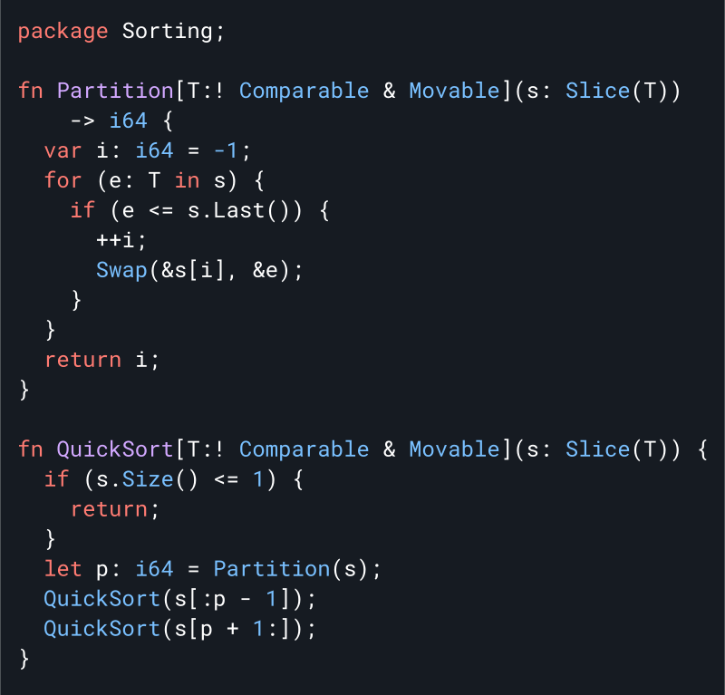

# Carbon Language: <br/> An experimental successor to C++

<!--
Part of the Carbon Language project, under the Apache License v2.0 with LLVM
Exceptions. See /LICENSE for license information.
SPDX-License-Identifier: Apache-2.0 WITH LLVM-exception
-->

<p align="center">
  <a href="#why-build-carbon">Why?</a> |
  <a href="#language-goals">Goals</a> |
  <a href="#getting-started">Getting started</a> |
  <a href="#join-us">Join us</a>
</p>

**See our [announcement video](https://youtu.be/omrY53kbVoA) from
[CppNorth](https://cppnorth.ca/)**

<a href="docs/images/snippets.md#quicksort">
<!--
Edit snippet in docs/images/snippets.md and:
https://drive.google.com/drive/folders/1-rsUjiya7dSZ87L8kpZmu3MZghRVxzLA
-->

</a>

<!--
Don't let the text wrap too narrowly to the left of the above image.
The `div` reduces the vertical height.
GitHub will autolink `img`, but won't produce a link when `href="#"`.
-->
<div><a href="#"></a></div>

**Fast and works with C++**

-   Performance matching C++ using LLVM, with low-level access to bits and
    addresses
-   Interoperate with your existing C++ code, from inheritance to templates
-   Fast and scalable builds that work with your existing C++ build systems

**Modern and evolving**

-   Solid language foundations that are easy to learn, especially if you have
    used C++
-   Easy, tool-based upgrades between Carbon versions
-   Safer fundamentals, and an incremental path towards a memory-safe subset

**Welcoming open-source community**

-   Clear goals and priorities with robust governance
-   Community that works to be welcoming, inclusive, and friendly
-   Batteries-included approach: compiler, libraries, docs, tools, package
    manager, and more

## Why build Carbon?

C++ remains the dominant programming language for performance-critical software,
with massive and growing codebases and investments. However, it is struggling to
improve and meet developers' needs, as outlined above, in no small part due to
accumulating decades of technical debt. Incrementally improving C++ is
[extremely difficult](/docs/project/difficulties_improving_cpp.md), both due to
the technical debt itself and challenges with its evolution process. The best
way to address these problems is to avoid inheriting the legacy of C or C++
directly, and instead start with solid language foundations like
[modern generics system](#generics), modular code organization, and consistent,
simple syntax.

Existing modern languages already provide an excellent developer experience: Go,
Swift, Kotlin, Rust, and many more. **Developers that _can_ use one of these
existing languages _should_.** Unfortunately, the designs of these languages
present significant barriers to adoption and migration from C++. These barriers
range from changes in the idiomatic design of software to performance overhead.

Carbon is fundamentally **a successor language approach**, rather than an
attempt to incrementally evolve C++. It is designed around interoperability with
C++ as well as large-scale adoption and migration for existing C++ codebases and
developers. A successor language for C++ requires:

-   **Performance matching C++**, an essential property for our developers.
-   **Seamless, bidirectional interoperability with C++**, such that a library
    anywhere in an existing C++ stack can adopt Carbon without porting the rest.
-   **A gentle learning curve** with reasonable familiarity for C++ developers.
-   **Comparable expressivity** and support for existing software's design and
    architecture.
-   **Scalable migration**, with some level of source-to-source translation for
    idiomatic C++ code.

With this approach, we can build on top of C++'s existing ecosystem, and bring
along existing investments, codebases, and developer populations. There are a
few languages that have followed this model for other ecosystems, and Carbon
aims to fill an analogous role for C++:

-   JavaScript → TypeScript
-   Java → Kotlin
-   C++ → **_Carbon_**

## Language Goals

We are designing Carbon to support:

-   Performance-critical software
-   Software and language evolution
-   Code that is easy to read, understand, and write
-   Practical safety and testing mechanisms
-   Fast and scalable development
-   Modern OS platforms, hardware architectures, and environments
-   Interoperability with and migration from existing C++ code

While many languages share subsets of these goals, what distinguishes Carbon is
their combination.

We also have explicit _non-goals_ for Carbon, notably including:

-   A stable
    [application binary interface](https://en.wikipedia.org/wiki/Application_binary_interface)
    (ABI) for the entire language and library
-   Perfect backwards or forwards compatibility

Our detailed [goals](/docs/project/goals.md) document fleshes out these ideas
and provides a deeper view into our goals for the Carbon project and language.

## Project status

Carbon is currently an experimental project. We want to better understand
whether we can build a language that meets our successor language criteria, and
whether the resulting language can gather a critical mass of interest within the
larger C++ industry and community.

Currently, we have fleshed out several core aspects of both Carbon the project
and the language:

-   The strategy of the Carbon Language and project.
-   An open-source project structure, governance model, and evolution process.
-   Critical and foundational aspects of the language design informed by our
    experience with C++ and the most difficult challenges we anticipate. This
    includes designs for:
    -   Generics
    -   Class types
    -   Inheritance
    -   Operator overloading
    -   Lexical and syntactic structure
    -   Code organization and modular structure
-   A prototype interpreter demo that can both run isolated examples and gives a
    detailed analysis of the specific semantic model and abstract machine of
    Carbon. We call this the [Carbon Explorer](/explorer/).

We are currently focused on getting more broad feedback and participation from
the C++ community,
[completing the 0.1 language design](/docs/project/roadmap.md#completing-the-language-design),
and
[completing the Carbon Explorer implementation of this design](/docs/project/roadmap.md#demo-implementation-of-core-features-with-working-examples).
Beyond that, we plan to prioritize C++ interoperability and a realistic
toolchain that implements the 0.1 language and can be used to evaluate Carbon in
more detail.

You can see our [full roadmap](/docs/project/roadmap.md) for more details.

## Carbon and C++

If you're already a C++ developer, Carbon should have a gentle learning curve.
It is built out of a consistent set of language constructs that should feel
familiar and be easy to read and understand.

C++ code like this:

<a href="docs/images/snippets.md#c">
<!--
Edit snippet in docs/images/snippets.md and:
https://drive.google.com/drive/folders/1-rsUjiya7dSZ87L8kpZmu3MZghRVxzLA
-->

</a>

corresponds to this Carbon code:

<a href="docs/images/snippets.md#carbon">
<!--
Edit snippet in docs/images/snippets.md and:
https://drive.google.com/drive/folders/1-rsUjiya7dSZ87L8kpZmu3MZghRVxzLA
-->

</a>

You can call Carbon from C++ without overhead and the other way around. This
means you migrate a single C++ library to Carbon within an application, or write
new Carbon on top of your existing C++ investment. For example:

<a href="docs/images/snippets.md#mixed">
<!--
Edit snippet in docs/images/snippets.md and:
https://drive.google.com/drive/folders/1-rsUjiya7dSZ87L8kpZmu3MZghRVxzLA
-->

</a>

Read more about
[C++ interop in Carbon](/docs/design/interoperability/philosophy_and_goals.md).

Beyond interoperability between Carbon and C++, we're also planning to support
migration tools that will mechanically translate idiomatic C++ code into Carbon
code to help you switch an existing C++ codebase to Carbon.

## Generics

Carbon provides a
**[modern generics system](/docs/design/generics/overview.md#what-are-generics)**
with checked definitions, while still **supporting opt-in
[templates](/docs/design/templates.md) for seamless C++ interop**. Checked
generics provide several advantages compared to C++ templates:

-   **Generic definitions are fully type-checked**, removing the need to
    instantiate to check for errors and giving greater confidence in code.
    -   Avoids the compile-time cost of re-checking the definition for every
        instantiation.
    -   When using a definition-checked generic, usage error messages are
        clearer, directly showing which requirements are not met.
-   **Enables automatic, opt-in type erasure and dynamic dispatch** without a
    separate implementation. This can reduce the binary size and enables
    constructs like heterogeneous containers.
-   **Strong, checked interfaces** mean fewer accidental dependencies on
    implementation details and a clearer contract for consumers.

Without sacrificing these advantages, **Carbon generics support
specialization**, ensuring it can fully address performance-critical use cases
of C++ templates. For more details about Carbon's generics, see their
[design](/docs/design/generics).

In addition to easy and powerful interop with C++, Carbon templates can be
constrained and incrementally migrated to checked generics at a fine granularity
and with a smooth evolutionary path.

## Memory safety

Safety, and especially
[memory safety](https://en.wikipedia.org/wiki/Memory_safety), remains a key
challenge for C++ and something a successor language needs to address. Our
initial priority and focus is on immediately addressing important, low-hanging
fruit in the safety space:

-   Tracking uninitialized states better, increased enforcement of
    initialization, and systematically providing hardening against
    initialization bugs when desired.
-   Designing fundamental APIs and idioms to support dynamic bounds checks in
    debug and hardened builds.
-   Having a default debug build mode that is both cheaper and more
    comprehensive than existing C++ build modes even when combined with
    [Address Sanitizer](https://github.com/google/sanitizers/wiki/AddressSanitizer).

Once we can migrate code into Carbon, we will have a simplified language with
room in the design space to add any necessary annotations or features, and
infrastructure like [generics](#generics) to support safer design patterns.
Longer term, we will build on this to introduce **a safe Carbon subset**. This
will be a large and complex undertaking, and won't be in the 0.1 design.
Meanwhile, we are closely watching and learning from efforts to add memory safe
semantics onto C++ such as Rust-inspired
[lifetime annotations](https://discourse.llvm.org/t/rfc-lifetime-annotations-for-c/61377).

## Getting started

You can get started playing with Carbon by checking out the codebase and using
the Carbon explorer:

```shell
# Install bazelisk using Homebrew.
$ brew install bazelisk

# Install Clang/LLVM using Homebrew.
# Many Clang/LLVM releases aren't built with options we rely on.
$ brew install llvm
$ export PATH="$(brew --prefix llvm)/bin:${PATH}"

# Download Carbon's code.
$ git clone https://github.com/carbon-language/carbon-lang
$ cd carbon-lang

# Build and run the explorer.
$ bazel run //explorer -- ./explorer/testdata/print/format_only.carbon
```

These instructions assume [Homebrew](https://brew.sh/); see our
[contribution tools documentation](/docs/project/contribution_tools.md) for more
extensive tooling instructions.

Learn more about the Carbon project:

-   [Project goals](/docs/project/goals.md)
-   [Language design overview](/docs/design)
-   [Carbon Explorer](/explorer)
-   [FAQ](/docs/project/faq.md)

## Join us

Carbon is committed to a welcoming and inclusive environment where everyone can
contribute.

-   To watch for major release announcements, subscribe to our
    [Carbon release post on GitHub](https://github.com/carbon-language/carbon-lang/discussions/1020)
    and [star carbon-lang](https://github.com/carbon-language/carbon-lang).
-   To join the design discussion, join our
    [GitHub forum](https://github.com/carbon-language/carbon-lang/discussions).
-   See our [code of conduct](CODE_OF_CONDUCT.md) and
    [contributing guidelines](CONTRIBUTING.md) for information about the Carbon
    development community.
-   We discuss Carbon on [Discord](https://discord.gg/ZjVdShJDAs).
