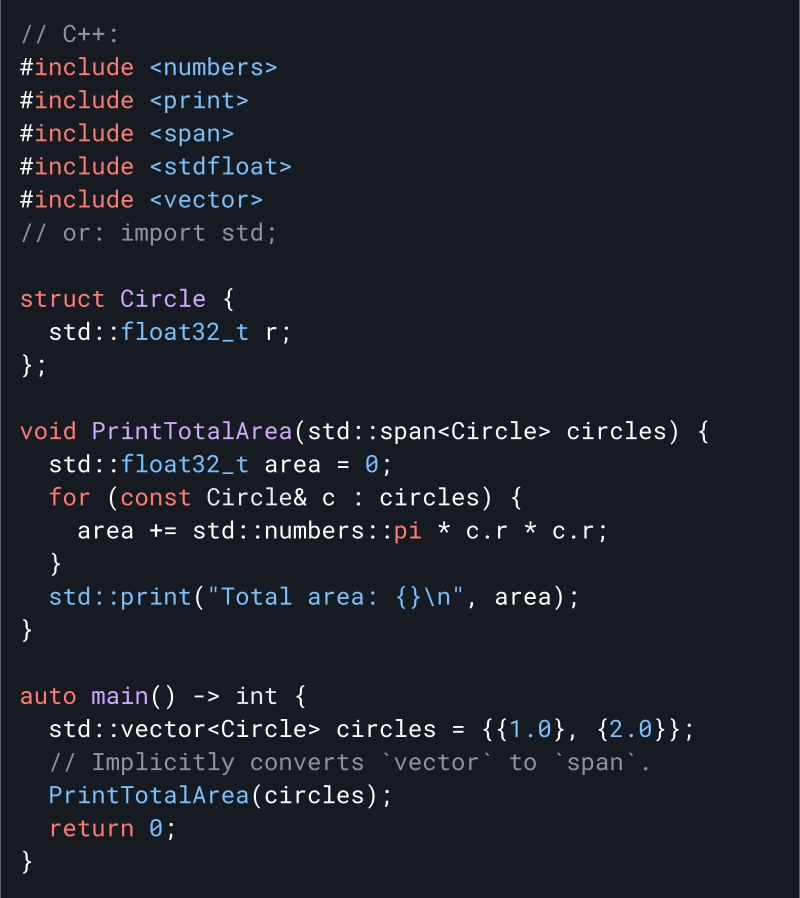

# Karbon Programlama Dili: <br/> C++ Programlama dilinin deneysel halefisi

<!--
LLVM Exception ile Apache Lisansı v2.0 kapsamında Carbon Programlama dilinin projesinin bir parçası. Lisans bilgileri için /LICENSE bölümüne bakın.
SPDX-License-Identifier: Apache-2.0 WITH LLVM-exception
-->

<p align="center">
  <a href="#why-build-carbon">Niçin?</a> |
  <a href="#language-goals">Hedefler</a> |
  <a href="#project-status">Durum</a> |
  <a href="#getting-started">Başlarken</a> |
  <a href="#join-us">Bize katıl</a>
</p>

**[Duyuru Videomuzu](https://youtu.be/omrY53kbVoA) izleyin
[CppNorth](https://cppnorth.ca/).** Karbon dilinin [Kullanıma hazır Olmadığını](#project-status) unutmayın.

<a href="docs/images/snippets.md#quicksort">
<!--
Snippet'i docs/images/snippets.md dosyasında düzenleyin ve:
https://drive.google.com/drive/folders/1-rsUjiya7dSZ87L8kpZmu3MZghRVxzLA
-->

</a>

<!--
Metnin yukarıdaki resmin soluna çok dar olmasına izin vermeyin.
'div' dikey yüksekliği azaltır.
GitHub, "img"yi otomatik olarak bağlar, ancak "href="#"` olduğunda bir bağlantı oluşturmaz.
-->
<div><a href="#"></a></div>

**Hızlı ve C++ ile çalışır**

- Bitlere ve adreslere düşük seviyeli erişim ile LLVM kullanarak C++ performans eşleştirme
- Kalıtımdan şablonlara kadar mevcut C++ kodunuzla birlikte çalışın
- Mevcut C++ yapı sistemlerinizle çalışan hızlı ve ölçeklenebilir yapılar

**Modern ve gelişen**

- Özellikle C++ kullandıysanız öğrenmesi kolay sağlam dil temelleri
- Karbon sürümleri arasında kolay, araç tabanlı yükseltmeler
- Daha güvenli temeller ve bellek açısından güvenli bir alt kümeye doğru artan bir yol

**Açık kaynak topluluğuna hoş geldiniz**

- Güçlü yönetişim ile net hedefler ve öncelikler
- Konuksever, kapsayıcı ve arkadaş canlısı olmaya çalışan topluluk
- Herşeyi içeren yaklaşım: derleyici, kitaplıklar, belgeler, araçlar, paket yöneticisi ve daha fazlası

## Karbon dili niçin geliştiriliyor?

C++, performans açısından kritik yazılımlar için devasa yatırımlarla ve büyüyen kod tabanlarıyla baskın programlama dili olmaya devam ediyor. Ancak on yıllardır biriken teknik borç nedeniyle, yukarıda belirtildiği gibi geliştiricilerin ihtiyaçlarını iyileştirmek ve karşılamak için uğraşılıyor. Kademeli olarak gelişen C++
[son derece zor](/docs/project/difficulties cpp.md'yi geliştirmek), her ikisi de
teknik borcun kendisi ve evrim süreciyle ilgili zorluklar. Bu sorunları çözmenin en iyi yolu, C veya C++ mirasını doğrudan devralmaktan kaçınmaktır ve bunun yerine aşağıdaki gibi sağlam dil temelleriyle başlamaktır.
[modern jenerik sistem](#generics), modüler kod organizasyonu, tutarlı ve
basit sözdizimi.

Mevcut modern diller zaten mükemmel bir geliştirici deneyimi sağlıyor: Go,
Swift, Kotlin, Rust, ve daha fazlası. **_Geliştiriciler var olan bu dillerden birini kullanabilir._**Ne yazık ki, bu dillerin tasarımları
C++'ın benimsenmesi ve taşınması için önemli engeller sunar.
Bu engeller Yazılımın deyimsel tasarımındaki değişikliklerden performans 
yüküne kadar değişir.

Karbon temelde c++ geliştirmek yerine onun yerini alabilecek bir **varis yaklaşımıdır**.
 Büyük ölçekli benimsemenin sayesinde büyük ölçekli C++ kod tabanlarının ve geliştiricilerin C++ den geçişi sırasında daha kolay şekilde adapte olmalarını sağlar. C++ dilinin varisi olmak için gereklilikler şunlardır:

-   Geliştiricilerimiz için önemli bir özellik olan **C++ ile performans eşleştirme**.
-   **C++ ile sorunsuz, çift yönlü birlikte çalışabilirlik**, öyle ki mevcut bir C++ kötüphanesinin 
    herhangi bir yerindeki bir kitaplık, geri kalanını taşımadan Karbon'u benimseyebilir.
-   C++ geliştiricileri için makul düzeyde aşinalık sağlayan **yumuşak bir öğrenme eğrisi**.
-   Mevcut yazılımın tasarımı ve mimarisi için **karşılaştırılabilir ifade ve destek**.
-   Deyimsel C++ kodu için bir düzeyde kaynaktan kaynağa çeviri ile **ölçeklenebilir geçiş**.

Bu yaklaşımla, C++'ın mevcut ekosisteminin üzerine inşa edebilir ve mevcut yatırımları, kod tabanlarını ve geliştirici popülasyonlarını bir araya getirebiliriz. Diğer ekosistemler için bu modeli takip eden birkaç dil vardır ve Carbon, C++ için benzer bir rolü doldurmayı amaçlamaktadır:

-   JavaScript → TypeScript
-   Java → Kotlin
-   C++ → **_Karbon_**

## Dil hedefleri

Karbonu bunları destekleyecek şekilde tasarlıyoruz:

-   Performans açısından kritik yazılımlar
-   Yazılım ve dil gelişimi
-   Okunması, anlaşılması ve yazılması kolay kod
-   Pratik güvenlik ve test mekanizmaları
-   Hızlı ve ölçeklenebilir geliştirme
-   Modern işletim sistemi platformları, donanım mimarileri ve ortamları
-   Mevcut C++ koduyla birlikte çalışabilirlik ve kolay şekilde geçiş

Birçok dil bu hedeflerin alt kümelerini paylaşırken, Karbon'u farklı kılan şey,
onların kombinasyonu.

Ayrıca, özellikle aşağıdakiler dahil olmak üzere Carbon için _açık olmayan hedeflerimiz_ var:

-   Tüm dil ve kötüphane için karalı bir şekilde çalışan
    [ikili uygulama arayüzü](https://en.wikipedia.org/wiki/Application_binary_interface)
    (ABI)
-   Geriye ve ileriye dönük mükemmel uyumluluk
Bizim detaylı [hedeflerimiz](/docs/project/goals.md) belgesi bu fikirleri somutlaştırır ve karbon projesi ve dili için hedeflerimize daha derin bir bakış sağlar.

## Proje durumu

Carbon Dili şu anda deneysel bir proje olarak geliştirilmektedir.Çalışan bir derleyici veya araç takımı mevcut değildir. Carbon için demo yorumlayıcıyı [compiler-explorer.com](http://carbon.compiler-explorer.com/) adresinde görebilirsiniz.


Amacımız, halefi bir dil kriterlerini karşılayan bir dil oluşturabileceğimizi ve elde edilen dilin C++ endüstrisi ve topluluğunda yeterli ilgiyi toplayabileceğini daha iyi anlamaktır.

Şu anda, Carbon Projesi ve diliyle ilgili birçok temel bileşen üzerinde çalışıyoruz:

-   Carbon Dil ve proje stratejisi.
-   Açık kaynak proje yapısı, yönetim modeli ve gelişim süreci.
-   C++ deneyimimizden ve öngördüğümüz en zorlu zorluklardan bilgilendirilen dil tasarımının kritik ve temel yönleri. Bu, aşağıdaki tasarımları içerir:
    -   Generic (Jenerik) tipler
    -   Sınıf tipleri
    -   Kalıtım
    -   Operatör aşırı yükleme
    -   Leksik ve sentaktik yapı
    -   Kod düzeni ve modüler yapı
-   Carbon'un semantik modelini ve soyut makinesini ayrıntılı bir şekilde analiz edebilen bir prototip yorumlayıcı demo. Buna [Carbon Explorer](/explorer/) diyoruz.

Eğer katkıda bulunmak isterseniz,
[0.1 dil tasarımlarının tamamlanmasına](/docs/project/roadmap.md#complete-design-coverage-of-the-01-languages-necessary-features)
ve
[Carbon Explorer'daki bu tasarımın uygulanmasını tamamlamaya](/docs/project/roadmap.md#complete-01-language-implementation-coverage-in-the-carbon-explorer) yardımcı olmak istiyoruz.
Ayrıca, C++ topluluğundan daha geniş bir geri bildirim ve katılım elde etmek için çalışıyoruz. Bunun ötesinde, C++ ile uyumluluk ve 0.1 dilini uygulayan gerçek bir araç takımını önceliklendirmeyi planlıyoruz.

Daha fazla bilgi için bizim [yol haritamıza](/docs/project/roadmap.md) bakabilirsiniz.

## Karbon ve C++

C++ geliştiricisi iseniz, Carbon'un öğrenme eğrisi yumuşak olmalıdır. Aşina olunan ve okunması ve anlaşılması kolay olması gereken tutarlı bir dil yapısı kullanılmıştır.

Aşağıdaki C++ kodu:

<a href="docs/images/snippets.md#c">
<!--
Edit snippet in docs/images/snippets.md and:
https://drive.google.com/drive/folders/1QrBXiy_X74YsOueeC0IYlgyolWIhvusB
-->

</a>

aşağıdaki Carbon koduna karşılık gelir:

<a href="docs/images/snippets.md#carbon">
<!--
Edit snippet in docs/images/snippets.md and:
https://drive.google.com/drive/folders/1QrBXiy_X74YsOueeC0IYlgyolWIhvusB
-->

</a>

Carbon'u C++ ile birlikte çağırabilirsiniz ve aynı şekilde C++'dan Carbon'a çağrı yapabilirsiniz. Bu, bir uygulama içinde tek bir C++ kütüphanesini Carbon'a taşıyabileceğiniz veya mevcut C++ yatırımınızın üzerine yeni Carbon kodu yazabileceğiniz anlamına gelir.

Aşağıdaki örnekte gösterildiği gibi:

<a href="docs/images/snippets.md#mixed">
<!--
Edit snippet in docs/images/snippets.md and:
https://drive.google.com/drive/folders/1QrBXiy_X74YsOueeC0IYlgyolWIhvusB
-->

</a>

[C++ ile Carbon arasındaki etkileşimi ](/docs/design/interoperability/philosophy_and_goals.md) daha fazla okuyabilirsiniz.

Carbon ve C++ arasındaki etkileşimin yanı sıra, mevcut C++ kod tabanını Carbon'a geçirmenize yardımcı olmak için geleneksel araçlar da sağlamayı planlıyoruz.

## Jenerik

Carbon, kontrol edilen tanımlamaları destekleyen bir
**[modern jenerik sistem](/docs/design/generics/overview.md#what-are-generics)**
 sunar ve aynı zamanda
[C++ uyumluluğu için isteğe bağlı şablonları](/docs/design/templates.md) destekler. Kontrol edilen jenerik tanımlamaları, C++ şablonlarına kıyasla birçok avantaj sağlar:

-   **Jenerik tanımlamaları tamamen tür denetlenir**,  hataları kontrol etmek için örnekleştirme yapma gereksinimini ortadan kaldırır ve kod konusunda daha fazla güven sağlar.
    -   Her örnekleme için tanımı yeniden denetleme için derleme zamanı maliyetini önler.
        instantiation.
    -   Tanım denetimi yapılan bir jenerik kullanırken, hata mesajları daha net olur ve hangi gereksinimlerin karşılanmadığını doğrudan gösterir.
-   Ayrı bir uygulama gerektirmeden **otomatik, isteğe bağlı tip silme ve dinamik göndermeyi **destekler. Bu, ikili dosya boyutunu azaltabilir ve heterojen konteynerler gibi yapıları mümkün kılar.
-   **Güçlü, denetlenen arabirimler** , uygulama ayrıntılarına yanlışlıkla bağımlılıkları azaltır ve tüketiciye daha net bir sözleşme sunar.

Bu avantajları feda etmeden, **Carbon jenerikleri özelleştirmeyi**, edestekler, böylece performans açısından kritik öneme sahip C++ şablonlarının gereksinimlerini tam olarak karşılayabilir. Carbon'un jenerikler hakkında daha fazla ayrıntıyı
[tasarım belgesinde](/docs/design/generics) bulabilirsiniz.

Carbon şablonları, C++ ile kolay ve güçlü bir etkileşim sağladığı gibi, ince granülerlikte kısıtlanabilir ve denetlenen jeneriklere doğru sorunsuz bir evrimsel yol ile göç ettirilebilir.

## Bellek güvenliği

Karbondaki güvenlik, özellikle
[bellek güvenliği](https://en.wikipedia.org/wiki/Memory_safety)konusu, C++ için önemli bir zorluktur ve halefinin bu konuya çözüm bulması gerekmektedir. İlk önceliğimiz ve odak noktamız, güvenlik alanında önemli ve hızlı bir şekilde ele alınabilecek konulara odaklanmaktır:

-   Daha iyi başlatılmamış durumların takibi, başlatmanın zorunlu hale getirilmesi ve başlatma hatalarına karşı sıkı koruma sağlanması.
-   Hata ayıklama ve güçlendirilmiş yapılar için dinamik sınırların denetimini destekleyen temel API'ların ve yapıların tasarlanması.
Mevcut C++ derleme modlarıyla bile birleştirildiğinde daha ucuz ve kapsamlı olan bir varsayılan [hata ayıklama](https://github.com/google/sanitizers/wiki/AddressSanitizer).
 derleme modu sağlama.
    
Carbon'a kodu aktarabildiğimizde, basit bir dil olacak ve gerektiğinde gerekli bildirimleri veya özellikleri ekleyebileceğimiz ve daha güvenli tasarım kalıplarını desteklemek için [jenerikler](#generics) gibi altyapıya sahip olacağız. Daha uzun vadede, bu temel üzerine **güvenli bir Carbon alt kümesi** getireceğiz.  Bu, büyük ve karmaşık bir görev olacak ve 0.1 tasarımda olmayacak. Bu arada, C++'a Rust'tan ilham alan bellek güvenli semantikler eklemeye yönelik çabalara dikkatlice bakıyor ve onlardan öğreniyoruz, örneğin [ömürle ilgili bildirimler](https://discourse.llvm.org/t/rfc-lifetime-annotations-for-c/61377).

## Başlarken

Eğer Carbon'u denemek isterseniz, henüz bir derleyici olmadığı için, Carbon gezginini kullanarak Carbon kodunu yorumlayıp çıktısını alabilirsiniz. Carbon gezginini hemen [compiler-explorer.com](http://carbon.compiler-explorer.com/) adresinde deneyebilirsiniz.


Carbon gezginini kendiniz oluşturmak için önce bağımlılıkları (Bazel, Clang, libc++) kurmanız gerekecek, ardından şunları çalıştırabilirsiniz:

```shell
# Download Carbon's code.
$ git clone https://github.com/carbon-language/carbon-lang
$ cd carbon-lang

# Build and run the explorer.
$ bazel run //explorer -- ./explorer/testdata/print/format_only.carbon
```

Daha fazla bilgi ve kaynaklar için Carbon Projesi'nin [resmi web sitesini](/docs/project/contribution_tools.md) ziyaret edebilirsiniz.


Karbon projesi hakkında daha fazla şey öğren:

-   [Proje Hedefleri](/docs/project/goals.md)
-   [Dil tasarımına genel bakış](/docs/design)
-   [Karbon gezgini](/explorer)
-   [SSS](/docs/project/faq.md)

## Konferans konuşmaları

Topluluk tarafından gerçekleştirilen geçmiş Carbon odaklı konferans konuşmaları:

### 2022

-   [Carbon Language: C++'ın deneysel bir halefi](https://www.youtube.com/watch?v=omrY53kbVoA),
    CppNorth
-   [Carbon Language: Sözdizimi ve takaslar](https://www.youtube.com/watch?v=9Y2ivB8VaIs),
    Core C++

### 2023

-   [Carbon'ın Halef Stratejisi: C++ uyumluluğundan bellek güvenliğine (Sunum)](https://chandlerc.blog/slides/2023-cppnow-carbon-strategy/index.html#/),
    C++Now
-   Tanım Doğrulamalı Jenerikler
    [(Bölüm 1, Sunum)](https://chandlerc.blog/slides/2023-cppnow-generics-1/#/),
    [(Bölüm 2, Sunum)](https://chandlerc.blog/slides/2023-cppnow-generics-2/#/),
    C++Now
-   [Carbon'un Araç Zinciri için Modernleşen Derleyici Tasarımı (Sunum)](https://chandlerc.blog/slides/2023-cppnow-compiler/index.html#/),
    C++Now

## Bize Katılın

Sizi projeye katılmaya ve katkıda bulunmaya davet etmekten mutluluk duyarız. Carbon, herkesin katkıda bulunabileceği hoşgörülü ve kapsayıcı bir ortama bağlıdır.

-   Carbon'un tasarım tartışmalarının çoğu
    [Discord](https://discord.gg/ZjVdShJDAs) üzerinde gerçekleşir.
-   Carbon, [Google Summer of Code 2023 organizasyonu](https://         summerofcode.withgoogle.com/programs/2023/organizations/carbon-language) olarak yer almaktadır.
-   Önemli sürüm duyurularını takip etmek için
    [ GitHub'daki Carbon yayın gönderisine](https://github.com/carbon-language/carbon-lang/discussions/1020)
    ve [carbon-lang'i yıldızlamaya](https://github.com/carbon-language/carbon-lang) abone olun..
-   Carbon geliştirme topluluğu hakkında daha fazla bilgi için [davranış kurallarımızı](CODE_OF_CONDUCT.md) ve
    [katkı yapma yönergelerimizi](CONTRIBUTING.md) inceleyin.

### Katkıda Bulunma

Ayrıca doğrudan aşağıdakilere katkıda bulunabilirsiniz:

-   [Dil tasarımına katkıda bulunma](CONTRIBUTING.md#contributing-to-the-language-design):
    tasarıma yönelik geri bildirim, yeni tasarım önerileri
-   [Dil uygulamasına katkıda bulunma](CONTRIBUTING.md#contributing-to-the-language-implementation)
    -   [Carbon Explorer](/explorer/): hata raporu, hata düzeltmesi, dil özelliği uygulaması
    -   [Carbon Araç Zinciri](/toolchain/) ve proje altyapısı

**GitHub'daki bazı 
["iyi ilk konuları"](https://github.com/carbon-language/carbon-lang/labels/good%20first%20issue)**kontrol edebilir veya [Discord](https://discord.gg/ZjVdShJDAs) üzerindeki `#contributing-help` kanalına katılabilirsiniz.Daha fazla ayrıntı için tam [`CONTRIBUTING`](CONTRIBUTING.md) belgelerimize göz atabilirsiniz.

