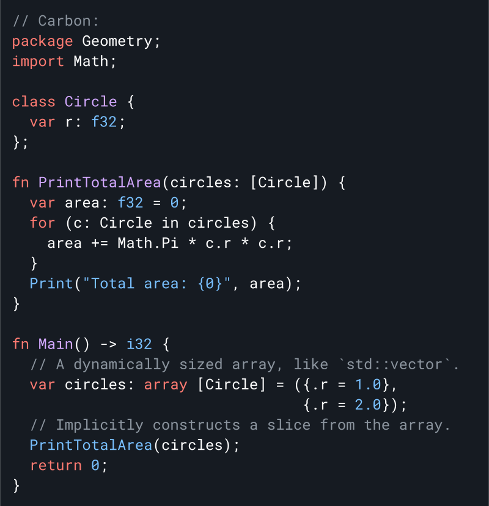
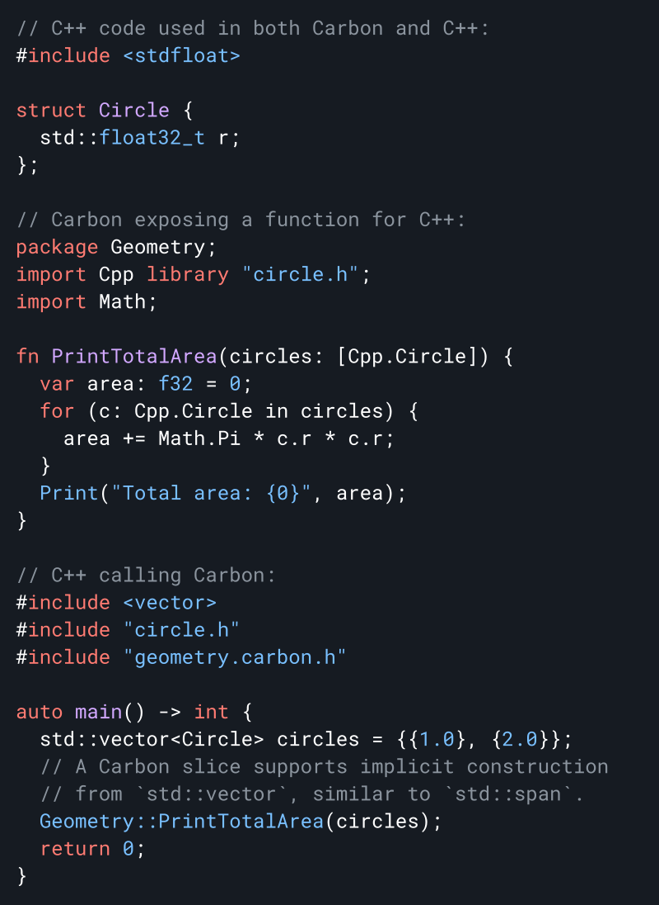

# Karbon Programlama Dili: <br/> C++ Programlama dilinin deneysel halefisi

<!--
LLVM Exception ile Apache Lisansı v2.0 kapsamında Carbon Programlama dilinin projesinin bir parçası. Lisans bilgileri için /LICENSE bölümüne bakın.
SPDX-License-Identifier: Apache-2.0 WITH LLVM-exception
-->

<p align="center">
  <a href="#why-build-carbon">Niçin?</a> |
  <a href="#language-goals">Hedefler</a> |
  <a href="#project-status">Durum</a> |
  <a href="#getting-started">Başlarken</a> |
  <a href="#join-us">Bize katıl</a>
</p>

**[Duyuru Videomuzu](https://youtu.be/omrY53kbVoA) izleyin
[CppNorth](https://cppnorth.ca/).** Karbon dilinin [Kullanıma hazır Olmadığını](#project-status) unutmayın.

<a href="docs/images/snippets.md#quicksort">
<!--
Snippet'i docs/images/snippets.md dosyasında düzenleyin ve:
https://drive.google.com/drive/folders/1-rsUjiya7dSZ87L8kpZmu3MZghRVxzLA
-->

</a>

<!--
Metnin yukarıdaki resmin soluna çok dar olmasına izin vermeyin.
'div' dikey yüksekliği azaltır.
GitHub, "img"yi otomatik olarak bağlar, ancak "href="#"` olduğunda bir bağlantı oluşturmaz.
-->
<div><a href="#"></a></div>

**Hızlı ve C++ ile çalışır**

- Bitlere ve adreslere düşük seviyeli erişim ile LLVM kullanarak C++ performans eşleştirme
- Kalıtımdan şablonlara kadar mevcut C++ kodunuzla birlikte çalışın
- Mevcut C++ yapı sistemlerinizle çalışan hızlı ve ölçeklenebilir yapılar

**Modern ve gelişen**

- Özellikle C++ kullandıysanız öğrenmesi kolay sağlam dil temelleri
- Karbon sürümleri arasında kolay, araç tabanlı yükseltmeler
- Daha güvenli temeller ve bellek açısından güvenli bir alt kümeye doğru artan bir yol

**Açık kaynak topluluğuna hoş geldiniz**

- Güçlü yönetişim ile net hedefler ve öncelikler
- Konuksever, kapsayıcı ve arkadaş canlısı olmaya çalışan topluluk
- Herşeyi içeren yaklaşım: derleyici, kitaplıklar, belgeler, araçlar, paket yöneticisi ve daha fazlası

## Karbon dili niçin geliştiriliyor?

C++, performans açısından kritik yazılımlar için devasa yatırımlarla ve büyüyen kod tabanlarıyla baskın programlama dili olmaya devam ediyor. Ancak on yıllardır biriken teknik borç nedeniyle, yukarıda belirtildiği gibi geliştiricilerin ihtiyaçlarını iyileştirmek ve karşılamak için uğraşılıyor. Kademeli olarak gelişen C++
[son derece zor](/docs/project/difficulties cpp.md'yi geliştirmek), her ikisi de
teknik borcun kendisi ve evrim süreciyle ilgili zorluklar. Bu sorunları çözmenin en iyi yolu, C veya C++ mirasını doğrudan devralmaktan kaçınmaktır ve bunun yerine aşağıdaki gibi sağlam dil temelleriyle başlamaktır.
[modern jenerik sistem](#generics), modüler kod organizasyonu, tutarlı ve
basit sözdizimi.

Mevcut modern diller zaten mükemmel bir geliştirici deneyimi sağlıyor: Go,
Swift, Kotlin, Rust, ve daha fazlası. **_Geliştiriciler var olan bu dillerden birini kullanabilir._**Ne yazık ki, bu dillerin tasarımları
C++'ın benimsenmesi ve taşınması için önemli engeller sunar.
Bu engeller Yazılımın deyimsel tasarımındaki değişikliklerden performans 
yüküne kadar değişir.

Karbon temelde c++ geliştirmek yerine onun yerini alabilecek bir **varis yaklaşımıdır**.
 Büyük ölçekli benimsemenin sayesinde büyük ölçekli C++ kod tabanlarının ve geliştiricilerin C++ den geçişi sırasında daha kolay şekilde adapte olmalarını sağlar. C++ dilinin varisi olmak için gereklilikler şunlardır:

-   Geliştiricilerimiz için önemli bir özellik olan **C++ ile performans eşleştirme**.
-   **C++ ile sorunsuz, çift yönlü birlikte çalışabilirlik**, öyle ki mevcut bir C++ kötüphanesinin 
    herhangi bir yerindeki bir kitaplık, geri kalanını taşımadan Karbon'u benimseyebilir.
-   C++ geliştiricileri için makul düzeyde aşinalık sağlayan **yumuşak bir öğrenme eğrisi**.
-   Mevcut yazılımın tasarımı ve mimarisi için **karşılaştırılabilir ifade ve destek**.
-   Deyimsel C++ kodu için bir düzeyde kaynaktan kaynağa çeviri ile **ölçeklenebilir geçiş**.

Bu yaklaşımla, C++'ın mevcut ekosisteminin üzerine inşa edebilir ve mevcut yatırımları, kod tabanlarını ve geliştirici popülasyonlarını bir araya getirebiliriz. Diğer ekosistemler için bu modeli takip eden birkaç dil vardır ve Carbon, C++ için benzer bir rolü doldurmayı amaçlamaktadır:

-   JavaScript → TypeScript
-   Java → Kotlin
-   C++ → **_Karbon_**

## Dil hedefleri

Karbonu bunları destekleyecek şekilde tasarlıyoruz:

-   Performans açısından kritik yazılımlar
-   Yazılım ve dil gelişimi
-   Okunması, anlaşılması ve yazılması kolay kod
-   Pratik güvenlik ve test mekanizmaları
-   Hızlı ve ölçeklenebilir geliştirme
-   Modern işletim sistemi platformları, donanım mimarileri ve ortamları
-   Mevcut C++ koduyla birlikte çalışabilirlik ve kolay şekilde geçiş

Birçok dil bu hedeflerin alt kümelerini paylaşırken, Karbon'u farklı kılan şey,
onların kombinasyonu.

Ayrıca, özellikle aşağıdakiler dahil olmak üzere Carbon için _açık olmayan hedeflerimiz_ var:

-   Tüm dil ve kötüphane için karalı bir şekilde çalışan
    [ikili uygulama arayüzü](https://en.wikipedia.org/wiki/Application_binary_interface)
    (ABI)
-   Geriye ve ileriye dönük mükemmel uyumluluk
Bizim detaylı [hedeflerimiz](/docs/project/goals.md) belgesi bu fikirleri somutlaştırır ve karbon projesi ve dili için hedeflerimize daha derin bir bakış sağlar.
## Proje durumu

Carbon Language is currently an experimental project. There is no working
compiler or toolchain. You can see the demo interpreter for Carbon on
[compiler-explorer.com](http://carbon.compiler-explorer.com/).

We want to better understand whether we can build a language that meets our
successor language criteria, and whether the resulting language can gather a
critical mass of interest within the larger C++ industry and community.

Currently, we have fleshed out several core aspects of both Carbon the project
and the language:

-   The strategy of the Carbon Language and project.
-   An open-source project structure, governance model, and evolution process.
-   Critical and foundational aspects of the language design informed by our
    experience with C++ and the most difficult challenges we anticipate. This
    includes designs for:
    -   Generics
    -   Class types
    -   Inheritance
    -   Operator overloading
    -   Lexical and syntactic structure
    -   Code organization and modular structure
-   A prototype interpreter demo that can both run isolated examples and gives a
    detailed analysis of the specific semantic model and abstract machine of
    Carbon. We call this the [Carbon Explorer](/explorer/).

If you're interested in contributing, we would love help
[completing the 0.1 language designs](/docs/project/roadmap.md#complete-design-coverage-of-the-01-languages-necessary-features),
and
[completing the Carbon Explorer implementation of this design](/docs/project/roadmap.md#complete-01-language-implementation-coverage-in-the-carbon-explorer).
We are also currently working to get more broad feedback and participation from
the C++ community. Beyond that, we plan to prioritize C++ interoperability and a
realistic toolchain that implements the 0.1 language and can be used to evaluate
Carbon in more detail.

You can see our [full roadmap](/docs/project/roadmap.md) for more details.

## Karbon ve C++

If you're already a C++ developer, Carbon should have a gentle learning curve.
It is built out of a consistent set of language constructs that should feel
familiar and be easy to read and understand.

C++ code like this:

<a href="docs/images/snippets.md#c">
<!--
Edit snippet in docs/images/snippets.md and:
https://drive.google.com/drive/folders/1QrBXiy_X74YsOueeC0IYlgyolWIhvusB
-->

</a>

corresponds to this Carbon code:

<a href="docs/images/snippets.md#carbon">
<!--
Edit snippet in docs/images/snippets.md and:
https://drive.google.com/drive/folders/1QrBXiy_X74YsOueeC0IYlgyolWIhvusB
-->

</a>

You can call Carbon from C++ without overhead and the other way around. This
means you migrate a single C++ library to Carbon within an application, or write
new Carbon on top of your existing C++ investment. For example:

<a href="docs/images/snippets.md#mixed">
<!--
Edit snippet in docs/images/snippets.md and:
https://drive.google.com/drive/folders/1QrBXiy_X74YsOueeC0IYlgyolWIhvusB
-->

</a>

Read more about
[C++ interop in Carbon](/docs/design/interoperability/philosophy_and_goals.md).

Beyond interoperability between Carbon and C++, we're also planning to support
migration tools that will mechanically translate idiomatic C++ code into Carbon
code to help you switch an existing C++ codebase to Carbon.

## Jenerik

Carbon provides a
**[modern generics system](/docs/design/generics/overview.md#what-are-generics)**
with checked definitions, while still **supporting opt-in
[templates](/docs/design/templates.md) for seamless C++ interop**. Checked
generics provide several advantages compared to C++ templates:

-   **Generic definitions are fully type-checked**, removing the need to
    instantiate to check for errors and giving greater confidence in code.
    -   Avoids the compile-time cost of re-checking the definition for every
        instantiation.
    -   When using a definition-checked generic, usage error messages are
        clearer, directly showing which requirements are not met.
-   **Enables automatic, opt-in type erasure and dynamic dispatch** without a
    separate implementation. This can reduce the binary size and enables
    constructs like heterogeneous containers.
-   **Strong, checked interfaces** mean fewer accidental dependencies on
    implementation details and a clearer contract for consumers.

Without sacrificing these advantages, **Carbon generics support
specialization**, ensuring it can fully address performance-critical use cases
of C++ templates. For more details about Carbon's generics, see their
[design](/docs/design/generics).

In addition to easy and powerful interop with C++, Carbon templates can be
constrained and incrementally migrated to checked generics at a fine granularity
and with a smooth evolutionary path.

## Bellek güvenliği

Safety, and especially
[memory safety](https://en.wikipedia.org/wiki/Memory_safety), remains a key
challenge for C++ and something a successor language needs to address. Our
initial priority and focus is on immediately addressing important, low-hanging
fruit in the safety space:

-   Tracking uninitialized states better, increased enforcement of
    initialization, and systematically providing hardening against
    initialization bugs when desired.
-   Designing fundamental APIs and idioms to support dynamic bounds checks in
    debug and hardened builds.
-   Having a default debug build mode that is both cheaper and more
    comprehensive than existing C++ build modes even when combined with
    [Address Sanitizer](https://github.com/google/sanitizers/wiki/AddressSanitizer).

Once we can migrate code into Carbon, we will have a simplified language with
room in the design space to add any necessary annotations or features, and
infrastructure like [generics](#generics) to support safer design patterns.
Longer term, we will build on this to introduce **a safe Carbon subset**. This
will be a large and complex undertaking, and won't be in the 0.1 design.
Meanwhile, we are closely watching and learning from efforts to add memory safe
semantics onto C++ such as Rust-inspired
[lifetime annotations](https://discourse.llvm.org/t/rfc-lifetime-annotations-for-c/61377).

## Başlarken

As there is no compiler yet, to try out Carbon, you can use the Carbon explorer
to interpret Carbon code and print its output. You can try it out immediately at
[compiler-explorer.com](http://carbon.compiler-explorer.com/).

To build the Carbon explorer yourself, you'll need to install dependencies
(Bazel, Clang, libc++), and then you can run:

```shell
# Download Carbon's code.
$ git clone https://github.com/carbon-language/carbon-lang
$ cd carbon-lang

# Build and run the explorer.
$ bazel run //explorer -- ./explorer/testdata/print/format_only.carbon
```

For complete instructions, including installing dependencies, see our
[contribution tools documentation](/docs/project/contribution_tools.md).

Karbon projesi hakkında daha fazla şey öğren:

-   [Proje Hedefleri](/docs/project/goals.md)
-   [Dil tasarımına genel bakış](/docs/design)
-   [Karbon gezgini](/explorer)
-   [SSS](/docs/project/faq.md)

## Conference talks

Past Carbon focused talks from the community:

### 2022

-   [Carbon Language: An experimental successor to C++](https://www.youtube.com/watch?v=omrY53kbVoA),
    CppNorth
-   [Carbon Language: Syntax and trade-offs](https://www.youtube.com/watch?v=9Y2ivB8VaIs),
    Core C++

### 2023

-   [Carbon’s Successor Strategy: From C++ interop to memory safety (Slides)](https://chandlerc.blog/slides/2023-cppnow-carbon-strategy/index.html#/),
    C++Now
-   Definition-Checked Generics
    [(Part 1, Slides)](https://chandlerc.blog/slides/2023-cppnow-generics-1/#/),
    [(Part 2, Slides)](https://chandlerc.blog/slides/2023-cppnow-generics-2/#/),
    C++Now
-   [Modernizing Compiler Design for Carbon’s Toolchain (Slides)](https://chandlerc.blog/slides/2023-cppnow-compiler/index.html#/),
    C++Now

## Join us

We'd love to have folks join us and contribute to the project. Carbon is
committed to a welcoming and inclusive environment where everyone can
contribute.

-   Most of Carbon's design discussions occur on
    [Discord](https://discord.gg/ZjVdShJDAs).
-   Carbon is a
    [Google Summer of Code 2023 organization](https://summerofcode.withgoogle.com/programs/2023/organizations/carbon-language).
-   To watch for major release announcements, subscribe to our
    [Carbon release post on GitHub](https://github.com/carbon-language/carbon-lang/discussions/1020)
    and [star carbon-lang](https://github.com/carbon-language/carbon-lang).
-   See our [code of conduct](CODE_OF_CONDUCT.md) and
    [contributing guidelines](CONTRIBUTING.md) for information about the Carbon
    development community.

### Contributing

You can also directly:

-   [Contribute the language design](CONTRIBUTING.md#contributing-to-the-language-design):
    feedback on design, new design proposal
-   [Contribute to the language implementation](CONTRIBUTING.md#contributing-to-the-language-implementation)
    -   [Carbon Explorer](/explorer/): bug report, bug fix, language feature
        implementation
    -   [Carbon Toolchain](/toolchain/), and project infrastructure

You can **check out some
["good first issues"](https://github.com/carbon-language/carbon-lang/labels/good%20first%20issue)**,
or join the `#contributing-help` channel on
[Discord](https://discord.gg/ZjVdShJDAs). See our full
[`CONTRIBUTING`](CONTRIBUTING.md) documentation for more details.

