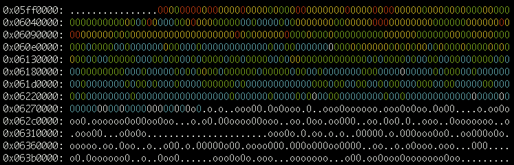

# Code Heatmaps

BOLT has gained the ability to print code heatmaps based on
sampling-based LBR profiles generated by `perf`. The output is produced
in colored ASCII to be displayed in a color-capable terminal. It looks
something like this:



Heatmaps can be generated for BOLTed and non-BOLTed binaries. You can
use them to compare the code layout before and after optimizations.

To generate a heatmap, start with running your app under `perf`:

```bash
$ perf record -e cycles:u -j any,u -- <executable with args>
```
or if you want to monitor the existing process(es):
```bash
$ perf record -e cycles:u -j any,u [-p PID|-a] -- sleep <interval>
```

Note that at the moment running with LBR (`-j any,u` or `-b`) is
a requirement.

Once the run is complete, and `perf.data` is generated, run llvm-bolt-heatmap:

```bash
$ llvm-bolt-heatmap -p perf.data <executable>
```

By default the heatmap will be dumped to *stdout*. You can change it
with `-o <heatmapfile>` option. Each character/block in the heatmap
shows the execution data accumulated for corresponding 64 bytes of
code. You can change this granularity with a `-block-size` option.
E.g. set it to 4096 to see code usage grouped by 4K pages.
Other useful options are:

```bash
-line-size=<uint>   - number of entries per line (default 256)
-max-address=<uint> - maximum address considered valid for heatmap (default 4GB)
```

If you prefer to look at the data in a browser (or would like to share
it that way), then you can use an HTML conversion tool. E.g.:

```bash
$ aha -b -f <heatmapfile> > <heatmapfile>.html
```
