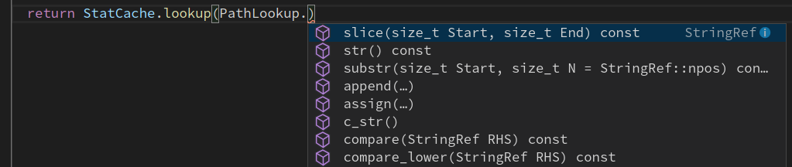
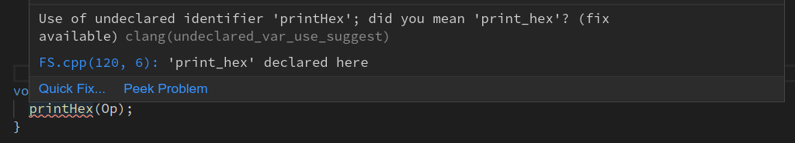
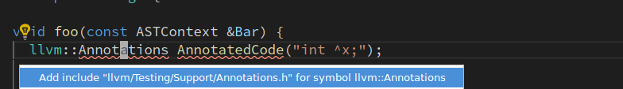
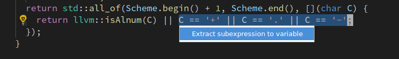

# vscode-clangd

Provides C/C++ language IDE features for VS Code using [clangd](https://clang.llvm.org/extra/clangd.html):

 - code completion
 - compile errors and warnings
 - go-to-definition and cross references
 - include management
 - code formatting
 - simple refactorings

## Setup

### `clangd` server

`clangd` is a language server that must be installed separately, see
[getting started](https://clang.llvm.org/extra/clangd/Installation.html#installing-clangd).
The vscode-clangd extension will look for `clangd` on your PATH (you can change
this in the settings).

### Project setup

clangd is based on the clang C++ compiler, and understands even complex C++
code.  However, you must tell clangd how your project is built (compile flags).
[A `compile_commands.json` file](http://clang.llvm.org/docs/JSONCompilationDatabase.html)
can usually be generated by your build system
(e.g. by setting `-DCMAKE_EXPORT_COMPILE_COMMANDS=1` when building with CMake,
or with
[many other tools](https://sarcasm.github.io/notes/dev/compilation-database.html)).

It should live at the top of your source tree: symlink or copy it there.

## Features

### Code completion

Suggestions will appear as you type names, or after `.` or `->`.
Because clangd uses a full C++ parser, code completion has access to precise
type information.

### Errors, warnings, and clang-tidy

Code errors are shown as you type (both as red squiggle underlines, and in the
"Problems" panel). These are the same as produced by the clang compiler, and
suggested fixes can automatically be applied.

Most clang-tidy checks are supported (these can be enabled using a [.clang-tidy
file](https://clang.llvm.org/extra/clang-tidy/)).

### Cross-references

Go-to-definition and find-references work across your code, using a project-wide
index.

Press `Ctrl-P #` to quickly navigate to a symbol by name.

### Include management

Code completion works across your codebase and adds `#include` directives where
needed. The `•` shows includes that will be inserted.

clangd can also suggest inserting missing #includes, where they cause errors.

### Formatting

clangd uses the `clang-format` engine. You can format a file or the selection.
When "Format on Type" is enabled in the settings, pressing enter will cause
clangd to format the old line and semantically reindent.

The style used for formatting (and certain other operations) is controlled by
the .clang-format file is controlled by the project's
[.clang-format file](https://clang.llvm.org/docs/ClangFormatStyleOptions.html).

### Refactoring

clangd supports some local refactorings. When you select an expression or
declaration, the lightbulb menu appears and you can choose a code action.

Current refactorings include:
 - extract variable/function
 - expand `auto` types and macros
 - use raw strings
 - rename (bound to `<F2>`, rather than a contextual code action)

## Bugs/contributing

clangd and vscode-clangd are part of the [LLVM project](https://llvm.org).

If you'd like to help out, reach out to clangd-dev@lists.llvm.org.

If you've found a bug, please file at https://github.com/clangd/clangd/issues.
