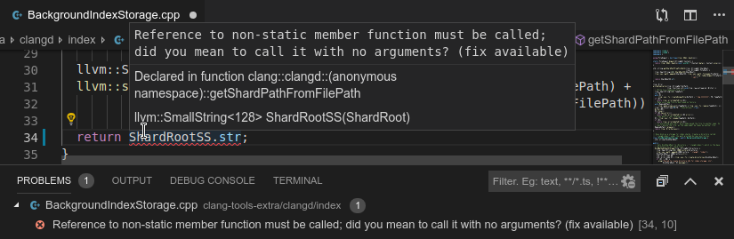
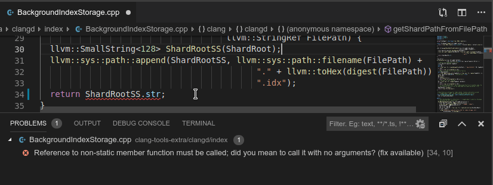
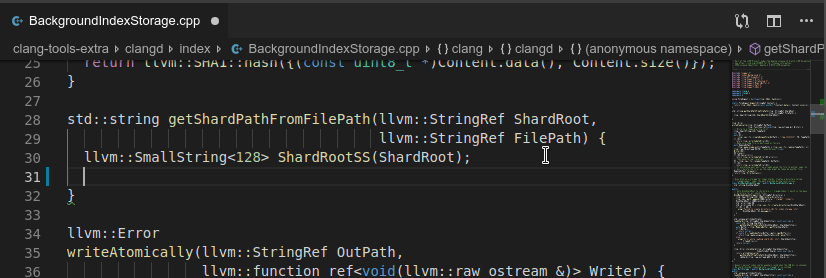
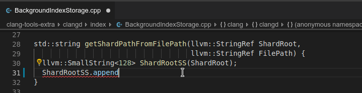
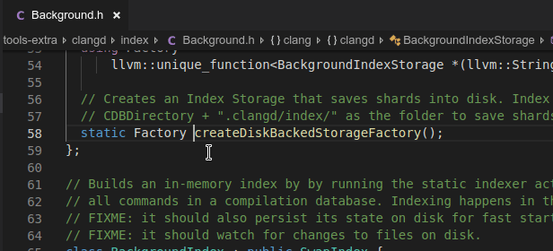
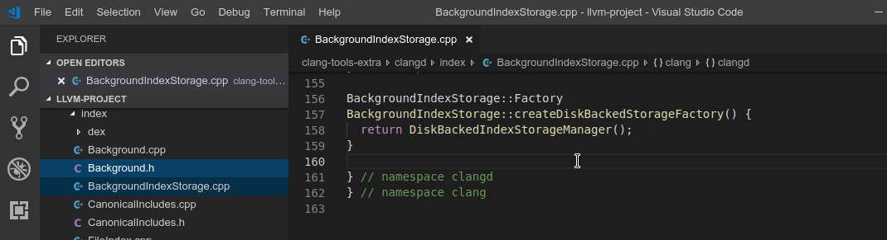
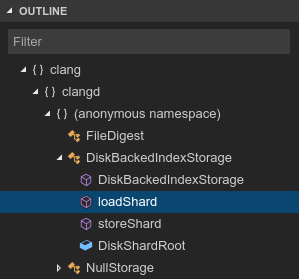
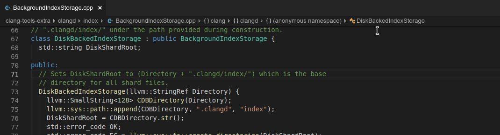
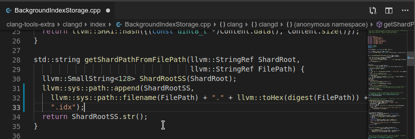

========
Features
========

.. role:: raw-html(raw)
   :format: html

Here is what clangd can do for you.  Screenshots below show `VSCode
<https://code.visualstudio.com/>`__; the available features and UI depend on
the editor.

Errors and warnings
===================

clangd runs the clang compiler on your code as you type, and shows errors and
warnings in-place.  Some errors are suppressed: diagnostics that require
expanding templates in headers are disabled for performance reasons.

:raw-html:`

Screenshot
`

:raw-html:`
`

Fixes in errors and warnings
----------------------------

The compiler can suggest fixes for many common problems automatically, and
clangd can update the code for you.

:raw-html:`

Animated demo
`

:raw-html:`
`

Code completion
===============

You'll see suggestions as you type based on what methods, variables, etc are
available in this context.

:raw-html:`

Screenshot
`

.. image:: CodeCompletionInVSCode.png
   :align: center
   :alt: Code completion demonstration

:raw-html:`
`

Abbreviating words may help you find the right result faster. If you type in
``camelCase`` but the function you're looking for is ``snake_case``, that's OK.

Insertion of namespace qualifiers and includes
----------------------------------------------

**(New in v8)**
clangd will sometimes suggest results from other files and namespaces. In this
case the correct qualifier and ``#include`` directive will be inserted.

:raw-html:`

Animated demo
`

:raw-html:`
`

Signature help
--------------

Some editors will show you the parameters of the function you're calling, as
you fill them in.

:raw-html:`

Animated demo
`

:raw-html:`
`

Cross-references
================

The following features let you navigate your codebase.

If there is no project-wide index, cross-references work across the files
you have opened.

Find definition/declaration
---------------------------

Jump to the definition or declaration of a symbol under the cursor.

:raw-html:`

Animated demo
`

:raw-html:`
`

Find references
---------------

Show all references to a symbol under the cursor.

:raw-html:`

Animated demo
`

:raw-html:`
`

Some editors will automatically highlight local references to the selected
symbol as you move around a file.

Navigation
==========

clangd informs the editor of the code structure in the current file.
Some editors use this to present an outline view:

:raw-html:`

Screenshot
`

:raw-html:`
`

In VSCode, the outline is also presented as breadcrumbs that allow jumping to a
symbol within the current file.  Searching for symbols within the scope of the
whole project is also possible.

:raw-html:`

Animated demo
`

:raw-html:`
`

Formatting
==========

clangd embeds `clang-format <https://clang.llvm.org/docs/ClangFormat.html>`__,
which can reformat your code: fixing indentation, breaking lines, and reflowing
comments.

:raw-html:`

Animated demo
`

:raw-html:`
`

clangd respects your project's ``.clang-format`` file which controls styling
options.

Format-as-you-type is experimental and doesn't work well yet.

Complete list of features
=========================

Here is a list of features that could be useful for editors, together with the
implementation status in clangd, and specification in the Language Server
Protocol.

It is not clear whether or not some of the features mentioned below should be a
part of the Language Server Protocol; those features might be eventually
developed outside clangd or become clangd extensions to LSP.

+-------------------------------------+------------+----------+
| C/C++ Editor feature                |  LSP       |  Clangd  |
+=====================================+============+==========+
| Formatting                          | Yes        |   Yes    |
+-------------------------------------+------------+----------+
| Completion                          | Yes        |   Yes    |
+-------------------------------------+------------+----------+
| Diagnostics                         | Yes        |   Yes    |
+-------------------------------------+------------+----------+
| Fix-its                             | Yes        |   Yes    |
+-------------------------------------+------------+----------+
| Go to Definition                    | Yes        |   Yes    |
+-------------------------------------+------------+----------+
| Signature Help                      | Yes        |   Yes    |
+-------------------------------------+------------+----------+
| Document Highlights                 | Yes        |   Yes    |
+-------------------------------------+------------+----------+
| Rename                              | Yes        |   Yes    |
+-------------------------------------+------------+----------+
| Source hover                        | Yes        |   Yes    |
+-------------------------------------+------------+----------+
| Find References                     | Yes        |   Yes    |
+-------------------------------------+------------+----------+
| Document Symbols                    | Yes        |   Yes    |
+-------------------------------------+------------+----------+
| Workspace Symbols                   | Yes        |   Yes    |
+-------------------------------------+------------+----------+
| Code Lens                           | Yes        |   No     |
+-------------------------------------+------------+----------+
| Code folding                        | Yes        |   No     |
+-------------------------------------+------------+----------+
| Extract Local Variable              | Yes        |   No     |
+-------------------------------------+------------+----------+
| Extract Function/Method             | Yes        |   No     |
+-------------------------------------+------------+----------+
| Quick Assist                        | Yes        |   No     |
+-------------------------------------+------------+----------+
| Hide Method                         | Yes        |   No     |
+-------------------------------------+------------+----------+
| Implement Method                    | Yes        |   No     |
+-------------------------------------+------------+----------+
| Gen. Getters/Setters                | Yes        |   No     |
+-------------------------------------+------------+----------+
| Syntax and Semantic Coloring        | No         |   No     |
+-------------------------------------+------------+----------+
| Call hierarchy                      | No         |   No     |
+-------------------------------------+------------+----------+
| Type hierarchy                      | No         |   No     |
+-------------------------------------+------------+----------+
| Organize Includes                   | No         |   No     |
+-------------------------------------+------------+----------+
