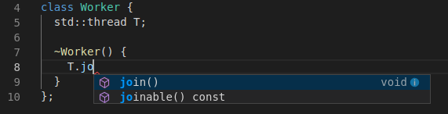

======
clangd
======

.. toctree::
   :maxdepth: 1

   Installation
   Features

What is clangd?
===============

clangd understands your C++ code and adds smart features to your editor: code
completion, compile errors, go-to-definition and more.

clangd is a language server that implements the `Language Server Protocol
<https://github.com/Microsoft/language-server-protocol>`__; it can work with
many editors through a plugin.  Here's Visual Studio Code with the clangd
plugin, demonstrating code completion:

clangd is based on the `Clang <https://clang.llvm.org>`__ C++ compiler, and is
part of the `LLVM <https://llvm.org>`__ project.
