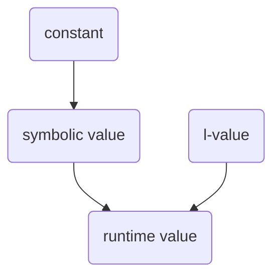

# Language design

<!--
Part of the Carbon Language project, under the Apache License v2.0 with LLVM
Exceptions. See /LICENSE for license information.
SPDX-License-Identifier: Apache-2.0 WITH LLVM-exception
-->

> **STATUS:** Up-to-date on 09-Aug-2022, including proposals up through
> [#1327](https://github.com/carbon-language/carbon-lang/pull/1327).

<!-- toc -->

## Table of contents

-   [Introduction](#introduction)
    -   [This document is provisional](#this-document-is-provisional)
    -   [Tour of the basics](#tour-of-the-basics)
-   [Code and comments](#code-and-comments)
-   [Build modes](#build-modes)
-   [Types are values](#types-are-values)
-   [Primitive types](#primitive-types)
    -   [`bool`](#bool)
    -   [Integer types](#integer-types)
        -   [Integer literals](#integer-literals)
    -   [Floating-point types](#floating-point-types)
        -   [Floating-point literals](#floating-point-literals)
    -   [String types](#string-types)
        -   [String literals](#string-literals)
-   [Value categories and value phases](#value-categories-and-value-phases)
-   [Composite types](#composite-types)
    -   [Tuples](#tuples)
    -   [Struct types](#struct-types)
    -   [Pointer types](#pointer-types)
    -   [Arrays and slices](#arrays-and-slices)
-   [Expressions](#expressions)
-   [Declarations, Definitions, and Scopes](#declarations-definitions-and-scopes)
-   [Patterns](#patterns)
    -   [Binding patterns](#binding-patterns)
    -   [Destructuring patterns](#destructuring-patterns)
    -   [Refutable patterns](#refutable-patterns)
-   [Name-binding declarations](#name-binding-declarations)
    -   [Constant `let` declarations](#constant-let-declarations)
    -   [Variable `var` declarations](#variable-var-declarations)
    -   [`auto`](#auto)
-   [Functions](#functions)
    -   [Parameters](#parameters)
    -   [`auto` return type](#auto-return-type)
    -   [Blocks and statements](#blocks-and-statements)
    -   [Assignment statements](#assignment-statements)
    -   [Control flow](#control-flow)
        -   [`if` and `else`](#if-and-else)
        -   [Loops](#loops)
            -   [`while`](#while)
            -   [`for`](#for)
            -   [`break`](#break)
            -   [`continue`](#continue)
        -   [`return`](#return)
            -   [`returned var`](#returned-var)
        -   [`match`](#match)
-   [User-defined types](#user-defined-types)
    -   [Classes](#classes)
        -   [Assignment](#assignment)
        -   [Class functions and factory functions](#class-functions-and-factory-functions)
        -   [Methods](#methods)
        -   [Inheritance](#inheritance)
        -   [Access control](#access-control)
        -   [Destructors](#destructors)
        -   [`const`](#const)
        -   [Unformed state](#unformed-state)
        -   [Move](#move)
        -   [Mixins](#mixins)
    -   [Choice types](#choice-types)
-   [Names](#names)
    -   [Files, libraries, packages](#files-libraries-packages)
    -   [Package declaration](#package-declaration)
    -   [Imports](#imports)
    -   [Name visibility](#name-visibility)
    -   [Package scope](#package-scope)
    -   [Namespaces](#namespaces)
    -   [Naming conventions](#naming-conventions)
    -   [Aliases](#aliases)
    -   [Name lookup](#name-lookup)
        -   [Name lookup for common types](#name-lookup-for-common-types)
-   [Generics](#generics)
    -   [Checked and template parameters](#checked-and-template-parameters)
    -   [Interfaces and implementations](#interfaces-and-implementations)
    -   [Combining constraints](#combining-constraints)
    -   [Associated types](#associated-types)
    -   [Generic entities](#generic-entities)
        -   [Generic Classes](#generic-classes)
        -   [Generic choice types](#generic-choice-types)
        -   [Generic interfaces](#generic-interfaces)
        -   [Generic implementations](#generic-implementations)
    -   [Other features](#other-features)
    -   [Generic type equality and `observe` declarations](#generic-type-equality-and-observe-declarations)
    -   [Operator overloading](#operator-overloading)
        -   [Common type](#common-type)
-   [Bidirectional interoperability with C and C++](#bidirectional-interoperability-with-c-and-c)
    -   [Goals](#goals)
    -   [Non-goals](#non-goals)
    -   [Importing and `#include`](#importing-and-include)
    -   [ABI and dynamic linking](#abi-and-dynamic-linking)
    -   [Operator overloading](#operator-overloading-1)
    -   [Templates](#templates)
    -   [Standard types](#standard-types)
    -   [Inheritance](#inheritance-1)
    -   [Enums](#enums)
-   [Unfinished tales](#unfinished-tales)
    -   [Safety](#safety)
    -   [Lifetime and move semantics](#lifetime-and-move-semantics)
    -   [Metaprogramming](#metaprogramming)
    -   [Pattern matching as function overload resolution](#pattern-matching-as-function-overload-resolution)
    -   [Error handling](#error-handling)
    -   [Execution abstractions](#execution-abstractions)
        -   [Abstract machine and execution model](#abstract-machine-and-execution-model)
        -   [Lambdas](#lambdas)
        -   [Co-routines](#co-routines)
        -   [Concurrency](#concurrency)

<!-- tocstop -->

## Introduction

This documentation describes the design of the Carbon language, and the
rationale for that design. This documentation is an overview of the Carbon
project in its current state, written for the builders of Carbon and for those
interested in learning more about Carbon.

This document is _not_ a complete programming manual, and, nor does it provide
detailed and comprehensive justification for design decisions. These
descriptions are found in linked dedicated designs.

### This document is provisional

This document includes much that is provisional or placeholder. This means that
the syntax used, language rules, standard library, and other aspects of the
design have things that have not been decided through the Carbon process. This
preliminary material fills in gaps until aspects of the design can be filled in.
Features that are provisional have been marked as such on a best-effort basis.

### Tour of the basics

Here is a simple function showing some Carbon code:

```carbon
import Math;

// Returns the smallest factor of `n` > 1, and
// whether `n` itself is prime.
fn SmallestFactor(n: i32) -> (i32, bool) {
  let limit: i32 = Math.Sqrt(n) as i32;
  var i: i32 = 2;
  while (i <= limit) {
    let remainder: i32 = n % i;
    if (remainder == 0) {
      Carbon.Print("{0} is a factor of {1}", i, n);
      return (i, false);
    }
    if (i == 2) {
      i = 3;
    } else {
      // Skip even numbers once we get past `2`.
      i += 2;
    }
  }
  return (n, true);
}
```

Carbon is a language that should feel familiar to C++ and C developers. This
example has familiar constructs like [imports](#imports),
[comments](#code-and-comments), [function definitions](#functions),
[typed arguments](#binding-patterns), and [expressions](#expressions).
[Statements](#blocks-and-statements) and
[declarations](#declarations-definitions-and-scopes) are terminated with a `;`
or something in curly braces `{`...`}`.

A few other features that are unlike C or C++ may stand out. First,
[declarations](#declarations-definitions-and-scopes) start with introducer
keywords. `fn` introduces a function declaration, and `var` introduces a
[variable declaration](#variable-var-declarations).

The example starts with an [`import` declaration](#imports). Carbon imports are
more like [C++ modules](https://en.cppreference.com/w/cpp/language/modules) than
[textual inclusion during preprocessing using `#include`](https://en.cppreference.com/w/cpp/preprocessor/include).
The `import` declaration imports a
[library from a package](#files-libraries-packages). It must appear at the top
of a Carbon source file, the first thing after the
[optional `package` declaration](#package-declaration). Libraries can optionally
be split into [api and implementation files](#files-libraries-packages), like
C++'s header and source files but without requiring a source file in any cases.
This declaration from the example:

```carbon
import Math;
```

imports the default library from package `Math`. The names from this library are
accessible as members of `Math`, like `Math.Sqrt`. The `Carbon.Print` function
comes from the `Carbon` package's prelude library which is
[imported by default](#name-lookup-for-common-types). Unlike C++, the namespaces
of different packages are kept separate, so there are no name conflicts.

Carbon [comments](#code-and-comments) must be on a line by themselves starting
with `//`:

```carbon
// Returns the smallest factor of `n` > 1, and
// whether `n` itself is prime.
...
      // Skip even numbers once we get past `2`.
```

A [function definition](#functions) consists of:

-   the `fn` keyword introducer,
-   the function's name,
-   a parameter list in round parens `(`...`)`,
-   an optional `->` and return type, and
-   a body inside curly braces `{`...`}`.

```carbon
fn SmallestFactor(n: i32) -> (i32, bool) {
  ...
      return (i, false);
  ...
  return (n, true);
}
```

The body of the function is an ordered sequence of
[statements](#blocks-and-statements) and
[declarations](#declarations-definitions-and-scopes). Function execution ends
when it reaches a `return` statement or the end of the function body. `return`
statements can also specify an expression whose value is returned.

Here `i32` refers to a signed [integer type](#integer-types), with 32 bits, and
`bool` is the [boolean type](#bool). Carbon also has
[floating-point types](#floating-point-types) like `f32` and `f64`, and
[string types](#string-types).

A [variable declaration](#variable-var-declarations) has three parts:

-   the `var` keyword introducer,
-   the name followed by a `:` and a type, declared the same way as a parameter
    in a function signature, and
-   an optional initializer.

```carbon
  var i: i32 = 2;
```

You can modify the value of a variable with an
[assignment statement](#assignment-statements):

```carbon
      i = 3;
      ...
      i += 2;
```

[Constants are declared](#constant-let-declarations) with the `let` keyword
introducer. The syntax parallels variable declarations except the initializer is
required:

```carbon
  let limit: i32 = Math.Sqrt(n) as i32;
  ...
    let remainder: i32 = n % i;
```

The initializer `Math.Sqrt(n) as i32` is an [expression](#expressions). It first
calls the `Math.Sqrt` function with `n` as the argument. Then, the `as` operator
casts the floating-point return value to `i32`. Lossy conversions like that must
be done explicitly.

Other expressions include `n % i`, which applies the binary `%` modulo operator
with `n` and `i` as arguments, and `remainder == 0`, which applies the `==`
comparison operator producing a `bool` result. Expression return values are
ignored when expressions are used as statements, as in this call to the
`Carbon.Print` function:

```carbon
      Carbon.Print("{0} is a factor of {1}", i, n);
```

Function calls consist of the name of the function followed by the
comma-separated argument list in round parentheses `(`...`)`.

Control flow statements, including `if`, `while`, `for`, `break`, and
`continue`, change the order that statements are executed, as they do in C++:

```carbon
  while (i <= limit) {
    ...
    if (remainder == 0) {
      ...
    }
    if (i == 2) {
      ...
    } else {
      ...
    }
  }
```

Every code block in curly braces `{`...`}` defines a scope. Names are visible
from their declaration until the end of innermost scope containing it. So
`remainder` in the example is visible until the curly brace `}` that closes the
`while`.

The example function uses a [_tuple_](#tuples), a
[composite type](#composite-types), to return multiple values. Both tuple values
and types are written using a comma-separated list inside parentheses. So
`(i, false)` and `(n, true)` are tuple values, and `(i32, bool)` is their type.

[Struct types](#struct-types) are similar, except their members are referenced
by name instead of position. The example could be changed to use structs instead
as follows:

```carbon
// Return type of `{.factor: i32, .prime: bool}` is a struct
// with an `i32` field named `.factor`, and a `bool` field
// named `.prime`.
fn SmallestFactor(n: i32) -> {.factor: i32, .prime: bool} {
  ...
    if (remainder == 0) {
      // Return a struct value.
      return {.factor = i, .prime = false};
    }
  ...
  // Return a struct value.
  return {.factor = n, .prime = true};
}
```

## Code and comments

All source code is UTF-8 encoded text. Comments, identifiers, and strings are
allowed to have non-ASCII characters.

```carbon
var résultat: String = "Succès";
```

Comments start with two slashes `//` and go to the end of the line. They are
required to be the only non-whitespace on the line.

```carbon
// Compute an approximation of π
```

> References:
>
> -   [Source files](code_and_name_organization/source_files.md)
> -   [Lexical conventions](lexical_conventions)
> -   Proposal
>     [#142: Unicode source files](https://github.com/carbon-language/carbon-lang/pull/142)
> -   Proposal
>     [#198: Comments](https://github.com/carbon-language/carbon-lang/pull/198)

## Build modes

The behavior of the Carbon compiler depends on the _build mode_:

-   In a _development build_, the priority is diagnosing problems and fast build
    time.
-   In a _performance build_, the priority is fastest execution time and lowest
    memory usage.
-   In a _hardened build_, the first priority is safety and second is
    performance.

> References: [Safety strategy](/docs/project/principles/safety_strategy.md)

## Types are values

Expressions compute values in Carbon, and these values are always strongly typed
much like in C++. However, an important difference from C++ is that types are
themselves modeled as values; specifically, compile-time-constant values. This
has a number of consequences:

-   Names for types are in the same namespace shared with functions, variables,
    namespaces, and so on.
-   The grammar for writing a type is the [expression](#expressions) grammar,
    not a separate grammar for types. As a result, Carbon doesn't use angle
    brackets `<`...`>` in types, since `<` and `>` are used for comparison in
    expressions.
-   Function call syntax is used to specify parameters to a type, like
    `HashMap(String, i64)`.

Some values, such as `()` and `{}`, may even be used as types, but only act like
types when they are in a type position, like after a `:` in a variable
declaration or the return type after a `->` in a function declaration. Any
expression in a type position must be
[a constants or symbolic value](#value-categories-and-value-phases) so the
compiler can resolve whether the value can be used as a type. This also puts
limits on how much operators can do different things for types. This is good for
consistency, but is a significant restriction on Carbon's design.

## Primitive types

Primitive types fall into the following categories:

-   the boolean type `bool`,
-   signed and unsigned integer types,
-   IEEE-754 floating-point types, and
-   string types.

These are made available through the [prelude](#name-lookup-for-common-types).

> References: [Primitive types](primitive_types.md)

### `bool`

The type `bool` is a boolean type with two possible values: `true` and `false`.
[Comparison expressions](#expressions) produce `bool` values. The condition
arguments in [control-flow statements](#control-flow), like [`if`](#if-and-else)
and [`while`](#while), and
[`if`-`then`-`else` conditional expressions](#expressions) take `bool` values.

### Integer types

The signed-integer type with bit width `N` may be written `Carbon.Int(N)`. For
convenience and brevity, the common power-of-two sizes may be written with an
`i` followed by the size: `i8`, `i16`, `i32`, `i64`, or `i128`. Signed-integer
[overflow](expressions/arithmetic.md#overflow-and-other-error-conditions) is a
programming error:

-   In a development build, overflow will be caught immediately when it happens
    at runtime.
-   In a performance build, the optimizer can assume that such conditions don't
    occur. As a consequence, if they do, the behavior of the program is not
    defined.
-   In a hardened build, overflow does not result in undefined behavior.
    Instead, either the program will be aborted, or the arithmetic will evaluate
    to a mathematically incorrect result, such as a two's complement result or
    zero.

The unsigned-integer types are: `u8`, `u16`, `u32`, `u64`, `u128`, and
`Carbon.UInt(N)`. Unsigned integer types wrap around on overflow, we strongly
advise that they are not used except when those semantics are desired. These
types are intended for bit manipulation or modular arithmetic as often found in
[hashing](https://en.wikipedia.org/wiki/Hash_function),
[cryptography](https://en.wikipedia.org/wiki/Cryptography), and
[PRNG](https://en.wikipedia.org/wiki/Pseudorandom_number_generator) use cases.
Values which can never be negative, like sizes, but for which wrapping does not
make sense
[should use signed integer types](/proposals/p1083.md#dont-let-unsigned-arithmetic-wrap).

> References:
>
> -   Question-for-leads issue
>     [#543: pick names for fixed-size integer types](https://github.com/carbon-language/carbon-lang/issues/543)
> -   Proposal
>     [#820: Implicit conversions](https://github.com/carbon-language/carbon-lang/pull/820)
> -   Proposal
>     [#1083: Arithmetic expressions](https://github.com/carbon-language/carbon-lang/pull/1083)

#### Integer literals

Integers may be written in decimal, hexadecimal, or binary:

-   `12345` (decimal)
-   `0x1FE` (hexadecimal)
-   `0b1010` (binary)

Underscores (`_`) may be used as digit separators. Numeric literals are
case-sensitive: `0x`, `0b` must be lowercase, whereas hexadecimal digits must be
uppercase. Integer literals never contain a `.`.

Unlike in C++, literals do not have a suffix to indicate their type. Instead,
numeric literals have a type derived from their value, and can be
[implicitly converted](expressions/implicit_conversions.md) to any type that can
represent that value.

> References:
>
> -   [Integer literal syntax](lexical_conventions/numeric_literals.md#integer-literals)
> -   [Numeric Literal Semantics](numeric_literals.md)
> -   Proposal
>     [#143: Numeric literals](https://github.com/carbon-language/carbon-lang/pull/143)
> -   Proposal
>     [#144: Numeric literal semantics](https://github.com/carbon-language/carbon-lang/pull/144)
> -   Proposal
>     [#820: Implicit conversions](https://github.com/carbon-language/carbon-lang/pull/820)
> -   Proposal
>     [#1983: Weaken digit separator placement rules](https://github.com/carbon-language/carbon-lang/pull/1983)

### Floating-point types

Floating-point types in Carbon have IEEE 754 semantics, use the round-to-nearest
rounding mode, and do not set any floating-point exception state. They are named
with an `f` and the number of bits: `f16`, `f32`, `f64`, and `f128`.
[`BFloat16`](primitive_types.md#bfloat16) is also provided.

> References:
>
> -   Question-for-leads issue
>     [#543: pick names for fixed-size integer types](https://github.com/carbon-language/carbon-lang/issues/543)
> -   Proposal
>     [#820: Implicit conversions](https://github.com/carbon-language/carbon-lang/pull/820)
> -   Proposal
>     [#1083: Arithmetic expressions](https://github.com/carbon-language/carbon-lang/pull/1083)

#### Floating-point literals

Floating-point types along with [user-defined types](#user-defined-types) may
initialized from _real-number literals_. Decimal and hexadecimal real-number
literals are supported:

-   `123.456` (digits on both sides of the `.`)
-   `123.456e789` (optional `+` or `-` after the `e`)
-   `0x1.Ap123` (optional `+` or `-` after the `p`)

As with integer literals, underscores (`_`) may be used as digit separators.
Real-number literals always have a period (`.`) and a digit on each side of the
period. When a real-number literal is interpreted as a value of a floating-point
type, its value is the representable real number closest to the value of the
literal. In the case of a tie, the nearest value whose mantissa is even is
selected.

> References:
>
> -   [Real-number literal syntax](lexical_conventions/numeric_literals.md#real-number-literals)
> -   [Numeric Literal Semantics](numeric_literals.md)
> -   Proposal
>     [#143: Numeric literals](https://github.com/carbon-language/carbon-lang/pull/143)
> -   Proposal
>     [#144: Numeric literal semantics](https://github.com/carbon-language/carbon-lang/pull/144)
> -   Proposal
>     [#820: Implicit conversions](https://github.com/carbon-language/carbon-lang/pull/820)
> -   Proposal
>     [#866: Allow ties in floating literals](https://github.com/carbon-language/carbon-lang/pull/866)
> -   Proposal
>     [#1983: Weaken digit separator placement rules](https://github.com/carbon-language/carbon-lang/pull/1983)

### String types

> **Note:** This is provisional, no design for string types has been through the
> proposal process yet.

There are two string types:

-   `String` - a byte sequence treated as containing UTF-8 encoded text.
-   `StringView` - a read-only reference to a byte sequence treated as
    containing UTF-8 encoded text.

#### String literals

String literals may be written on a single line using a double quotation mark
(`"`) at the beginning and end of the string, as in `"example"`.

Multi-line string literals, called _block string literals_, begin and end with
three double quotation marks (`"""`), and may have a file type indicator after
the first `"""`.

```carbon
// Block string literal:
var block: String = """
    The winds grow high; so do your stomachs, lords.
    How irksome is this music to my heart!
    When such strings jar, what hope of harmony?
    I pray, my lords, let me compound this strife.
        -- History of Henry VI, Part II, Act II, Scene 1, W. Shakespeare
    """;
```

The indentation of a block string literal's terminating line is removed from all
preceding lines.

Strings may contain
[escape sequences](lexical_conventions/string_literals.md#escape-sequences)
introduced with a backslash (`\`).
[Raw string literals](lexical_conventions/string_literals.md#raw-string-literals)
are available for representing strings with `\`s and `"`s.

> References:
>
> -   [String literals](lexical_conventions/string_literals.md)
> -   Proposal
>     [#199: String literals](https://github.com/carbon-language/carbon-lang/pull/199)

## Value categories and value phases

Every value has a
[value category](<https://en.wikipedia.org/wiki/Value_(computer_science)#lrvalue>),
similar to [C++](https://en.cppreference.com/w/cpp/language/value_category),
that is either _l-value_ or _r-value_. Carbon will automatically convert an
l-value to an r-value, but not in the other direction.

L-values have storage and a stable address. They may be modified, assuming their
type is not [`const`](#const).

R-values may not have dedicated storage. This means they cannot be modified and
their address generally cannot be taken. R-values are broken down into three
kinds, called _value phases_:

-   A _constant_ has a value known at compile time, and that value is available
    during type checking, for example to use as the size of an array. These
    include literals ([integer](#integer-literals),
    [floating-point](#floating-point-literals), [string](#string-literals)),
    concrete type values (like `f64` or `Optional(i32*)`), expressions in terms
    of constants, and values of
    [`template` parameters](#checked-and-template-parameters).
-   A _symbolic value_ has a value that will be known at the code generation
    stage of compilation when
    [monomorphization](https://en.wikipedia.org/wiki/Monomorphization) happens,
    but is not known during type checking. This includes
    [checked-generic parameters](#checked-and-template-parameters), and type
    expressions with checked-generic arguments, like `Optional(T*)`.
-   A _runtime value_ has a dynamic value only known at runtime.

Carbon will automatically convert a constant to a symbolic value, or any value
to a runtime value:



Constants convert to symbolic values and to runtime values. Symbolic values will
generally convert into runtime values if an operation that inspects the value is
performed on them. Runtime values will convert into constants or to symbolic
values if constant evaluation of the runtime expression succeeds.

> **Note:** Conversion of runtime values to other phases is provisional, as are
> the semantics of r-values. See pending proposal
> [#821: Values, variables, pointers, and references](https://github.com/carbon-language/carbon-lang/pull/821).

## Composite types

### Tuples

A tuple is a fixed-size collection of values that can have different types,
where each value is identified by its position in the tuple. An example use of
tuples is to return multiple values from a function:

```carbon
fn DoubleBoth(x: i32, y: i32) -> (i32, i32) {
  return (2 * x, 2 * y);
}
```

Breaking this example apart:

-   The return type is a tuple of two `i32` types.
-   The expression uses tuple syntax to build a tuple of two `i32` values.

Both of these are expressions using the tuple syntax
`(<expression>, <expression>)`. The only difference is the type of the tuple
expression: one is a tuple of types, the other a tuple of values. In other
words, a tuple type is a tuple _of_ types.

The components of a tuple are accessed positionally, so element access uses
subscript syntax, but the index must be a compile-time constant:

```carbon
fn DoubleTuple(x: (i32, i32)) -> (i32, i32) {
  return (2 * x[0], 2 * x[1]);
}
```

Tuple types are
[structural](https://en.wikipedia.org/wiki/Structural_type_system).

> **Note:** This is provisional, no design for tuples has been through the
> proposal process yet. Many of these questions were discussed in dropped
> proposal [#111](https://github.com/carbon-language/carbon-lang/pull/111).

> References: [Tuples](tuples.md)

### Struct types

Carbon also has
[structural types](https://en.wikipedia.org/wiki/Structural_type_system) whose
members are identified by name instead of position. These are called _structural
data classes_, also known as a _struct types_ or _structs_.

Both struct types and values are written inside curly braces (`{`...`}`). In
both cases, they have a comma-separated list of members that start with a period
(`.`) followed by the field name.

-   In a struct type, the field name is followed by a colon (`:`) and the type,
    as in: `{.name: String, .count: i32}`.
-   In a struct value, called a _structural data class literal_ or a _struct
    literal_, the field name is followed by an equal sign (`=`) and the value,
    as in `{.key = "Joe", .count = 3}`.

> References:
>
> -   [Struct types](classes.md#struct-types)
> -   Proposal
>     [#561: Basic classes: use cases, struct literals, struct types, and future work](https://github.com/carbon-language/carbon-lang/pull/561)
> -   Proposal
>     [#981: Implicit conversions for aggregates](https://github.com/carbon-language/carbon-lang/pull/981)
> -   Proposal
>     [#710: Default comparison for data classes](https://github.com/carbon-language/carbon-lang/issues/710)

### Pointer types

The type of pointers-to-values-of-type-`T` is written `T*`. Carbon pointers do
not support
[pointer arithmetic](<https://en.wikipedia.org/wiki/Pointer_(computer_programming)>);
the only pointer [operations](#expressions) are:

-   Dereference: given a pointer `p`, `*p` gives the value `p` points to as an
    [l-value](#value-categories-and-value-phases). `p->m` is syntactic sugar for
    `(*p).m`.
-   Address-of: given an [l-value](#value-categories-and-value-phases) `x`, `&x`
    returns a pointer to `x`.

There are no [null pointers](https://en.wikipedia.org/wiki/Null_pointer) in
Carbon. To represent a pointer that may not refer to a valid object, use the
type `Optional(T*)`.

**TODO:** Perhaps Carbon will have
[stricter pointer provenance](https://www.ralfj.de/blog/2022/04/11/provenance-exposed.html)
or restrictions on casts between pointers and integers.

> **Note:** While the syntax for pointers has been decided, the semantics of
> pointers are provisional, as is the syntax for optionals. See pending proposal
> [#821: Values, variables, pointers, and references](https://github.com/carbon-language/carbon-lang/pull/821).

> References:
>
> -   Question-for-leads issue
>     [#520: should we use whitespace-sensitive operator fixity?](https://github.com/carbon-language/carbon-lang/issues/520)
> -   Question-for-leads issue
>     [#523: what syntax should we use for pointer types?](https://github.com/carbon-language/carbon-lang/issues/523)

### Arrays and slices

The type of an array of holding 4 `i32` values is written `[i32; 4]`. There is
an [implicit conversion](expressions/implicit_conversions.md) from tuples to
arrays of the same length as long as every component of the tuple may be
implicitly converted to the destination element type. In cases where the size of
the array may be deduced, it may be omitted, as in:

```carbon
var i: i32 = 1;
// `[i32;]` equivalent to `[i32; 3]` here.
var a: [i32;] = (i, i, i);
```

Elements of an array may be accessed using square brackets (`[`...`]`), as in
`a[i]`:

```carbon
a[i] = 2;
Carbon.Print(a[0]);
```

> **TODO:** Slices

> **Note:** This is provisional, no design for arrays has been through the
> proposal process yet. See pending proposal
> [#1928: Arrays](https://github.com/carbon-language/carbon-lang/pull/1928).

## Expressions

Expressions describe some computed value. The simplest example would be a
literal number like `42`: an expression that computes the integer value 42.

Some common expressions in Carbon include:

-   Literals:

    -   [boolean](#bool): `true`, `false`
    -   [integer](#integer-literals): `42`, `-7`
    -   [real-number](#floating-point-literals): `3.1419`, `6.022e+23`
    -   [string](#string-literals): `"Hello World!"`
    -   [tuple](#tuples): `(1, 2, 3)`
    -   [struct](#struct-types): `{.word = "the", .count = 56}`

-   [Names](#names) and [member access](expressions/member_access.md)

-   [Operators](expressions#operators):

    -   [Arithmetic](expressions/arithmetic.md): `-x`, `1 + 2`, `3 - 4`,
        `2 * 5`, `6 / 3`, `5 % 3`
    -   [Bitwise](expressions/bitwise.md): `2 & 3`, `2 | 4`, `3 ^ 1`, `^7`
    -   [Bit shift](expressions/bitwise.md): `1 << 3`, `8 >> 1`
    -   [Comparison](expressions/comparison_operators.md): `2 == 2`, `3 != 4`,
        `5 < 6`, `7 > 6`, `8 <= 8`, `8 >= 8`
    -   [Conversion](expressions/as_expressions.md): `2 as i32`
    -   [Logical](expressions/logical_operators.md): `a and b`, `c or d`,
        `not e`
    -   [Indexing](#arrays-and-slices): `a[3]`
    -   [Function](#functions) call: `f(4)`
    -   [Pointer](#pointer-types): `*p`, `p->m`, `&x`
    -   [Move](#move): `~x`

-   [Conditionals](expressions/if.md): `if c then t else f`
-   Parentheses: `(7 + 8) * (3 - 1)`

When an expression appears in a context in which an expression of a specific
type is expected, [implicit conversions](expressions/implicit_conversions.md)
are applied to convert the expression to the target type.

> References:
>
> -   [Expressions](expressions/)
> -   Proposal
>     [#162: Basic Syntax](https://github.com/carbon-language/carbon-lang/pull/162)
> -   Proposal
>     [#555: Operator precedence](https://github.com/carbon-language/carbon-lang/pull/555)
> -   Proposal
>     [#601: Operator tokens](https://github.com/carbon-language/carbon-lang/pull/601)
> -   Proposal
>     [#680: And, or, not](https://github.com/carbon-language/carbon-lang/pull/680)
> -   Proposal
>     [#702: Comparison operators](https://github.com/carbon-language/carbon-lang/pull/702)
> -   Proposal
>     [#845: as expressions](https://github.com/carbon-language/carbon-lang/pull/845)
> -   Proposal
>     [#911: Conditional expressions](https://github.com/carbon-language/carbon-lang/pull/911)
> -   Proposal
>     [#1083: Arithmetic expressions](https://github.com/carbon-language/carbon-lang/pull/1083)

## Declarations, Definitions, and Scopes

_Declarations_ introduce a new [name](#names) and say what that name represents.
For some kinds of entities, like [functions](#functions), there are two kinds of
declarations: _forward declarations_ and _definitions_. For those entities,
there should be exactly one definition for the name, and at most one additional
forward declaration that introduces the name before it is defined, plus any
number of declarations in a
[`match_first` block](generics/details.md#prioritization-rule). Forward
declarations can be used to separate interface from implementation, such as to
declare a name in an [api file](#files-libraries-packages) that is defined in an
[impl file](#files-libraries-packages). Forward declarations also allow entities
to be used before they are defined, such as to allow cyclic references. A name
that has been declared but not defined is called _incomplete_, and in some cases
there are limitations on what can be done with an incomplete name. Within a
definition, the defined name is incomplete until the end of the definition is
reached, but is complete in the bodies of member functions because they are
[parsed as if they appeared after the definition](#class-functions-and-factory-functions).

A name is valid until the end of the innermost enclosing
[_scope_](<https://en.wikipedia.org/wiki/Scope_(computer_science)>). There are a
few kinds of scopes:

-   the outermost scope, which includes the whole file,
-   scopes that are enclosed in curly braces (`{`...`}`), and
-   scopes that encompass a single declaration.

For example, the names of the parameters of a [function](#functions) or
[class](#classes) are valid until the end of the declaration. The name of the
function or class itself is visible until the end of the enclosing scope.

> References:
>
> -   [Principle: Information accumulation](/docs/project/principles/information_accumulation.md)
> -   Proposal
>     [#875: Principle: information accumulation](https://github.com/carbon-language/carbon-lang/pull/875)
> -   Question-for-leads issue
>     [#472: Open question: Calling functions defined later in the same file](https://github.com/carbon-language/carbon-lang/issues/472)

## Patterns

> **Note:** This is provisional, no design for patterns has been through the
> proposal process yet.

A _pattern_ says how to receive some data that is being matched against. There
are two kinds of patterns:

-   _Refutable_ patterns can fail to match based on the runtime value being
    matched.
-   _Irrefutable_ patterns are guaranteed to match, so long as the code
    type-checks.

In the [introduction](#tour-of-the-basics), [function parameters](#functions),
[variable `var` declarations](#variable-var-declarations), and
[constant `let` declarations](#constant-let-declarations) use a "name `:` type"
construction. That construction is an example of an irrefutable pattern, and in
fact any irrefutable pattern may be used in those positions.
[`match` statements](#match) can include both refutable patterns and irrefutable
patterns.

> References:
>
> -   [Pattern matching](pattern_matching.md)
> -   Proposal
>     [#162: Basic Syntax](https://github.com/carbon-language/carbon-lang/pull/162)

### Binding patterns

The most common irrefutable pattern is a _binding pattern_, consisting of a new
name, a colon (`:`), and a type. It binds the matched value of that type to that
name. It can only match values that may be
[implicitly converted](expressions/implicit_conversions.md) to that type. A
underscore (`_`) may be used instead of the name to match a value but without
binding any name to it.

Binding patterns default to _`let` bindings_. The `var` keyword is used to make
it a _`var` binding_.

-   The result of a `let` binding is the name is bound to an
    [r-value](#value-categories-and-value-phases). This means the value cannot
    be modified, and its address generally cannot be taken.
-   A `var` binding has dedicated storage, and so the name is an
    [l-value](#value-categories-and-value-phases) which can be modified and has
    a stable address.

A `let`-binding may trigger a copy of the original value, or a move if the
original value is a temporary, or the binding may be a pointer to the original
value, like a
[`const` reference in C++](<https://en.wikipedia.org/wiki/Reference_(C%2B%2B)>).
Which of these options (copy, move, or pointer) is selected must not be
observable to the programmer. For example, Carbon will not allow modifications
to the original value when it is through a pointer. This choice may also be
influenced by the type. For example, types that don't support being copied will
be passed by pointer instead.

A [generic binding](#checked-and-template-parameters) uses `:!` instead of a
colon (`:`) and can only match
[constant or symbolic values](#value-categories-and-value-phases), not run-time
values.

The keyword `auto` may be used in place of the type in a binding pattern, as
long as the type can be deduced from the type of a value in the same
declaration.

### Destructuring patterns

There are also irrefutable _destructuring patterns_, such as _tuple
destructuring_. A tuple destructuring pattern looks like a tuple of patterns. It
may only be used to match tuple values whose components match the component
patterns of the tuple. An example use is:

```carbon
// `Bar()` returns a tuple consisting of an
// `i32` value and 2-tuple of `f32` values.
fn Bar() -> (i32, (f32, f32));

fn Foo() -> i64 {
  // Pattern in `var` declaration:
  var (p: i64, _: auto) = Bar();
  return p;
}
```

The pattern used in the `var` declaration destructures the tuple value returned
by `Bar()`. The first component pattern, `p: i64`, corresponds to the first
component of the value returned by `Bar()`, which has type `i32`. This is
allowed since there is an implicit conversion from `i32` to `i64`. The result of
this conversion is assigned to the name `p`. The second component pattern,
`_: auto`, matches the second component of the value returned by `Bar()`, which
has type `(f32, f32)`.

### Refutable patterns

Additional kinds of patterns are allowed in [`match` statements](#match), that
may or may not match based on the runtime value of the `match` expression:

-   An _expression pattern_ is an expression, such as `42`, whose value must be
    equal to match.
-   A _choice pattern_ matches one case from a choice type, as described in
    [the choice types section](#choice-types).
-   A _dynamic cast pattern_ is tests the dynamic type, as described in
    [inheritance](#inheritance).

See [`match`](#match) for examples of refutable patterns.

> References:
>
> -   [Pattern matching](pattern_matching.md)
> -   Question-for-leads issue
>     [#1283: how should pattern matching and implicit conversion interact?](https://github.com/carbon-language/carbon-lang/issues/1283)

## Name-binding declarations

There are two kinds of name-binding declarations:

-   constant declarations, introduced with `let`, and
-   variable declarations, introduced with `var`.

There are no forward declarations of these; all name-binding declarations are
[definitions](#declarations-definitions-and-scopes).

### Constant `let` declarations

A `let` declaration matches an [irrefutable pattern](#patterns) to a value. In
this example, the name `x` is bound to the value `42` with type `i64`:

```carbon
let x: i64 = 42;
```

Here `x: i64` is the pattern, which is followed by an equal sign (`=`) and the
value to match, `42`. The names from [binding patterns](#binding-patterns) are
introduced into the enclosing [scope](#declarations-definitions-and-scopes).

> **Note:** `let` declarations are provisional. See pending proposal
> [#821: Values, variables, pointers, and references](https://github.com/carbon-language/carbon-lang/pull/821).

### Variable `var` declarations

A `var` declaration is similar, except with `var` bindings, so `x` here is an
[l-value](#value-categories-and-value-phases) with storage and an address, and
so may be modified:

```carbon
var x: i64 = 42;
x = 7;
```

Variables with a type that has [an unformed state](#unformed-state) do not need
to be initialized in the variable declaration, but do need to be assigned before
they are used.

> References:
>
> -   [Variables](variables.md)
> -   Proposal
>     [#162: Basic Syntax](https://github.com/carbon-language/carbon-lang/pull/162)
> -   Proposal
>     [#257: Initialization of memory and variables](https://github.com/carbon-language/carbon-lang/pull/257)
> -   Proposal
>     [#339: Add `var <type> <identifier> [ = <value> ];` syntax for variables](https://github.com/carbon-language/carbon-lang/pull/339)
> -   Proposal
>     [#618: var ordering](https://github.com/carbon-language/carbon-lang/pull/618)

### `auto`

If `auto` is used as the type in a `var` or `let` declaration, the type is the
static type of the initializer expression, which is required.

```
var x: i64 = 2;
// The type of `y` is inferred to be `i64`.
let y: auto = x + 3;
// The type of `z` is inferred to be `bool`.
var z: auto = (y > 1);
```

> References:
>
> -   [Type inference](type_inference.md)
> -   Proposal
>     [#851: auto keyword for vars](https://github.com/carbon-language/carbon-lang/pull/851)

## Functions

Functions are the core unit of behavior. For example, this is a
[forward declaration](#declarations-definitions-and-scopes) of a function that
adds two 64-bit integers:

```carbon
fn Add(a: i64, b: i64) -> i64;
```

Breaking this apart:

-   `fn` is the keyword used to introduce a function.
-   Its name is `Add`. This is the name added to the enclosing
    [scope](#declarations-definitions-and-scopes).
-   The [parameter list](#parameters) in parentheses (`(`...`)`) is a
    comma-separated list of [irrefutable patterns](#patterns).
-   It returns an `i64` result. Functions that return nothing omit the `->` and
    return type.

You would call this function like `Add(1, 2)`.

A function definition is a function declaration that has a body
[block](#blocks-and-statements) instead of a semicolon:

```carbon
fn Add(a: i64, b: i64) -> i64 {
  return a + b;
}
```

The names of the parameters are in scope until the end of the definition or
declaration. The parameter names in a forward declaration may be omitted using
`_`, but must match the definition if they are specified.

> References:
>
> -   [Functions](functions.md)
> -   Proposal
>     [#162: Basic Syntax](https://github.com/carbon-language/carbon-lang/pull/162)
> -   Proposal
>     [#438: Add statement syntax for function declarations](https://github.com/carbon-language/carbon-lang/pull/438)
> -   Question-for-leads issue
>     [#476: Optional argument names (unused arguments)](https://github.com/carbon-language/carbon-lang/issues/476)
> -   Question-for-leads issue
>     [#1132: How do we match forward declarations with their definitions?](https://github.com/carbon-language/carbon-lang/issues/1132)

### Parameters

The bindings in the parameter list default to
[`let` bindings](#binding-patterns), and so the parameter names are treated as
[r-values](#value-categories-and-value-phases). This is appropriate for input
parameters. This binding will be implemented using a pointer, unless it is legal
to copy and copying is cheaper.

If the `var` keyword is added before the binding, then the arguments will be
copied (or moved from a temporary) to new storage, and so can be mutated in the
function body. The copy ensures that any mutations will not be visible to the
caller.

Use a [pointer](#pointer-types) parameter type to represent an
[input/output parameter](<https://en.wikipedia.org/wiki/Parameter_(computer_programming)#Output_parameters>),
allowing a function to modify a variable of the caller's. This makes the
possibility of those modifications visible: by taking the address using `&` in
the caller, and dereferencing using `*` in the callee.

Outputs of a function should prefer to be returned. Multiple values may be
returned using a [tuple](#tuples) or [struct](#struct-types) type.

> **Note:** The semantics of parameter passing are provisional. See pending
> proposal
> [#821: Values, variables, pointers, and references](https://github.com/carbon-language/carbon-lang/pull/821).

### `auto` return type

If `auto` is used in place of the return type, the return type of the function
is inferred from the function body. It is set to [common type](#common-type) of
the static type of arguments to the [`return` statements](#return) in the
function. This is not allowed in a forward declaration.

```
// Return type is inferred to be `bool`, the type of `a > 0`.
fn Positive(a: i64) -> auto {
  return a > 0;
}
```

> References:
>
> -   [Type inference](type_inference.md)
> -   [Function return clause](functions.md#return-clause)
> -   Proposal
>     [#826: Function return type inference](https://github.com/carbon-language/carbon-lang/pull/826)

### Blocks and statements

A _block_ is a sequence of _statements_. A block defines a
[scope](#declarations-definitions-and-scopes) and, like other scopes, is
enclosed in curly braces (`{`...`}`). Each statement is terminated by a
semicolon or block. [Expressions](#expressions) and
[`var`](#variable-var-declarations) and [`let`](#constant-let-declarations) are
valid statements.

Statements within a block are normally executed in the order they appear in the
source code, except when modified by control-flow statements.

The body of a function is defined by a block, and some
[control-flow statements](#control-flow) have their own blocks of code. These
are nested within the enclosing scope. For example, here is a function
definition with a block of statements defining the body of the function, and a
nested block as part of a `while` statement:

```carbon
fn Foo() {
  Bar();
  while (Baz()) {
    Quux();
  }
}
```

> References:
>
> -   [Blocks and statements](blocks_and_statements.md)
> -   Proposal
>     [#162: Basic Syntax](https://github.com/carbon-language/carbon-lang/pull/162)

### Assignment statements

Assignment statements mutate the value of the
[l-value](#value-categories-and-value-phases) described on the left-hand side of
the assignment.

-   Assignment: `x = y;`. `x` is assigned the value of `y`.
-   Increment and decrement: `++i;`, `--j;`. `i` is set to `i + 1`, `j` is set
    to `j - 1`.
-   Compound assignment: `x += y;`, `x -= y;`, `x *= y;`, `x /= y;`, `x &= y;`,
    `x |= y;`, `x ^= y;`, `x <<= y;`, `x >>= y;`. `x @= y;` is equivalent to
    `x = x @ y;` for each operator `@`.

Unlike C++, these assignments are statements, not expressions, and don't return
a value.

> **Note:** The semantics of assignment are provisional. See pending proposal
> [#821: Values, variables, pointers, and references](https://github.com/carbon-language/carbon-lang/pull/821).

### Control flow

Blocks of statements are generally executed sequentially. Control-flow
statements give additional control over the flow of execution and which
statements are executed.

Some control-flow statements include [blocks](#blocks-and-statements). Those
blocks will always be within curly braces `{`...`}`.

```carbon
// Curly braces { ... } are required.
if (condition) {
  ExecutedWhenTrue();
} else {
  ExecutedWhenFalse();
}
```

This is unlike C++, which allows control-flow constructs to omit curly braces
around a single statement.

> References:
>
> -   [Control flow](control_flow/README.md)
> -   Proposal
>     [#162: Basic Syntax](https://github.com/carbon-language/carbon-lang/pull/162)
> -   Proposal
>     [#623: Require braces](https://github.com/carbon-language/carbon-lang/pull/623)

#### `if` and `else`

`if` and `else` provide conditional execution of statements. An `if` statement
consists of:

-   An `if` introducer followed by a condition in parentheses. If the condition
    evaluates to `true`, the block following the condition is executed,
    otherwise it is skipped.
-   This may be followed by zero or more `else if` clauses, whose conditions are
    evaluated if all prior conditions evaluate to `false`, with a block that is
    executed if that evaluation is to `true`.
-   A final optional `else` clause, with a block that is executed if all
    conditions evaluate to `false`.

For example:

```carbon
if (fruit.IsYellow()) {
  Carbon.Print("Banana!");
} else if (fruit.IsOrange()) {
  Carbon.Print("Orange!");
} else {
  Carbon.Print("Vegetable!");
}
```

This code will:

-   Print `Banana!` if `fruit.IsYellow()` is `true`.
-   Print `Orange!` if `fruit.IsYellow()` is `false` and `fruit.IsOrange()` is
    `true`.
-   Print `Vegetable!` if both of the above return `false`.

> References:
>
> -   [Control flow](control_flow/conditionals.md)
> -   Proposal
>     [#285: if/else](https://github.com/carbon-language/carbon-lang/pull/285)

#### Loops

> References: [Loops](control_flow/loops.md)

##### `while`

`while` statements loop for as long as the passed expression returns `true`. For
example, this prints `0`, `1`, `2`, then `Done!`:

```carbon
var x: i32 = 0;
while (x < 3) {
  Carbon.Print(x);
  ++x;
}
Carbon.Print("Done!");
```

> References:
>
> -   [`while` loops](control_flow/loops.md#while)
> -   Proposal
>     [#340: Add C++-like `while` loops](https://github.com/carbon-language/carbon-lang/pull/340)

##### `for`

`for` statements support range-based looping, typically over containers. For
example, this prints each `String` value in `names`:

```carbon
for (var name: String in names) {
  Carbon.Print(name);
}
```

> References:
>
> -   [`for` loops](control_flow/loops.md#for)
> -   Proposal
>     [#353: Add C++-like `for` loops](https://github.com/carbon-language/carbon-lang/pull/353)

##### `break`

The `break` statement immediately ends a `while` or `for` loop. Execution will
continue starting from the end of the loop's scope. For example, this processes
steps until a manual step is hit (if no manual step is hit, all steps are
processed):

```carbon
for (var step: Step in steps) {
  if (step.IsManual()) {
    Carbon.Print("Reached manual step!");
    break;
  }
  step.Process();
}
```

> References:
>
> -   [`break`](control_flow/loops.md#break)
> -   Proposal
>     [#340: Add C++-like `while` loops](https://github.com/carbon-language/carbon-lang/pull/340)
> -   Proposal
>     [#353: Add C++-like `for` loops](https://github.com/carbon-language/carbon-lang/pull/353)

##### `continue`

The `continue` statement immediately goes to the next loop of a `while` or
`for`. In a `while`, execution continues with the `while` expression. For
example, this prints all non-empty lines of a file, using `continue` to skip
empty lines:

```carbon
var f: File = OpenFile(path);
while (!f.EOF()) {
  var line: String = f.ReadLine();
  if (line.IsEmpty()) {
    continue;
  }
  Carbon.Print(line);
}
```

> References:
>
> -   [`continue`](control_flow/loops.md#continue)
> -   Proposal
>     [#340: Add C++-like `while` loops](https://github.com/carbon-language/carbon-lang/pull/340)
> -   Proposal
>     [#353: Add C++-like `for` loops](https://github.com/carbon-language/carbon-lang/pull/353)

#### `return`

The `return` statement ends the flow of execution within a function, returning
execution to the caller.

```carbon
// Prints the integers 1 .. `n` and then
// returns to the caller.
fn PrintFirstN(n: i32) {
  var i: i32 = 0;
  while (true) {
    i += 1;
    if (i > n) {
      // None of the rest of the function is
      // executed after a `return`.
      return;
    }
    Carbon.Print(i);
  }
}
```

If the function returns a value to the caller, that value is provided by an
expression in the return statement. For example:

```carbon
fn Sign(i: i32) -> i32 {
  if (i > 0) {
    return 1;
  }
  if (i < 0) {
    return -1;
  }
  return 0;
}

Assert(Sign(-3) == -1);
```

> References:
>
> -   [`return`](control_flow/return.md)
> -   [`return` statements](functions.md#return-statements)
> -   Proposal
>     [#415: return](https://github.com/carbon-language/carbon-lang/pull/415)
> -   Proposal
>     [#538: return with no argument](https://github.com/carbon-language/carbon-lang/pull/538)

##### `returned var`

To avoid a copy when returning a variable, add a `returned` prefix to the
variable's declaration and use `return var` instead of returning an expression,
as in:

```carbon
fn MakeCircle(radius: i32) -> Circle {
  returned var c: Circle;
  c.radius = radius;
  // `return c` would be invalid because `returned` is in use.
  return var;
}
```

This is instead of
[the "named return value optimization" of C++](https://en.wikipedia.org/wiki/Copy_elision#Return_value_optimization).

> References:
>
> -   [`returned var`](control_flow/return.md#returned-var)
> -   Proposal
>     [#257: Initialization of memory and variables](https://github.com/carbon-language/carbon-lang/pull/257)

#### `match`

`match` is a control flow similar to `switch` of C and C++ and mirrors similar
constructs in other languages, such as Swift. The `match` keyword is followed by
an expression in parentheses, whose value is matched against the `case`
declarations, each of which contains a [refutable pattern](#refutable-patterns),
in order. The refutable pattern may optionally be followed by an `if`
expression, which may use the names from bindings in the pattern.

The code for the first matching `case` is executed. An optional `default` block
may be placed after the `case` declarations, it will be executed if none of the
`case` declarations match.

An example `match` is:

```carbon
fn Bar() -> (i32, (f32, f32));

fn Foo() -> f32 {
  match (Bar()) {
    case (42, (x: f32, y: f32)) => {
      return x - y;
    }
    case (p: i32, (x: f32, _: f32)) if (p < 13) => {
      return p * x;
    }
    case (p: i32, _: auto) if (p > 3) => {
      return p * Pi;
    }
    default => {
      return Pi;
    }
  }
}
```

> **Note:** This is provisional, no design for `match` statements has been
> through the proposal process yet.

> References:
>
> -   [Pattern matching](pattern_matching.md)
> -   Question-for-leads issue
>     [#1283: how should pattern matching and implicit conversion interact?](https://github.com/carbon-language/carbon-lang/issues/1283)

## User-defined types

### Classes

_Nominal classes_, or just
[_classes_](<https://en.wikipedia.org/wiki/Class_(computer_programming)>), are a
way for users to define their own
[data structures](https://en.wikipedia.org/wiki/Data_structure) or
[record types](<https://en.wikipedia.org/wiki/Record_(computer_science)>).

This is an example of a class
[definition](#declarations-definitions-and-scopes):

```carbon
class Widget {
  var x: i32;
  var y: i32;
  var payload: String;
}
```

Breaking this apart:

-   This defines a class named `Widget`. `Widget` is the name added to the
    enclosing [scope](#declarations-definitions-and-scopes).
-   The name `Widget` is followed by curly braces (`{`...`}`) containing the
    class _body_, making this a
    [definition](#declarations-definitions-and-scopes). A
    [forward declaration](#declarations-definitions-and-scopes) would instead
    have a semicolon(`;`).
-   Those braces delimit the class'
    [scope](#declarations-definitions-and-scopes).
-   Fields, or
    [instances variables](https://en.wikipedia.org/wiki/Instance_variable), are
    defined using [`var` declarations](#variable-var-declarations). `Widget` has
    two `i32` fields (`x` and `y`), and one `String` field (`payload`).

The order of the field declarations determines the fields' memory-layout order.

Classes may have other kinds of members beyond fields declared in its scope:

-   [Class functions](#class-functions-and-factory-functions)
-   [Methods](#methods)
-   [`alias`](#aliases)
-   [`let`](#constant-let-declarations) to define class constants. **TODO:**
    Another syntax to define constants associated with the class like
    `class let` or `static let`?
-   `class`, to define a
    [_member class_ or _nested class_](https://en.wikipedia.org/wiki/Inner_class)

Within the scope of a class, the unqualified name `Self` can be used to refer to
the class itself.

Members of a class are [accessed](expressions/member_access.md) using the dot
(`.`) notation, so given an instance `dial` of type `Widget`, `dial.payload`
refers to its `payload` field.

Both [structural data classes](#struct-types) and nominal classes are considered
_class types_, but they are commonly referred to as "structs" and "classes"
respectively when that is not confusing. Like structs, classes refer to their
members by name. Unlike structs, classes are
[nominal types](https://en.wikipedia.org/wiki/Nominal_type_system#Nominal_typing).

> References:
>
> -   [Classes](classes.md#nominal-class-types)
> -   Proposal
>     [#722: Nominal classes and methods](https://github.com/carbon-language/carbon-lang/pull/722)
> -   Proposal
>     [#989: Member access expressions](https://github.com/carbon-language/carbon-lang/pull/989)

#### Assignment

There is an [implicit conversions](expressions/implicit_conversions.md) defined
between a [struct literal](#struct-types) and a class type with the same fields,
in any scope that has [access](#access-control) to all of the class' fields.
This may be used to assign or initialize a variable with a class type, as in:

```carbon
var sprocket: Widget = {.x = 3, .y = 4, .payload = "Sproing"};
sprocket = {.x = 2, .y = 1, .payload = "Bounce"};
```

> References:
>
> -   [Classes: Assignment](classes.md#assignment)
> -   Proposal
>     [#722: Nominal classes and methods](https://github.com/carbon-language/carbon-lang/pull/722)
> -   Proposal
>     [#981: Implicit conversions for aggregates](https://github.com/carbon-language/carbon-lang/pull/981)

#### Class functions and factory functions

Classes may also contain _class functions_. These are functions that are
accessed as members of the type, like
[static member functions in C++](<https://en.wikipedia.org/wiki/Method_(computer_programming)#Static_methods>),
as opposed to [methods](#methods) that are members of instances. They are
commonly used to define a function that creates instances. Carbon does not have
separate
[constructors](<https://en.wikipedia.org/wiki/Constructor_(object-oriented_programming)>)
like C++ does.

```carbon
class Point {
  // Class function that instantiates `Point`.
  // `Self` in class scope means the class currently being defined.
  fn Origin() -> Self {
    return {.x = 0, .y = 0};
  }
  var x: i32;
  var y: i32;
}
```

Note that if the definition of a function is provided inside the class scope,
the body is treated as if it was defined immediately after the outermost class
definition. This means that members such as the fields will be considered
declared even if their declarations are later in the source than the class
function.

The [`returned var` feature](#returned-var) can be used if the address of the
instance being created is needed in a factory function, as in:

```carbon
class Registered {
  fn Make() -> Self {
    returned var result: Self = {...};
    StoreMyPointerSomewhere(&result);
    return var;
  }
}
```

This approach can also be used for types that can't be copied or moved.

> References:
>
> -   [Classes: Construction](classes.md#construction)
> -   Proposal
>     [#722: Nominal classes and methods](https://github.com/carbon-language/carbon-lang/pull/722)

#### Methods

Class type definitions can include methods:

```carbon
class Point {
  // Method defined inline
  fn Distance[me: Self](x2: i32, y2: i32) -> f32 {
    var dx: i32 = x2 - me.x;
    var dy: i32 = y2 - me.y;
    return Math.Sqrt(dx * dx + dy * dy);
  }
  // Mutating method declaration
  fn Offset[addr me: Self*](dx: i32, dy: i32);

  var x: i32;
  var y: i32;
}

// Out-of-line definition of method declared inline
fn Point.Offset[addr me: Self*](dx: i32, dy: i32) {
  me->x += dx;
  me->y += dy;
}

var origin: Point = {.x = 0, .y = 0};
Assert(Math.Abs(origin.Distance(3, 4) - 5.0) < 0.001);
origin.Offset(3, 4);
Assert(origin.Distance(3, 4) == 0.0);
```

This defines a `Point` class type with two integer data members `x` and `y` and
two methods `Distance` and `Offset`:

-   Methods are defined as class functions with a `me` parameter inside square
    brackets `[`...`]` before the regular explicit parameter list in parens
    `(`...`)`.
-   Methods are called using the member syntax, `origin.Distance(`...`)` and
    `origin.Offset(`...`)`.
-   `Distance` computes and returns the distance to another point, without
    modifying the `Point`. This is signified using `[me: Self]` in the method
    declaration.
-   `origin.Offset(`...`)` does modify the value of `origin`. This is signified
    using `[addr me: Self*]` in the method declaration. Since calling this
    method requires taking the address of `origin`, it may only be called on
    [non-`const`](#const) [l-values](#value-categories-and-value-phases).
-   Methods may be declared lexically inline like `Distance`, or lexically out
    of line like `Offset`.

> References:
>
> -   [Methods](classes.md#methods)
> -   Proposal
>     [#722: Nominal classes and methods](https://github.com/carbon-language/carbon-lang/pull/722)

#### Inheritance

The philosophy of inheritance support in Carbon is to focus on use cases where
inheritance is a good match, and use other features for other cases. For
example, [mixins](#mixins) for implementation reuse and [generics](#generics)
for separating interface from implementation. This allows Carbon to move away
from [multiple inheritance](https://en.wikipedia.org/wiki/Multiple_inheritance),
which doesn't have as efficient of an implementation strategy.

Classes by default are
[_final_](<https://en.wikipedia.org/wiki/Inheritance_(object-oriented_programming)#Non-subclassable_classes>),
which means they may not be extended. A class may be declared as allowing
extension using either the `base class` or `abstract class` introducer instead
of `class`. An `abstract class` is a base class that may not itself be
instantiated.

```carbon
base class MyBaseClass { ... }
```

Either kind of base class may be _extended_ to get a _derived class_. Derived
classes are final unless they are themselves declared `base` or `abstract`.
Classes may only extend a single class. Carbon only supports single inheritance,
and will use mixins instead of multiple inheritance.

```carbon
base class MiddleDerived extends MyBaseClass { ... }
class FinalDerived extends MiddleDerived { ... }
// ❌ Forbidden: class Illegal extends FinalDerived { ... }
```

A base class may define
[virtual methods](https://en.wikipedia.org/wiki/Virtual_function). These are
methods whose implementation may be overridden in a derived class. By default
methods are _non-virtual_, the declaration of a virtual method must be prefixed
by one of these three keywords:

-   A method marked `virtual` has a definition in this class but not in any
    base.
-   A method marked `abstract` does not have a definition in this class, but
    must have a definition in any non-`abstract` derived class.
-   A method marked `impl` has a definition in this class, overriding any
    definition in a base class.

A pointer to a derived class may be cast to a pointer to one of its base
classes. Calling a virtual method through a pointer to a base class will use the
overridden definition provided in the derived class. Base classes with `virtual`
methods may use
[run-time type information](https://en.wikipedia.org/wiki/Run-time_type_information)
in a match statement to dynamically test whether the dynamic type of a value is
some derived class, as in:

```carbon
var base_ptr: MyBaseType* = ...;
match (base_ptr) {
  case dyn p: MiddleDerived* => { ... }
}
```

For purposes of construction, a derived class acts like its first field is
called `base` with the type of its immediate base class.

```carbon
class MyDerivedType extends MyBaseType {
  fn Make() -> MyDerivedType {
    return {.base = MyBaseType.Make(), .derived_field = 7};
  }
  var derived_field: i32;
}
```

Abstract classes can't be instantiated, so instead they should define class
functions returning `partial Self`. Those functions should be marked
[`protected`](#access-control) so they may only be used by derived classes.

```carbon
abstract class AbstractClass {
  protected fn Make() -> partial Self {
    return {.field_1 = 3, .field_2 = 9};
  }
  // ...
  var field_1: i32;
  var field_2: i32;
}
// ❌ Error: can't instantiate abstract class
var abc: AbstractClass = ...;

class DerivedFromAbstract extends AbstractClass {
  fn Make() -> Self {
    // AbstractClass.Make() returns a
    // `partial AbstractClass` that can be used as
    // the `.base` member when constructing a value
    // of a derived class.
    return {.base = AbstractClass.Make(),
            .derived_field = 42 };
  }

  var derived_field: i32;
}
```

> References:
>
> -   [Classes: Inheritance](classes.md#inheritance)
> -   Proposal
>     [#777: Inheritance](https://github.com/carbon-language/carbon-lang/pull/777)
> -   Proposal
>     [#820: Implicit conversions](https://github.com/carbon-language/carbon-lang/pull/820)

#### Access control

Class members are by default publicly accessible. The `private` keyword prefix
can be added to the member's declaration to restrict it to members of the class
or any friends. A `private virtual` or `private abstract` method may be
implemented in derived classes, even though it may not be called.

Friends may be declared using a `friend` declaration inside the class naming an
existing function or type. Unlike C++, `friend` declarations may only refer to
names resolvable by the compiler, and don't act like forward declarations.

`protected` is like `private`, but also gives access to derived classes.

> References:
>
> -   [Access control for class members](classes.md#access-control)
> -   Question-for-leads issue
>     [#665: `private` vs `public` _syntax_ strategy, as well as other visibility tools like `external`/`api`/etc.](https://github.com/carbon-language/carbon-lang/issues/665)
> -   Proposal
>     [#777: Inheritance](https://github.com/carbon-language/carbon-lang/pull/777)
> -   Question-for-leads issue
>     [#971: Private interfaces in public API files](https://github.com/carbon-language/carbon-lang/issues/971)

#### Destructors

A destructor for a class is custom code executed when the lifetime of a value of
that type ends. They are defined with the `destructor` keyword followed by
either `[me: Self]` or `[addr me: Self*]` (as is done with [methods](#methods))
and the block of code in the class definition, as in:

```carbon
class MyClass {
  destructor [me: Self] { ... }
}
```

or:

```carbon
class MyClass {
  // Can modify `me` in the body.
  destructor [addr me: Self*] { ... }
}
```

The destructor for a class is run before the destructors of its data members.
The data members are destroyed in reverse order of declaration. Derived classes
are destroyed before their base classes.

A destructor in an abstract or base class may be declared `virtual` like with
[methods](#inheritance). Destructors in classes derived from one with a virtual
destructor must be declared with the `impl` keyword prefix. It is illegal to
delete an instance of a derived class through a pointer to a base class unless
the base class is declared `virtual` or `impl`. To delete a pointer to a
non-abstract base class when it is known not to point to a value with a derived
type, use `UnsafeDelete`.

> References:
>
> -   [Classes: Destructors](classes.md#destructors)
> -   Proposal
>     [#1154: Destructors](https://github.com/carbon-language/carbon-lang/pull/1154)

#### `const`

> **Note:** This is provisional, no design for `const` has been through the
> proposal process yet.

For every type `MyClass`, there is the type `const MyClass` such that:

-   The data representation is the same, so a `MyClass*` value may be implicitly
    converted to a `(const MyClass)*`.
-   A `const MyClass` [l-value](#value-categories-and-value-phases) may
    automatically convert to a `MyClass` r-value, the same way that a `MyClass`
    l-value can.
-   If member `x` of `MyClass` has type `T`, then member `x` of `const MyClass`
    has type `const T`.
-   The API of a `const MyClass` is a subset of `MyClass`, excluding all methods
    taking `[addr me: Self*]`.

Note that `const` binds more tightly than postfix-`*` for forming a pointer
type, so `const MyClass*` is equal to `(const MyClass)*`.

This example uses the definition of `Point` from the
["methods" section](#methods):

```carbon
var origin: Point = {.x = 0, .y = 0};

// ✅ Allowed conversion from `Point*` to
// `const Point*`:
let p: const Point* = &origin;

// ✅ Allowed conversion of `const Point` l-value
// to `Point` r-value.
let five: f32 = p->Distance(3, 4);

// ❌ Error: mutating method `Offset` excluded
// from `const Point` API.
p->Offset(3, 4);

// ❌ Error: mutating method `AssignAdd.Op`
// excluded from `const i32` API.
p->x += 2;
```

#### Unformed state

Types indicate that they support unformed states by
[implementing a particular interface](#interfaces-and-implementations),
otherwise variables of that type must be explicitly initialized when they are
declared.

An unformed state for an object is one that satisfies the following properties:

-   Assignment from a fully formed value is correct using the normal assignment
    implementation for the type.
-   Destruction must be correct using the type's normal destruction
    implementation.
-   Destruction must be optional. The behavior of the program must be equivalent
    whether the destructor is run or not for an unformed object, including not
    leaking resources.

A type might have more than one in-memory representation for the unformed state,
and those representations may be the same as valid fully formed values for that
type. For example, all values are legal representations of the unformed state
for any type with a trivial destructor like `i32`. Types may define additional
initialization for the [hardened build mode](#build-modes). For example, this
causes integers to be set to `0` when in unformed state in this mode.

Any operation on an unformed object _other_ than destruction or assignment from
a fully formed value is an error, even if its in-memory representation is that
of a valid value for that type.

> References:
>
> -   Proposal
>     [#257: Initialization of memory and variables](https://github.com/carbon-language/carbon-lang/pull/257)

#### Move

Carbon will allow types to define if and how they are moved. This can happen
when returning a value from a function or by using the _move operator_ `~x`.
This leaves `x` in an [unformed state](#unformed-state) and returns its old
value.

> **Note:** This is provisional. The move operator was discussed but not
> proposed in accepted proposal
> [#257: Initialization of memory and variables](https://github.com/carbon-language/carbon-lang/pull/257).
> See pending proposal
> [#821: Values, variables, pointers, and references](https://github.com/carbon-language/carbon-lang/pull/821).

#### Mixins

Mixins allow reuse with different trade-offs compared to
[inheritance](#inheritance). Mixins focus on implementation reuse, such as might
be done using
[CRTP](https://en.wikipedia.org/wiki/Curiously_recurring_template_pattern) or
[multiple inheritance](https://en.wikipedia.org/wiki/Multiple_inheritance) in
C++.

> **TODO:** The design for mixins is still under development. The details here
> are provisional. The mixin use case was included in accepted proposal
> [#561: Basic classes: use cases, struct literals, struct types, and future work](https://github.com/carbon-language/carbon-lang/pull/561).

### Choice types

A _choice type_ is a [tagged union](https://en.wikipedia.org/wiki/Tagged_union),
that can store different types of data in a storage space that can hold the
largest. A choice type has a name, and a list of cases separated by commas
(`,`). Each case has a name and an optional parameter list.

```carbon
choice IntResult {
  Success(value: i32),
  Failure(error: String),
  Cancelled
}
```

The value of a choice type is one of the cases, plus the values of the
parameters to that case, if any. A value can be constructed by naming the case
and providing values for the parameters, if any:

```carbon
fn ParseAsInt(s: String) -> IntResult {
  var r: i32 = 0;
  for (c: i32 in s) {
    if (not IsDigit(c)) {
      // Equivalent to `IntResult.Failure(...)`
      return .Failure("Invalid character");
    }
    // ...
  }
  return .Success(r);
}
```

Choice type values may be consumed using a [`match` statement](#match):

```carbon
match (ParseAsInt(s)) {
  case .Success(value: i32) => {
    return value;
  }
  case .Failure(error: String) => {
    Display(error);
  }
  case .Cancelled => {
    Terminate();
  }
}
```

They can also represent an
[enumerated type](https://en.wikipedia.org/wiki/Enumerated_type), if no
additional data is associated with the choices, as in:

```carbon
choice LikeABoolean { False, True }
```

> References:
>
> -   Proposal
>     [#157: Design direction for sum types](https://github.com/carbon-language/carbon-lang/pull/157)
> -   Proposal
>     [#162: Basic Syntax](https://github.com/carbon-language/carbon-lang/pull/162)

## Names

Names are introduced by [declarations](#declarations-definitions-and-scopes) and
are valid until the end of the scope in which they appear. Code may not refer to
names earlier in the source than they are declared. In executable scopes such as
function bodies, names declared later are not found. In declarative scopes such
as packages, classes, and interfaces, it is an error to refer to names declared
later, except that inline class member function bodies are
[parsed as if they appeared after the class](#class-functions-and-factory-functions).

A name in Carbon is formed from a sequence of letters, numbers, and underscores,
and starts with a letter. We intend to follow
[Unicode's Annex 31](https://unicode.org/reports/tr31/) in selecting valid
identifier characters, but a concrete set of valid characters has not been
selected yet.

> References:
>
> -   [Lexical conventions](lexical_conventions)
> -   [Principle: Information accumulation](/docs/project/principles/information_accumulation.md)
> -   Proposal
>     [#142: Unicode source files](https://github.com/carbon-language/carbon-lang/pull/142)
> -   Question-for-leads issue
>     [#472: Open question: Calling functions defined later in the same file](https://github.com/carbon-language/carbon-lang/issues/472)
> -   Proposal
>     [#875: Principle: information accumulation](https://github.com/carbon-language/carbon-lang/pull/875)

### Files, libraries, packages

-   **Files** are grouped into libraries, which are in turn grouped into
    packages.
-   **Libraries** are the granularity of code reuse through imports.
-   **Packages** are the unit of distribution.

Each library must have exactly one `api` file. This file includes declarations
for all public names of the library. Definitions for those declarations must be
in some file in the library, either the `api` file or an `impl` file.

Every package has its own namespace. This means libraries within a package need
to coordinate to avoid name conflicts, but not across packages.

> References:
>
> -   [Code and name organization](code_and_name_organization)
> -   Proposal
>     [#107: Code and name organization](https://github.com/carbon-language/carbon-lang/pull/107)

### Package declaration

Files start with an optional package declaration, consisting of:

-   the `package` keyword introducer,
-   an optional identifier specifying the package name,
-   optional `library` followed by a string with the library name,
-   either `api` or `impl`, and
-   a terminating semicolon (`;`).

For example:

```carbon
// Package name is `Geometry`.
// Library name is "Shapes".
// This file is an `api` file, not an `impl` file.
package Geometry library "Shapes" api;
```

Parts of this declaration may be omitted:

-   If the package name is omitted, as in `package library "Main" api;`, the
    file contributes to the default package. No other package may import from
    the default package.
-   If the library keyword is not specified, as in `package Geometry api;`, this
    file contributes to the default library.
-   If a file has no package declaration at all, it is the `api` file belonging
    to the default package and default library. This is particularly for tests
    and smaller examples. No other library can import this library even from
    within the default package. It can be split across multiple `impl` files
    using a `package impl;` package declaration.

A program need not use the default package, but if it does, it should contain
the entry-point function. By default, the entry-point function is `Run` from the
default package.

> References:
>
> -   [Code and name organization](code_and_name_organization)
> -   Proposal
>     [#107: Code and name organization](https://github.com/carbon-language/carbon-lang/pull/107)

### Imports

After the package declaration, files may include `import` declarations. These
include the package name and optionally `library` followed by the library name.
If the library is omitted, the default library for that package is imported.

```carbon
// Import the "Vector" library from the
// `LinearAlgebra` package.
import LinearAlgebra library "Vector";
// Import the default library from the
// `ArbitraryPrecision` package.
import ArbitraryPrecision;
```

The syntax `import PackageName ...` introduces the name `PackageName` as a
[`private`](#name-visibility) name naming the given package. It cannot be used
to import libraries of the current package. Importing additional libraries from
that package makes additional members of `PackageName` visible.

Libraries from the current package are imported by omitting the package name.

```carbon
// Import the "Vertex" library from the same package.
import library "Vertex";
// Import the default library from the same package.
import library default;
```

The `import library ...` syntax adds all the public top-level names within the
given library to the top-level scope of the current file as
[`private`](#name-visibility) names, and similarly for names in
[namespaces](#namespaces).

Every `impl` file automatically imports the `api` file for its library.

All `import` declarations must appear before all other non-`package`
declarations in the file.

> References:
>
> -   [Code and name organization](code_and_name_organization)
> -   Proposal
>     [#107: Code and name organization](https://github.com/carbon-language/carbon-lang/pull/107)

### Name visibility

The names visible from an imported library are determined by these rules:

-   Declarations in an `api` file are by default _public_, which means visible
    to any file that imports that library. This matches class members, which are
    also [default public](#access-control).
-   A `private` prefix on a declaration in an `api` file makes the name _library
    private_. This means the name is visible in the file and all `impl` files
    for the same library.
-   The visibility of a name is determined by its first declaration, considering
    `api` files before `impl` files. The `private` prefix is only allowed on the
    first declaration.
-   A name declared in an `impl` file and not the corresponding `api` file is
    _file private_, meaning visible in just that file. Its first declaration
    must be marked with a `private` prefix. **TODO:** This needs to be finalized
    in a proposal to resolve inconsistency between
    [#665](https://github.com/carbon-language/carbon-lang/issues/665#issuecomment-914661914)
    and [#1136](https://github.com/carbon-language/carbon-lang/issues/1136).
-   Private names don't conflict with names outside the region they're private
    to: two different libraries can have different private names `foo` without
    conflict, but a private name conflicts with a public name in the same scope.

At most one `api` file in a package transitively used in a program may declare a
given name public.

> References:
>
> -   [Exporting entities from an API file](code_and_name_organization/README.md#exporting-entities-from-an-api-file)
> -   Question-for-leads issue
>     [#665: `private` vs `public` _syntax_ strategy, as well as other visibility tools like `external`/`api`/etc.](https://github.com/carbon-language/carbon-lang/issues/665)
> -   Proposal
>     [#752: api file default public](https://github.com/carbon-language/carbon-lang/pull/752)
> -   Proposal
>     [#931: Generic impls access (details 4)](https://github.com/carbon-language/carbon-lang/pull/931)
> -   Question-for-leads issue
>     [#1136: what is the top-level scope in a source file, and what names are found there?](https://github.com/carbon-language/carbon-lang/issues/1136)

### Package scope

The top-level scope in a file is the scope of the package. This means:

-   Within this scope (and its sub-namespaces), all visible names from the same
    package appear. This includes names from the same file, names from the `api`
    file of a library when inside an `impl` file, and names from imported
    libraries of the same package.
-   In scopes where package members might have a name conflict with something
    else, the syntax `package.Foo` can be used to name the `Foo` member of the
    current package.

In this example, the names `F` and `P` are used in a scope where they could mean
two different things, and
[qualifications are needed to disambiguate](#name-lookup):

```carbon
import P;
fn F();
class C {
  fn F();
  class P {
    fn H();
  }
  fn G() {
    // ❌ Error: ambiguous whether `F` means
    // `package.F` or `package.C.F`.
    F();
   // ✅ Allowed: fully qualified
    package.F();
    package.C.F();
    // ✅ Allowed: unambiguous
    C.F();
    // ❌ Error: ambiguous whether `P` means
    // `package.P` or `package.C.P`.
    P.H();
    // ✅ Allowed
    package.P.H();
    package.C.P.H();
    C.P.H();
  }
}
```

> References:
>
> -   [Code and name organization](code_and_name_organization)
> -   Proposal
>     [#107: Code and name organization](https://github.com/carbon-language/carbon-lang/pull/107)
> -   Proposal
>     [#752: api file default public](https://github.com/carbon-language/carbon-lang/pull/752)
> -   Question-for-leads issue
>     [#1136: what is the top-level scope in a source file, and what names are found there?](https://github.com/carbon-language/carbon-lang/issues/1136)

### Namespaces

A `namespace` declaration defines a name that may be used as a prefix of names
declared afterward. When defining a member of a namespace, other members of that
namespace are considered in scope and may be found by
[name lookup](#name-lookup) without the namespace prefix. In this example,
package `P` defines some of its members inside a namespace `N`:

```carbon
package P api;

// Defines namespace `N` within the current package.
namespace N;

// Defines namespaces `M` and `M.L`.
namespace M.L;

fn F();
// ✅ Allowed: Declares function `G` in namespace `N`.
private fn N.G();
// ❌ Error: `Bad` hasn't been declared.
fn Bad.H();

fn J() {
  // ❌ Error: No `package.G`
  G();
}

fn N.K() {
  // ✅ Allowed: Looks in both `package` and `package.N`.
  // Finds `package.F` and `package.N.G`.
  F();
  G();
}

// ✅ Allowed: Declares function `R` in namespace `M.L`.
fn M.L.R();
// ✅ Allowed: Declares function `Q` in namespace `M`.
fn M.Q();
```

Another package importing `P` can refer to the public members of that namespace
by prefixing with the package name `P` followed by the namespace:

```carbon
import P;

// ✅ Allowed: `F` is public member of `P`.
P.F();
// ❌ Error: `N.G` is a private member of `P`.
P.N.G();
// ✅ Allowed: `N.K` is public member of `P`.
P.N.K();
// ✅ Allowed: `M.L.R` is public member of `P`.
P.M.L.R();
// ✅ Allowed: `M.Q` is public member of `P`.
P.M.Q();
```

> References:
>
> -   ["Namespaces" in "Code and name organization"](code_and_name_organization/README.md#namespaces)
> -   ["Package and namespace members" in "Qualified names and member access"](expressions/member_access.md#package-and-namespace-members)
> -   Proposal
>     [#107: Code and name organization](https://github.com/carbon-language/carbon-lang/pull/107)
> -   Proposal
>     [#989: Member access expressions](https://github.com/carbon-language/carbon-lang/pull/989)
> -   Question-for-leads issue
>     [#1136: what is the top-level scope in a source file, and what names are found there?](https://github.com/carbon-language/carbon-lang/issues/1136)

### Naming conventions

Our naming conventions are:

-   For idiomatic Carbon code:
    -   `UpperCamelCase` will be used when the named entity cannot have a
        dynamically varying value. For example, functions, namespaces, or
        compile-time constant values. Note that
        [`virtual` methods](#inheritance) are named the same way to be
        consistent with other functions and methods.
    -   `lower_snake_case` will be used when the named entity's value won't be
        known until runtime, such as for variables.
-   For Carbon-provided features:
    -   Keywords and type literals will use `lower_snake_case`.
    -   Other code will use the conventions for idiomatic Carbon code.

> References:
>
> -   [Naming conventions](naming_conventions.md)
> -   Proposal
>     [#861: Naming conventions](https://github.com/carbon-language/carbon-lang/pull/861)

### Aliases

`alias` declares a name as equivalent to another name, for example:

```carbon
alias NewName = SomePackage.OldName;
```

Note that the right-hand side of the equal sign (`=`) is a name not a value, so
`alias four = 4;` is not allowed. This allows `alias` to work with entities like
namespaces, which aren't values in Carbon.

This can be used during an incremental migration when changing a name. For
example, `alias` would allow you to have two names for a data field in a class
while clients were migrated between the old name and the new name.

```carbon
class MyClass {
  var new_name: String;
  alias old_name = new_name;
}

var x: MyClass = {.new_name = "hello"};
Carbon.Assert(x.old_name == "hello");
```

Another use is to include a name in a public API. For example, `alias` may be
used to include a name from an interface implementation as a member of a class
or [named constraint](generics/details.md#named-constraints), possibly renamed:

```carbon
class ContactInfo {
  external impl as Printable;
  external impl as ToPrinterDevice;
  alias PrintToScreen = Printable.Print;
  alias PrintToPrinter = ToPrinterDevice.Print;
  ...
}
```

> References:
>
> -   [Aliases](aliases.md)
> -   ["Aliasing" in "Code and name organization"](code_and_name_organization/README.md#aliasing)
> -   [`alias` a name from an external impl](generics/details.md#external-impl)
> -   [`alias` a name in a named constraint](generics/details.md#named-constraints)
> -   Proposal
>     [#107: Code and name organization](https://github.com/carbon-language/carbon-lang/pull/107)
> -   Proposal
>     [#553: Generics details part 1](https://github.com/carbon-language/carbon-lang/pull/553)
> -   Question-for-leads issue
>     [#749: Alias syntax](https://github.com/carbon-language/carbon-lang/issues/749)
> -   Proposal
>     [#989: Member access expressions](https://github.com/carbon-language/carbon-lang/pull/989)

### Name lookup

The general principle of Carbon name lookup is that we look up names in all
relevant scopes, and report an error if the name is found to refer to more than
one different entity. So Carbon requires disambiguation by adding qualifiers
instead of doing any
[shadowing](https://en.wikipedia.org/wiki/Variable_shadowing) of names. For an
example, see [the "package scope" section](#package-scope).

Unqualified name lookup walks the semantically-enclosing scopes, not only the
lexically-enclosing ones. So when a lookup is performed within
`fn MyNamespace.MyClass.MyNestedClass.MyFunction()`, we will look in
`MyNestedClass`, `MyClass`, `MyNamespace`, and the package scope, even when the
lexically-enclosing scope is the package scope. This means that the definition
of a method will look for names in the class' scope even if it is written
lexically out of line:

```
class C {
  fn F();
  fn G();
}
fn C.G() {
  // ✅ Allowed: resolves to `package.C.F`.
  F();
}
```

[Member name lookup](expressions/member_access.md) follows a similar philosophy.
If a [checked-generic type parameter](#checked-and-template-parameters) is known
to implement multiple interfaces due to a constraint using
[`&`](#combining-constraints) or
[`where` clauses](generics/details.md#where-constraints), member name lookup
into that type will look in all of the interfaces. If it is found in multiple,
the name must be disambiguated by qualifying using compound member access
([1](expressions/member_access.md),
[2](generics/details.md#qualified-member-names-and-compound-member-access)). A
[template-generic type parameter](#checked-and-template-parameters) performs
look up into the caller's type in addition to the constraint.

Carbon also rejects cases that would be invalid if all declarations in the file,
including ones appearing later, were visible everywhere, not only after their
point of appearance:

```carbon
class C {
  fn F();
  fn G();
}
fn C.G() {
  F();
}
// Error: use of `F` in `C.G` would be ambiguous
// if this declaration was earlier.
fn F();
```

> References:
>
> -   [Name lookup](name_lookup.md)
> -   ["Qualified names and member access" section of "Expressions"](expressions/README.md#qualified-names-and-member-access)
> -   [Qualified names and member access](expressions/member_access.md)
> -   [Principle: Information accumulation](/docs/project/principles/information_accumulation.md)
> -   Proposal
>     [#875: Principle: information accumulation](https://github.com/carbon-language/carbon-lang/pull/875)
> -   Proposal
>     [#989: Member access expressions](https://github.com/carbon-language/carbon-lang/pull/989)
> -   Question-for-leads issue
>     [#1136: what is the top-level scope in a source file, and what names are found there?](https://github.com/carbon-language/carbon-lang/issues/1136)

#### Name lookup for common types

Common types that we expect to be used universally will be provided for every
file are made available as if there was a special "prelude" package that was
imported automatically into every `api` file. Dedicated type literal syntaxes
like `i32` and `bool` refer to types defined within this package, based on the
["all APIs are library APIs" principle](/docs/project/principles/library_apis_only.md).

> **TODO:** Prelude provisionally imports the `Carbon` package which includes
> common facilities, like `Print` and the interfaces for operator overloading.

> References:
>
> -   [Name lookup](name_lookup.md)
> -   [Principle: All APIs are library APIs](/docs/project/principles/library_apis_only.md)
> -   Question-for-leads issue
>     [#750: Naming conventions for Carbon-provided features](https://github.com/carbon-language/carbon-lang/issues/750)
> -   Question-for-leads issue
>     [#1058: How should interfaces for core functionality be named?](https://github.com/carbon-language/carbon-lang/issues/1058)
> -   Proposal
>     [#1280: Principle: All APIs are library APIs](https://github.com/carbon-language/carbon-lang/pull/1280)

## Generics

Generics allow Carbon constructs like [functions](#functions) and
[classes](#classes) to be written with compile-time parameters and apply
generically to different types using those parameters. For example, this `Min`
function has a type parameter `T` that can be any type that implements the
`Ordered` interface.

```carbon
fn Min[T:! Ordered](x: T, y: T) -> T {
  // Can compare `x` and `y` since they have
  // type `T` known to implement `Ordered`.
  return if x <= y then x else y;
}

var a: i32 = 1;
var b: i32 = 2;
// `T` is deduced to be `i32`
Assert(Min(a, b) == 1);
// `T` is deduced to be `String`
Assert(Min("abc", "xyz") == "abc");
```

Since the `T` type parameter is in the deduced parameter list in square brackets
(`[`...`]`) before the explicit parameter list in parentheses (`(`...`)`), the
value of `T` is determined from the types of the explicit arguments instead of
being passed as a separate explicit argument.

> References: **TODO:** Revisit
>
> -   [Generics: Overview](generics/overview.md)
> -   Proposal
>     [#524: Generics overview](https://github.com/carbon-language/carbon-lang/pull/524)
> -   Proposal
>     [#553: Generics details part 1](https://github.com/carbon-language/carbon-lang/pull/553)
> -   Proposal
>     [#950: Generic details 6: remove facets](https://github.com/carbon-language/carbon-lang/pull/950)

### Checked and template parameters

The `:!` indicates that `T` is a _checked_ parameter passed at compile time.
"Checked" here means that the body of `Min` is type checked when the function is
defined, independent of the specific type values `T` is instantiated with, and
name lookup is delegated to the constraint on `T` (`Ordered` in this case). This
type checking is equivalent to saying the function would pass type checking
given any type `T` that implements the `Ordered` interface. Then calls to `Min`
only need to check that the deduced type value of `T` implements `Ordered`.

The parameter could alternatively be declared to be a _template_ parameter by
prefixing with the `template` keyword, as in `template T:! Type`.

```carbon
fn Convert[template T:! Type](source: T, template U:! Type) -> U {
  var converted: U = source;
  return converted;
}

fn Foo(i: i32) -> f32 {
  // Instantiates with the `T` implicit argument set to `i32` and the `U`
  // explicit argument set to `f32`, then calls with the runtime value `i`.
  return Convert(i, f32);
}
```

Carbon templates follow the same fundamental paradigm as
[C++ templates](<https://en.wikipedia.org/wiki/Template_(C%2B%2B)>): they are
instantiated when called, resulting in late type checking, duck typing, and lazy
binding.

One difference from C++ templates, Carbon template instantiation is not
controlled by the SFINAE rule of C++
([1](https://en.wikipedia.org/wiki/Substitution_failure_is_not_an_error),
[2](https://en.cppreference.com/w/cpp/language/sfinae)) but by explicit `if`
clauses evaluated at compile-time. The `if` clause is at the end of the
declaration, and the condition can only use constant values known at
type-checking time, including `template` parameters.

```carbon
class Array(template T:! Type, template N:! i64)
    if N >= 0 and N < MaxArraySize / sizeof(T);
```

Member lookup into a template type parameter is done in the actual type value
provided by the caller, _in addition_ to any constraints. This means member name
lookup and type checking for anything
[dependent](generics/terminology.md#dependent-names) on the template parameter
can't be completed until the template is instantiated with a specific concrete
type. When the constraint is just `Type`, this gives semantics similar to C++
templates. Constraints can then be added incrementally, with the compiler
verifying that the semantics stay the same. Once all constraints have been
added, removing the word `template` to switch to a checked parameter is safe.

The [value phase](#value-categories-and-value-phases) of a checked parameter is
a symbolic value whereas the value phase of a template parameter is constant.

Although checked generics are generally preferred, templates enable translation
of code between C++ and Carbon, and address some cases where the type checking
rigor of generics are problematic.

> References:
>
> -   [Templates](templates.md)
> -   Proposal
>     [#553: Generics details part 1](https://github.com/carbon-language/carbon-lang/pull/553)
> -   Question-for-leads issue
>     [#949: Constrained template name lookup](https://github.com/carbon-language/carbon-lang/issues/949)
> -   Proposal
>     [#989: Member access expressions](https://github.com/carbon-language/carbon-lang/pull/989)

### Interfaces and implementations

_Interfaces_ specify a set of requirements that a types might satisfy.
Interfaces act both as constraints on types a caller might supply and
capabilities that may be assumed of types that satisfy that constraint.

```carbon
interface Printable {
  // Inside an interface definition `Self` means
  // "the type implementing this interface".
  fn Print[me: Self]();
}
```

In addition to function requirements, interfaces can contain:

-   [requirements that other interfaces be implemented](generics/details.md#interface-requiring-other-interfaces)
    or
    [interfaces that this interface extends](generics/details.md#interface-extension)
-   [associated types](generics/details.md#associated-types) and other
    [associated constants](generics/details.md#associated-constants)
-   [interface defaults](generics/details.md#interface-defaults)
-   [`final` interface members](generics/details.md#final-members)

Types only implement an interface if there is an explicit `impl` declaration
that they do. Simply having a `Print` function with the right signature is not
sufficient.

```carbon
class Circle {
  var radius: f32;

  impl as Printable {
    fn Print[me: Self]() {
      Carbon.Print("Circle with radius: {0}", me.radius);
    }
  }
}
```

In this case, `Print` is a member of `Circle`. Interfaces may also be
implemented [externally](generics/details.md#external-impl), which means the
members of the interface are not direct members of the type. Those methods may
still be called using compound member access syntax
([1](expressions/member_access.md),
[2](generics/details.md#qualified-member-names-and-compound-member-access)) to
qualify the name of the member, as in `x.(Printable.Print)()`. External
implementations don't have to be in the same library as the type definition,
subject to the orphan rule ([1](generics/details.md#impl-lookup),
[2](generics/details.md#orphan-rule)) for
[coherence](generics/terminology.md#coherence).

Interfaces and implementations may be
[forward declared](generics/details.md#forward-declarations-and-cyclic-references)
by replacing the definition scope in curly braces (`{`...`}`) with a semicolon.

> References:
>
> -   [Generics: Interfaces](generics/details.md#interfaces)
> -   [Generics: Implementing interfaces](generics/details.md#implementing-interfaces)
> -   Proposal
>     [#553: Generics details part 1](https://github.com/carbon-language/carbon-lang/pull/553)
> -   Proposal
>     [#731: Generics details 2: adapters, associated types, parameterized interfaces](https://github.com/carbon-language/carbon-lang/pull/731)
> -   Proposal
>     [#624: Coherence: terminology, rationale, alternatives considered](https://github.com/carbon-language/carbon-lang/pull/624)
> -   Proposal
>     [#990: Generics details 8: interface default and final members](https://github.com/carbon-language/carbon-lang/pull/990)
> -   Proposal
>     [#1084: Generics details 9: forward declarations](https://github.com/carbon-language/carbon-lang/pull/1084)
> -   Question-for-leads issue
>     [#1132: How do we match forward declarations with their definitions?](https://github.com/carbon-language/carbon-lang/issues/1132)

### Combining constraints

A function can require calling types to implement multiple interfaces by
combining them using an ampersand (`&`):

```carbon
fn PrintMin[T:! Ordered & Printable](x: T, y: T) {
  // Can compare since type `T` implements `Ordered`.
  if (x <= y) {
    // Can call `Print` since type `T` implements `Printable`.
    x.Print();
  } else {
    y.Print();
  }
}
```

The body of the function may call functions that are in either interface, except
for names that are members of both. In that case, use the compound member access
syntax ([1](expressions/member_access.md),
[2](generics/details.md#qualified-member-names-and-compound-member-access)) to
qualify the name of the member, as in:

```carbon
fn DrawTies[T:! Renderable & GameResult](x: T) {
  if (x.(GameResult.Draw)()) {
    x.(Renderable.Draw)();
  }
}
```

> References:
>
> -   [Combining interfaces by anding type-of-types](generics/details.md#combining-interfaces-by-anding-type-of-types)
> -   Question-for-leads issue
>     [#531: Combine interfaces with `+` or `&`](https://github.com/carbon-language/carbon-lang/issues/531)
> -   Proposal
>     [#553: Generics details part 1](https://github.com/carbon-language/carbon-lang/pull/553)

### Associated types

An associated type is a type member of an interface whose value is determined by
the implementation of that interface for a specific type. These values are set
to compile-time values in implementations, and so use the
[`:!` generic syntax](#checked-and-template-parameters) inside a
[`let` declaration](#constant-let-declarations) without an initializer. This
allows types in the signatures of functions in the interface to vary. For
example, an interface describing a
[stack](<https://en.wikipedia.org/wiki/Stack_(abstract_data_type)>) might use an
associated type to represent the type of elements stored in the stack.

```
interface StackInterface {
  let ElementType:! Movable;
  fn Push[addr me: Self*](value: ElementType);
  fn Pop[addr me: Self*]() -> ElementType;
  fn IsEmpty[addr me: Self*]() -> bool;
}
```

Then different types implementing `StackInterface` can specify different type
values for the `ElementType` member of the interface using a `where` clause:

```carbon
class IntStack {
  impl as StackInterface where .ElementType == i32 {
    fn Push[addr me: Self*](value: i32);
    // ...
  }
}

class FruitStack {
  impl as StackInterface where .ElementType == Fruit {
    fn Push[addr me: Self*](value: Fruit);
    // ...
  }
}
```

> References:
>
> -   [Generics: Associated types](generics/details.md#associated-types)
> -   Proposal
>     [#731: Generics details 2: adapters, associated types, parameterized interfaces](https://github.com/carbon-language/carbon-lang/pull/731)
> -   Proposal
>     [#1013: Generics: Set associated constants using `where` constraints](https://github.com/carbon-language/carbon-lang/pull/1013)

### Generic entities

Many Carbon entities, not just functions, may be made generic by adding
[checked or template parameters](#checked-and-template-parameters).

#### Generic Classes

Classes may be defined with an optional explicit parameter list. All parameters
to a class must be generic, and so defined with `:!`, either with or without the
`template` prefix. For example, to define a stack that can hold values of any
type `T`:

```carbon
class Stack(T:! Type) {
  fn Push[addr me: Self*](value: T);
  fn Pop[addr me: Self*]() -> T;

  var storage: Array(T);
}

var int_stack: Stack(i32);
```

In this example:

-   `Stack` is a type parameterized by a type `T`.
-   `T` may be used within the definition of `Stack` anywhere a normal type
    would be used.
-   `Array(T)` instantiates generic type `Array` with its parameter set to `T`.
-   `Stack(i32)` instantiates `Stack` with `T` set to `i32`.

The values of type parameters are part of a type's value, and so may be deduced
in a function call, as in this example:

```carbon
fn PeekTopOfStack[T:! Type](s: Stack(T)*) -> T {
  var top: T = s->Pop();
  s->Push(top);
  return top;
}

// `int_stack` has type `Stack(i32)`, so `T` is deduced to be `i32`.
PeekTopOfStack(&int_stack);
```

> References:
>
> -   [Generic or parameterized types](generics/details.md#parameterized-types)
> -   Proposal
>     [#1146: Generic details 12: parameterized types](https://github.com/carbon-language/carbon-lang/pull/1146)

#### Generic choice types

[Choice types](#choice-types) may be parameterized similarly to classes:

```carbon
choice Result(T:! Type, Error:! Type) {
  Success(value: T),
  Failure(error: Error)
}
```

#### Generic interfaces

Interfaces are always parameterized by a `Self` type, but in some cases they
will have additional parameters.

```carbon
interface AddWith(U:! Type);
```

Interfaces without parameters may only be implemented once for a given type, but
a type can have distinct implementations of `AddWith(i32)` and
`AddWith(BigInt)`.

Parameters to an interface _determine_ which implementation is selected for a
type, in contrast to [associated types](#associated-types) which are _determined
by_ the implementation of an interface for a type.

> References:
>
> -   [Generic or parameterized interfaces](generics/details.md#parameterized-interfaces)
> -   Proposal
>     [#731: Generics details 2: adapters, associated types, parameterized interfaces](https://github.com/carbon-language/carbon-lang/pull/731)

#### Generic implementations

An `impl` declaration may be parameterized by adding `forall [`_generic
parameter list_`]` after the `impl` keyword introducer, as in:

```carbon
external impl forall [T:! Printable] Vector(T) as Printable;
external impl forall [Key:! Hashable, Value:! Type]
    HashMap(Key, Value) as Has(Key);
external impl forall [T:! Ordered] T as PartiallyOrdered;
external impl forall [T:! ImplicitAs(i32)] BigInt as AddWith(T);
external impl forall [U:! Type, T:! As(U)]
    Optional(T) as As(Optional(U));
```

Generic implementations can create a situation where multiple `impl` definitions
apply to a given type and interface query. The
[specialization](generics/details.md#lookup-resolution-and-specialization) rules
pick which definition is selected. These rules ensure:

-   Implementations have [coherence](generics/terminology.md#coherence), so the
    same implementation is always selected for a given query.
-   Libraries will work together as long as they pass their separate checks.
-   A generic function can assume that some impl will be successfully selected
    if it can see an impl that applies, even though another more specific impl
    may be selected.

Implementations may be marked [`final`](generics/details.md#final-impls) to
indicate that they may not be specialized, subject to
[some restrictions](generics/details.md#libraries-that-can-contain-final-impls).

> References:
>
> -   [Generic or parameterized impls](generics/details.md#parameterized-impls)
> -   Proposal
>     [#624: Coherence: terminology, rationale, alternatives considered](https://github.com/carbon-language/carbon-lang/pull/624)
> -   Proposal
>     [#920: Generic parameterized impls (details 5)](https://github.com/carbon-language/carbon-lang/pull/920)
> -   Proposal
>     [#983: Generics details 7: final impls](https://github.com/carbon-language/carbon-lang/pull/983)
> -   Question-for-leads issue
>     [1192: Parameterized impl syntax](https://github.com/carbon-language/carbon-lang/issues/1192)
> -   Proposal
>     [#1327: Generics: `impl forall`](https://github.com/carbon-language/carbon-lang/pull/1327)

### Other features

Carbon generics have a number of other features, including:

-   [Named constraints](generics/details.md#named-constraints) may be used to
    disambiguate when combining two interfaces that have name conflicts. Named
    constraints may be implemented and otherwise used in place of an interface.
-   [Template constraints](generics/details.md#named-constraints) are a kind of
    named constraint that can contain structural requirements. For example, a
    template constraint could match any type that has a function with a specific
    name and signature without any explicit declaration that the type implements
    the constraint. Template constraints may only be used as requirements for
    template parameters.
-   An [adapter type](generics/details.md#adapting-types) is a type with the
    same data representation as an existing type, so you may cast between the
    two types, but can implement different interfaces or implement interfaces
    differently.
-   Additional requirements can be placed on the associated types of an
    interface using
    [`where` constraints](generics/details.md#where-constraints).
-   [Implied constraints](generics/details.md#implied-constraints) allows some
    constraints to be deduced and omitted from a function signature.
-   [Dynamic erased types](generics/details.md#runtime-type-fields) can hold any
    value with a type implementing an interface, and allows the functions in
    that interface to be called using
    [dynamic dispatch](https://en.wikipedia.org/wiki/Dynamic_dispatch), for some
    interfaces marked "`dyn`-safe". **Note:** Provisional.
-   [Variadics](generics/details.md#variadic-arguments) supports variable-length
    parameter lists. **Note:** Provisional.

> References:
>
> -   [Generics details](generics/details.md)
> -   Proposal
>     [#553: Generics details part 1](https://github.com/carbon-language/carbon-lang/pull/553)
> -   Proposal
>     [#731: Generics details 2: adapters, associated types, parameterized interfaces](https://github.com/carbon-language/carbon-lang/pull/731)

> -   Proposal
>     [#818: Constraints for generics (generics details 3)](https://github.com/carbon-language/carbon-lang/pull/818)

### Generic type equality and `observe` declarations

Determining whether two types must be equal in a generic context is in general
undecidable, as
[has been shown in Swift](https://forums.swift.org/t/swift-type-checking-is-undecidable/39024).

To make compilation fast, the Carbon compiler will limit its search to a depth
of 1, only identifying types as equal if there is an explicit declaration that
they are equal in the code, such as in a
[`where` constraint](generics/details.md#where-constraints). There will be
situations where two types must be equal as the result of combining these facts,
but the compiler will return a type error since it did not realize they are
equal due to the limit of the search. An
[`observe`...`==` declaration](generics/details.md#observe-declarations) may be
added to describe how two types are equal, allowing more code to pass type
checking.

An `observe` declaration showing types are equal can increase the set of
interfaces the compiler knows that a type implements. It is also possible that
knowing a type implements one interface implies that it implements another, from
an
[interface requirement](generics/details.md#interface-requiring-other-interfaces)
or [generic implementation](#generic-implementations). An `observe`...`is`
declaration may be used to
[observe that a type implements an interface](generics/details.md#observing-a-type-implements-an-interface).

> References:
>
> -   [Generics: `observe` declarations](generics/details.md#observe-declarations)
> -   [Generics: Observing a type implements an interface](generics/details.md#observing-a-type-implements-an-interface)
> -   Proposal
>     [#818: Constraints for generics (generics details 3)](https://github.com/carbon-language/carbon-lang/pull/818)
> -   Proposal
>     [#1088: Generic details 10: interface-implemented requirements](https://github.com/carbon-language/carbon-lang/pull/1088)

### Operator overloading

Uses of an operator in an [expression](#expressions) is translated into a call
to a method of an interface. For example, if `x` has type `T` and `y` has type
`U`, then `x + y` is translated into a call to `x.(AddWith(U).Op)(y)`. So
overloading of the `+` operator is accomplished by implementing interface
`AddWith(U)` for type `T`. In order to support
[implicit conversion](expressions/implicit_conversions.md) of the first operand
to type `T` and the second argument to type `U`, add the `like` keyword to both
types in the `impl` declaration, as in:

```carbon
external impl like T as AddWith(like U) where .Result == V {
  // `Self` is `T` here
  fn Op[me: Self](other: U) -> V { ... }
}
```

When the operand types and result type are all the same, this is equivalent to
implementing the `Add` interface:

```carbon
external impl T as Add {
  fn Op[me: Self](other: Self) -> Self { ... }
}
```

The interfaces that correspond to each operator are given by:

-   [Arithmetic](expressions/arithmetic.md#extensibility):
    -   `-x`: `Negate`
    -   `x + y`: `Add` or `AddWith(U)`
    -   `x - y`: `Sub` or `SubWith(U)`
    -   `x * y`: `Mul` or `MulWith(U)`
    -   `x / y`: `Div` or `DivWith(U)`
    -   `x % y`: `Mod` or `ModWith(U)`
-   [Bitwise and shift operators](expressions/bitwise.md#extensibility):
    -   `^x`: `BitComplement`
    -   `x & y`: `BitAnd` or `BitAndWith(U)`
    -   `x | y`: `BitOr` or `BitOrWith(U)`
    -   `x ^ y`: `BitXor` or `BitXorWith(U)`
    -   `x << y`: `LeftShift` or `LeftShiftWith(U)`
    -   `x >> y`: `RightShift` or `RightShiftWith(U)`
-   Comparison:
    -   `x == y`, `x != y` overloaded by implementing
        [`Eq` or `EqWith(U)`](expressions/comparison_operators.md#equality)
    -   `x < y`, `x > y`, `x <= y`, `x >= y` overloaded by implementing
        [`Ordered` or `OrderedWith(U)`](expressions/comparison_operators.md#ordering)
-   Conversion:
    -   `x as U` is rewritten to use the
        [`As(U)`](expressions/as_expressions.md#extensibility) interface
    -   Implicit conversions use
        [`ImplicitAs(U)`](expressions/implicit_conversions.md#extensibility)
-   **TODO:** [Assignment](#assignment-statements): `x = y`, `++x`, `x += y`,
    and so on
-   **TODO:** Dereference: `*p`
-   **TODO:** [Move](#move): `~x`
-   **TODO:** Indexing: `a[3]`
-   **TODO:** Function call: `f(4)`

The
[logical operators can not be overloaded](expressions/logical_operators.md#overloading).

Operators that result in [l-values](#value-categories-and-value-phases), such as
dereferencing `*p` and indexing `a[3]`, have interfaces that return the address
of the value. Carbon automatically dereferences the pointer to get the l-value.

Operators that can take multiple arguments, such as function calling operator
`f(4)`, have a [variadic](generics/details.md#variadic-arguments) parameter
list.

Whether and how a value supports other operations, such as being copied,
swapped, or set into an [unformed state](#unformed-state), is also determined by
implementing corresponding interfaces for the value's type.

> References:
>
> -   [Operator overloading](generics/details.md#operator-overloading)
> -   Proposal
>     [#702: Comparison operators](https://github.com/carbon-language/carbon-lang/pull/702)
> -   Proposal
>     [#820: Implicit conversions](https://github.com/carbon-language/carbon-lang/pull/820)
> -   Proposal
>     [#845: as expressions](https://github.com/carbon-language/carbon-lang/pull/845)
> -   Question-for-leads issue
>     [#1058: How should interfaces for core functionality be named?](https://github.com/carbon-language/carbon-lang/issues/1058)
> -   Proposal
>     [#1083: Arithmetic expressions](https://github.com/carbon-language/carbon-lang/pull/1083)
> -   Proposal
>     [#1191: Bitwise operators](https://github.com/carbon-language/carbon-lang/pull/1191)
> -   Proposal
>     [#1178: Rework operator interfaces](https://github.com/carbon-language/carbon-lang/pull/1178)

#### Common type

There are some situations where the common type for two types is needed:

-   A [conditional expression like `if c then t else f`](expressions/if.md)
    returns a value with the common type of `t` and `f`.
-   If there are multiple parameters to a function with a type parameter, it
    will be set to the common type of the corresponding arguments, as in:

    ```carbon
    fn F[T:! Type](x: T, y: T);

    // Calls `F` with `T` set to the
    // common type of `G()` and `H()`:
    F(G(), H());
    ```

-   The inferred return type of a function with
    [`auto` return type](#auto-return-type) is the common type of its `return`
    statements.

The common type is specified by implementing the `CommonTypeWith` interface:

```carbon
// Common type of `A` and `B` is `C`.
impl A as CommonTypeWith(B) where .Result == C { }
```

The common type is required to be a type that both types have an
[implicit conversion](expressions/implicit_conversions.md) to.

> References:
>
> -   [`if` expressions](expressions/if.md#finding-a-common-type)
> -   Proposal
>     [#911: Conditional expressions](https://github.com/carbon-language/carbon-lang/pull/911)
> -   Question-for-leads issue
>     [#1077: find a way to permit impls of CommonTypeWith where the LHS and RHS type overlap](https://github.com/carbon-language/carbon-lang/issues/1077)

## Bidirectional interoperability with C and C++

Interoperability, or _interop_, is the ability to call C and C++ code from
Carbon code and the other way around. This ability achieves two goals:

-   Allows sharing a code and library ecosystem with C and C++.
-   Allows incremental migration to Carbon from C and C++.

Carbon's approach to interop is most similar to
[Java/Kotlin interop](interoperability/philosophy_and_goals.md#other-interoperability-layers),
where the two languages are different, but share enough of runtime model that
data from one side can be used from the other. For example, C++ and Carbon will
use the same
[memory model](https://en.cppreference.com/w/cpp/language/memory_model).

The design for interoperability between Carbon and C++ hinges on:

1.  The ability to interoperate with a wide variety of code, such as
    classes/structs and
    [templates](<https://en.wikipedia.org/wiki/Template_(C%2B%2B)>), not just
    free functions.
2.  A willingness to expose the idioms of C++ into Carbon code, and the other
    way around, when necessary to maximize performance of the interoperability
    layer.
3.  The use of wrappers and generic programming, including templates, to
    minimize or eliminate runtime overhead.

This feature will have some restrictions; only a subset of Carbon APIs will be
available to C++ and a subset of C++ APIs will be available to Carbon.

-   To achieve simplification in Carbon, its programming model will exclude some
    rarely used and complex features of C++. For example, there will be
    limitations on
    [multiple inheritance](https://en.wikipedia.org/wiki/Multiple_inheritance).
-   C or C++ features that compromise the performance of code that don't use
    that feature, like
    [RTTI](https://en.wikipedia.org/wiki/Run-time_type_information) and
    [exceptions](https://en.wikipedia.org/wiki/Exception_handling), are in
    particular subject to revision in Carbon.

> References:
>
> -   [Bidirectional interoperability with C/C++](interoperability/README.md)
> -   Proposal
>     [#175: C++ interoperability goals](https://github.com/carbon-language/carbon-lang/pull/175)

### Goals

The [goals for interop](interoperability/philosophy_and_goals.md#goals) include:

-   [Support mixing Carbon and C++ toolchains](interoperability/philosophy_and_goals.md#support-mixing-carbon-and-c-toolchains)
-   [Compatibility with the C++ memory model](interoperability/philosophy_and_goals.md#compatibility-with-the-c-memory-model)
-   [Minimize bridge code](interoperability/philosophy_and_goals.md#minimize-bridge-code)
-   [Unsurprising mappings between C++ and Carbon types](interoperability/philosophy_and_goals.md#unsurprising-mappings-between-c-and-carbon-types)
-   [Allow C++ bridge code in Carbon files](interoperability/philosophy_and_goals.md#allow-c-bridge-code-in-carbon-files)
-   [Carbon inheritance from C++ types](interoperability/philosophy_and_goals.md#carbon-inheritance-from-c-types)
-   [Support use of advanced C++ features](interoperability/philosophy_and_goals.md#support-use-of-advanced-c-features)
-   [Support basic C interoperability](interoperability/philosophy_and_goals.md#support-basic-c-interoperability)

> References:
>
> -   [Interoperability: Goals](interoperability/philosophy_and_goals.md#goals)

### Non-goals

The [non-goals for interop](interoperability/philosophy_and_goals.md#non-goals)
include:

-   [Full parity between a Carbon-only toolchain and mixing C++/Carbon toolchains](interoperability/philosophy_and_goals.md#full-parity-between-a-carbon-only-toolchain-and-mixing-ccarbon-toolchains)
-   [Never require bridge code](interoperability/philosophy_and_goals.md#never-require-bridge-code)
-   [Convert all C++ types to Carbon types](interoperability/philosophy_and_goals.md#convert-all-c-types-to-carbon-types)
-   [Support for C++ exceptions without bridge code](interoperability/philosophy_and_goals.md#support-for-c-exceptions-without-bridge-code)
-   [Cross-language metaprogramming](interoperability/philosophy_and_goals.md#cross-language-metaprogramming)
-   [Offer equivalent support for languages other than C++](interoperability/philosophy_and_goals.md#offer-equivalent-support-for-languages-other-than-c)

> References:
>
> -   [Interoperability: Non-goals](interoperability/philosophy_and_goals.md#non-goals)

### Importing and `#include`

> **Note:** This is provisional, no design for importing C++ has been through
> the proposal process yet.

A C++ library header file may be [imported](#imports) into Carbon using an
`import` declaration of the special `Cpp` package.

```carbon
// like `#include "circle.h"` in C++
import Cpp library "circle.h";
```

This adds the names from `circle.h` into the `Cpp` namespace. If `circle.h`
defines some names in a `namespace shapes { ... }` scope, those will be found in
Carbon's `Cpp.shapes` namespace.

In the other direction, Carbon packages can export a header file to be
`#include`d from C++ files.

```c++
// like `import Geometry` in Carbon
#include "geometry.carbon.h"
```

Generally Carbon entities will be usable from C++ and C++ entities will be
usable from Carbon. This includes types, function, and constants. Some entities,
such as Carbon interfaces, won't be able to be translated directly.

C and C++ macros that are defining constants will be imported as constants.
Otherwise, C and C++ macros will be unavailable in Carbon. C and C++ `typedef`s
would be translated into type constants, as if declared using a
[`let`](#constant-let-declarations).

Carbon functions and types that satisfy some restrictions may be annotated as
exported to C as well, like C++'s
[`extern "C"`](https://en.wikipedia.org/wiki/Compatibility_of_C_and_C%2B%2B#Linking_C_and_C++_code)
marker.

### ABI and dynamic linking

> **Note:** This reflects goals and plans. No specific design for the
> implementation has been through the proposal process yet.

Carbon itself will not have a stable ABI for the language as a whole, and most
language features will be designed around not having any ABI stability. Instead,
we expect to add dedicated language features that are specifically designed to
provide an ABI-stable boundary between two separate parts of a Carbon program.
These ABI-resilient language features and API boundaries will be opt-in and
explicit. They may also have functionality restrictions to make them easy to
implement with strong ABI resilience.

When interoperating with already compiled C++ object code or shared libraries,
the C++ interop may be significantly less feature rich than otherwise. This is
an open area for us to explore, but we expect to require re-compiling C++ code
in order to get the full ergonomic and performance benefits when interoperating
with Carbon. For example, recompilation lets us ensure Carbon and C++ can use
the same representation for key vocabulary types.

However, we expect to have full support for the C ABI when interoperating with
already-compiled C object code or shared libraries. We expect Carbon's bridge
code functionality to cover similar use cases as C++'s
[`extern "C"`](https://en.wikipedia.org/wiki/Compatibility_of_C_and_C%2B%2B#Linking_C_and_C++_code)
marker in order to provide full bi-directional support here. The functionality
available across this interop boundary will of course be restricted to what is
expressible in the C ABI, and types may need explicit markers to have guaranteed
ABI compatibility.

> References:
>
> -   [Goals: Stable language and library ABI non-goal](https://github.com/carbon-language/carbon-lang/blob/trunk/docs/project/goals.md#stable-language-and-library-abi)
> -   [#175: C++ interoperability goals: Support mixing Carbon and C++ toolchains](/proposals/p0175.md#support-mixing-carbon-and-c-toolchains)

### Operator overloading

> **Note:** This is provisional, no design for this has been through the
> proposal process yet.

[Operator overloading](#operator-overloading) is supported in Carbon, but is
done by [implementing an interface](#interfaces-and-implementations) instead of
defining a method or nonmember function as in C++.

Carbon types implementing an operator overload using an interface should get the
corresponding operator overload in C++. So implementing `ModWith(U)` in Carbon
for a type effectively implements `operator%` in C++ for that type. This also
works in the other direction, so C++ types implementing an operator overload are
automatically considered to implement the corresponding Carbon interface. So
implementing `operator%` in C++ for a type also implements interface
`ModWith(U)` in Carbon. However, there may be edge cases around implicit
conversions or overload selection that don't map completely into Carbon.

In some cases, the operation might be written differently in the two languages.
In those cases, they are matched according to which operation has the most
similar semantics rather than using the same symbols. For example, the `^x`
operation and `BitComplement` interface in Carbon corresponds to the `~x`
operation and `operator~` function in C++. Similarly, the `ImplicitAs(U)` Carbon
interface corresponds to implicit conversions in C++, which can be written in
multiple different ways. Other
[C++ customization points](http://www.open-std.org/jtc1/sc22/wg21/docs/papers/2015/n4381.html)
like `swap` will correspond to a Carbon interface, on a case-by-case basis.

Some operators will only exist or be overridable in C++, such as logical
operators or the comma operator. In the unlikely situation where those operators
need to be overridden for a Carbon type, that can be done with a nonmember C++
function.

Carbon interfaces with no C++ equivalent, such as
[`CommonTypeWith(U)`](#common-type), may be implemented for C++ types externally
in Carbon code. To satisfy the orphan rule
([1](generics/details.md#impl-lookup), [2](generics/details.md#orphan-rule)),
each C++ library will have a corresponding Carbon wrapper library that must be
imported instead of the C++ library if the Carbon wrapper exists. **TODO:**
Perhaps it will automatically be imported, so a wrapper may be added without
requiring changes to importers?

### Templates

> **Note:** This is provisional, no design for this has been through the
> proposal process yet.

Carbon supports both
[checked and template generics](#checked-and-template-parameters). This provides
a migration path for C++ template code:

-   C++ template -> Carbon template: This involves migrating the code from C++
    to Carbon. If that migration is faithful, the change should be transparent
    to callers.
-   -> Carbon template with constraints: Constraints may be added one at a time.
    Adding a constraint never changes the meaning of the code as long as it
    continues to compile. Compile errors will point to types for which an
    implementation of missing interfaces is needed. A temporary template
    implementation of that interface can act as a bridge during the transition.
-   -> Carbon checked generic: Once all callers work after all constraints have
    been added, the template parameter may be switched to a checked generic.

Carbon will also provide direct interop with C++ templates in many ways:

-   Ability to call C++ templates and use C++ templated types from Carbon.
-   Ability to instantiate a C++ template with a Carbon type.
-   Ability to instantiate a Carbon generic with a C++ type.

We expect the best interop in these areas to be based on a Carbon-provided C++
toolchain. However, even when using Carbon's generated C++ headers for interop,
we will include the ability where possible to use a Carbon generic from C++ as
if it were a C++ template.

### Standard types

> **Note:** This is provisional, no design for this has been through the
> proposal process yet.

The Carbon integer types, like `i32` and `u64`, are considered equal to the
corresponding fixed-width integer types in C++, like `int32_t` and `uint64_t`,
provided by `<stdint.h>` or `<cstdint>`. The basic C and C++ integer types like
`int`, `char`, and `unsigned long` are available in Carbon inside the `Cpp`
namespace given an `import Cpp;` declaration, with names like `Cpp.int`,
`Cpp.char`, and `Cpp.unsigned_long`. C++ types are considered different if C++
considers them different, so C++ overloads are resolved the same way. Carbon
[conventions for implicit conversions between integer types](expressions/implicit_conversions.md#data-types)
apply here, allowing them whenever the numerical value for all inputs may be
preserved by the conversion.

Other C and C++ types are equal to Carbon types as follows:

| C or C++ | Carbon         |
| -------- | -------------- |
| `bool`   | `bool`         |
| `float`  | `f32`          |
| `double` | `f64`          |
| `T*`     | `Optional(T*)` |
| `T[4]`   | `[T; 4]`       |

Further, C++ reference types like `T&` will be translated to `T*` in Carbon,
which is Carbon's non-null pointer type.

Carbon will work to have idiomatic vocabulary _view_ types for common data
structures, like `std::string_view` and `std::span`, map transparently between
C++ and the Carbon equivalents. This will include data layout so that even
pointers to these types translate seamlessly, contingent on a suitable C++ ABI
for those types, potentially by re-compiling the C++ code with a customized ABI.
We will also explore how to expand coverage to similar view types in other
libraries.

However, Carbon's containers will be distinct from the C++ standard library
containers in order to maximize our ability to improve performance and leverage
language features like checked generics in their design and implementation.

Where possible, we will also try to provide implementations of Carbon's standard
library container _interfaces_ for the relevant C++ container types so that they
can be directly used with generic Carbon code. This should allow generic code in
Carbon to work seamlessly with both Carbon and C++ containers without
performance loss or constraining the Carbon container implementations. In the
other direction, Carbon containers will satisfy C++ container requirements, so
templated C++ code can operate directly on Carbon containers as well.

### Inheritance

[Carbon has single inheritance](#inheritance) allowing C++ classes using
inheritance to be migrated. The data representation will be consistent so that
Carbon classes may inherit from C++ classes, and the other way around, even with
virtual methods.

C++ [multiple inheritance](https://en.wikipedia.org/wiki/Multiple_inheritance)
and [CRTP](https://en.wikipedia.org/wiki/Curiously_recurring_template_pattern)
will be migrated using a combination of Carbon features. Carbon mixins support
implementation reuse and Carbon interfaces allow a type to implement multiple
APIs. However, there may be limits on the degree of interop available with
multiple inheritance across the C++ <-> Carbon boundaries.

Carbon dyn-safe interfaces may be exported to C++ as an
[abstract base class](<https://en.wikipedia.org/wiki/Class_(computer_programming)#Abstract_and_concrete>).
The reverse operation is also possible using a proxy object implementing a C++
abstract base class and holding a pointer to a type implementing the
corresponding interface.

> References:
>
> -   Proposal
>     [#561: Basic classes: use cases, struct literals, struct types, and future work](https://github.com/carbon-language/carbon-lang/pull/561)
> -   Proposal
>     [#777: Inheritance](https://github.com/carbon-language/carbon-lang/pull/777)

### Enums

> **TODO**

## Unfinished tales

> **Note:** Everything in this section is provisional and forward looking.

### Safety

Carbon's premise is that C++ users can't give up performance to get safety. Even
if some isolated users can make that tradeoff, they share code with
performance-sensitive users. Any path to safety must preserve performance of C++
today. This rules out garbage collection, and many other options. The only well
understood mechanism of achieving safety without giving up performance is
compile-time safety. The leading example of how to achieve this is Rust.

The difference between Rust's approach and Carbon's is that Rust starts with
safety and Carbons starts with migration. Rust supports interop with C, and
there is ongoing work to improve the C++-interop story and develop migration
tools. However, there is a large gap in programming models between the two
languages, generally requiring a revision to the architecture. So, thus far the
common pattern in the Rust community is to "rewrite it in Rust"
([1](https://deprogrammaticaipsum.com/the-great-rewriting-in-rust/),
[2](https://unhandledexpression.com/rust/2017/07/10/why-you-should-actually-rewrite-it-in-rust.html),
[3](https://transitiontech.ca/random/RIIR)). Carbon's approach is to focus on
migration from C++, including seamless interop, and then incrementally improve
safety.

The first impact on Carbon's design to support its safety strategy are the
necessary building blocks for this level of compile-time safety. We look at
existing languages like Rust and Swift to understand what fundamental
capabilities they ended up needing. The two components that stand out are:

-   Expanded type system that includes more semantic information.
-   More pervasive use of type system abstractions (typically generics).

For migrating C++ code, we also need the ability to add features and migrate
code to use those new features incrementally and over time. This requires
designing the language with evolution baked in on day one. This impacts a wide
range of features:

-   At the lowest level, a simple and extensible syntax and grammar.
-   Tools and support for adding and removing APIs.
-   Scalable migration strategies, including tooling support.

Rust shows the value of expanded semantic information in the type system such as
precise lifetimes. This is hard to do in C++ since it has too many kinds of
references and pointers, which increases the complexity in the type system
multiplicatively. Carbon is attempting to compress C++'s type variations into
just values and [pointers](#pointer-types).

Rust also shows the value of functions parameterized by lifetimes. Since
lifetimes are only used to establish safety properties of the code, there is no
reason to pay the cost of monomorphization for those parameters. So we need a
[generics system](#generics) that can reason about code before it is
instantiated, unlike C++ templates.

In conclusion, there are two patterns in how Carbon diverges from C++:

-   Simplify and removing things to create space for new safety features. This
    trivially requires breaking backwards compatibility.
-   Re-engineer foundations to model and enforce safety. This has complex and
    difficulty in C++ without first simplifying the language.

This leads to Carbon's incremental path to safety:

-   Keep your performance, your existing codebase, and your developers.
-   Adopt Carbon through a scalable, tool-assisted migration from C++.
-   Address initial, easy safety improvements starting day one.
-   Shift the Carbon code onto an incremental path towards memory safety over
    the next decade.

> References: [Safety strategy](/docs/project/principles/safety_strategy.md)

### Lifetime and move semantics

> **TODO:**

### Metaprogramming

> **TODO:** References need to be evolved. Needs a detailed design and a high
> level summary provided inline.

Carbon provides metaprogramming facilities that look similar to regular Carbon
code. These are structured, and do not offer arbitrary inclusion or
preprocessing of source text such as C and C++ do.

> References: [Metaprogramming](metaprogramming.md)

### Pattern matching as function overload resolution

> **TODO:** References need to be evolved. Needs a detailed design and a high
> level summary provided inline.

> References: [Pattern matching](pattern_matching.md)

### Error handling

For now, Carbon does not have language features dedicated to error handling, but
we would consider adding some in the future. At this point, errors are
represented using [choice types](#choice-types) like `Result` and `Optional`.

This is similar to the story for Rust, which started using `Result`, then added
[`?` operator](https://doc.rust-lang.org/reference/expressions/operator-expr.html#the-question-mark-operator)
for convenience, and is now considering ([1](https://yaah.dev/try-blocks),
[2](https://doc.rust-lang.org/beta/unstable-book/language-features/try-blocks.html))
adding more.

### Execution abstractions

Carbon provides some higher-order abstractions of program execution, as well as
the critical underpinnings of such abstractions.

#### Abstract machine and execution model

> **TODO:**

#### Lambdas

> **TODO:**

#### Co-routines

> **TODO:**

#### Concurrency

> **TODO:**
