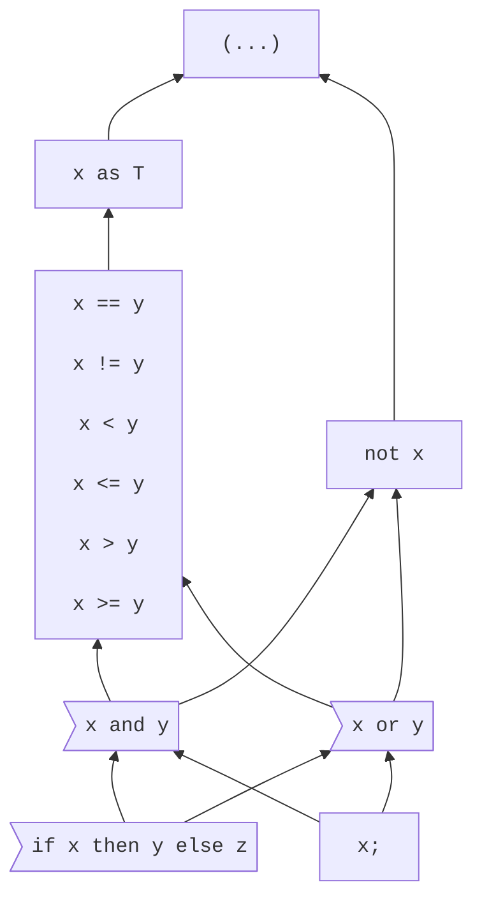

# Expressions

<!--
Part of the Carbon Language project, under the Apache License v2.0 with LLVM
Exceptions. See /LICENSE for license information.
SPDX-License-Identifier: Apache-2.0 WITH LLVM-exception
-->

<!-- toc -->

## Table of contents

-   [Overview](#overview)
-   [Precedence](#precedence)
-   [Operators](#operators)
-   [Conversions and casts](#conversions-and-casts)
-   [`if` expressions](#if-expressions)
-   [Alternatives considered](#alternatives-considered)
-   [References](#references)

<!-- tocstop -->

## Overview

Expressions are the portions of Carbon syntax that produce values. Because types
in Carbon are values, this includes anywhere that a type is specified.

```
fn Foo(a: i32*) -> i32 {
  return *a;
}
```

Here, the parameter type `i32*`, the return type `i32`, and the operand `*a` of
the `return` statement are all expressions.

## Precedence

Expressions are interpreted based on a partial
[precedence ordering](https://en.wikipedia.org/wiki/Order_of_operations).
Expression components which lack a relative ordering must be disambiguated by
the developer, for example by adding parentheses; otherwise, the expression will
be invalid due to ambiguity. Precedence orderings will only be added when it's
reasonable to expect most developers to understand the precedence without
parentheses.

The precedence diagram is defined thusly:



The diagram's attributes are:

-   Each node represents a precedence group.

-   When an expression is composed from different precedence groups, the
    interpretation is determined by the precedence edges:

    -   A precedence edge A --> B means that A is lower precedence than B, so A
        can contain B without parentheses. For example, `or --> not` means that
        `not x or y` is treated as `(not x) or y`.

    -   Precedence edges are transitive. For example, `or --> == --> as` means
        that `or` is lower precedence than `as`.

-   When an expression is composed from a single precedence group, the
    interpretation is determined by the
    [associativity](https://en.wikipedia.org/wiki/Operator_associativity) of the
    precedence group:

    ```mermaid
    graph TD
        non["Non-associative"]
        left>"Left associative"]
    ```

    -   For example, `+` and `-` are left-associative and in the same precedence
        group, so `a + b + c - d` is treated as `((a + b) + c) - d`.

## Operators

Most expressions are modeled as operators:

| Category   | Operator                        | Syntax    | Function                                                              |
| ---------- | ------------------------------- | --------- | --------------------------------------------------------------------- |
| Conversion | [`as`](as_expressions.md)       | `x as T`  | Converts the value `x` to the type `T`.                               |
| Logical    | [`and`](logical_operators.md)   | `x and y` | A short-circuiting logical AND: `true` if both operands are `true`.   |
| Logical    | [`or`](logical_operators.md)    | `x or y`  | A short-circuiting logical OR: `true` if either operand is `true`.    |
| Logical    | [`not`](logical_operators.md)   | `not x`   | Logical NOT: `true` if the operand is `false`.                        |
| Comparison | [`==`](comparison_operators.md) | `x == y`  | Equality: `true` if `x` is equal to `y`.                              |
| Comparison | [`!=`](comparison_operators.md) | `x != y`  | Inequality: `true` if `x` is not equal to `y`.                        |
| Comparison | [`<`](comparison_operators.md)  | `x < y`   | Less than: `true` if `x` is less than `y`.                            |
| Comparison | [`<=`](comparison_operators.md) | `x <= y`  | Less than or equal: `true` if `x` is less than or equal to `y`.       |
| Comparison | [`>`](comparison_operators.md)  | `x > y`   | Greater than: `true` if `x` is greater than to `y`.                   |
| Comparison | [`>=`](comparison_operators.md) | `x >= y`  | Greater than or equal: `true` if `x` is greater than or equal to `y`. |

## Conversions and casts

When an expression appears in a context in which an expression of a specific
type is expected, [implicit conversions](implicit_conversions.md) are applied to
convert the expression to the target type.

Expressions can also be converted to a specific type using an
[`as` expression](as_expressions.md).

```
fn Bar(n: i32);
fn Baz(n: i64) {
  // OK, same as Bar(n as i32)
  Bar(n);
}
```

## `if` expressions

An [`if` expression](if.md) chooses between two expressions.

```
fn Run(args: Span(StringView)) {
  var file: StringView = if args.size() > 1 then args[1] else "/dev/stdin";
}
```

`if` expressions are analogous to `?:` ternary expressions in C and C++.

## Alternatives considered

Other expression documents will list more references; this lists references not
noted elsewhere.

-   [Total order](/proposals/p0555.md#total-order)
-   [Different precedence for different operands](/proposals/p0555.md#different-precedence-for-different-operands)
-   [Require less than a partial order](/proposals/p0555.md#require-less-than-a-partial-order)

## References

Other expression documents will list more references; this lists references not
noted elsewhere.

-   Proposal
    [#555: Operator precedence](https://github.com/carbon-language/carbon-lang/pull/555).
