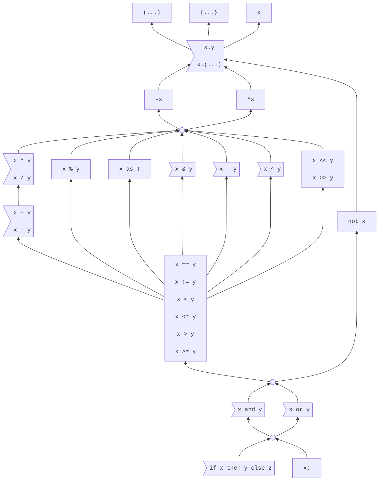

# Expressions

<!--
Part of the Carbon Language project, under the Apache License v2.0 with LLVM
Exceptions. See /LICENSE for license information.
SPDX-License-Identifier: Apache-2.0 WITH LLVM-exception
-->

<!-- toc -->

## Table of contents

-   [Overview](#overview)
-   [Precedence](#precedence)
-   [Names](#names)
    -   [Unqualified names](#unqualified-names)
    -   [Qualified names and member access](#qualified-names-and-member-access)
-   [Operators](#operators)
-   [Conversions and casts](#conversions-and-casts)
-   [`if` expressions](#if-expressions)
-   [Numeric type literal expressions](#numeric-type-literal-expressions)
-   [Alternatives considered](#alternatives-considered)
-   [References](#references)

<!-- tocstop -->

## Overview

Expressions are the portions of Carbon syntax that produce values. Because types
in Carbon are values, this includes anywhere that a type is specified.

```
fn Foo(a: i32*) -> i32 {
  return *a;
}
```

Here, the parameter type `i32*`, the return type `i32`, and the operand `*a` of
the `return` statement are all expressions.

## Precedence

Expressions are interpreted based on a partial
[precedence ordering](https://en.wikipedia.org/wiki/Order_of_operations).
Expression components which lack a relative ordering must be disambiguated by
the developer, for example by adding parentheses; otherwise, the expression will
be invalid due to ambiguity. Precedence orderings will only be added when it's
reasonable to expect most developers to understand the precedence without
parentheses.

The precedence diagram is defined thusly:



The diagram's attributes are:

-   Each non-empty node represents a precedence group. Empty circles are used to
    simplify the graph, and do not represent a precedence group.

-   When an expression is composed from different precedence groups, the
    interpretation is determined by the precedence edges:

    -   A precedence edge A --> B means that A is lower precedence than B, so A
        can contain B without parentheses. For example, `or --> not` means that
        `not x or y` is treated as `(not x) or y`.

    -   Precedence edges are transitive. For example, `or --> == --> as` means
        that `or` is lower precedence than `as`.

-   When an expression is composed from a single precedence group, the
    interpretation is determined by the
    [associativity](https://en.wikipedia.org/wiki/Operator_associativity) of the
    precedence group:

    ```mermaid
    graph TD
        non["Non-associative"]
        left>"Left associative"]
    ```

    -   For example, `+` and `-` are left-associative and in the same precedence
        group, so `a + b + c - d` is treated as `((a + b) + c) - d`.

## Names

### Unqualified names

An _unqualified name_ is a [word](../lexical_conventions/words.md) that is not a
keyword and is not preceded by a period (`.`).

**TODO:** Name lookup rules for unqualified names.

### Qualified names and member access

A _qualified name_ is a word that appears immediately after a period. Qualified
names appear in the following contexts:

-   [Designators](/docs/design/classes.md#literals): `.` _word_
-   [Simple member access expressions](member_access.md): _expression_ `.`
    _word_

```
var x: auto = {.hello = 1, .world = 2};
                ^^^^^       ^^^^^ qualified name
               ^^^^^^      ^^^^^^ designator

x.hello = x.world;
  ^^^^^     ^^^^^ qualified name
^^^^^^^   ^^^^^^^ member access expression
```

Qualified names refer to members of an entity determined by the context in which
the expression appears. For a member access, the entity is named by the
expression preceding the period. In a struct literal, the entity is the struct
type. For example:

```
package Foo api;
namespace N;
fn N.F() {}

fn G() {
  // Same as `(Foo.N).F()`.
  // `Foo.N` names namespace `N` in package `Foo`.
  // `(Foo.N).F` names function `F` in namespace `N`.
  Foo.N.F();
}

// `.n` refers to the member `n` of `{.n: i32}`.
fn H(a: {.n: i32}) -> i32 {
  // `a.n` is resolved to the member `{.n: i32}.n`,
  // and names the corresponding subobject of `a`.
  return a.n;
}

fn J() {
  // `.n` refers to the member `n of `{.n: i32}`.
  H({.n = 5 as i32});
}
```

Member access expressions associate left-to-right. If the member name is more
complex than a single _word_, a compound member access expression can be used,
with parentheses around the member name:

-   _expression_ `.` `(` _expression_ `)`

```
interface I { fn F[self: Self](); }
class X {}
external impl X as I { fn F[self: Self]() {} }

// `x.I.F()` would mean `(x.I).F()`.
fn Q(x: X) { x.(I.F)(); }
```

## Operators

Most expressions are modeled as operators:

| Category   | Operator                        | Syntax    | Function                                                              |
| ---------- | ------------------------------- | --------- | --------------------------------------------------------------------- |
| Arithmetic | [`-`](arithmetic.md) (unary)    | `-x`      | The negation of `x`.                                                  |
| Bitwise    | [`^`](bitwise.md) (unary)       | `^x`      | The bitwise complement of `x`.                                        |
| Arithmetic | [`+`](arithmetic.md)            | `x + y`   | The sum of `x` and `y`.                                               |
| Arithmetic | [`-`](arithmetic.md) (binary)   | `x - y`   | The difference of `x` and `y`.                                        |
| Arithmetic | [`*`](arithmetic.md)            | `x * y`   | The product of `x` and `y`.                                           |
| Arithmetic | [`/`](arithmetic.md)            | `x / y`   | `x` divided by `y`, or the quotient thereof.                          |
| Arithmetic | [`%`](arithmetic.md)            | `x % y`   | `x` modulo `y`.                                                       |
| Bitwise    | [`&`](bitwise.md)               | `x & y`   | The bitwise AND of `x` and `y`.                                       |
| Bitwise    | [`\|`](bitwise.md)              | `x \| y`  | The bitwise OR of `x` and `y`.                                        |
| Bitwise    | [`^`](bitwise.md) (binary)      | `x ^ y`   | The bitwise XOR of `x` and `y`.                                       |
| Bitwise    | [`<<`](bitwise.md)              | `x << y`  | `x` bit-shifted left `y` places.                                      |
| Bitwise    | [`>>`](bitwise.md)              | `x >> y`  | `x` bit-shifted right `y` places.                                     |
| Conversion | [`as`](as_expressions.md)       | `x as T`  | Converts the value `x` to the type `T`.                               |
| Comparison | [`==`](comparison_operators.md) | `x == y`  | Equality: `true` if `x` is equal to `y`.                              |
| Comparison | [`!=`](comparison_operators.md) | `x != y`  | Inequality: `true` if `x` is not equal to `y`.                        |
| Comparison | [`<`](comparison_operators.md)  | `x < y`   | Less than: `true` if `x` is less than `y`.                            |
| Comparison | [`<=`](comparison_operators.md) | `x <= y`  | Less than or equal: `true` if `x` is less than or equal to `y`.       |
| Comparison | [`>`](comparison_operators.md)  | `x > y`   | Greater than: `true` if `x` is greater than to `y`.                   |
| Comparison | [`>=`](comparison_operators.md) | `x >= y`  | Greater than or equal: `true` if `x` is greater than or equal to `y`. |
| Logical    | [`and`](logical_operators.md)   | `x and y` | A short-circuiting logical AND: `true` if both operands are `true`.   |
| Logical    | [`or`](logical_operators.md)    | `x or y`  | A short-circuiting logical OR: `true` if either operand is `true`.    |
| Logical    | [`not`](logical_operators.md)   | `not x`   | Logical NOT: `true` if the operand is `false`.                        |

## Conversions and casts

When an expression appears in a context in which an expression of a specific
type is expected, [implicit conversions](implicit_conversions.md) are applied to
convert the expression to the target type.

Expressions can also be converted to a specific type using an
[`as` expression](as_expressions.md).

```
fn Bar(n: i32);
fn Baz(n: i64) {
  // OK, same as Bar(n as i32)
  Bar(n);
}
```

## `if` expressions

An [`if` expression](if.md) chooses between two expressions.

```
fn Run(args: Span(StringView)) {
  var file: StringView = if args.size() > 1 then args[1] else "/dev/stdin";
}
```

`if` expressions are analogous to `?:` ternary expressions in C and C++.

## Numeric type literal expressions

Carbon's syntax provides a simple way to represent different types of integers
and floating-point numbers. Each type is identified with a keyword-like syntax,
prefixed with either `i`, `u`, or `f` followed by a multiple of 8, representing
the size in bits of the data type.

These are referred to as
[numeric type literals](literals.md#numeric-type-literals).

## Alternatives considered

Other expression documents will list more alternatives; this lists alternatives
not noted elsewhere.

-   [Total order](/proposals/p0555.md#total-order)
-   [Different precedence for different operands](/proposals/p0555.md#different-precedence-for-different-operands)
-   [Require less than a partial order](/proposals/p0555.md#require-less-than-a-partial-order)

## References

Other expression documents will list more references; this lists references not
noted elsewhere.

-   Proposal
    [#555: Operator precedence](https://github.com/carbon-language/carbon-lang/pull/555).
