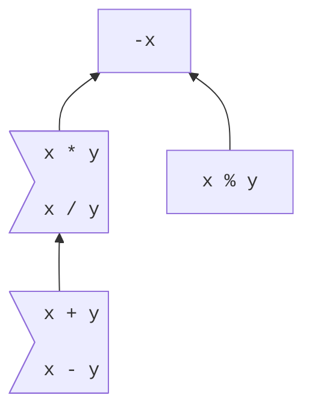

# Arithmetic

<!--
Part of the Carbon Language project, under the Apache License v2.0 with LLVM
Exceptions. See /LICENSE for license information.
SPDX-License-Identifier: Apache-2.0 WITH LLVM-exception
-->

<!-- toc -->

## Table of contents

-   [Overview](#overview)
-   [Precedence and associativity](#precedence-and-associativity)
-   [Built-in types](#built-in-types)
    -   [Integer types](#integer-types)
        -   [Overflow and other error conditions](#overflow-and-other-error-conditions)
    -   [Floating-point types](#floating-point-types)
    -   [Strings](#strings)
-   [Extensibility](#extensibility)
-   [Alternatives considered](#alternatives-considered)
-   [References](#references)

<!-- tocstop -->

## Overview

Carbon provides a conventional set of arithmetic operators:

```
var a: i32 = 5;
var b: i32 = 3;

// -5
var negation: i32 = -a;
// 8
var sum: i32 = a + b;
// 2
var difference: i32 = a - b;
// 15
var product: i32 = a * b;
// 1
var quotient: i32 = a / b;
// 2
var remainder: i32 = a % b;
```

These operators have predefined meanings for some of Carbon's
[built-in types](#built-in-types).

User-defined types can define the meaning of these operations by
[implementing an interface](#extensibility) provided as part of the Carbon
standard library.

## Precedence and associativity



<small>[Instructions for reading this diagram.](README.md#precedence)</small>

Binary `+` and `-` can be freely mixed, and are left-associative.

```
// -2, same as `((1 - 2) + 3) - 4`.
var n: i32 = 1 - 2 + 3 - 4;
```

Binary `*` and `/` can be freely mixed, and are left-associative.

```
// 0.375, same as `((1.0 / 2.0) * 3.0) / 4.0`.
var m: f32 = 1.0 / 2.0 * 3.0 / 4.0;
```

Unary `-` has higher precedence than binary `*`, `/`, and `%`. Binary `*` and
`/` have higher precedence than binary `+` and `-`.

```
// 5, same as `(-1) + ((-2) * (-3))`.
var x: i32 = -1 + -2 * -3;
// Error, parentheses required: no precedence order between `+` and `%`.
var y: i32 = 2 + 3 % 5;
```

## Built-in types

For binary operators, if the operands have different built-in types, they are
converted as follows:

-   If the types are `uN` and `uM`, or they are `iN` and `iM`, the operands are
    converted to the larger type.
-   If one type is `iN` and the other type is `uM`, and `M` < `N`, the `uM`
    operand is converted to `iN`.
-   If one type is `fN` and the other type is `iM` or `uM`, and there is an
    [implicit conversion](implicit_conversions.md#data-types) from the integer
    type to `fN`, then the integer operand is converted to `fN`.

More broadly, if one operand is of built-in type and the other operand can be
implicitly converted to that type, then it is, unless that behavior is
[overridden](#extensibility).

A built-in arithmetic operation is performed if, after the above conversion
step, the operands have the same built-in type. The result type is that type.
The result type is never wider than the operands, and the conversions applied to
the operands are always lossless, so arithmetic between a wider unsigned integer
type and a narrower signed integer is not defined.

Although the conversions are always lossless, the arithmetic may still
[overflow](#overflow-and-other-error-conditions).

### Integer types

Signed and unsigned integer types support all the arithmetic operators.

Signed integer arithmetic produces the usual mathematical result. Unsigned
integer arithmetic in `uN` wraps around modulo 2<sup>`N`</sup>.

Division truncates towards zero. The result of the `%` operator is defined by
the equation `a % b == a - (a / b) * b`.

#### Overflow and other error conditions

Integer arithmetic is subject to two classes of problems for which an operation
has no representable result:

-   Overflow, where the resulting value is too large to be represented in the
    type, or, for `%`, when the implied multiplication overflows.
-   Division by zero.

Unsigned integer arithmetic cannot overflow, but division by zero can still
occur.

**Note:** All arithmetic operators can overflow for signed integer types. For
example, given a value `v: iN` that is the least possible value for its type,
`-v`, `v + v`, `v - 1`, `v * 2`, `v / -1`, and `v % -1` all result in overflow.

Signed integer overflow and signed or unsigned integer division by zero are
programming errors:

-   In a development build, they will be caught immediately when they happen at
    runtime.
-   In a performance build, the optimizer can assume that such conditions don't
    occur. As a consequence, if they do, the behavior of the program is not
    defined.
-   In a hardened build, overflow and division by zero do not result in
    undefined behavior. On overflow and division by zero, either the program
    will be aborted, or the arithmetic will evaluate to a mathematically
    incorrect result, such as a two's complement result or zero. The program
    might not in all cases be aborted immediately -- for example, multiple
    overflow checks might be combined into one -- but no control flow or memory
    access that depends on the value will be performed.

**TODO:** Unify the description of these programming errors with those of
bit-shift domain errors, document the behavior in a common place and link to it
from here.

**TODO:** In a hardened build, should we prefer to trap on overflow, give a
two's complement result, or produce zero? Using zero may defeat some classes of
exploit, but comes at a code size and performance cost.

### Floating-point types

Floating-point types support all the arithmetic operators other than `%`.
Floating-point types in Carbon have IEEE 754 semantics, use the round-to-nearest
rounding mode, and do not set any floating-point exception state.

Because floating-point arithmetic follows IEEE 754 rules: overflow results in
±∞, and division by zero results in either ±∞ or, for 0.0 / 0.0, a quiet NaN.

### Strings

**TODO:** Decide whether strings are built-in types, and whether they support
`+` for concatenation. See
[#457](https://github.com/carbon-language/carbon-lang/issues/457).

## Extensibility

Arithmetic operators can be provided for user-defined types by implementing the
following family of interfaces:

```
// Unary `-`.
interface Negate {
  let Result:! type = Self;
  fn Op[self: Self]() -> Result;
}
```

```
// Binary `+`.
interface AddWith(U:! type) {
  let Result:! type = Self;
  fn Op[self: Self](other: U) -> Result;
}
constraint Add {
  extends AddWith(Self) where .Result = Self;
}
```

```
// Binary `-`.
interface SubWith(U:! type) {
  let Result:! type = Self;
  fn Op[self: Self](other: U) -> Result;
}
constraint Sub {
  extends SubWith(Self) where .Result = Self;
}
```

```
// Binary `*`.
interface MulWith(U:! type) {
  let Result:! type = Self;
  fn Op[self: Self](other: U) -> Result;
}
constraint Mul {
  extends MulWith(Self) where .Result = Self;
}
```

```
// Binary `/`.
interface DivWith(U:! type) {
  let Result:! type = Self;
  fn Op[self: Self](other: U) -> Result;
}
constraint Div {
  extends DivWith(Self) where .Result = Self;
}
```

```
// Binary `%`.
interface ModWith(U:! type) {
  let Result:! type = Self;
  fn Op[self: Self](other: U) -> Result;
}
constraint Mod {
  extends ModWith(Self) where .Result = Self;
}
```

Given `x: T` and `y: U`:

-   The expression `-x` is rewritten to `x.(Negate.Op)()`.
-   The expression `x + y` is rewritten to `x.(AddWith(U).Op)(y)`.
-   The expression `x - y` is rewritten to `x.(SubWith(U).Op)(y)`.
-   The expression `x * y` is rewritten to `x.(MulWith(U).Op)(y)`.
-   The expression `x / y` is rewritten to `x.(DivWith(U).Op)(y)`.
-   The expression `x % y` is rewritten to `x.(ModWith(U).Op)(y)`.

Implementations of these interfaces are provided for built-in types as necessary
to give the semantics described above.

## Alternatives considered

-   [Use a sufficiently wide result type to avoid overflow](/proposals/p1083.md#use-a-sufficiently-wide-result-type-to-avoid-overflow)
-   [Guarantee that the program never proceeds with an incorrect value after overflow](/proposals/p1083.md#guarantee-that-the-program-never-proceeds-with-an-incorrect-value-after-overflow)
-   [Guarantee that all integer arithmetic is two's complement](/proposals/p1083.md#guarantee-that-all-integer-arithmetic-is-twos-complement)
-   [Treat overflow as an error but don't optimize on it](/proposals/p1083.md#treat-overflow-as-an-error-but-dont-optimize-on-it)
-   [Don't let `Unsigned` arithmetic wrap](/proposals/p1083.md#dont-let-unsigned-arithmetic-wrap)
-   [Provide separate wrapping types](/proposals/p1083.md#provide-separate-wrapping-types)
-   [Do not provide an ordering or division for `uN`](/proposals/p1083.md#do-not-provide-an-ordering-or-division-for-un)
-   [Give unary `-` lower precedence](/proposals/p1083.md#give-unary---lower-precedence)
-   [Include a unary plus operator](/proposals/p1083.md#include-a-unary-plus-operator)
-   [Floating-point modulo operator](/proposals/p1083.md#floating-point-modulo-operator)
-   [Provide different division operators](/proposals/p1083.md#provide-different-division-operators)
-   [Use different division and modulo semantics](/proposals/p1083.md#use-different-division-and-modulo-semantics)
-   [Use different precedence groups for division and multiplication](/proposals/p1083.md#use-different-precedence-groups-for-division-and-multiplication)
-   [Use the same precedence group for modulo and multiplication](/proposals/p1083.md#use-the-same-precedence-group-for-modulo-and-multiplication)
-   [Use a different spelling for modulo](/proposals/p1083.md#use-a-different-spelling-for-modulo)

## References

-   Proposal
    [#1083: Arithmetic](https://github.com/carbon-language/carbon-lang/pull/1083)
-   Proposal
    [#1178: Rework operator interfaces](https://github.com/carbon-language/carbon-lang/pull/1178)
