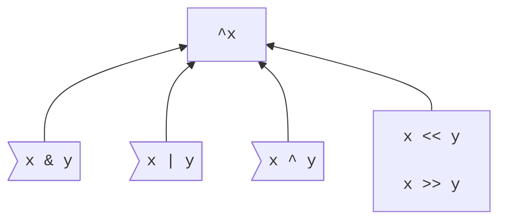

# Bitwise and shift operators

<!--
Part of the Carbon Language project, under the Apache License v2.0 with LLVM
Exceptions. See /LICENSE for license information.
SPDX-License-Identifier: Apache-2.0 WITH LLVM-exception
-->

<!-- toc -->

## Table of contents

-   [Overview](#overview)
-   [Precedence and associativity](#precedence-and-associativity)
-   [Integer types](#integer-types)
-   [Integer constants](#integer-constants)
-   [Extensibility](#extensibility)
-   [Alternatives considered](#alternatives-considered)
-   [References](#references)

<!-- tocstop -->

## Overview

Carbon provides a conventional set of operators for operating on bits:

```
var a: u8 = 5;
var b: u8 = 3;
var c: i8 = -5;

// 250
var complement: u8 = ^a;
// 1
var bitwise_and: u8 = a & b;
// 7
var bitwise_or: u8 = a | b;
// 6
var bitwise_xor: u8 = a ^ b;
// 40
var left_shift: u8 = a << b;
// 2
var logical_right_shift: u8 = a >> 1;
// -3
var arithmetic_right_shift: i8 = c >> 1;
```

These operators have [predefined meanings](#integer-types) for Carbon's integer
types. User-defined types can define the meaning of these operations by
[implementing an interface](#extensibility) provided as part of the Carbon
standard library.

## Precedence and associativity



<small>[Instructions for reading this diagram.](README.md#precedence)</small>

Parentheses are required when mixing different bitwise and bit-shift operators.
Binary `&`, `|`, and `^` are left-associative. The bit-shift operators `<<` and
`>>` are non-associative.

```
// ✅ Same as (1 | 2) | 4, evaluates to 7.
var a: i32 = 1 | 2 | 4;

// ❌ Error, parentheses are required to distinguish between
//    (3 | 5) & 6, which evaluates to 6, and
//    3 | (5 & 6), which evaluates to 7.
var b: i32 = 3 | 5 & 6;

// ❌ Error, parentheses are required to distinguish between
//    (1 << 2) << 3, which evaluates to 4 << 3 == 32, and
//    1 << (2 << 3), which evaluates to 1 << 16 == 65536.
var c: i32 = 1 << 2 << 3;

// ❌ Error, can't repeat the `^` operator. Use `^(^4)` or simply `4`.
var d: i32 = ^^4;
```

## Integer types

Bitwise and bit-shift operators are supported for Carbon's built-in integer
types, and, unless that behavior is [overridden](#extensibility), for types that
can be implicitly converted to integer types, as follows:

For binary bitwise operators, if one operand has an integer type and the other
operand can be implicitly converted to that type, then it is. If both operands
are of integer type, this results in the following conversions:

-   If the types are `uN` and `uM`, or they are `iN` and `iM`, the operands are
    converted to the larger type.
-   If one type is `iN` and the other type is `uM`, and `M` < `N`, the `uM`
    operand is converted to `iN`.

A built-in binary bitwise `&`, `|`, or `^` operation is performed if, after the
above conversion step, the operands have the same integer type. The result type
is that type, and the result value is produced by applying the relevant
operation -- AND, OR, or XOR -- to each pair of corresponding bits in the input,
including the sign bit for a signed integer type.

A built-in complement operation is performed if the operand can be implicitly
converted to an integer type. The result type is that type, and the result value
is produced by flipping all bits in the input, including the sign bit for a
signed integer type. `^a` is equivalent to `a ^ x`, where `x` is the
all-one-bits value of the same type as `a`.

A built-in bit-shift operation is performed if both operands are, or can be
implicitly converted to, integer types. The result type is the converted type of
the first operand. The result value is produced by shifting the first operand
left for `<<` or right for `>>` a number of positions equal to the second
operand. Vacant positions are filled with `0` bits, except for a right shift
where the first operand is of a signed type and has a negative value, in which
case they are filled with `1` bits.

For the purposes of bit-shifts, bits are ordered by significance, with the most
significant bit being the leftmost bit and the least significant bit being the
rightmost bit. As a consequence, in the absence of overflow a left shift is
equivalent to a multiplication by a power of 2 and a right shift is equivalent
to a division by a power of two, rounding downwards.

The second operand of a bit-shift is required to be between zero (inclusive) and
the bit-width of the first operand (exclusive); it is a programming error if the
second operand is not within that range.

-   In a development build, they will be caught immediately when they happen at
    runtime.
-   In a performance build, the optimizer may assume that this programming error
    does not occur.
-   In a hardened build, the result will have well the defined behavior of
    either aborting the program or performing a shift of an unspecified number
    of bits, which if wider than the first operand will result in `0` or `-1`.
    In the case where the program is aborted, the program might not in all cases
    be aborted immediately -- for example, multiple checks might be combined
    into one -- but no control flow or memory access that depends on the value
    will be performed.

**TODO:** Unify the description of these programming errors with those of
arithmetic overflow, document the behavior in a common place and link to it from
here.

## Integer constants

These operations can also be applied to a pair of integer constants, or to an
integer constant and a value of integer type, as follows:

-   If any binary bitwise or bit-shift operator is applied to two integer
    constants, or the unary `^` operator is applied to an integer constant, the
    result is an integer constant. Integer constants are treated as having
    infinitely many high-order bits, where all but finitely many of those bits
    are sign bits. For example, `-1` comprises infinitely many `1` bits. Note
    that there is no difference between an arithmetic and a logical right shift
    on an integer constant, because every bit always has a higher-order bit to
    shift from.
    -   It is easy to produce extremely large numbers by left-shifting an
        integer constant. For example, the binary representation of
        `1 << (1 << 1000)` is thought to be substantially larger than the total
        entropy in the observable universe. In practice, Carbon implementations
        will set a much lower limit on the largest integer constant that they
        support.
-   If a binary bitwise `&`, `|`, or `^` operation is applied to an integer
    constant and a value of an integer type to which the constant can be
    implicitly converted, the operand that is an integer constant is implicitly
    converted to the integer type and the computation is performed as described
    [above](#integer-types).
-   If the second operand of a bit-shift operator is an integer constant and the
    first operand is not, and the second operand is between 0 (inclusive) and
    the bit-width of the first operand (exclusive), the integer constant is
    converted to an integer type that can hold its value and the computation is
    performed as described above.

Other operations involving integer constants are invalid. For example, a bitwise
`&` between a `u8` and an integer constant `500` is invalid because `500`
doesn't fit into `u8`, and `1 << n` is invalid if `n` is an integer variable
because we don't know what type to use to compute the result.

Note that the unary `^` operator applied to a non-negative integer constant
results in a negative integer constant, and the binary `^` operator gives a
negative result if exactly one of the input operands was negative. For example,
`^0 == -1` evaluates to `true`.

## Extensibility

Bitwise and shift operators can be provided for user-defined types by
implementing the following family of interfaces:

```
// Unary `^`.
interface BitComplement {
  let Result:! type = Self;
  fn Op[self: Self]() -> Result;
}
```

```
// Binary `&`.
interface BitAndWith(U:! type) {
  let Result:! type = Self;
  fn Op[self: Self](other: U) -> Result;
}
constraint BitAnd {
  extends BitAndWith(Self) where .Result = Self;
}
```

```
// Binary `|`.
interface BitOrWith(U:! type) {
  let Result:! type = Self;
  fn Op[self: Self](other: U) -> Result;
}
constraint BitOr {
  extends BitOrWith(Self) where .Result = Self;
}
```

```
// Binary `^`.
interface BitXorWith(U:! type) {
  let Result:! type = Self;
  fn Op[self: Self](other: U) -> Result;
}
constraint BitXor {
  extends BitXorWith(Self) where .Result = Self;
}
```

```
// Binary `<<`.
interface LeftShiftWith(U:! type) {
  let Result:! type = Self;
  fn Op[self: Self](other: U) -> Result;
}
constraint LeftShift {
  extends LeftShiftWith(Self) where .Result = Self;
}
```

```
// Binary `>>`.
interface RightShiftWith(U:! type) {
  let Result:! type = Self;
  fn Op[self: Self](other: U) -> Result;
}
constraint RightShift {
  extends RightShiftWith(Self) where .Result = Self;
}
```

Given `x: T` and `y: U`:

-   The expression `^x` is rewritten to `x.(BitComplement.Op)()`.
-   The expression `x & y` is rewritten to `x.(BitAndWith(U).Op)(y)`.
-   The expression `x | y` is rewritten to `x.(BitOrWith(U).Op)(y)`.
-   The expression `x ^ y` is rewritten to `x.(BitXorWith(U).Op)(y)`.
-   The expression `x << y` is rewritten to `x.(LeftShiftWith(U).Op)(y)`.
-   The expression `x >> y` is rewritten to `x.(RightShiftWith(U).Op)(y)`.

Implementations of these interfaces are provided for built-in types as necessary
to give the semantics described above.

## Alternatives considered

-   [Use different symbols for bitwise operators](/proposals/p1191.md#use-different-symbols-for-bitwise-operators)
-   [Provide different operators for arithmetic and logical shifts](/proposals/p1191.md#provide-different-operators-for-arithmetic-and-logical-shifts)
-   [Provide rotate operators](/proposals/p1191.md#provide-rotate-operators)
-   [Guarantee the behavior of large shifts](/proposals/p1191.md#guarantee-behavior-of-large-shifts)
-   [Support shifting a constant by a variable](/proposals/p1191.md#support-shifting-a-constant-by-a-variable)

## References

-   Proposal
    [#1191: bitwise and shift operators](https://github.com/carbon-language/carbon-lang/pull/1191).
