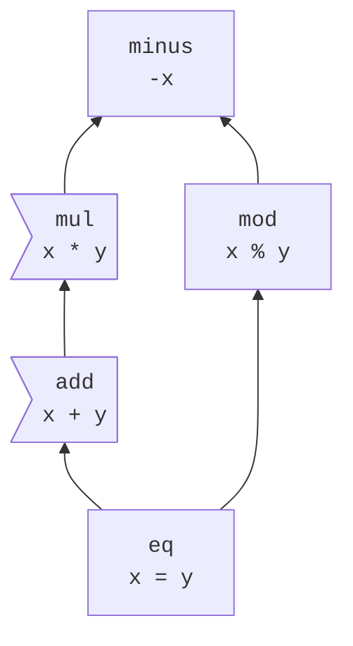

<!--
Part of the Carbon Language project, under the Apache License v2.0 with LLVM
Exceptions. See /LICENSE for license information.
SPDX-License-Identifier: Apache-2.0 WITH LLVM-exception
-->

The code in this directory is responsible for translating Carbon source code to
the AST defined in [`ast`](../ast/). It consists primarily of a Flex lexer
defined in [`lexer.lpp`](lexer.lpp) and a Bison grammar defined in
[`parser.ypp`](parser.ypp).

It is possible to define and test a new expression syntax without defining its
semantics by using the `UnimplementedExpression` AST node type and the same
techniques can be applied to other kinds of AST nodes as needed. See the
handling of the `UNIMPL_EXAMPLE` token for an example of how this is done, and
see [`unimplemented_example_test.cpp`](unimplemented_example_test.cpp) for an
example of how to test it.

## Precedence and associativity

The [Bison expression grammar](parser.ypp) uses the
[precedence climbing method](https://en.wikipedia.org/wiki/Operator-precedence_parser#Precedence_climbing_method)
to model precedence and associativity, suitably modified to handle Carbon's
partial precedence order without grammar ambiguities.

Consider this example
[precedence diagram](/docs/design/expressions/README.md#precedence):



For each precedence level, we have up to three grammar productions:

-   `foo_expression` represents an expression at that precedence level or
    higher, and includes as productions all of the expression kinds that are
    immediately higher in the precedence graph:
    ```bison
    add_expression:
      mul_expression | add_lhs '+' add_operand ;
    ```
-   `foo_operand` represents an operand of a `foo_expression` that is not itself
    a `foo_expression`.
    ```bison
    eq_operand:
      add_expression | mod_expression ;
    ```
-   For left-associative operators, `foo_lhs` represents either a `foo_operand`
    or a `foo_expression`.
    ```
    add_lhs:
      add_operand | add_expression ;
    ```

The above approach leads to (benign) reduce-reduce conflicts. In our example
precedence diagram, the expression `-x == y` has two different parses:

-   _eq_expression_
    -   _eq_operand_
        -   _add_expression_
            -   _mul_expression_
                -   _minus_expression_
                    -   `-`
                    -   `x`
    -   `==`
    -   _eq_operand_
        -   ...
            -   `y`

and

-   _eq_expression_
    -   _eq_operand_
        -   _mod_expression_
            -   _minus_expression_
                -   `-`
                -   `x`
    -   `==`
    -   _eq_operand_
        -   ...
            -   `y`

These would invoke the same parsing actions, so the states can be combined, but
Bison isn't smart enough to see that.

In order to eliminate these conflicts, if there are multiple paths through the
precedence graph between a higher-precedence level `foo` and some lower
precedence level `bar` -- that is, if there's a diamond in the precedence graph
with `foo` at the top and `bar` at the bottom -- `foo_expression`s are excluded
from all intermediate `_expression` productions on the diamond between `foo` and
`bar`, and are added back in the downstream `_operand` productions in the
diamond instead:

```bison
minus_expression:
  identifier | '-' identifier ;

// In the real grammar, trivial productions like this are inlined.
mul_operand:
  minus_expression ;
mul_lhs:
  mul_operand | mul_expression ;
// A minus_expression is not a mul_expression, even though it's a
// higher-precedence expression, because there are multiple paths from
// eq_expression to minus_expression, and this production is on such a path.
mul_expression:
  mul_lhs '*' mul_operand

// minus_expression is listed here because it is excluded from mul_expression.
add_operand:
  minus_expression | mul_expression ;
// This is notionally
//   add_operand | add_expression
// but that introduces another kind of reduce-reduce conflict, because there
// would be two ways to interpret a mul_expression as an add_lhs.
add_lhs:
  minus_expression | add_expression ;
// A mul_expression is an add_expression, because multiplication is
// higher-precedence, and mul is not at the top of a diamond in the precedence
// graph. minus_expression is excluded because we are within a diamond with it
// at the top.
add_expression:
  mul_expression | add_lhs '+' add_operand ;

mod_operand:
  minus_expression ;
mod_expression:
  mod_operand '%' mod_operand ;

// We add back minus_expression here because it was excluded from add_expression
// and mod_expression.
eq_operand:
  minus_expression | add_expression | mod_expression ;
// We also include minus_expression here because this is the bottom of the
// precedence diamond.
eq_expression:
  minus_expression | add_expression | mod_expression | eq_operand '=' eq_operand ;
```
