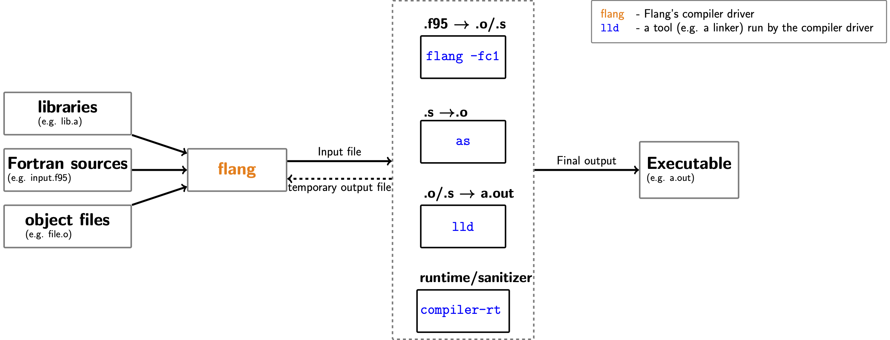

<!--===- docs/FlangDriver.md

   Part of the LLVM Project, under the Apache License v2.0 with LLVM Exceptions.
   See https://llvm.org/LICENSE.txt for license information.
   SPDX-License-Identifier: Apache-2.0 WITH LLVM-exception

-->

# Flang drivers

```eval_rst
.. contents::
   :local:
```

There are two main drivers in Flang:
* the compiler driver, `flang-new`
* the frontend driver, `flang-new -fc1`

> **_NOTE:_** The diagrams in this document refer to `flang` as opposed to
> `flang-new`. Eventually, `flang-new` will be renamed as `flang` and the
> diagrams reflect the final design that we are still working towards.

The **compiler driver** will allow you to control all compilation phases (e.g.
preprocessing, semantic checks, code-generation, code-optimisation, lowering
and linking). For frontend specific tasks, the compiler driver creates a
Fortran compilation job and delegates it to `flang-new -fc1`, the frontend
driver. For linking, it creates a linker job and calls an external linker (e.g.
LLVM's [`lld`](https://lld.llvm.org/)). It can also call other tools such as
external assemblers (e.g. [`as`](https://www.gnu.org/software/binutils/)). In
Clang, the compiler driver can also link the generated binaries with LLVM's
static analysis/sanitizer libraries (e.g.
[MemorySanitizer](https://clang.llvm.org/docs/MemorySanitizer.html)). This is
not yet available in Flang, but will be relatively easy to support once such
libraries become available. Flang's compiler driver is intended for Flang's
end-users - its interface needs to remain stable. Otherwise, Flang's users will
have to adjust their build scripts every time a compiler flag is changed.

|  |
|:--:|
| *Flang’s compiler driver and the **tools** that it runs* |

The **frontend driver** glues together and drives all of the Flang's frontend
libraries. As such, it provides an easy-to-use and intuitive interface to the
frontend. It uses MLIR and LLVM for code-generation and can be viewed as a
driver for Flang, LLVM and MLIR libraries. Contrary to the compiler driver, it
is not capable of calling any external tools (including linkers).  It is aware
of all the frontend internals that are "hidden" from the compiler driver. It
accepts many frontend-specific options not available in `flang-new` and as such
it provides a finer control over the frontend. Note that this tool is mostly
intended for Flang developers. In particular, there are no guarantees about the
stability of its interface and compiler developers can use it to experiment
with new flags.

|  |
|:-:|
| *Flang's frontend driver and the **libraries** that it drives* |

Note that similarly to `-Xclang` in `clang`, you can use `-Xflang` to forward a
frontend specific flag from the _compiler_ directly to the _frontend_ driver,
e.g.:

```lang=bash
flang-new -Xflang -fdebug-dump-parse-tree input.f95
```

In the invocation above, `-fdebug-dump-parse-tree` is forwarded to `flang-new
-fc1`. Without the forwarding flag, `-Xflang`, you would see the following
warning:

```lang=bash
flang-new: warning: argument unused during compilation:
```

As `-fdebug-dump-parse-tree` is only supported by `flang-new -fc1`, `flang-new`
will ignore it when used without `Xflang`.

## Why Do We Need Two Drivers?
As hinted above, `flang-new` and `flang-new -fc1` are two separate tools. The
fact that these tools are accessed through one binary, `flang-new`, is just an
implementation detail. Each tool has a separate list of options, albeit defined
in the same file: `clang/include/clang/Driver/Options.td`.

The separation helps us split various tasks and allows us to implement more
specialised tools. In particular, `flang-new` is not aware of various
compilation phases within the frontend (e.g. scanning, parsing or semantic
checks). It does not have to be. Conversely, the frontend driver, `flang-new
-fc1`, needs not to be concerned with linkers or other external tools like
assemblers. Nor does it need to know where to look for various systems
libraries, which is usually OS and platform specific.

One helpful way of differentiating these tools is to keep in mind that:

* the compiler driver is an end-user tool
* frontend driver is a compiler developer tool with many additional options,

Also, Since the compiler driver can call external tools, e.g. linkers, it can
be used to generate **executables**. The frontend driver cannot call external
tools and hence can only generate **object files**. A similar model is
implemented in Clang (`clang` vs `clang -cc1` vs `clang -cc1as`), which is
based on the [architecture of
GCC](https://en.wikibooks.org/wiki/GNU_C_Compiler_Internals/GNU_C_Compiler_Architecture).
In fact, Flang needs to adhere to this model in order to be able to re-use
Clang's driver library. If you are more familiar with the [architecture of
GFortran](https://gcc.gnu.org/onlinedocs/gcc-4.7.4/gfortran/About-GNU-Fortran.html)
than Clang, then `flang-new` corresponds to `gfortran` and `flang-new -fc1` to
`f951`.

## Compiler Driver
The main entry point for Flang's compiler driver is implemented in
`flang/tools/flang-driver/driver.cpp`.  Flang's compiler driver is implemented
in terms of Clang's driver library, `clangDriver`. This approach allows us to:
* benefit from Clang's support for various targets, platforms and operating systems
* leverage Clang's ability to drive various backends available in LLVM, as well
  as linkers and assemblers.
One implication of this dependency on Clang is that all of Flang's compiler
options are defined alongside Clang's options in
`clang/include/clang/Driver/Options.td`. For options that are common for both
Flang and Clang, the corresponding definitions are shared.

Internally, a `clangDriver` based compiler driver works by creating actions
that correspond to various compilation phases, e.g. `PreprocessJobClass`,
`CompileJobClass`, `BackendJobClass` or `LinkJobClass` from the
`clang::driver::Action::ActionClass` enum. There are also other, more
specialised actions, e.g. `MigrateJobClass` or `InputClass`, that do not map
directly to common compilation steps. The actions to run are determined from
the supplied compiler flags, e.g.

* `-E` for `PreprocessJobClass`,
* `-c` for `CompileJobClass`.

In most cases, the driver creates a chain of actions/jobs/phases where the
output from one action is the input for the subsequent one. You can use the
`-ccc-print-phases` flag to see the sequence of actions that the driver will
create for your compiler invocation:
```bash
flang-new -ccc-print-phases -E file.f
+- 0: input, "file.f", f95-cpp-input
1: preprocessor, {0}, f95
```
As you can see, for `-E` the driver creates only two jobs and stops immediately
after preprocessing. The first job simply prepares the input. For `-c`, the
pipeline of the created jobs is more complex:
```bash
flang-new -ccc-print-phases -c file.f
         +- 0: input, "file.f", f95-cpp-input
      +- 1: preprocessor, {0}, f95
   +- 2: compiler, {1}, ir
+- 3: backend, {2}, assembler
4: assembler, {3}, object
```
Note that currently Flang does not support code-generation and `flang-new` will
fail during the second step above with the following error:
```bash
error: code-generation is not available yet
```
The other phases are printed nonetheless when using `-ccc-print-phases`, as
that reflects what `clangDriver`, the library, will try to create and run.

For actions specific to the frontend (e.g. preprocessing or code generation), a
command to call the frontend driver is generated (more specifically, an
instance of `clang::driver::Command`). Every command is bound to an instance of
`clang::driver::Tool`. For Flang we introduced a specialisation of this class:
`clang::driver::Flang`. This class implements the logic to either translate or
forward compiler options to the frontend driver, `flang-new -fc1`.

You can read more on the design of `clangDriver` in Clang's [Driver Design &
Internals](https://clang.llvm.org/docs/DriverInternals.html).

## Frontend Driver
Flang's frontend driver is the main interface between compiler developers and
the Flang frontend. The high-level design is similar to Clang's frontend
driver, `clang -cc1` and consists of the following classes:
* `CompilerInstance`, which is a helper class that encapsulates and manages
  various objects that are always required by the frontend (e.g. `AllSources`,
  `AllCookedSources, `Parsing`, `CompilerInvocation`, etc.). In most cases
  `CompilerInstance` owns these objects, but it also can share them with its
  clients when required. It also implements utility methods to construct and
  manipulate them.
* `CompilerInvocation` encapsulates the configuration of the current
  invocation of the compiler as derived from the command-line options and the
  input files (in particular, file extensions). Among other things, it holds an
  instance of `FrontendOptions`. Like `CompilerInstance`, it owns the objects
  that it manages. It can share them with its clients that want to access them
  even after the corresponding `CompilerInvocation` has been destructed.
* `FrontendOptions` holds options that control the behaviour of the frontend,
  as well as e.g. the list of the input files. These options come either
  directly from the users (through command-line flags) or are derived from
  e.g. the host system configuration.
* `FrontendAction` and `FrontendActions` (the former being the base class for
  the latter) implement the actual actions to perform by the frontend. Usually
  there is one specialisation of `FrontendActions` for every compiler action flag
  (e.g. `-E`, `-fdebug-unparse`). These classes also contain various hooks that
  allow you to e.g. fine-tune the configuration of the frontend based on the
  input.

This list is not exhaustive and only covers the main classes that implement the
driver. The main entry point for the frontend driver, `fc1_main`, is
implemented in `flang/tools/flang-driver/driver.cpp`. It can be accessed by
invoking the compiler driver, `flang-new`, with the `-fc1` flag.

The frontend driver will only run one action at a time. If you specify multiple
action flags, only the last one will be taken into account. The default action
is `ParseSyntaxOnlyAction`, which corresponds to `-fsyntax-only`. In other
words, `flang-new -fc1 <input-file>` is equivalent to `flang-new -fc1 -fsyntax-only
<input-file>`.

## The `flang-to-external-fc` script
The `flang-to-external-fc` wrapper script for `flang-new` was introduced as a
development tool and to facilitate testing. The `flang-to-external-fc` wrapper
script will:
* use `flang-new` to unparse the input source file (i.e. it will run `flang-new
  -fc1 -fdebug-unparse <input-file>`), and then
* call a host Fortran compiler, e.g. `gfortran`, to compile the unparsed file.

Here's a basic breakdown of what happens inside `flang-to-external-fc` when you
run `flang-to-external-fc file.f90`:
```bash
flang-new -fc1 -fdebug-unparse file.f90 -o file-unparsed.f90
gfortran file-unparsed.f90
```
This is a simplified version for illustration purposes only. In practice,
`flang-to-external-fc` adds a few more frontend options and it also supports
various other use cases (e.g. compiling C files, linking existing object
files). `gfortran` is the default host compiler used by `flang-to-external-fc`.
You can change it by setting the `FLANG_FC` environment variable.

## Adding new Compiler Options
Adding a new compiler option in Flang consists of two steps:
* define the new option in a dedicated TableGen file,
* parse and implement the option in the relevant drivers that support it.

### Option Definition
All of Flang's compiler and frontend driver options are defined in
`clang/include/clang/Driver/Options.td` in Clang. When adding a new option to
Flang, you will either:
  * extend the existing definition for an option that is already available
    in one of Clang's drivers (e.g.  `clang`), but not yet available in Flang, or
  * add a completely new definition if the option that you are adding has not
    been defined yet.

There are many predefined TableGen classes and records that you can use to fine
tune your new option. The list of available configurations can be overwhelming
at times. Sometimes the easiest approach is to find an existing option that has
similar semantics to your new option and start by copying that.

For every new option, you will also have to define the visibility of the new
option. This is controlled through the `Flags` field. You can use the following
Flang specific option flags to control this:
  * `FlangOption` - this option will be available in the `flang-new` compiler driver,
  * `FC1Option` - this option will be available in the `flang-new -fc1` frontend driver,
  * `FlangOnlyOption` - this option will not be visible in Clang drivers.

Please make sure that options that you add are only visible in drivers that can
support it. For example, options that only make sense for Fortran input files
(e.g. `-ffree-form`) should not be visible in Clang and be marked as
`FlangOnlyOption`.

When deciding what `OptionGroup` to use when defining a new option in the
`Options.td` file, many new options fall into one of the following two
categories:
  * `Action_Group` - options that define an action to run (e.g.
    `-fsyntax-only`, `-E`)
  * `f_Group` - target independent compiler flags (e.g. `-ffixed-form`,
    `-fopenmp`)
There are also other groups and occasionally you will use them instead of the
groups listed above.

### Option Implementation
First, every option needs to be parsed. Flang compiler options are parsed in
two different places, depending on which driver they belong to:

* frontend driver: `flang/lib/Frontend/CompilerInvocation.cpp`,
* compiler driver: `clang/lib/Driver/ToolChains/Flang.cpp`.

The parsing will depend on the semantics encoded in the TableGen definition.

When adding a compiler driver option (i.e. an option that contains
`FlangOption` among its `Flags`) that you also intend to be understood by the
frontend, make sure that it is either forwarded to `flang-new -fc1` or translated
into some other option that is accepted by the frontend driver. In the case of
options that contain both `FlangOption` and `FC1Option` among its flags, we
usually just forward from `flang-new` to `flang-new -fc1`. This is then tested in
`flang/test/Driver/frontend-forward.F90`.

What follows is usually very dependant on the meaning of the corresponding
option. In general, regular compiler flags (e.g. `-ffree-form`) are mapped to
some state within the driver. A lot of this state is stored within an instance
of `FrontendOptions`, but there are other more specialised classes too. Action
flags (e.g. `-fsyntax-only`) are usually more complex overall, but also more
structured in terms of the implementation.

### Action Options
For options that correspond to an action (i.e. marked as `Action_Group`), you
will have to define a dedicated instance of `FrontendActions` in
`flang/include/flang/Frontend/FrontendOptions.h`. For example, for
`-fsyntax-only` we defined:
```cpp
class ParseSyntaxOnlyAction : public PrescanAndSemaAction {
  void ExecuteAction() override;
};
```
Command line options are mapped to frontend actions through the
`Fortran::frontend::ActionKind` enum.  For every new action option that you
add, you will have to add a dedicated entry in that enum (e.g.
`ParseSyntaxOnly` for `-fsyntax-only`) and a corresponding `case` in
`ParseFrontendArgs` function in the `CompilerInvocation.cpp` file, e.g.:
```cpp
    case clang::driver::options::OPT_fsyntax_only:
      opts.programAction = ParseSyntaxOnly;
      break;
```
Note that this simply sets the program/frontend action within the frontend
driver. You still have make sure that the corresponding frontend action class
is instantiated when your new action option is used. The relevant `switch`
statement is implemented in `Fortran::frontend::CreatedFrontendBaseAction` in
the `ExecuteCompilerInvocation.cpp` file. Here's an example for
`-fsyntax-only`:
```cpp
  case ParseSyntaxOnly:
    return std::make_unique<ParseSyntaxOnlyAction>();
```
At this point you should be able to trigger that frontend action that you have
just added using your new frontend option.


# CMake Support
As of [#7246](https://gitlab.kitware.com/cmake/cmake/-/merge_requests/7246)
(and soon to be released CMake 3.24.0), `cmake` can detect `flang-new` as a
supported Fortran compiler. You can configure your CMake projects to use
`flang-new` as follows:
```bash
cmake -DCMAKE_Fortran_FLAGS="-flang-experimental-exec" -DCMAKE_Fortran_COMPILER=<path/to/flang-new> <src/dir>
```
You should see the following in the output:
```
-- The Fortran compiler identification is LLVMFlang <version>
```
where `<version>` corresponds to the LLVM Flang version. Note that while
generating executables remains experimental, you will need to inform CMake to
use the `-flang-experimental-exec` flag when invoking `flang-new` as in the
example above.

# Testing
In LIT, we define two variables that you can use to invoke Flang's drivers:
* `%flang` is expanded as `flang-new` (i.e. the compiler driver)
* `%flang_fc1` is expanded as `flang-new -fc1` (i.e. the frontend driver)

For most regression tests for the frontend, you will want to use `%flang_fc1`.
In some cases, the observable behaviour will be identical regardless of whether
`%flang` or `%flang_fc1` is used. However, when you are using `%flang` instead
of `%flang_fc1`, the compiler driver will add extra flags to the frontend
driver invocation (i.e. `flang-new -fc1 -<extra-flags>`). In some cases that might
be exactly what you want to test.  In fact, you can check these additional
flags by using the `-###` compiler driver command line option.

Lastly, you can use `! REQUIRES: <feature>` for tests that will only work when
`<feature>` is available. For example, you can use`! REQUIRES: shell` to mark a
test as only available on Unix-like systems (i.e. systems that contain a Unix
shell). In practice this means that the corresponding test is skipped on
Windows.

# Frontend Driver Plugins
Plugins are an extension to the frontend driver that make it possible to run
extra user defined frontend actions, in the form of a specialization of a
`PluginParseTreeAction`. These actions are run during compilation, after
semantic checks. Similarly to Clang, Flang leverages `LoadLibraryPermanently`
from LLVM's `llvm::sys::DynamicLibrary` to load dynamic objects that implement
plugins. The process for using plugins includes:
* [Creating a plugin](#creating-a-plugin)
* [Loading and running a plugin](#loading-and-running-a-plugin)

Flang plugins are limited to `flang-new -fc1` and are currently only available /
been tested on Linux.

## Creating a Plugin
There are three parts required for plugins to work:
1. [`PluginParseTreeAction` subclass](#a-pluginparsetreeaction-subclass)
1. [Implementation of `ExecuteAction`](#implementation-of-executeaction)
1. [Plugin registration](#plugin-registration)

There is an example plugin located in `flang/example/PrintFlangFunctionNames`
that demonstrates these points by using the `ParseTree` API to print out
function and subroutine names declared in the input file.

### A `PluginParseTreeAction` Subclass
This subclass will wrap everything together and represent the `FrontendAction`
corresponding to your plugin. It will need to inherit from
`PluginParseTreeAction` (defined in `flang/include/flang/FrontendActions.h`), in
order to have access to the parse tree post semantic checks, and also so that it
can be registered, e.g.
```cpp
class PrintFunctionNamesAction : public PluginParseTreeAction
```

### Implementation of `ExecuteAction`
Like in other frontend actions, the driver looks for an `ExecuteAction` function
to run, so in order for your plugin to do something, you will need to implement
the `ExecuteAction` method in your plugin class. This method will contain the
implementation of what the plugin actually does, for example:
```cpp
// Forward declaration
struct ParseTreeVisitor;

void ExecuteAction() override {
  ParseTreeVisitor visitor;
  Fortran::parser::Walk(getParsing().parseTree(), visitor);
}
```
In the example plugin, the `ExecuteAction` method first creates an instance of
`visitor` struct, before passing it together with the parse tree to the
`Fortran::parser::Walk` function that will traverse the parse tree. The parse
tree will normally be generated by the frontend driver and can be retrieved in
your plugin through the `getParsing()` member method. Implementation and
details of the `Walk` function can be found in
`flang/include/flang/Parser/parse-tree-visitor.h`.

You will have to define your own `visitor` struct. It should define different
`Pre` and `Post` functions that take the type of a specific `ParseTree` node as
an argument. When the `Walk` function is traversing the parse tree, these
functions will be run before/after a node of that type is visited. Template
functions for `Pre`/`Post` are defined so that when a node is visited that you
have not defined a function for, it will still be able to continue. `Pre`
returns a `bool` indicating whether to visit that node's children or not. For
example:
```cpp
struct ParseTreeVisitor {
  template <typename A> bool Pre(const A&) { return true; }
  template <typename A> void Post(const A&) {}
  void Post(const Fortran::parser::FunctionStmt &f) {
    llvm::outs() << std::get<Fortran::parser::Name>(f.t).ToString() << "\n" ;
  }
}
```
The different types of nodes and also what each node structure contains are
defined in `flang/include/flang/Parser/parse-tree.h`. In the example, there is a
`Post` function, with a line that gets the `Name` element from a tuple `t` in
the `FunctionStmt` struct and prints it. This function will be run after every
`FunctionStmt` node is visited in the parse tree.

### Plugin Registration
A plugin registry is used to store names and descriptions of a collection of
plugins. The Flang plugin registry, defined in
`flang/include/flang/Frontend/FrontendPluginRegistry.h`, is an alias of
`llvm::Registry` of type `PluginParseTreeAction`.

The plugin will need to be registered, which will add the Plugin to the registry
and allow it to be used. The format is as follows, with `print-fns` being the
plugin name that is used later to call the plugin and `Print Function names`
being the description:
```cpp
static FrontendPluginRegistry::Add<PrintFunctionNamesAction> X(
    "print-fns", "Print Function names");
```

## Loading and Running a Plugin
In order to use plugins, there are 2 command line options made available to the
frontend driver, `flang-new -fc1`:
* [`-load <dsopath>`](#the--load-dsopath-option) for loading the dynamic shared
  object of the plugin
* [`-plugin <name>`](#the--plugin-name-option) for calling the registered plugin

Invocation of the example plugin is done through:
```bash
flang-new -fc1 -load flangPrintFunctionNames.so -plugin print-fns file.f90
```

Both these options are parsed in `flang/lib/Frontend/CompilerInvocation.cpp` and
fulfil their actions in
`flang/lib/FrontendTool/ExecuteCompilerInvocation.cpp`

### The `-load <dsopath>` option
This loads the plugin shared object library, with the path given at `<dsopath>`,
using `LoadLibraryPermantly` from LLVM's `llvm::sys::DynamicLibrary`, which
itself uses `dlopen`. During this stage, the plugin is registered with the
registration line from the plugin, storing the name and description.

### The `-plugin <name>` option
This sets `frontend::ActionKind programAction` in `FrontendOptions` to
`PluginAction`, through which it searches the plugin registry for the plugin
name from `<name>`. If found, it returns the instantiated plugin, otherwise it
reports an error diagnostic and returns `nullptr`.

## Enabling In-Tree Plugins
For in-tree plugins, there is the CMake flag `FLANG_PLUGIN_SUPPORT`, enabled by
default, that controls the exporting of executable symbols from `flang-new`,
which plugins need access to. Additionally, there is the CMake flag
`FLANG_BUILD_EXAMPLES`, turned off by default, that is used to control if the
example programs are built. This includes plugins that are in the
`flang/example` directory and added as a `sub_directory` to the
`flang/examples/CMakeLists.txt`, for example, the `PrintFlangFunctionNames`
plugin. It is also possible to develop plugins out-of-tree.

## Limitations
Note that the traversal API presented here is under active development and
might change in the future. We expect it to evolve as support for new
language features are added. This document and the examples will be updated
accordingly.

The current `ParseTree` structure is not suitable for modifications. The
copy constructors are not available and hence duplicating code might not be
trivial. Please take this into consideration when designing your plugin. In
particular, creating a transformation plugin will be noticeably harder than
analysis plugins that just consume (rather than edit) `ParseTree`.

Lastly, if `ParseTree` modifications are performed, then it might be necessary
to re-analyze expressions and modify scope or symbols. You can check
[Semantics.md](Semantics.md) for more details on how `ParseTree` is edited
e.g. during the semantic checks.
