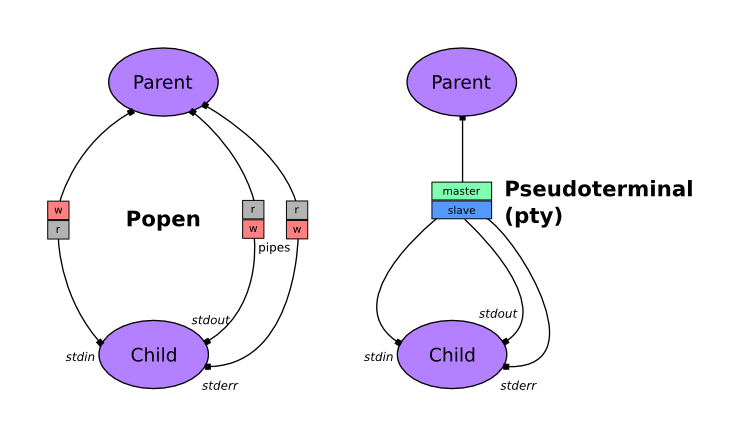

Ptyprocess
==========

.. include:: ../README.rst

Contents:

.. toctree::
   :maxdepth: 2

   api

What is a pty?
--------------

A pty is a kernel-level object which processes can write data to and read data
from, a bit like a pipe.

Unlike a pipe, data moves through a single pty in both directions. When you use
a program in a shell pipeline, or with :class:`subprocess.Popen` in Python, up
to three pipes are created for the process's standard streams (stdin, stdout
and stderr). When you run a program using ptyprocess, all three of its standard
streams are connected to a single pty:

A pty also does more than a pipe. It keeps track of the window size (rows and
columns of characters) and notifies child processes (with a SIGWINCH signal)
when it changes. In *cooked mode*, it does some processing of data sent from the
parent process, so for instance the byte ``03`` (entered as Ctrl-C) will cause
SIGINT to be sent to the child process.

Many command line programs behave differently if they detect that stdin or stdout
is connected to a terminal instead of a pipe (using 
`isatty() <http://linux.die.net/man/3/isatty>`_), because this normally means
that they're being used interactively by a human user.
They may format output differently (e.g. ``ls`` lists files in columns)
or prompt the user to confirm actions.
When you run these programs in ptyprocess, they will exhibit their 'interactive'
behaviour, instead of the 'pipe' behaviour you'll see using ``Popen()``.

.. seealso::

   `The TTY demystified <http://www.linusakesson.net/programming/tty/>`_
     Detailed article by Linus Akesson

Indices and tables
==================

* :ref:`genindex`
* :ref:`modindex`
* :ref:`search`

