# Allow Location Descriptions on the DWARF Expression Stack <!-- omit in toc -->

- [Extension](#extension)
- [Heterogeneous Computing Devices](#heterogeneous-computing-devices)
- [DWARF 5](#dwarf-5)
  - [How DWARF Maps Source Language To Hardware](#how-dwarf-maps-source-language-to-hardware)
  - [Examples](#examples)
    - [Dynamic Array Size](#dynamic-array-size)
    - [Variable Location in Register](#variable-location-in-register)
    - [Variable Location in Memory](#variable-location-in-memory)
    - [Variable Spread Across Different Locations](#variable-spread-across-different-locations)
    - [Offsetting a Composite Location](#offsetting-a-composite-location)
  - [Limitations](#limitations)
- [Extension Solution](#extension-solution)
  - [Location Description](#location-description)
  - [Stack Location Description Operations](#stack-location-description-operations)
  - [Examples](#examples-1)
    - [Source Language Variable Spilled to Part of a Vector Register](#source-language-variable-spilled-to-part-of-a-vector-register)
    - [Source Language Variable Spread Across Multiple Vector Registers](#source-language-variable-spread-across-multiple-vector-registers)
    - [Source Language Variable Spread Across Multiple Kinds of Locations](#source-language-variable-spread-across-multiple-kinds-of-locations)
    - [Address Spaces](#address-spaces)
    - [Bit Offsets](#bit-offsets)
  - [Call Frame Information (CFI)](#call-frame-information-cfi)
  - [Objects Not In Byte Aligned Global Memory](#objects-not-in-byte-aligned-global-memory)
  - [Higher Order Operations](#higher-order-operations)
  - [Objects In Multiple Places](#objects-in-multiple-places)
- [Conclusion](#conclusion)
- [Further Information](#further-information)

# Extension

In DWARF 5, expressions are evaluated using a typed value stack, a separate
location area, and an independent loclist mechanism. This extension unifies all
three mechanisms into a single generalized DWARF expression evaluation model
that allows both typed values and location descriptions to be manipulated on the
evaluation stack. Both single and multiple location descriptions are supported
on the stack. In addition, the call frame information (CFI) is extended to
support the full generality of location descriptions. This is done in a manner
that is backwards compatible with DWARF 5. The extension involves changes to the
DWARF 5 sections 2.5 (pp 26-38), 2.6 (pp 38-45), and 6.4 (pp 171-182).

The extension permits operations to act on location descriptions in an
incremental, consistent, and composable manner. It allows a small number of
operations to be defined to address the requirements of heterogeneous devices as
well as providing benefits to non-heterogeneous devices. It acts as a foundation
to provide support for other issues that have been raised that would benefit all
devices.

Other approaches were explored that involved adding specialized operations and
rules. However, these resulted in the need for more operations that did not
compose. It also resulted in operations with context sensitive semantics and
corner cases that had to be defined. The observation was that numerous
specialized context sensitive operations are harder for both produces and
consumers than a smaller number of general composable operations that have
consistent semantics regardless of context.

The following sections first describe heterogeneous devices and the features
they have that are not addressed by DWARF 5. Then a brief simplified overview of
the DWARF 5 expression evaluation model is presented that highlights the
difficulties for supporting the heterogeneous features. Finally, an overview of
the extension is presented, using simplified examples to illustrate how it can
address the issues of heterogeneous devices and also benefit non-heterogeneous
devices. References to further information are provided.

# Heterogeneous Computing Devices

GPUs and other heterogeneous computing devices have features not common to CPU
computing devices.

These devices often have many more registers than a CPU. This helps reduce
memory accesses which tend to be more expensive than on a CPU due to the much
larger number of threads concurrently executing. In addition to traditional
scalar registers of a CPU, these devices often have many wide vector registers.

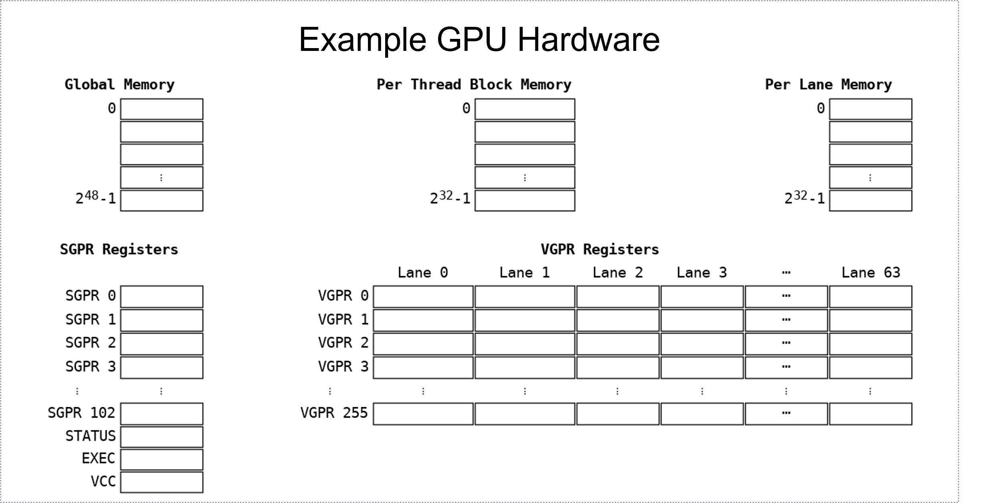

They may support masked vector instructions that are used by the compiler to map
high level language threads onto the lanes of the vector registers. As a
consequence, multiple language threads execute in lockstep as the vector
instructions are executed. This is termed single instruction multiple thread
(SIMT) execution.

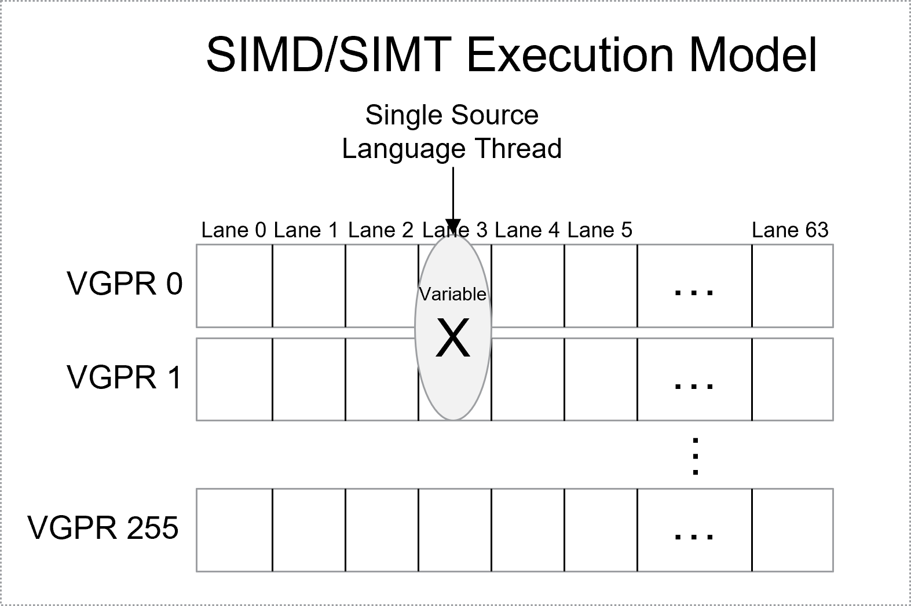

GPUs can have multiple memory address spaces in addition to the single global
memory address space of a CPU. These additional address spaces are accessed
using distinct instructions and are often local to a particular thread or group
of threads.

For example, a GPU may have a per thread block address space that is implemented
as scratch pad memory with explicit hardware support to isolate portions to
specific groups of threads created as a single thread block.

A GPU may also use global memory in a non linear manner. For example, to support
providing a SIMT per lane address space efficiently, there may be instructions
that support interleaved access.

Through optimization, the source variables may be located across these different
storage kinds. SIMT execution requires locations to be able to express selection
of runtime defined pieces of vector registers. With the more complex locations,
there is a benefit to be able to factorize their calculation which requires all
location kinds to be supported uniformly, otherwise duplication is necessary.

# DWARF 5

Before presenting the proposed solution to supporting heterogeneous devices, a
brief overview of the DWARF 5 expression evaluation model will be given to
highlight the aspects being addressed by the extension.

## How DWARF Maps Source Language To Hardware

DWARF is a standardized way to specify debug information. It describes source
language entities such as compilation units, functions, types, variables, etc.
It is either embedded directly in sections of the code object executables, or
split into separate files that they reference.

DWARF maps between source program language entities and their hardware
representations. For example:

- It maps a hardware instruction program counter to a source language program
  line, and vice versa.
- It maps a source language function to the hardware instruction program counter
  for its entry point.
- It maps a source language variable to its hardware location when at a
  particular program counter.
- It provides information to allow virtual unwinding of hardware registers for a
  source language function call stack.
- In addition, it provides numerous other information about the source language
  program.

In particular, there is great diversity in the way a source language entity
could be mapped to a hardware location. The location may involve runtime values.
For example, a source language variable location could be:

- In register.
- At a memory address.
- At an offset from the current stack pointer.
- Optimized away, but with a known compiler time value.
- Optimized away, but with an unknown value, such as happens for unused
  variables.
- Spread across combination of the above kinds of locations.
- At a memory address, but also transiently loaded into registers.

To support this DWARF 5 defines a rich expression language comprised of loclist
expressions and operation expressions. Loclist expressions allow the result to
vary depending on the PC. Operation expressions are made up of a list of
operations that are evaluated on a simple stack machine.

A DWARF expression can be used as the value of different attributes of different
debug information entries (DIE). A DWARF expression can also be used as an
argument to call frame information information (CFI) entry operations. An
expression is evaluated in a context dictated by where it is used. The context
may include:

- Whether the expression needs to produce a value or the location of an entity.
- The current execution point including process, thread, PC, and stack frame.
- Some expressions are evaluated with the stack initialized with a specific
  value or with the location of a base object that is available using the
  DW_OP_push_object_address operation.

## Examples

The following examples illustrate how DWARF expressions involving operations are
evaluated in DWARF 5. DWARF also has expressions involving location lists that
are not covered in these examples.

### Dynamic Array Size

The first example is for an operation expression associated with a DIE attribute
that provides the number of elements in a dynamic array type. Such an attribute
dictates that the expression must be evaluated in the context of providing a
value result kind.

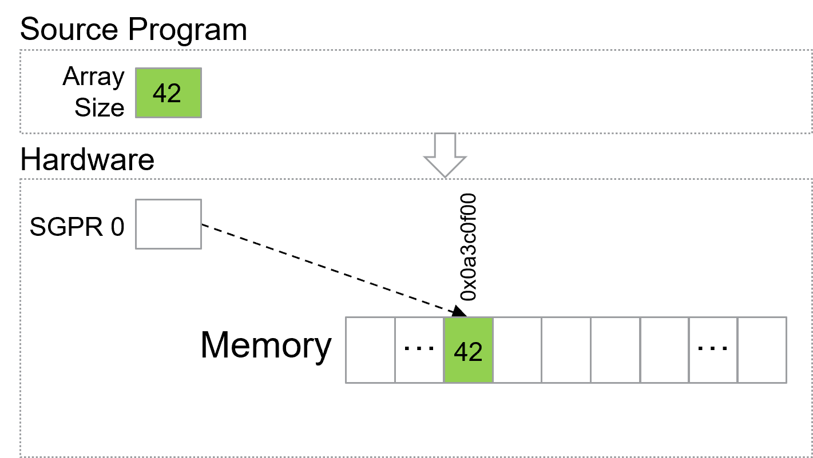

In this hypothetical example, the compiler has allocated an array descriptor in
memory and placed the descriptor's address in architecture register SGPR0. The
first location of the array descriptor is the runtime size of the array.

A possible expression to retrieve the dynamic size of the array is:

    DW_OP_regval_type SGPR0 Generic
    DW_OP_deref

The expression is evaluated one operation at a time. Operations have operands
and can pop and push entries on a stack.

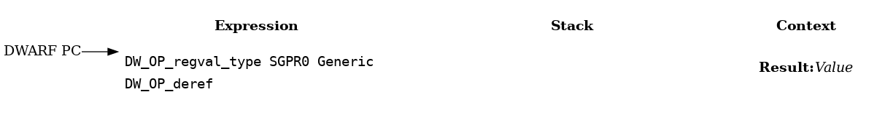

The expression evaluation starts with the first DW_OP_regval_type operation.
This operation reads the current value of an architecture register specified by
its first operand: SGPR0. The second operand specifies the size of the data to
read. The read value is pushed on the stack. Each stack element is a value and
its associated type.

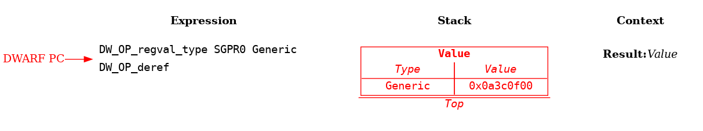

The type must be a DWARF base type. It specifies the encoding, byte ordering,
and size of values of the type. DWARF defines that each architecture has a
default generic type: it is an architecture specific integral encoding and byte
ordering, that is the size of the architecture's global memory address.

The DW_OP_deref operation pops a value off the stack, treats it as a global
memory address, and reads the contents of that location using the generic type.
It pushes the read value on the stack as the value and its associated generic
type.

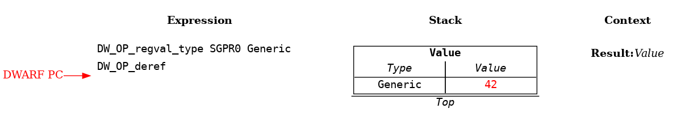

The evaluation stops when it reaches the end of the expression. The result of an
expression that is evaluated with a value result kind context is the top element
of the stack, which provides the value and its type.

### Variable Location in Register

This example is for an operation expression associated with a DIE attribute that
provides the location of a source language variable. Such an attribute dictates
that the expression must be evaluated in the context of providing a location
result kind.

DWARF defines the locations of objects in terms of location descriptions.

In this example, the compiler has allocated a source language variable in
architecture register SGPR0.

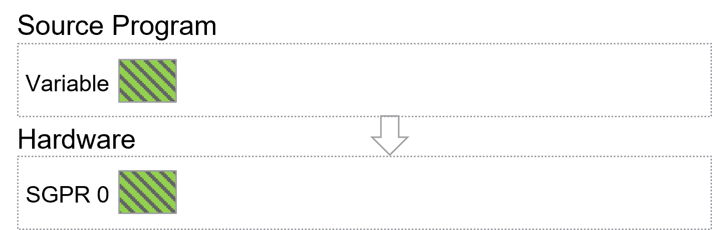

A possible expression to specify the location of the variable is:

    DW_OP_regx SGPR0

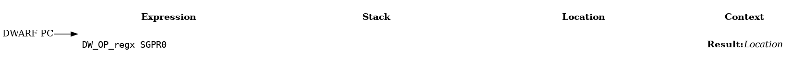

The DW_OP_regx operation creates a location description that specifies the
location of the architecture register specified by the operand: SGPR0. Unlike
values, location descriptions are not pushed on the stack. Instead they are
conceptually placed in a location area. Unlike values, location descriptions do
not have an associated type, they only denote the location of the base of the
object.

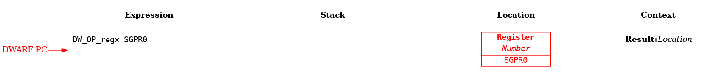

Again, evaluation stops when it reaches the end of the expression. The result of
an expression that is evaluated with a location result kind context is the
location description in the location area.

### Variable Location in Memory

The next example is for an operation expression associated with a DIE attribute
that provides the location of a source language variable that is allocated in a
stack frame. The compiler has placed the stack frame pointer in architecture
register SGPR0, and allocated the variable at offset 0x10 from the stack frame
base. The stack frames are allocated in global memory, so SGPR0 contains a
global memory address.

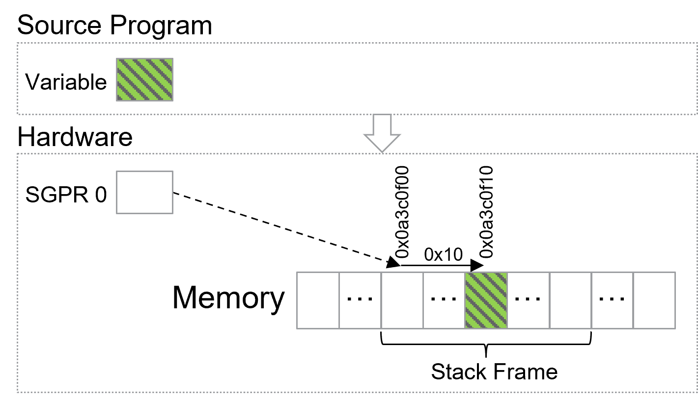

A possible expression to specify the location of the variable is:

    DW_OP_regval_type SGPR0 Generic
    DW_OP_plus_uconst 0x10

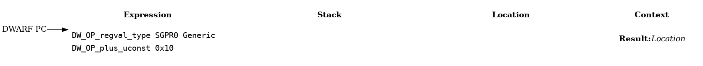

As in the previous example, the DW_OP_regval_type operation pushes the stack
frame pointer global memory address onto the stack. The generic type is the size
of a global memory address.

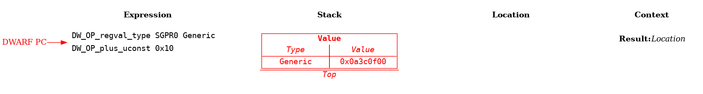

The DW_OP_plus_uconst operation pops a value from the stack, which must have a
type with an integral encoding, adds the value of its operand, and pushes the
result back on the stack with the same associated type. In this example, that
computes the global memory address of the source language variable.

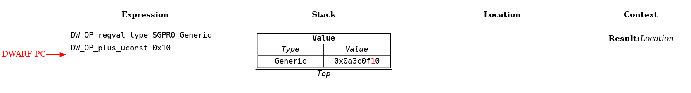

Evaluation stops when it reaches the end of the expression. If the expression
that is evaluated has a location result kind context, and the location area is
empty, then the top stack element must be a value with the generic type. The
value is implicitly popped from the stack, and treated as a global memory
address to create a global memory location description, which is placed in the
location area. The result of the expression is the location description in the
location area.

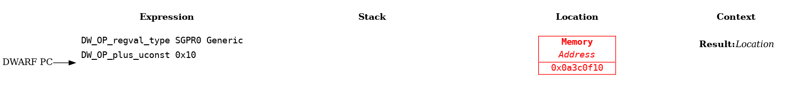

### Variable Spread Across Different Locations

This example is for a source variable that is partly in a register, partly undefined, and partly in memory.

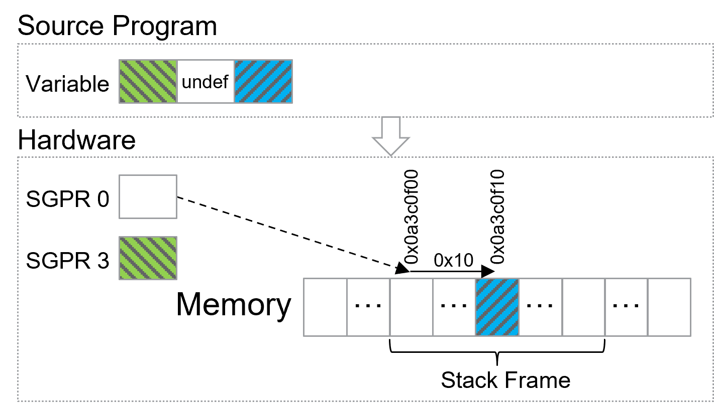

DWARF defines composite location descriptions that can have one or more parts.
Each part specifies a location description and the number of bytes used from it.
The following operation expression creates a composite location description.

    DW_OP_regx SGPR3
    DW_OP_piece 4
    DW_OP_piece 2
    DW_OP_bregx SGPR0 0x10
    DW_OP_piece 2

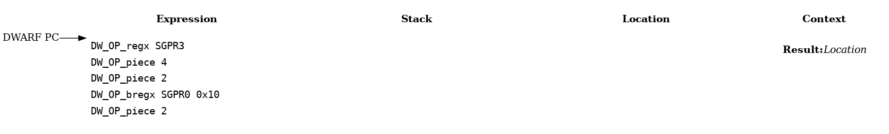

The DW_OP_regx operation creates a register location description in the location
area.

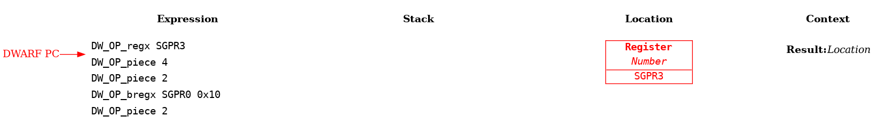

The first DW_OP_piece operation creates an incomplete composite location
description in the location area with a single part. The location description in
the location area is used to define the beginning of the part for the size
specified by the operand, namely 4 bytes.

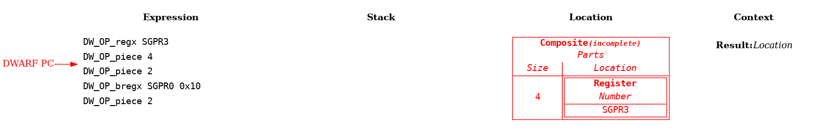

A subsequent DW_OP_piece adds a new part to an incomplete composite location
description already in the location area. The parts form a contiguous set of
bytes. If there are no other location descriptions in the location area, and no
value on the stack, then the part implicitly uses the undefined location
description. Again, the operand specifies the size of the part in bytes. The
undefined location description can be used to indicate a part that has been
optimized away. In this case, 2 bytes of undefined value.

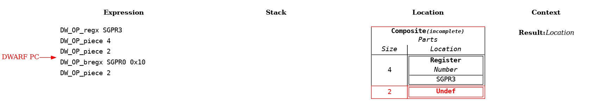

The DW_OP_bregx operation reads the architecture register specified by the first
operand (SGPR0) as the generic type, adds the value of the second operand
(0x10), and pushes the value on the stack.

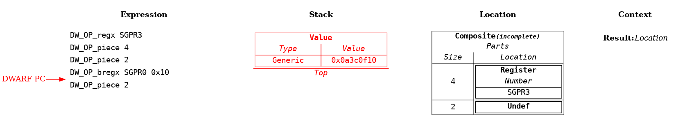

The next DW_OP_piece operation adds another part to the already created
incomplete composite location.

If there is no other location in the location area, but there is a value on
stack, the new part is a memory location description. The memory address used is
popped from the stack. In this case, the operand of 2 indicates there are 2
bytes from memory.

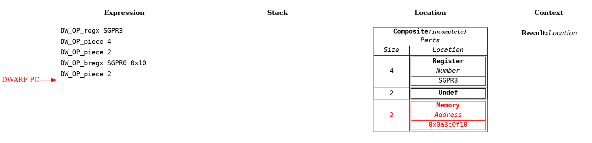

Evaluation stops when it reaches the end of the expression. If the expression
that is evaluated has a location result kind context, and the location area has
an incomplete composite location description, the incomplete composite location
is implicitly converted to a complete composite location description. The result
of the expression is the location description in the location area.

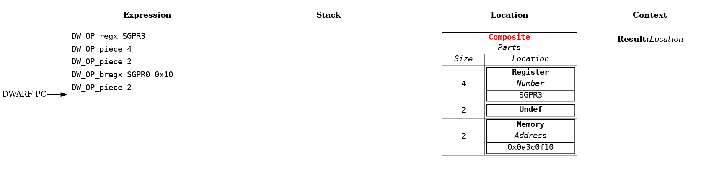

### Offsetting a Composite Location

This example attempts to extend the previous example to offset the composite
location description it created. The *Variable Location in Memory* example
conveniently used the DW_OP_plus operation to offset a memory address.

    DW_OP_regx SGPR3
    DW_OP_piece 4
    DW_OP_piece 2
    DW_OP_bregx SGPR0 0x10
    DW_OP_piece 2
    DW_OP_plus_uconst 5

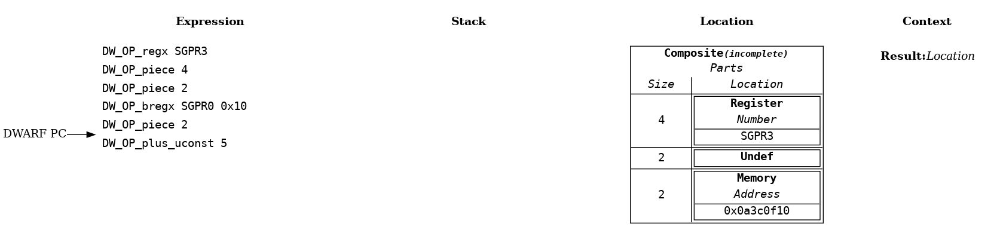

However, DW_OP_plus cannot be used to offset a composite location. It only
operates on the stack.

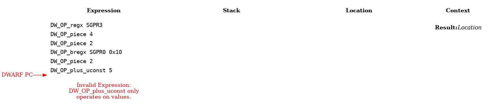

To offset a composite location description, the compiler would need to make a
different composite location description, starting at the part corresponding to
the offset. For example:

    DW_OP_piece 1
    DW_OP_bregx SGPR0 0x10
    DW_OP_piece 2

This illustrates that operations on stack values are not composable with
operations on location descriptions.

## Limitations

DWARF 5 is unable to describe variables in runtime indexed parts of registers.
This is required to describe a source variable that is located in a lane of a
SIMT vector register.

Some features only work when located in global memory. The type attribute
expressions require a base object which could be in any kind of location.

DWARF procedures can only accept global memory address arguments. This limits
the ability to factorize the creation of locations that involve other location
kinds.

There are no vector base types. This is required to describe vector registers.

There is no operation to create a memory location in a non-global address space.
Only the dereference operation supports providing an address space.

CFI location expressions do not allow composite locations or non-global address
space memory locations. Both these are needed in optimized code for devices with
vector registers and address spaces.

Bit field offsets are only supported in a limited way for register locations.
Supporting them in a uniform manner for all location kinds is required to
support languages with bit sized entities.

# Extension Solution

This section outlines the extension to generalize the DWARF expression evaluation
model to allow location descriptions to be manipulated on the stack. It presents
a number of simplified examples to demonstrate the benefits and how the extension
solves the issues of heterogeneous devices. It presents how this is done in
a manner that is backwards compatible with DWARF 5.

## Location Description

In order to have consistent, composable operations that act on location
descriptions, the extension defines a uniform way to handle all location kinds.
That includes memory, register, implicit, implicit pointer, undefined, and
composite location descriptions.

Each kind of location description is conceptually a zero-based offset within a
piece of storage. The storage is a contiguous linear organization of a certain
number of bytes (see below for how this is extended to support bit sized
storage).

- For global memory, the storage is the linear stream of bytes of the
  architecture's address size.
- For each separate architecture register, it is the linear stream of bytes of
  the size of that specific register.
- For an implicit, it is the linear stream of bytes of the value when
  represented using the value's base type which specifies the encoding, size,
  and byte ordering.
- For undefined, it is an infinitely sized linear stream where every byte is
  undefined.
- For composite, it is a linear stream of bytes defined by the composite's parts.

## Stack Location Description Operations

The DWARF expression stack is extended to allow each stack entry to either be a
value or a location description.

Evaluation rules are defined to implicitly convert a stack element that is a
value to a location description, or vice versa, so that all DWARF 5 expressions
continue to have the same semantics. This reflects that a memory address is
effectively used as a proxy for a memory location description.

For each place that allows a DWARF expression to be specified, it is defined if
the expression is to be evaluated as a value or a location description.

Existing DWARF expression operations that are used to act on memory addresses
are generalized to act on any location description kind. For example, the
DW_OP_deref operation pops a location description rather than a memory address
value from the stack and reads the storage associated with the location kind
starting at the location description's offset.

Existing DWARF expression operations that create location descriptions are
changed to pop and push location descriptions on the stack. For example, the
DW_OP_value, DW_OP_regx, DW_OP_implicit_value, DW_OP_implicit_pointer,
DW_OP_stack_value, and DW_OP_piece.

New operations that act on location descriptions can be added. For example, a
DW_OP_offset operation that modifies the offset of the location description on
top of the stack. Unlike the DW_OP_plus operation that only works with memory
address, a DW_OP_offset operation can work with any location kind.

To allow incremental and nested creation of composite location descriptions, a
DW_OP_piece_end can be defined to explicitly indicate the last part of a
composite. Currently, creating a composite must always be the last operation of
an expression.

A DW_OP_undefined operation can be defined that explicitly creates the undefined
location description. Currently this is only possible as a piece of a composite
when the stack is empty.

## Examples

This section provides some motivating examples to illustrate the benefits that
result from allowing location descriptions on the stack.

### Source Language Variable Spilled to Part of a Vector Register

A compiler generating code for a GPU may allocate a source language variable
that it proves has the same value for every lane of a SIMT thread in a scalar
register. It may then need to spill that scalar register. To avoid the high cost
of spilling to memory, it may spill to a fixed lane of one of the numerous
vector registers.

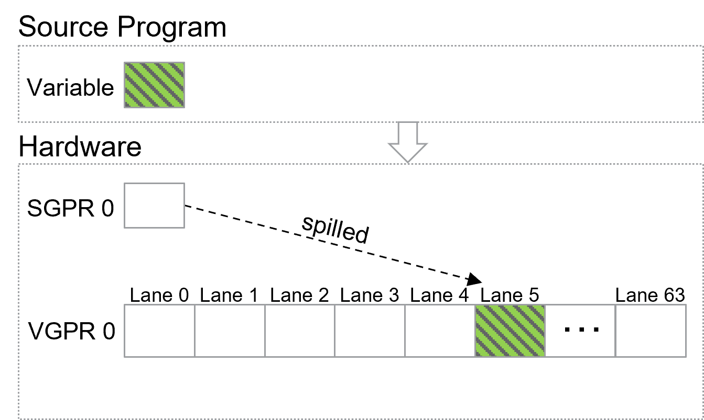

The following expression defines the location of a source language variable that
the compiler allocated in a scalar register, but had to spill to lane 5 of a
vector register at this point of the code.

    DW_OP_regx VGPR0
    DW_OP_offset_uconst 20

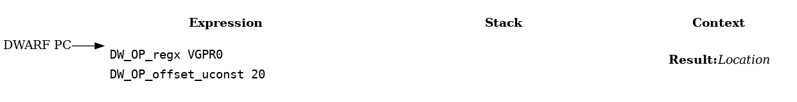

The DW_OP_regx pushes a register location description on the stack. The storage
for the register is the size of the vector register. The register location
description conceptually references that storage with an initial offset of 0.
The architecture defines the byte ordering of the register.

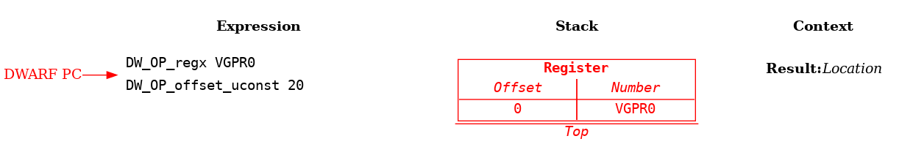

The DW_OP_offset_uconst pops a location description off the stack, adds its
operand value to the offset, and pushes the updated location description back on
the stack. In this case the source language variable is being spilled to lane 5
and each lane's component which is 32-bits (4 bytes), so the offset is 5*4=20.

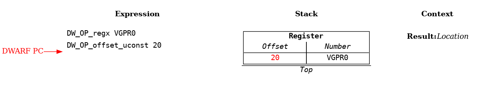

The result of the expression evaluation is the location description on the top
of the stack.

An alternative approach could be for the target to define distinct register
names for each part of each vector register. However, this is not practical for
GPUs due to the sheer number of registers that would have to be defined. It
would also not permit a runtime index into part of the whole register to be used
as shown in the next example.

### Source Language Variable Spread Across Multiple Vector Registers

A compiler may generate SIMT code for a GPU. Each source language thread of
execution is mapped to a single lane of the GPU thread. Source language
variables that are mapped to a register, are mapped to the lane component of the
vector registers corresponding to the source language's thread of execution.

The location expression for such variables must therefore be executed in the
context of the focused source language thread of execution. A DW_OP_push_lane
operation can be defined to push the value of the lane for the currently focused
source language thread of execution. The value to use would be provided by the
consumer of DWARF when it evaluates the location expression.

If the source language variable is larger than the size of the vector register
lane component, then multiple vector registers are used. Each source language
thread of execution will only use the vector register components for its
associated lane.

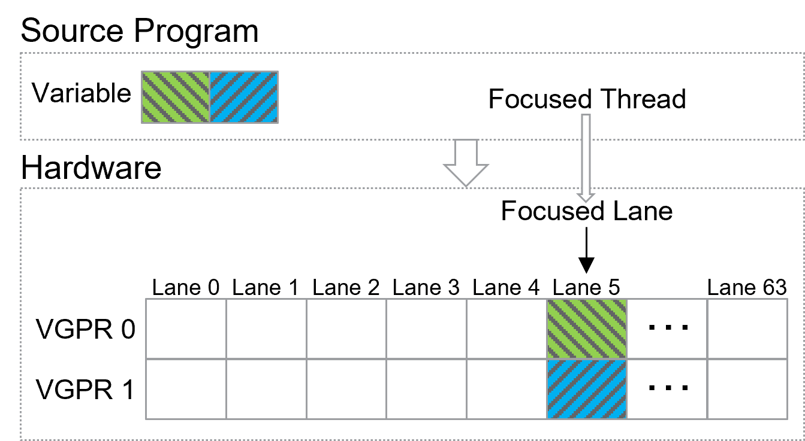

The following expression defines the location of a source language variable that
has to occupy two vector registers. A composite location description is created
that combines the two parts. It will give the correct result regardless of which
lane corresponds to the source language thread of execution that the user is
focused on.

    DW_OP_regx VGPR0
    DW_OP_push_lane
    DW_OP_uconst 4
    DW_OP_mul
    DW_OP_offset
    DW_OP_piece 4
    DW_OP_regx VGPR1
    DW_OP_push_lane
    DW_OP_uconst 4
    DW_OP_mul
    DW_OP_offset
    DW_OP_piece 4

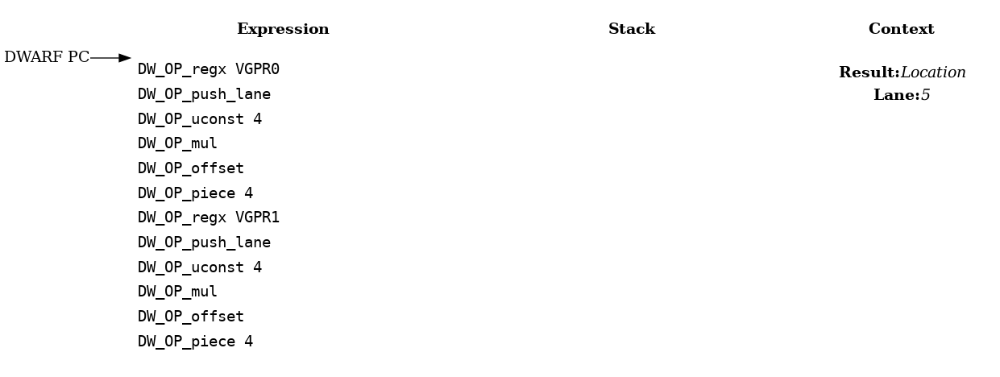

The DW_OP_regx VGPR0 pushes a location description for the first register.

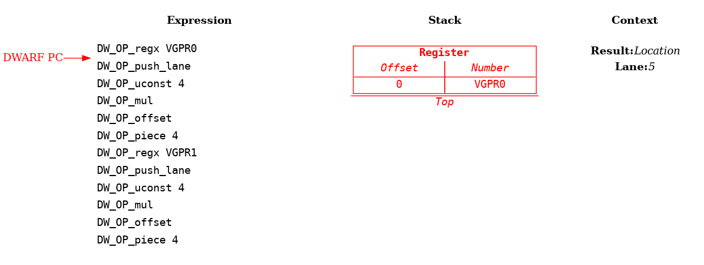

The DW_OP_push_lane; DW_OP_uconst 4; DW_OP_mul calculates the offset for the
focused lanes vector register component as 4 times the lane number.

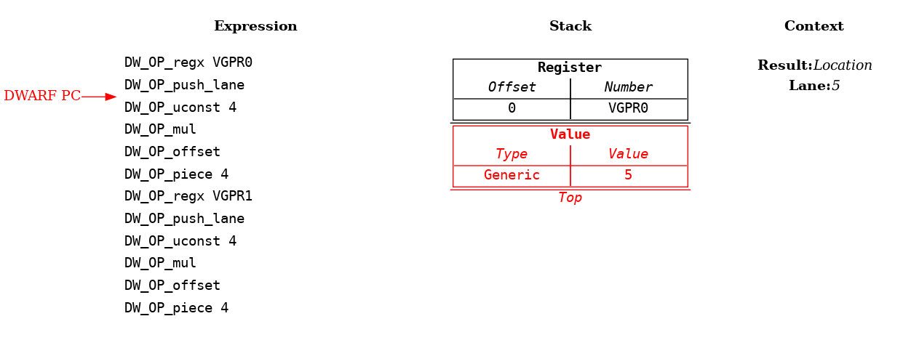

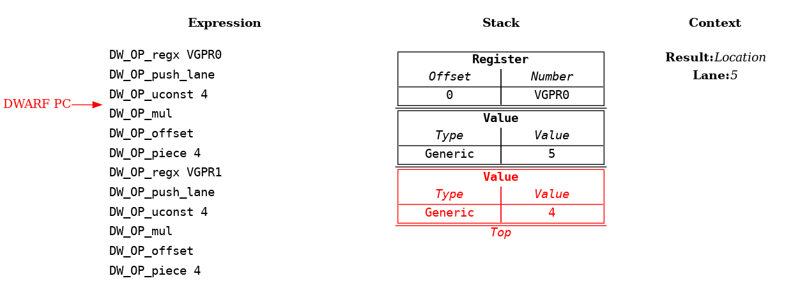

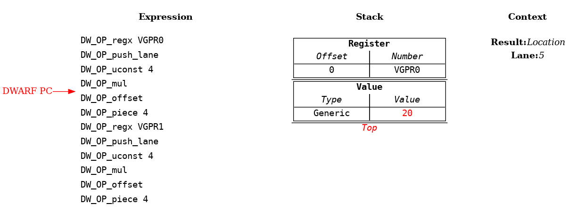

The DW_OP_offset adjusts the register location description's offset to the
runtime computed value.

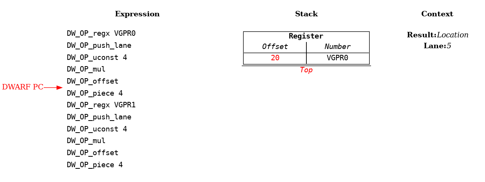

The DW_OP_piece either creates a new composite location description, or adds a
new part to an existing incomplete one. It pops the location description to use
for the new part. It then pops the next stack element if it is an incomplete
composite location description, otherwise it creates a new incomplete composite
location description with no parts. Finally it pushes the incomplete composite
after adding the new part.

In this case a register location description is added to a new incomplete
composite location description. The 4 of the DW_OP_piece specifies the size of
the register storage that comprises the part. Note that the 4 bytes start at the
computed register offset.

For backwards compatibility, if the stack is empty or the top stack element is
an incomplete composite, an undefined location description is used for the part.
If the top stack element is a generic base type value, then it is implicitly
converted to a global memory location description with an offset equal to the
value.

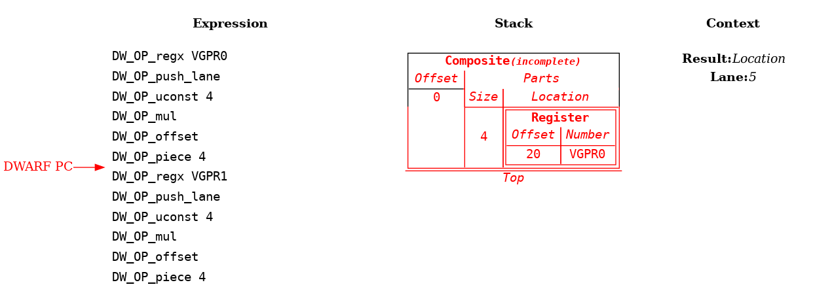

The rest of the expression does the same for VGPR1. However, when the
DW_OP_piece is evaluated there is an incomplete composite on the stack. So the
VGPR1 register location description is added as a second part.

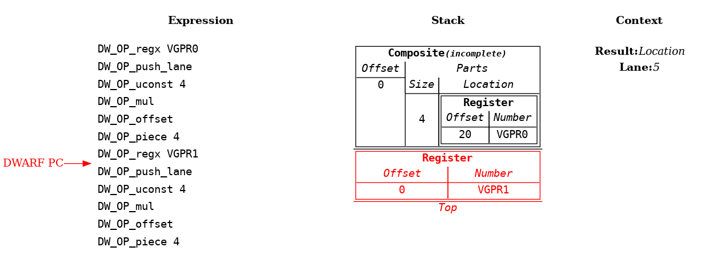

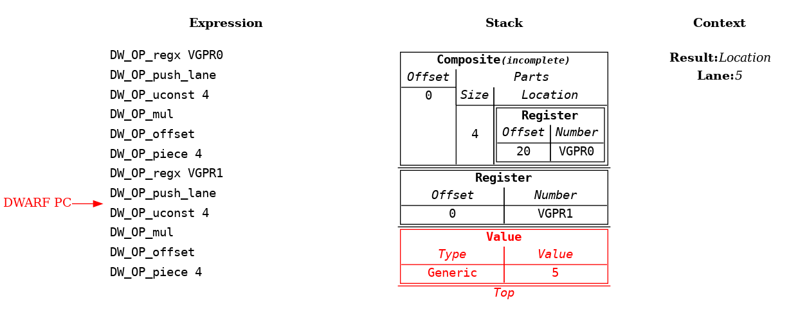

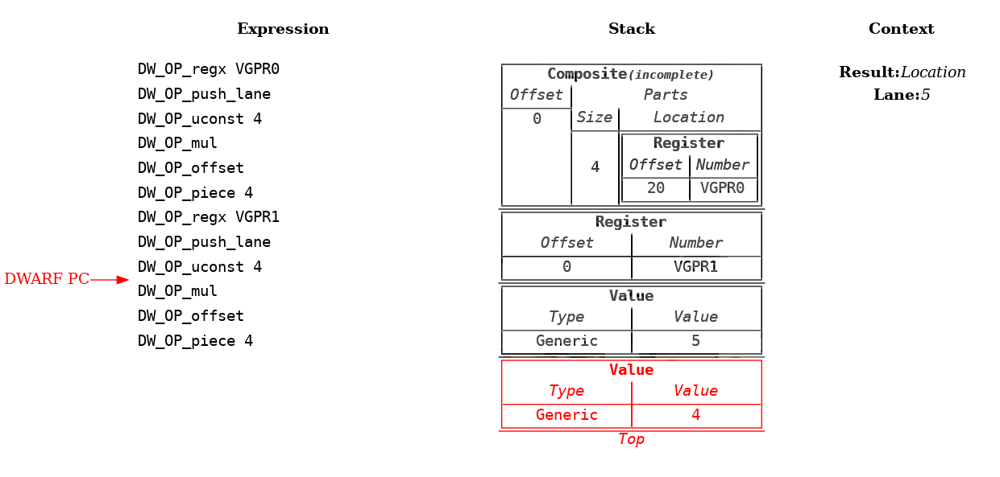

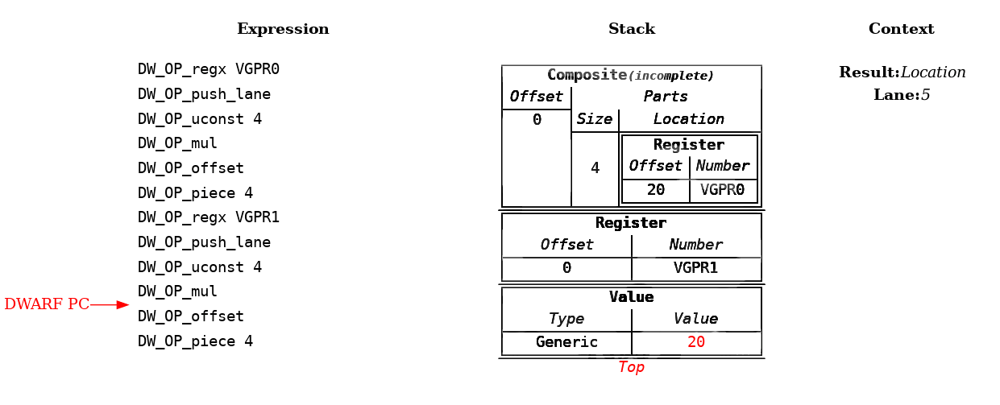

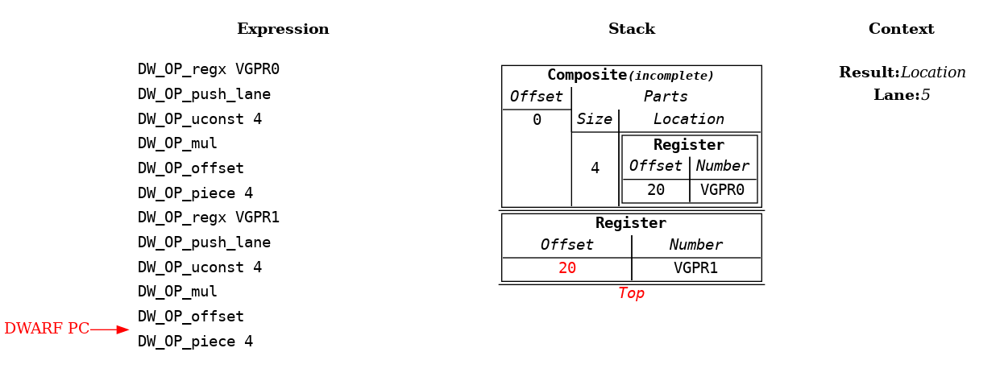

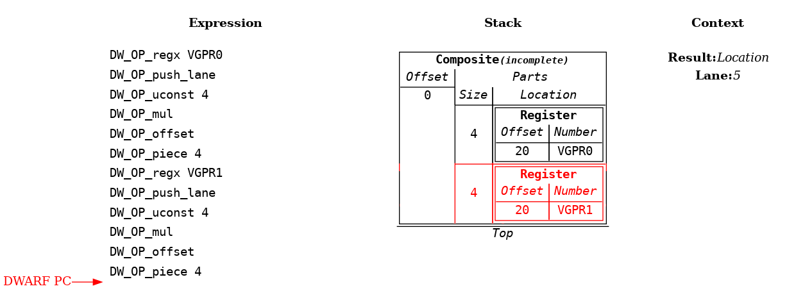

At the end of the expression, if the top stack element is an incomplete
composite location description, it is converted to a complete location
description and returned as the result.

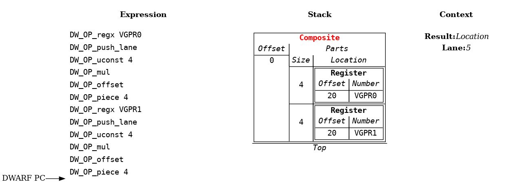

### Source Language Variable Spread Across Multiple Kinds of Locations

This example is the same as the previous one, except the first 2 bytes of the
second vector register have been spilled to memory, and the last 2 bytes have
been proven to be a constant and optimized away.

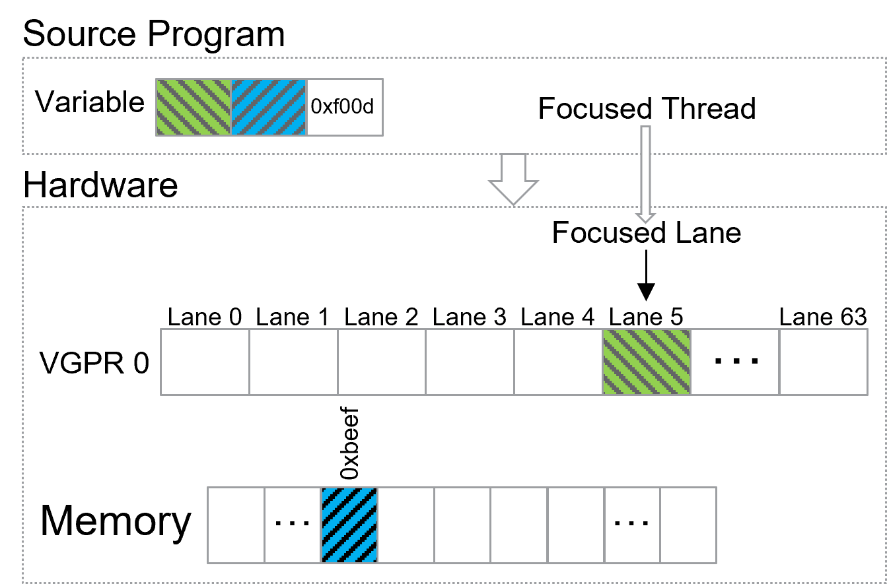

    DW_OP_regx VGPR0
    DW_OP_push_lane
    DW_OP_uconst 4
    DW_OP_mul
    DW_OP_offset
    DW_OP_piece 4
    DW_OP_addr 0xbeef
    DW_OP_piece 2
    DW_OP_uconst 0xf00d
    DW_OP_stack_value
    DW_OP_piece 2
    DW_OP_piece_end

The first 6 operations are the same.

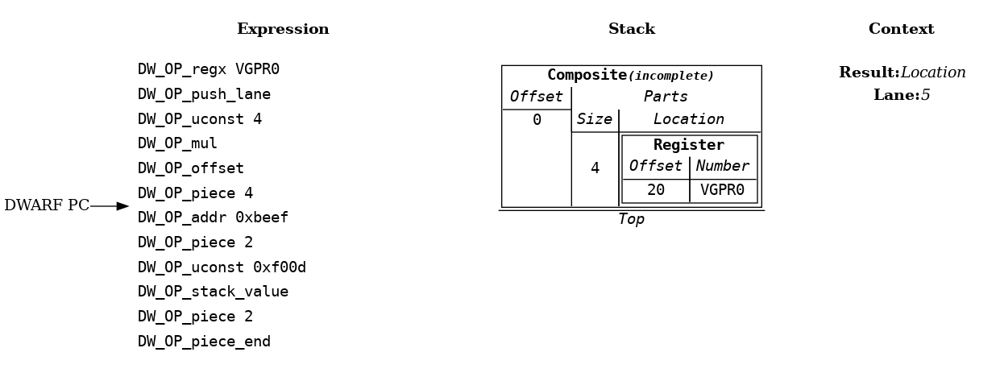

The DW_OP_addr operation pushes a global memory location description on the
stack with an offset equal to the address.

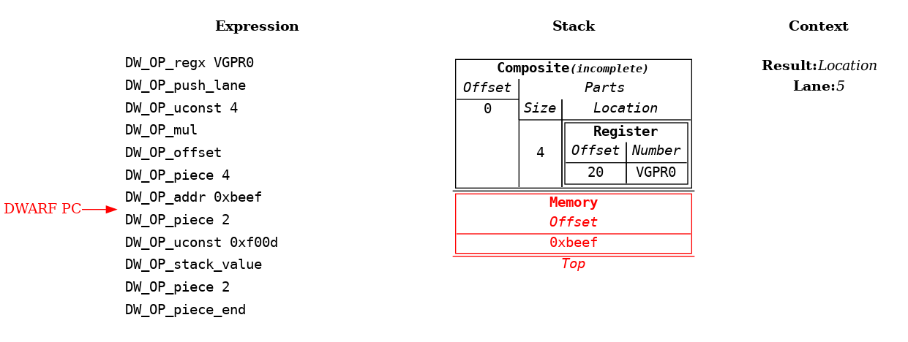

The next DW_OP_piece adds the global memory location description as the next 2
byte part of the composite.

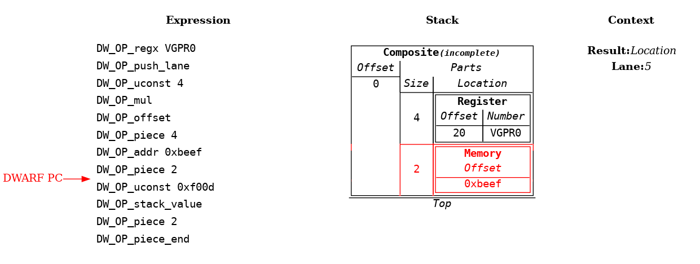

The DW_OP_uconst 0xf00d; DW_OP_stack_value pushes an implicit location
description on the stack. The storage of the implicit location description is
the representation of the value 0xf00d using the generic base type's encoding,
size, and byte ordering.

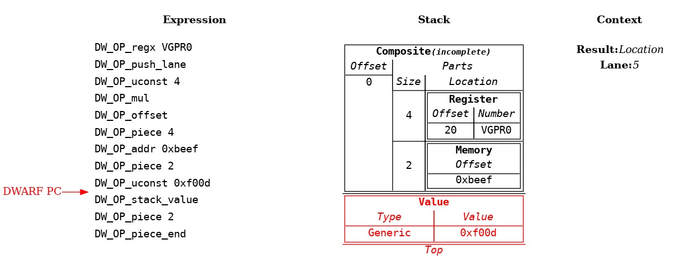

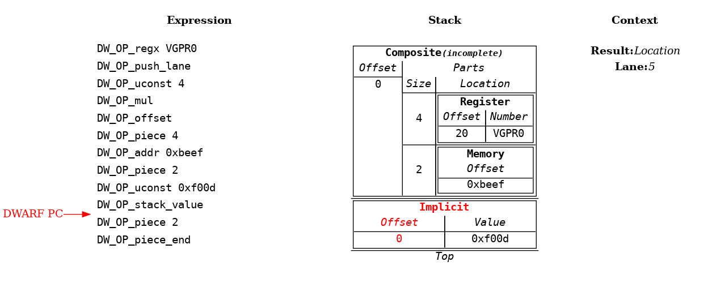

The final DW_OP_piece adds 2 bytes of the implicit location description as the
third part of the composite location description.

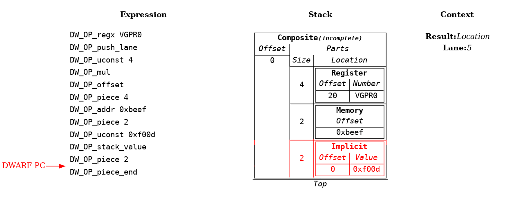

The DW_OP_piece_end operation explicitly makes the incomplete composite location
description into a complete location description. This allows a complete
composite location description to be created on the stack that can be used as
the location description of another following operation. For example, the
DW_OP_offset can be applied to it. More practically, it permits creation of
multiple composite location descriptions on the stack which can be used to pass
arguments to a DWARF procedure using a DW_OP_call* operation. This can be
beneficial to factor the incrementally creation of location descriptions.

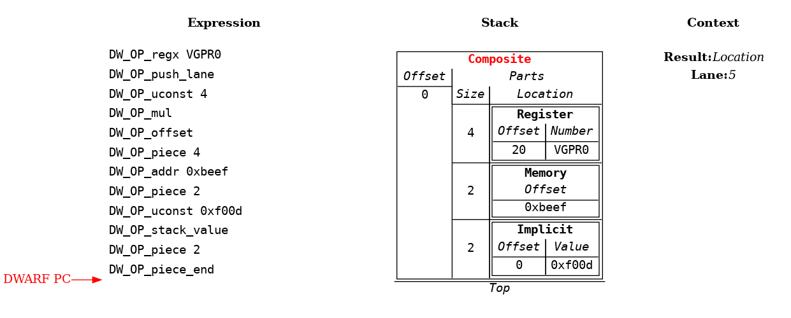

### Address Spaces

Heterogeneous devices can have multiple hardware supported address spaces which
use specific hardware instructions to access them.

For example, GPUs that use SIMT execution may provide hardware support to access
memory such that each lane can see a linear memory view, while the backing
memory is actually being accessed in an interleaved manner so that the locations
for each lanes Nth dword are contiguous. This minimizes cache lines read by the
SIMT execution.

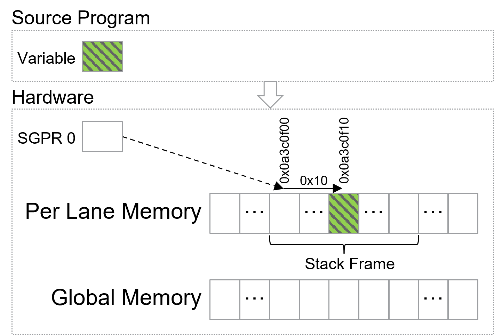

The following expression defines the location of a source language variable that
is allocated at offset 0x10 in the current subprograms stack frame. The
subprogram stack frames are per lane and reside in an interleaved address space.

    DW_OP_regval_type SGPR0 Generic
    DW_OP_uconst 1
    DW_OP_form_aspace_address
    DW_OP_offset 0x10

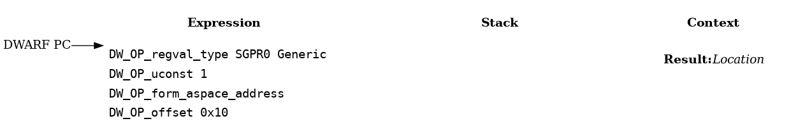

The DW_OP_regval_type operation pushes the contents of SGPR0 as a generic value.
This is the register that holds the address of the current stack frame.

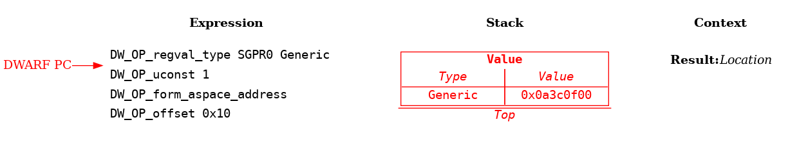

The DW_OP_uconst operation pushes the address space number. Each architecture
defines the numbers it uses in DWARF. In this case, address space 1 is being
used as the per lane memory.

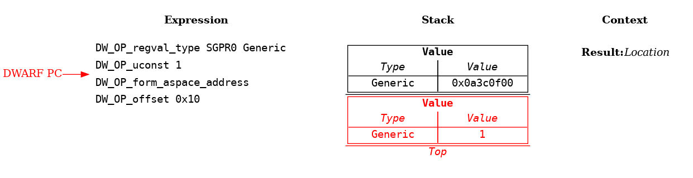

The DW_OP_form_aspace_address operation pops a value and an address space
number. Each address space is associated with a separate storage. A memory
location description is pushed which refers to the address space's storage, with
an offset of the popped value.

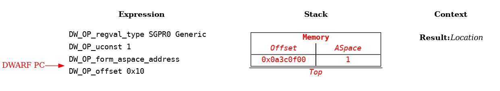

All operations that act on location descriptions work with memory locations
regardless of their address space.

Every architecture defines address space 0 as the default global memory address
space.

Generalizing memory location descriptions to include an address space component
avoids having to create specialized operations to work with address spaces.

The source variable is at offset 0x10 in the stack frame. The DW_OP_offset
operation works on memory location descriptions that have an address space just
like for any other kind of location description.

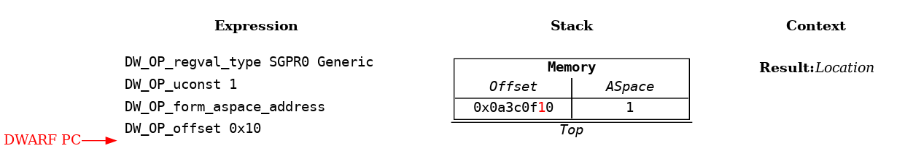

The only operations in DWARF 5 that take an address space are DW_OP_xderef*.
They treat a value as the address in a specified address space, and read its
contents. There is no operation to actually create a location description that
references an address space. There is no way to include address space memory
locations in parts of composite locations.

Since DW_OP_piece now takes any kind of location description for its pieces, it
is now possible for parts of a composite to involve locations in different
address spaces. For example, this can happen when parts of a source variable
allocated in a register are spilled to a stack frame that resides in the
non-global address space.

### Bit Offsets

With the generalization of location descriptions on the stack, it is possible to
define a DW_OP_bit_offset operation that adjusts the offset of any kind of
location in terms of bits rather than bytes. The offset can be a runtime
computed value. This is generally useful for any source language that support
bit sized entities, and for registers that are not a whole number of bytes.

DWARF 5 only supports bit fields in composites using DW_OP_bit_piece. It does
not support runtime computed offsets which can happen for bit field packed
arrays. It is also not generally composable as it must be the last part of an
expression.

The following example defines a location description for a source variable that
is allocated starting at bit 20 of a register. A similar expression could be
used if the source variable was at a bit offset within memory or a particular
address space, or if the offset is a runtime value.

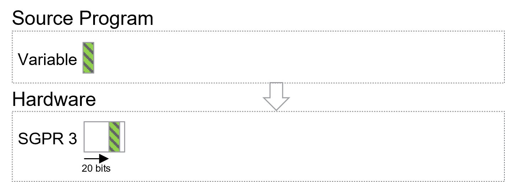

    DW_OP_regx SGPR3
    DW_OP_uconst 20
    DW_OP_bit_offset

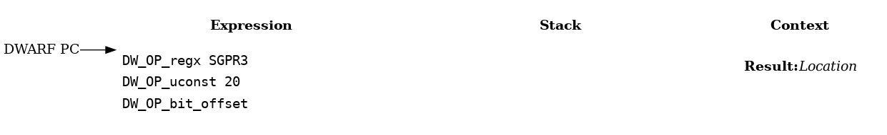

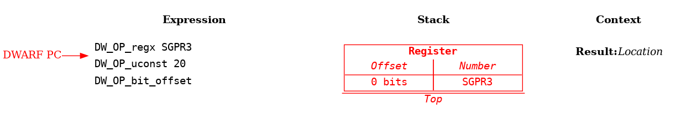

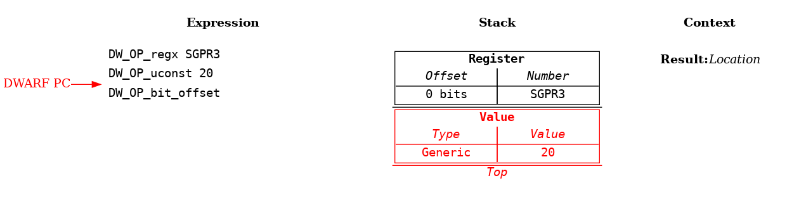

The DW_OP_bit_offset operation pops a value and location description from the
stack. It pushes the location description after updating its offset using the
value as a bit count.

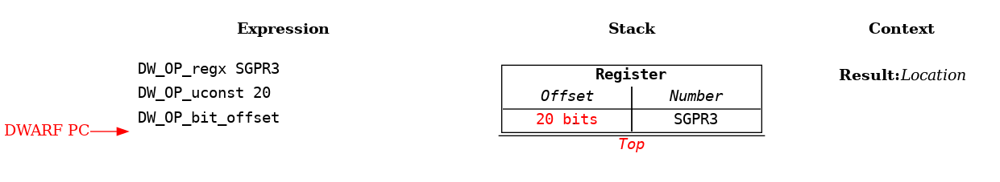

The ordering of bits within a byte, like byte ordering, is defined by the target
architecture. A base type could be extended to specify bit ordering in addition
to byte ordering.

## Call Frame Information (CFI)

DWARF defines call frame information (CFI) that can be used to virtually unwind
the subprogram call stack. This involves determining the location where register
values have been spilled. DWARF 5 limits these locations to either be registers
or global memory. As shown in the earlier examples, heterogeneous devices may
spill registers to parts of other registers, to non-global memory address
spaces, or even a composite of different location kinds.

Therefore, the extension extends the CFI rules to support any kind of location
description, and operations to create locations in address spaces.

## Objects Not In Byte Aligned Global Memory

DWARF 5 only effectively supports byte aligned memory locations on the stack by
using a global memory address as a proxy for a memory location description. This
is a problem for attributes that define DWARF expressions that require the
location of some source language entity that is not allocated in byte aligned
global memory.

For example, the DWARF expression of the DW_AT_data_member_location attribute is
evaluated with an initial stack containing the location of a type instance
object. That object could be located in a register, in a non-global memory
address space, be described by a composite location description, or could even
be an implicit location description.

A similar problem exists for DWARF expressions that use the
DW_OP_push_object_address operation. This operation pushes the location of a
program object associated with the attribute that defines the expression.

Allowing any kind of location description on the stack permits the DW_OP_call*
operations to be used to factor the creation of location descriptions. The
inputs and outputs of the call are passed on the stack. For example, on GPUs an
expression can be defined to describe the effective PC of inactive lanes of SIMT
execution. This is naturally done by composing the result of expressions for
each nested control flow region. This can be done by making each control flow
region have its own DWARF procedure, and then calling it from the expressions of
the nested control flow regions. The alternative is to make each control flow
region have the complete expression which results in much larger DWARF and is
less convenient to generate.

GPU compilers work hard to allocate objects in the larger number of registers to
reduce memory accesses, they have to use different memory address spaces, and
they perform optimizations that result in composites of these. Allowing
operations to work with any kind of location description enables creating
expressions that support all of these.

Full general support for bit fields and implicit locations benefits
optimizations on any target.

## Higher Order Operations

The generalization allows an elegant way to add higher order operations that
create location descriptions out of other location descriptions in a general
composable manner.

For example, a DW_OP_extend operation could create a composite location
description out of a location description, an element size, and an element
count. The resulting composite would effectively be a vector of element count
elements with each element being the same location description of the specified
bit size.

A DW_OP_select_bit_piece operation could create a composite location description
out of two location descriptions, a bit mask value, and an element size. The
resulting composite would effectively be a vector of elements, selecting from
one of the two input locations according to the bit mask.

These could be used in the expression of an attribute that computes the
effective PC of lanes of SIMT execution. The vector result efficiently computes
the PC for each SIMT lane at once. The mask could be the hardware execution mask
register that controls which SIMT lanes are executing. For active divergent
lanes the vector element would be the current PC, and for inactive divergent
lanes the PC would correspond to the source language line at which the lane is
logically positioned.

Similarly, a DW_OP_overlay_piece operation could be defined that creates a
composite location description out of two location descriptions, an offset
value, and a size. The resulting composite would consist of parts that are
equivalent to one of the location descriptions, but with the other location
description replacing a slice defined by the offset and size. This could be used
to efficiently express a source language array that has had a set of elements
promoted into a vector register when executing a set of iterations of a loop in
a SIMD manner.

## Objects In Multiple Places

A compiler may allocate a source variable in stack frame memory, but for some
range of code may promote it to a register. If the generated code does not
change the register value, then there is no need to save it back to memory.
Effectively, during that range, the source variable is in both memory and a
register. If a consumer, such as a debugger, allows the user to change the value
of the source variable in that PC range, then it would need to change both
places.

DWARF 5 supports loclists which are able to specify the location of a source
language entity is in different places at different PC locations. It can also
express that a source language entity is in multiple places at the same time.

DWARF 5 defines operation expressions and loclists separately. In general, this
is adequate as non-memory location descriptions can only be computed as the last
step of an expression evaluation.

However, allowing location descriptions on the stack permits non-memory location
descriptions to be used in the middle of expression evaluation. For example, the
DW_OP_call* and DW_OP_implicit_pointer operations can result in evaluating the
expression of a DW_AT_location attribute of a DIE. The DW_AT_location attribute
allows the loclist form. So the result could include multiple location
descriptions.

Similarly, the DWARF expression associated with attributes such as
DW_AT_data_member_location that are evaluated with an initial stack containing a
location description, or a DWARF operation expression that uses the
DW_OP_push_object_address operation, may want to act on the result of another
expression that returned a location description involving multiple places.

Therefore, the extension needs to define how expression operations that use those
results will behave. The extension does this by generalizing the expression stack
to allow an entry to be one or more single location descriptions. In doing this,
it unifies the definitions of DWARF operation expressions and loclist
expressions in a natural way.

All operations that act on location descriptions are extended to act on multiple
single location descriptions. For example, the DW_OP_offset operation adds the
offset to each single location description. The DW_OP_deref* operations simply
read the storage of one of the single location descriptions, since multiple
single location descriptions must all hold the same value. Similarly, if the
evaluation of a DWARF expression results in multiple single location
descriptions, the consumer can ensure any updates are done to all of them, and
any reads can use any one of them.

# Conclusion

A strength of DWARF is that it has generally sought to provide generalized
composable solutions that address many problems, rather than solutions that only
address one-off issues. This extension attempts to follow that tradition by
defining a backwards compatible composable generalization that can address a
significant family of issues. It addresses the specific issues present for
heterogeneous computing devices, provides benefits for non-heterogeneous
devices, and can help address a number of other previously reported issues.

# Further Information

The following references provide additional information on the extension.

Slides and a video of a presentation at the Linux Plumbers Conference 2021
related to this extension are available.

The LLVM compiler extension includes possible normative text changes for this
extension as well as the operations mentioned in the motivating examples. It
also covers other extensions needed for heterogeneous devices.

- DWARF extensions for optimized SIMT/SIMD (GPU) debugging - Linux Plumbers Conference 2021
  - [Video](https://www.youtube.com/watch?v=QiR0ra0ymEY&t=10015s)
  - [Slides](https://linuxplumbersconf.org/event/11/contributions/1012/attachments/798/1505/DWARF_Extensions_for_Optimized_SIMT-SIMD_GPU_Debugging-LPC2021.pdf)
- [DWARF Extensions For Heterogeneous Debugging](https://llvm.org/docs/AMDGPUDwarfExtensionsForHeterogeneousDebugging.html)
