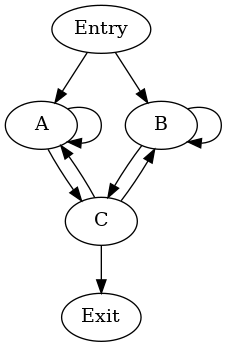
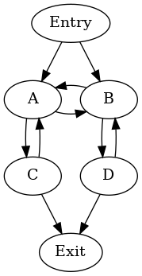
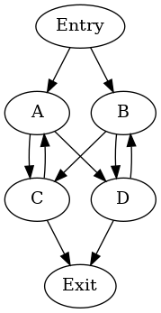

.. _cycle-terminology:

======================
LLVM Cycle Terminology
======================

.. contents::
   :local:

Cycles
======

Cycles are a generalization of LLVM :ref:`loops <loop-terminology>`,
defined recursively as follows [HavlakCycles]_:

1. In a directed graph G, an *outermost cycle* is a maximal strongly
   connected region with at least one internal edge. (Informational
   note --- The requirement for at least one internal edge ensures
   that a single basic block is a cycle only if there is an edge that
   goes back to the same basic block.)
2. A basic block in the cycle that can be reached from the entry of
   the function along a path that does not visit any other basic block
   in the cycle is called an *entry* of the cycle. A cycle can have
   multiple entries.
3. In any depth-first search starting from the entry of the function,
   the first node of a cycle to be visited will be one of the entries.
   This entry is called the *header* of the cycle. (Informational note
   --- Thus, the header of the cycle is implementation-defined.)
4. In any depth-first search starting from the entry, set of outermost
   cycles found in the CFG is the same. These are the *top-level
   cycles* that do not themselves have a parent.
5. The cycles nested inside a cycle C with header H are the outermost
   cycles in the subgraph induced on the set of nodes (C - H). C is
   said to be the *parent* of these cycles, and each of these cycles
   is a *child* of C.

Thus, cycles form an implementation-defined forest where each cycle C is
the parent of any outermost cycles nested inside C. The tree closely
follows the nesting of loops in the same function. The unique entry of
a reducible cycle (an LLVM loop) L dominates all its other nodes, and
is always chosen as the header of some cycle C regardless of the DFS
tree used. This cycle C is a superset of the loop L. For an
irreducible cycle, no one entry dominates the nodes of the cycle. One
of the entries is chosen as header of the cycle, in an
implementation-defined way.

.. _cycle-irreducible:

A cycle is *irreducible* if it has multiple entries and it is
*reducible* otherwise.

.. _cycle-parent-block:

A cycle C is said to be the *parent* of a basic block B if B occurs in
C but not in any child cycle of C. Then B is also said to be a *child*
of cycle C.

.. _cycle-sibling:

A basic block or cycle X is a *sibling* of another basic block or
cycle Y if they both have no parent or both have the same parent.

Informational notes:

- Non-header entry blocks of a cycle can be contained in child cycles.
- If the CFG is reducible, the cycles are exactly the natural loops and
  every cycle has exactly one entry block.
- Cycles are well-nested (by definition).
- The entry blocks of a cycle are siblings in the dominator tree.

.. [HavlakCycles] Paul Havlak, "Nesting of reducible and irreducible
                  loops." ACM Transactions on Programming Languages
                  and Systems (TOPLAS) 19.4 (1997): 557-567.

.. _cycle-examples:

Examples of Cycles
==================

Irreducible cycle enclosing natural loops
-----------------------------------------

.. Graphviz source; the indented blocks below form a comment.

  ///     |   |
  ///   />A] [B<\
  ///   |  \ /  |
  ///   ^---C---^
  ///       |

  strict digraph {
    { rank=same; A B}
    Entry -> A
    Entry -> B
    A -> A
    A -> C
    B -> B
    B -> C
    C -> A
    C -> B
    C -> Exit
  }

The self-loops of ``A`` and ``B`` give rise to two single-block
natural loops. A possible hierarchy of cycles is::

    cycle: {A, B, C} entries: {A, B} header: A
    - cycle: {B, C}  entries: {B, C} header: C
      - cycle: {B}   entries: {B}    header: B

This hierarchy arises when DFS visits the blocks in the order ``A``,
``C``, ``B`` (in preorder).

Irreducible union of two natural loops
--------------------------------------

.. Graphviz source; the indented blocks below form a comment.

  ///     |   |
  ///     A<->B
  ///     ^   ^
  ///     |   |
  ///     v   v
  ///     C   D
  ///     |   |

  strict digraph {
    { rank=same; A B}
    { rank=same; C D}
    Entry -> A
    Entry -> B
    A -> B
    B -> A
    A -> C
    C -> A
    B -> D
    D -> B
    C -> Exit
    D -> Exit
  }

There are two natural loops: ``{A, C}`` and ``{B, D}``. A possible
hierarchy of cycles is::

    cycle: {A, B, C, D} entries: {A, B} header: A
    - cycle: {B, D}     entries: {B}    header: B

Irreducible cycle without natural loops
---------------------------------------

.. Graphviz source; the indented blocks below form a comment.

  ///     |   |
  ///   />A   B<\
  ///   | |\ /| |
  ///   | | x | |
  ///   | |/ \| |
  ///   ^-C   D-^
  ///     |   |
  ///

  strict digraph {
    { rank=same; A B}
    { rank=same; C D}
    Entry -> A
    Entry -> B
    A -> C
    A -> D
    B -> C
    B -> D
    C -> A
    D -> B
    C -> Exit
    D -> Exit
  }

This graph does not contain any natural loops --- the nodes ``A``,
``B``, ``C`` and ``D`` are siblings in the dominator tree. A possible
hierarchy of cycles is::

    cycle: {A, B, C, D} entries: {A, B} header: A
    - cycle: {B, D}     entries: {B, D} header: D

.. _cycle-closed-path:

Closed Paths and Cycles
=======================

A *closed path* in a CFG is a connected sequence of nodes and edges in
the CFG whose start and end points are the same.

1. If a node D dominates one or more nodes in a closed path P and P
   does not contain D, then D dominates every node in P.

   **Proof:** Let U be a node in P that is dominated by D. If there
   was a node V in P not dominated by D, then U would be reachable
   from the function entry node via V without passing through D, which
   contradicts the fact that D dominates U.

2. If a node D dominates one or more nodes in a closed path P and P
   does not contain D, then there exists a cycle C that contains P but
   not D.

   **Proof:** From the above property, D dominates all the nodes in P.
   For any nesting of cycles discovered by the implementation-defined
   DFS, consider the smallest cycle C which contains P. For the sake
   of contradiction, assume that D is in C. Then the header H of C
   cannot be in P, since the header of a cycle cannot be dominated by
   any other node in the cycle. Thus, P is in the set (C-H), and there
   must be a smaller cycle C' in C which also contains P, but that
   contradicts how we chose C.

3. If a closed path P contains nodes U1 and U2 but not their
   dominators D1 and D2 respectively, then there exists a cycle C that
   contains U1 and U2 but neither of D1 and D2.

   **Proof:** From the above properties, each D1 and D2 separately
   dominate every node in P. There exists a cycle C1 (respectively,
   C2) that contains P but not D1 (respectively, D2). Either C1 and C2
   are the same cycle, or one of them is nested inside the other.
   Hence there is always a cycle that contains U1 and U2 but neither
   of D1 and D2.
