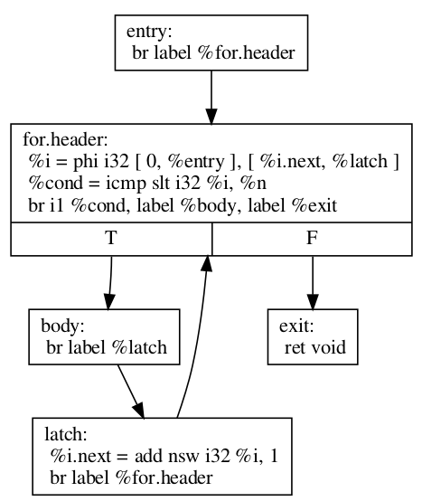
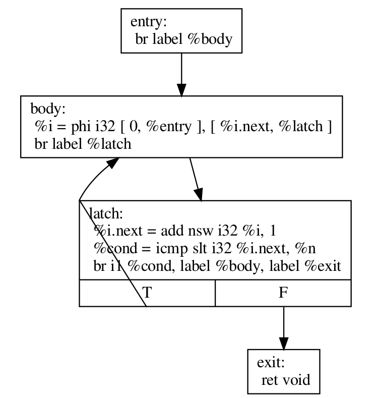
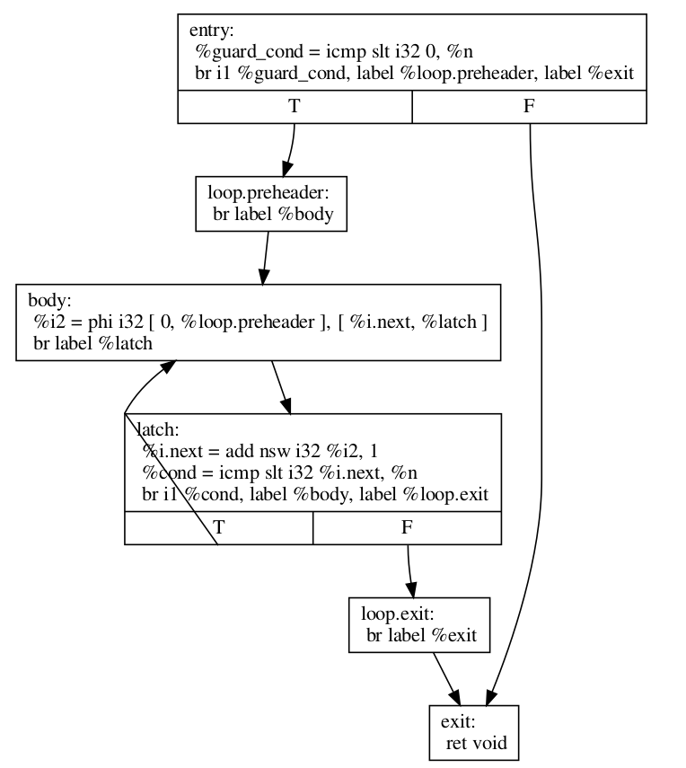

.. _loop-terminology:

===========================================
LLVM Loop Terminology (and Canonical Forms)
===========================================

.. contents::
   :local:

Introduction
============

Loops are a core concept in any optimizer.  This page spells out some
of the common terminology used within LLVM code to describe loop
structures.

First, let's start with the basics. In LLVM, a Loop is a maximal set of basic
blocks that form a strongly connected component (SCC) in the Control
Flow Graph (CFG) where there exists a dedicated entry/header block that
dominates all other blocks within the loop. Thus, without leaving the
loop, one can reach every block in the loop from the header block and
the header block from every block in the loop.

Note that there are some important implications of this definition:

* Not all SCCs are loops.  There exist SCCs that do not meet the
  dominance requirement and such are not considered loops.  

* Loops can contain non-loop SCCs and non-loop SCCs may contain
  loops.  Loops may also contain sub-loops.

* A header block is uniquely associated with one loop.  There can be
  multiple SCC within that loop, but the strongly connected component
  (SCC) formed from their union must always be unique.

* Given the use of dominance in the definition, all loops are
  statically reachable from the entry of the function.  

* Every loop must have a header block, and some set of predecessors
  outside the loop.  A loop is allowed to be statically infinite, so
  there need not be any exiting edges.

* Any two loops are either fully disjoint (no intersecting blocks), or
  one must be a sub-loop of the other.

* Loops in a function form a forest. One implication of this fact
  is that a loop either has no parent or a single parent.

A loop may have an arbitrary number of exits, both explicit (via
control flow) and implicit (via throwing calls which transfer control
out of the containing function).  There is no special requirement on
the form or structure of exit blocks (the block outside the loop which
is branched to).  They may have multiple predecessors, phis, etc...

Key Terminology
===============

**Header Block** - The basic block which dominates all other blocks
contained within the loop.  As such, it is the first one executed if
the loop executes at all.  Note that a block can be the header of
two separate loops at the same time, but only if one is a sub-loop
of the other.

**Exiting Block** - A basic block contained within a given loop which has
at least one successor outside of the loop and one successor inside the
loop.  (The latter is a consequence of the block being contained within
an SCC which is part of the loop.)  That is, it has a successor which
is an Exit Block.  

**Exit Block** - A basic block outside of the associated loop which has a
predecessor inside the loop.  That is, it has a predecessor which is
an Exiting Block.

**Latch Block** - A basic block within the loop whose successors include
the header block of the loop.  Thus, a latch is a source of backedge.
A loop may have multiple latch blocks.  A latch block may be either
conditional or unconditional.

**Backedge(s)** - The edge(s) in the CFG from latch blocks to the header
block.  Note that there can be multiple such edges, and even multiple
such edges leaving a single latch block.  

**Loop Predecessor** -  The predecessor blocks of the loop header which
are not contained by the loop itself.  These are the only blocks
through which execution can enter the loop.  When used in the
singular form implies that there is only one such unique block. 

**Preheader Block** - A preheader is a (singular) loop predecessor which
ends in an unconditional transfer of control to the loop header.  Note
that not all loops have such blocks.

**Backedge Taken Count** - The number of times the backedge will execute
before some interesting event happens.  Commonly used without
qualification of the event as a shorthand for when some exiting block
branches to some exit block. May be zero, or not statically computable.

**Iteration Count** - The number of times the header will execute before
some interesting event happens.  Commonly used without qualification to
refer to the iteration count at which the loop exits.  Will always be
one greater than the backedge taken count.  *Warning*: Preceding
statement is true in the *integer domain*; if you're dealing with fixed
width integers (such as LLVM Values or SCEVs), you need to be cautious
of overflow when converting one to the other.

It's important to note that the same basic block can play multiple
roles in the same loop, or in different loops at once.  For example, a
single block can be the header for two nested loops at once, while
also being an exiting block for the inner one only, and an exit block
for a sibling loop.  Example:

.. code-block:: C

  while (..) {
    for (..) {}
    do {
      do {
        // <-- block of interest
        if (exit) break;
      } while (..);
    } while (..)
  }

LoopInfo
========

LoopInfo is the core analysis for obtaining information about loops.
There are few key implications of the definitions given above which
are important for working successfully with this interface.

* LoopInfo does not contain information about non-loop cycles.  As a
  result, it is not suitable for any algorithm which requires complete
  cycle detection for correctness.

* LoopInfo provides an interface for enumerating all top level loops
  (e.g. those not contained in any other loop).  From there, you may
  walk the tree of sub-loops rooted in that top level loop.

* Loops which become statically unreachable during optimization *must*
  be removed from LoopInfo. If this can not be done for some reason,
  then the optimization is *required* to preserve the static
  reachability of the loop.
  

.. _loop-terminology-loop-simplify:

Loop Simplify Form
==================

The Loop Simplify Form is a canonical form that makes
several analyses and transformations simpler and more effective.
It is ensured by the LoopSimplify
(:ref:`-loop-simplify <passes-loop-simplify>`) pass and is automatically
added by the pass managers when scheduling a LoopPass.
This pass is implemented in
`LoopSimplify.h <https://llvm.org/doxygen/LoopSimplify_8h_source.html>`_.
When it is successful, the loop has:

* A preheader.
* A single backedge (which implies that there is a single latch).
* Dedicated exits. That is, no exit block for the loop
  has a predecessor that is outside the loop. This implies
  that all exit blocks are dominated by the loop header.

.. _loop-terminology-lcssa:

Loop Closed SSA (LCSSA)
=======================

A program is in Loop Closed SSA Form if it is in SSA form
and all values that are defined in a loop are used only inside
this loop.
Programs written in LLVM IR are always in SSA form but not necessarily
in LCSSA. To achieve the latter, single entry PHI nodes are inserted
at the end of the loops for all values that are live
across the loop boundary [#lcssa-construction]_.
In particular, consider the following loop:

.. code-block:: C

    c = ...;
    for (...) {
      if (c)
        X1 = ...
      else
        X2 = ...
      X3 = phi(X1, X2);  // X3 defined
    }

    ... = X3 + 4;  // X3 used, i.e. live
                   // outside the loop

In the inner loop, the X3 is defined inside the loop, but used
outside of it. In Loop Closed SSA form, this would be represented as follows:

.. code-block:: C

    c = ...;
    for (...) {
      if (c)
        X1 = ...
      else
        X2 = ...
      X3 = phi(X1, X2);
    }
    X4 = phi(X3);

    ... = X4 + 4;

This is still valid LLVM; the extra phi nodes are purely redundant,
but all LoopPass'es are required to preserve them.
This form is ensured by the LCSSA (:ref:`-lcssa <passes-lcssa>`)
pass and is added automatically by the LoopPassManager when
scheduling a LoopPass.
After the loop optimizations are done, these extra phi nodes
will be deleted by :ref:`-instcombine <passes-instcombine>`.

The major benefit of this transformation is that it makes many other
loop optimizations simpler.

First of all, a simple observation is that if one needs to see all
the outside users, they can just iterate over all the (loop closing)
PHI nodes in the exit blocks (the alternative would be to
scan the def-use chain [#def-use-chain]_ of all instructions in the loop).

Then, consider for example
:ref:`-loop-unswitch <passes-loop-unswitch>` ing the loop above.
Because it is in LCSSA form, we know that any value defined inside of
the loop will be used either only inside the loop or in a loop closing
PHI node. In this case, the only loop closing PHI node is X4.
This means that we can just copy the loop and change the X4
accordingly, like so:

.. code-block:: C

    c = ...;
    if (c) {
      for (...) {
        if (true)
          X1 = ...
        else
          X2 = ...
        X3 = phi(X1, X2);
      }
    } else {
      for (...) {
        if (false)
          X1' = ...
        else
          X2' = ...
        X3' = phi(X1', X2');
      }
    }
    X4 = phi(X3, X3')

Now, all uses of X4 will get the updated value (in general,
if a loop is in LCSSA form, in any loop transformation,
we only need to update the loop closing PHI nodes for the changes
to take effect).  If we did not have Loop Closed SSA form, it means that X3 could
possibly be used outside the loop. So, we would have to introduce the
X4 (which is the new X3) and replace all uses of X3 with that.
However, we should note that because LLVM keeps a def-use chain
[#def-use-chain]_ for each Value, we wouldn't need
to perform data-flow analysis to find and replace all the uses
(there is even a utility function, replaceAllUsesWith(),
that performs this transformation by iterating the def-use chain).

Another important advantage is that the behavior of all uses
of an induction variable is the same.  Without this, you need to
distinguish the case when the variable is used outside of
the loop it is defined in, for example:

.. code-block:: C

  for (i = 0; i < 100; i++) {
    for (j = 0; j < 100; j++) {
      k = i + j;
      use(k);    // use 1
    }
    use(k);      // use 2
  }

Looking from the outer loop with the normal SSA form, the first use of k
is not well-behaved, while the second one is an induction variable with
base 100 and step 1.  Although, in practice, and in the LLVM context,
such cases can be handled effectively by SCEV. Scalar Evolution
(:ref:`scalar-evolution <passes-scalar-evolution>`) or SCEV, is a
(analysis) pass that analyzes and categorizes the evolution of scalar
expressions in loops.

In general, it's easier to use SCEV in loops that are in LCSSA form.
The evolution of a scalar (loop-variant) expression that
SCEV can analyze is, by definition, relative to a loop.
An expression is represented in LLVM by an
`llvm::Instruction <https://llvm.org/doxygen/classllvm_1_1Instruction.html>`_.
If the expression is inside two (or more) loops (which can only
happen if the loops are nested, like in the example above) and you want
to get an analysis of its evolution (from SCEV),
you have to also specify relative to what Loop you want it.
Specifically, you have to use
`getSCEVAtScope() <https://llvm.org/doxygen/classllvm_1_1ScalarEvolution.html#a21d6ee82eed29080d911dbb548a8bb68>`_.

However, if all loops are in LCSSA form, each expression is actually
represented by two different llvm::Instructions.  One inside the loop
and one outside, which is the loop-closing PHI node and represents
the value of the expression after the last iteration (effectively,
we break each loop-variant expression into two expressions and so, every
expression is at most in one loop).  You can now just use
`getSCEV() <https://llvm.org/doxygen/classllvm_1_1ScalarEvolution.html#a30bd18ac905eacf3601bc6a553a9ff49>`_.
and which of these two llvm::Instructions you pass to it disambiguates
the context / scope / relative loop.

.. rubric:: Footnotes

.. [#lcssa-construction] To insert these loop-closing PHI nodes, one has to
  (re-)compute dominance frontiers (if the loop has multiple exits).

.. [#def-use-chain] A property of SSA is that there exists a def-use chain
  for each definition, which is a list of all the uses of this definition.
  LLVM implements this property by keeping a list of all the uses of a Value
  in an internal data structure.

"More Canonical" Loops
======================

.. _loop-terminology-loop-rotate:

Rotated Loops
-------------

Loops are rotated by the LoopRotate (:ref:`loop-rotate <passes-loop-rotate>`)
pass, which converts loops into do/while style loops and is
implemented in
`LoopRotation.h <https://llvm.org/doxygen/LoopRotation_8h_source.html>`_.  Example:

.. code-block:: C

  void test(int n) {
    for (int i = 0; i < n; i += 1)
      // Loop body
  }

is transformed to:

.. code-block:: C

  void test(int n) {
    int i = 0;
    do {
      // Loop body
      i += 1;
    } while (i < n);
  }

**Warning**: This transformation is valid only if the compiler
can prove that the loop body will be executed at least once. Otherwise,
it has to insert a guard which will test it at runtime. In the example
above, that would be:

.. code-block:: C

  void test(int n) {
    int i = 0;
    if (n > 0) {
      do {
        // Loop body
        i += 1;
      } while (i < n);
    }
  }

It's important to understand the effect of loop rotation
at the LLVM IR level. We follow with the previous examples
in LLVM IR while also providing a graphical representation
of the control-flow graphs (CFG). You can get the same graphical
results by utilizing the :ref:`view-cfg <passes-view-cfg>` pass.

The initial **for** loop could be translated to:

.. code-block:: none

  define void @test(i32 %n) {
  entry:
    br label %for.header

  for.header:
    %i = phi i32 [ 0, %entry ], [ %i.next, %latch ]
    %cond = icmp slt i32 %i, %n
    br i1 %cond, label %body, label %exit

  body:
    ; Loop body
    br label %latch

  latch:
    %i.next = add nsw i32 %i, 1
    br label %for.header

  exit:
    ret void
  }

Before we explain how LoopRotate will actually
transform this loop, here's how we could convert
it (by hand) to a do-while style loop.

.. code-block:: none

  define void @test(i32 %n) {
  entry:
    br label %body

  body:
    %i = phi i32 [ 0, %entry ], [ %i.next, %latch ]
    ; Loop body
    br label %latch

  latch:
    %i.next = add nsw i32 %i, 1
    %cond = icmp slt i32 %i.next, %n
    br i1 %cond, label %body, label %exit

  exit:
    ret void
  }

Note two things:

* The condition check was moved to the "bottom" of the loop, i.e.
  the latch. This is something that LoopRotate does by copying the header
  of the loop to the latch.
* The compiler in this case can't deduce that the loop will
  definitely execute at least once so the above transformation
  is not valid. As mentioned above, a guard has to be inserted,
  which is something that LoopRotate will do.

This is how LoopRotate transforms this loop:

.. code-block:: none

  define void @test(i32 %n) {
  entry:
    %guard_cond = icmp slt i32 0, %n
    br i1 %guard_cond, label %loop.preheader, label %exit

  loop.preheader:
    br label %body

  body:
    %i2 = phi i32 [ 0, %loop.preheader ], [ %i.next, %latch ]
    br label %latch

  latch:
    %i.next = add nsw i32 %i2, 1
    %cond = icmp slt i32 %i.next, %n
    br i1 %cond, label %body, label %loop.exit

  loop.exit:
    br label %exit

  exit:
    ret void
  }

The result is a little bit more complicated than we may expect
because LoopRotate ensures that the loop is in
:ref:`Loop Simplify Form <loop-terminology-loop-simplify>`
after rotation.
In this case, it inserted the %loop.preheader basic block so
that the loop has a preheader and it introduced the %loop.exit
basic block so that the loop has dedicated exits
(otherwise, %exit would be jumped from both %latch and %entry,
but %entry is not contained in the loop).
Note that a loop has to be in Loop Simplify Form beforehand
too for LoopRotate to be applied successfully.

The main advantage of this form is that it allows hoisting
invariant instructions, especially loads, into the preheader.
That could be done in non-rotated loops as well but with
some disadvantages.  Let's illustrate them with an example:

.. code-block:: C

  for (int i = 0; i < n; ++i) {
    auto v = *p;
    use(v);
  }

We assume that loading from p is invariant and use(v) is some
statement that uses v.
If we wanted to execute the load only once we could move it
"out" of the loop body, resulting in this:

.. code-block:: C

  auto v = *p;
  for (int i = 0; i < n; ++i) {
    use(v);
  }

However, now, in the case that n <= 0, in the initial form,
the loop body would never execute, and so, the load would
never execute.  This is a problem mainly for semantic reasons.
Consider the case in which n <= 0 and loading from p is invalid.
In the initial program there would be no error.  However, with this
transformation we would introduce one, effectively breaking
the initial semantics.

To avoid both of these problems, we can insert a guard:

.. code-block:: C

  if (n > 0) {  // loop guard
    auto v = *p;
    for (int i = 0; i < n; ++i) {
      use(v);
    }
  }

This is certainly better but it could be improved slightly. Notice
that the check for whether n is bigger than 0 is executed twice (and
n does not change in between).  Once when we check the guard condition
and once in the first execution of the loop.  To avoid that, we could
do an unconditional first execution and insert the loop condition
in the end. This effectively means transforming the loop into a do-while loop:

.. code-block:: C

  if (0 < n) {
    auto v = *p;
    do {
      use(v);
      ++i;
    } while (i < n);
  }

Note that LoopRotate does not generally do such
hoisting.  Rather, it is an enabling transformation for other
passes like Loop-Invariant Code Motion (:ref:`-licm <passes-licm>`).
