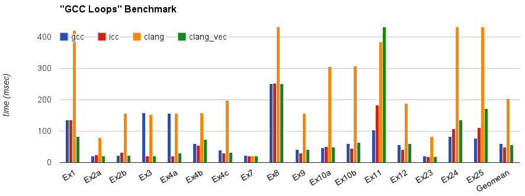

==========================
Auto-Vectorization in LLVM
==========================

LLVM has two vectorizers: The *Loop Vectorizer*, which operates on Loops,
and the *Basic Block Vectorizer*, which optimizes straight-line code. These
vectorizers focus on different optimization opportunities and use different
techniques. The BB vectorizer merges multiple scalars that are found in the
code into vectors while the Loop Vectorizer widens instructions in the
original loop to operate on multiple consecutive loop iterations.

The Loop Vectorizer
===================

LLVM’s Loop Vectorizer is now available and will be useful for many people.
It is not enabled by default, but can be enabled through clang using the
command line flag:

.. code-block:: console

   $ clang -fvectorize file.c

We plan to enable the Loop Vectorizer by default as part of the LLVM 3.3 release.

Features
^^^^^^^^^

The LLVM Loop Vectorizer has a number of features that allow it to vectorize
complex loops.

Loops with unknown trip count
------------------------------

The Loop Vectorizer supports loops with an unknown trip count.
In the loop below, the iteration ``start`` and ``finish`` points are unknown,
and the Loop Vectorizer has a mechanism to vectorize loops that do not start
at zero. In this example, ‘n’ may not be a multiple of the vector width, and
the vectorizer has to execute the last few iterations as scalar code. Keeping
a scalar copy of the loop increases the code size.

.. code-block:: c++

  void bar(float *A, float* B, float K, int start, int end) {
   for (int i = start; i < end; ++i)
     A[i] *= B[i] + K;
  }

Runtime Checks of Pointers
--------------------------

In the example below, if the pointers A and B point to consecutive addresses,
then it is illegal to vectorize the code because some elements of A will be
written before they are read from array B.

Some programmers use the 'restrict' keyword to notify the compiler that the
pointers are disjointed, but in our example, the Loop Vectorizer has no way of
knowing that the pointers A and B are unique. The Loop Vectorizer handles this
loop by placing code that checks, at runtime, if the arrays A and B point to
disjointed memory locations. If arrays A and B overlap, then the scalar version
of the loop is executed. 

.. code-block:: c++

  void bar(float *A, float* B, float K, int n) {
   for (int i = 0; i < n; ++i)
     A[i] *= B[i] + K;
  }

Reductions
--------------------------

In this example the ``sum`` variable is used by consecutive iterations of 
the loop. Normally, this would prevent vectorization, but the vectorizer can
detect that ‘sum’ is a reduction variable. The variable ‘sum’ becomes a vector
of integers, and at the end of the loop the elements of the array are added
together to create the correct result. We support a number of different 
reduction operations, such as addition, multiplication, XOR, AND and OR.

.. code-block:: c++

  int foo(int *A, int *B, int n) {
    unsigned sum = 0;
    for (int i = 0; i < n; ++i)
        sum += A[i] + 5;
    return sum;
  }

Inductions
--------------------------

In this example the value of the induction variable ``i`` is saved into an
array. The Loop Vectorizer knows to vectorize induction variables.

.. code-block:: c++

  void bar(float *A, float* B, float K, int n) {
   for (int i = 0; i < n; ++i)
     A[i] = i;
  }

If Conversion
--------------------------

The Loop Vectorizer is able to "flatten" the IF statement in the code and
generate a single stream of instructions. The Loop Vectorizer supports any
control flow in the innermost loop. The innermost loop may contain complex
nesting of IFs, ELSEs and even GOTOs.

.. code-block:: c++

  int foo(int *A, int *B, int n) {
    unsigned sum = 0;
    for (int i = 0; i < n; ++i)
      if (A[i] > B[i])
        sum += A[i] + 5;
    return sum;
  }

Pointer Induction Variables
---------------------------

This example uses the "accumulate" function of the standard c++ library. This
loop uses C++ iterators, which are pointers, and not integer indices.
The Loop Vectorizer detects pointer induction variables and can vectorize
this loop. This feature is important because many C++ programs use iterators.

.. code-block:: c++

  int baz(int *A, int n) {
    return std::accumulate(A, A + n, 0);
  }

Reverse Iterators
--------------------------

The Loop Vectorizer can vectorize loops that count backwards.

.. code-block:: c++

  int foo(int *A, int *B, int n) {
    for (int i = n; i > 0; --i)
      A[i] +=1;
  }

Scatter / Gather
----------------

The Loop Vectorizer can vectorize code that becomes scatter/gather 
memory accesses. 

.. code-block:: c++

  int foo(int *A, int *B, int n, int k) {
  for (int i = 0; i < n; ++i)
      A[i*7] += B[i*k];
  }

Vectorization of Mixed Types
--------------------------

The Loop Vectorizer can vectorize programs with mixed types. The Vectorizer
cost model can estimate the cost of the type conversion and decide if
vectorization is profitable.

.. code-block:: c++

  int foo(int *A, char *B, int n, int k) {
  for (int i = 0; i < n; ++i)
      A[i] += 4 * B[i];
  }

Vectorization of function calls
--------------------------

The Loop Vectorize can vectorize intrinsic math functions.
See the table below for a list of these functions.

+-----+-----+---------+
| pow | exp |  exp2   |
+-----+-----+---------+
| sin | cos |  sqrt   |
+-----+-----+---------+
| log |log2 |  log10  |
+-----+-----+---------+
|fabs |floor|  ceil   |
+-----+-----+---------+
|fma  |trunc|nearbyint|
+-----+-----+---------+

Performance
^^^^^^^^^^^

This section shows the the execution time of Clang on a simple benchmark: 
`gcc-loops <http://llvm.org/viewvc/llvm-project/test-suite/trunk/SingleSource/UnitTests/Vectorizer/>`_.
This benchmarks is a collection of loops from the GCC autovectorization 
`page <http://gcc.gnu.org/projects/tree-ssa/vectorization.html>`_ by Dorit Nuzman._

The chart below compares GCC-4.7, ICC-13, and Clang-SVN at -O3, running on a Sandybridge.
The Y-axis shows time in msec. Lower is better.

The Basic Block Vectorizer
==========================

The Basic Block Vectorizer is not enabled by default, but it can be enabled
through clang using the command line flag:

.. code-block:: console

   $ clang -fslp-vectorize file.c 

The goal of basic-block vectorization (a.k.a. superword-level parallelism) is
to combine similar independent instructions within simple control-flow regions
into vector instructions. Memory accesses, arithemetic operations, comparison
operations and some math functions can all be vectorized using this technique
(subject to the capabilities of the target architecture). 

For example, the following function performs very similar operations on its
inputs (a1, b1) and (a2, b2). The basic-block vectorizer may combine these
into vector operations.

.. code-block:: c++

  int foo(int a1, int a2, int b1, int b2) {
    int r1 = a1*(a1 + b1)/b1 + 50*b1/a1;
    int r2 = a2*(a2 + b2)/b2 + 50*b2/a2;
    return r1 + r2;
  }

