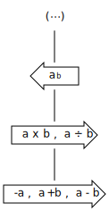
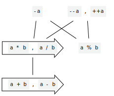
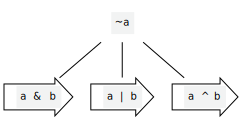
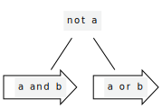
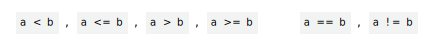
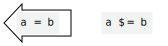
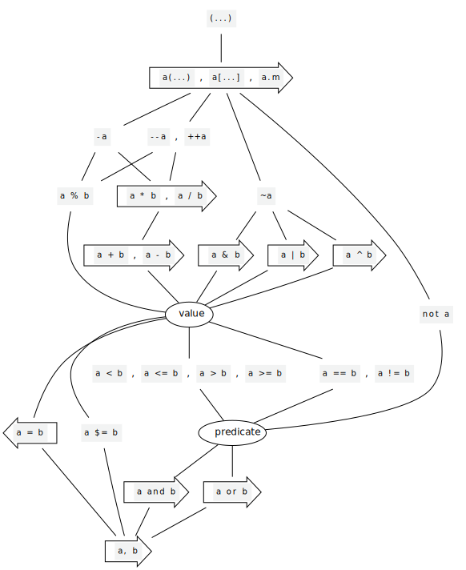

# Carbon operators and precedence

A proposal for a set of operators for Carbon.

# Basics

Expression-oriented languages traditionally build expressions from the following
pieces:

-   Primitive terms, such as identifiers and literals, and special syntactic
    forms such as lambda-expressions, casts, C `sizeof`, and so on.
-   Parenthesized expressions.
-   Unary operators written before or after an expression.
-   Binary operators written between[1] two expressions.
-   Function call expressions with a "function name" expression followed by zero
    or more "function argument" expressions, perhaps also including some syntax
    such as parentheses.

We want Carbon to follow a similar structure. This leads to the question: which
operators should Carbon have, and -- given an expression involving multiple
operators -- how should it be interpreted?

**tl;dr:** Major deviations from C++:

-   Precedence is a partial order rather than a total order. Expressions such as
    `a * b & c` that would invite parentheses in well-written C++ code are
    invalid in Carbon.
-   Whitespace is mandatory around operators and must match the fixity of the
    operators, but is not relied upon to form a correct parse tree.
-   Some operators are renamed or removed; others are added. TODO: Include
    notable examples here.

[1]: Some expression languages choose to write expressions in prefix or postfix
notation. Prefix notation models operators as if they were functions, so is
covered by the "function calls" bullet. We are not considering postfix notation
(sometimes known as Reverse Polish Notation) in this document, as it doesn't
satisfy our readability goal.

## Primitive terms

For the purpose of this document, we assume that Carbon will have primitive
terms of the following forms:

-   _Literals_, which can be distinguished from other tokens by their lexical
    structure.
-   _Identifiers_, which are looked up by a uniform name lookup mechanism.
-   _Special forms_, which begin with an introducer keyword and are
    self-delimiting.

Therefore when we see a token, we always know whether it is a primitive term and
can find the end of that term.

## Parentheses (`(`, `)`)

We anticipate parentheses being used for three overlapping purposes in Carbon
code:

-   Grouping expressions to specify, override, or clarify[2] operator
    precedence: `a * (b + c)`.
-   As part of tuple literal syntax: `(a, b)`.
-   As part of function call syntax: `f(a)`.

As a general principle, we want any particular syntax (including things like
parentheses and commas) to have only a single meaning in Carbon, to the extent
possible. Applied to this case, we might conclude that, if parentheses form
tuples, then they should (at least notionally) form tuples in all syntactic
contexts. However, that's not quite the rule we want for Carbon: it is highly
desirable for `(x)`, for a regular expression `x`, to have the same semantics
and interpretation as `x` itself (but perhaps be accepted in more syntactic
contexts).

We distinguish between two contexts:

-   In a context where a tuple is required (such as the argument list of a
    function call), `(x)` forms a 1-tuple.
-   In any other context, `(x)` has the same meaning as `x`.

Empty parentheses `()` in any context form a 0-tuple. Parentheses containing a
[tuple-formation operator](#commas-and-tuples) always form a tuple.

The syntax of a function call of the form `f(args)` can therefore be viewed as a
juxtaposition of a function expression and a parenthesized expression, where the
latter is a context that requires a tuple. We need not take this view, and could
instead consider function calls to be special syntax that merely resembles such
a juxtaposition. Either way, fact that concatenating two valid expressions can
result in a valid expression imposes some constraints on our operator set, as
described in [Function calls as operators](#function-calls-as-operators).

[2]: As described [below](#precedence-ordering), we hope to pick precedence
rules such that parentheses are never used merely to clarify the precedence that
would be imposed in the absence of parentheses. We may wish to warn on redundant
parentheses.

## Unary and binary operators

We expect Carbon to have a reasonably rich set of operators, comparable to those
of other modern programming languages. Each operator will be represented in
source code by a token, which will be either formed of symbol characters or will
be a keyword.

We anticipate the same operator token being reused as more than one of a prefix
unary operator, an infix binary operator, and a postfix unary operator (we will
refer to this choice of prefix/infix/postfix as the _fixity_ of the operator).
In C and C++, this is the case for various operator symbols -- `*`, `&`, `-`,
`+`, `--`, and `++` -- and GNU C adds `&&` to the list. We will likely trim that
overlap significantly, but at least `-` should be expected to exist as both a
unary prefix operator and an infix binary operator.

Where an operator token has more than one fixity, this document will consider
each combination of token and fixity as a distinct operator. See also
[Determining operator fixity](#determining-operator-fixity).

### User-defined operators

Some languages, such as Haskell and Swift, provide the ability to extend the
operator set with new symbols. Typically the language provides a fixed set of
operator precedence levels instead of a fixed set of operators, and new
operators formed from some set of symbol characters can be declared with any of
the predefined precedence levels. In Haskell, lookup for a name must always be
unique, and this applies to both identifier names and operator names. In Swift,
ambiguous lookup for custom operators has historically been
[problematic](https://forums.swift.org/t/some-concerns-on-custom-operators/4479/20)
and has presented the kind of conflict between different libraries that we would
like to avoid in Carbon.

An extensible operator set provides a great deal of flexibility and power in
library design, and if used well, can result in code that is -- for experienced
readers of that area of the codebase -- easier to read and understand than code
written with explicit named function calls. In much the same way that we would
find `a + b * c` easier to read than `a.add(b.multiplyBy(c))`, users of custom
types may find it easier to read code using operators that have some extrinsic
meaning for those types.

On the other hand, permitting a custom and extensible operator set encourages
library designs that invent new custom operators, and code making heavy use of
each particular set of custom operators will appear to be written in a different
dialect of the language. This is likely true of many abstraction mechanisms --
for example, heavy use of user-defined type and function names also effectively
result in language dialects -- but that doesn't mean it's unproblematic. For
example, the unbridled use of custom operators creates real readability problems
for Haskell code. We should be suspicious of such customizations in much the
same way we would be suspicious of a library inventing its own version of
vocabulary types.

We could make user-defined operators work in Carbon, likely following the
Haskell example: as with identifier names, we could perform a lookup for the
operator name and require it to find exactly one name. And we could require
operator names from other packages to be explicitly imported by name before they
are usable. Given our approach to [Precedence ordering](#precedence-ordering),
this would likely introduce additional complexity beyond that in Haskell or
Swift.

On balance, we do not have sufficient justification to permit user-defined
operators, so we will not pursue them at this time. We should remain open to the
idea of adding further operators as we accumulate usage experience and find
practical holes in our operator set, and should avoid making language decisions
that assume we will forever have a particular finite set of operators.

### Operator symbols

Carbon aims to support language evolution, and so -- even though we don't have a
user-extensible operator set -- we should reserve all combinations of operator
symbols for future operators. Specifically, we should only allow letters[3],
numbers, and (following historical precedent) underscore in identifiers, and
reserve more exotic character combinations for future operators even if we do
not use them as operators initially. For example, even if we do not use `$`,
`@`, or `#` as operators, they should remain reserved for future use as
operators or parts thereof.

To make language evolution as easy as possible, we could apply an unconstrained
"max munch" rule to tokens formed from operator symbols. That is: combine the
longest possible sequence of operator symbol characters into a single token,
even if no such operator exists. That way, adding new operators is never a
breaking change to any existing source code, even if the new operator can be
formed from a valid sequence of existing operators. However, such a rule is
problematic. For example, assuming a C-like operator set, an expression such as
`-*x` would be lexed as two tokens (a non-existent `-*` operator and a `x`
token) rather than the intended three (`-`, `*`, and `x`). The benefit to
language evolution of an unbounded max munch rule is minor: if we were to add a
`-*` operator, we could easily build a tool to replace existing `-*` expressions
with `-(*x)`, and such language evolution is unlikely since it would introduce
visual ambiguity. Therefore, we propose to use a max munch rule that is
constrained to only form extant operators. (This is the same rule used in C and
C++.)

[3]: We would likely follow the
[Unicode recommendations for identifiers](https://unicode.org/reports/tr31/).

### Operator overloading

We intend for it to be possible to build many kinds of abstraction in Carbon,
including types that represent numbers and other algebraic structures to which
our operator set could reasonably be applied. Also, even the built-in numerical
types are notionally provided as library functionality rather than as
intrinsics, so by symmetry it is reasonable to view all operator implementations
-- including those for built-in types -- as being operator overloads.

Carbon's basic mechanism for implementing an extension point is implementing an
interface, so it is natural that overloaded operators are defined for Carbon
types by implementing an interface. As such, the Carbon prelude will define
interfaces for the various classes of functionality that operators provide, and
uses of overloadable operators will be rewritten to direct calls to members of
those interfaces. There is no expectation that operators and interfaces will be
in direct correspondence, however -- there are cases where it is reasonable to
require operators to be defined as a set, if at all. For example, a type that
wishes to support a bitwise `&` operator may be required to support a bitwise
`|` operator and vice versa, so there may be only a single interface covering
both operators.

There are some tough questions to answer when deciding how to map operators to
interfaces.

-   For unary operators, we have one operand type, but what if it needs to be
    converted in order for the operator to be applied? If we want to check that
    the set of type constraints on a generic function is suitable for use of
    that operator, it would certainly be somewhat problematic if the constraint
    we need is not `T : UnaryOp` but is instead
    `T : ConvertibleTo(U); U : UnaryOp`.
-   For binary operators, our current generics proposal privileges one type as
    being the one constrained by the interface. There are various approaches we
    could take here. For example, we could choose one of the two operands as the
    primary key to look up the operator (presumably requiring the other one to
    be coercible to the type of the first), or first run the operands through
    some process to convert them to a common type (an extensible form of C++'s
    usual arithmetic conversions), or perhaps perform a dual lookup by requiring
    the tuple type `(T, U)` to implement the interface in question.
-   To what extent do we want to support heterogeneous binary operations? Should
    an explicit conversion be required when adding an `Int` and `Double`? When
    adding an `Int` and `Short`? When adding an `Int` and an `Unsigned`? When
    adding a `String` and `StringView`?
-   What is the granularity of these interfaces? Do we have an interface per
    operator, or an interface for a related group of functionality? How much do
    we allow these groups of functionality to be divided up?
-   How arbitrary can an operator overload be? Do we apply an axioms to the
    operator? (For example, should we say that all `+` overloads are expected to
    be associative?) Should those axioms apply even if they would violate
    preconditions?[4] Do we permit the compiler to rewrite code based on those
    axioms?

#### Mapping operators to interfaces

It's important that we keep the number of interfaces as low as we reasonably
can. Every interface we add in order to support operator overloads is one that
every Carbon programmer will be expected to know about, so we should be driven
to keep the number of concepts low.

It is likely to be substantially easier to add refinement to our numerical
hierarchy at a later date than it will be to remove strata we decide are
undesirable.

**Proposal:** The semantics of operators will be defined in terms of a rewrite
to an expression. For overloaded operators, that expression will involve a call
to a method of an interface.

We include an interface for each logical group of functionality, based on the
needs of our vocabulary types. Types are typically expected to implement those
logical groups, but more specific interfaces may be available for special cases
(particularly, for supporting heterogeneous operations, in cases where we think
that is reasonable for our vocabulary types). Operator overloading that goes
significantly outside what vocabulary types mean by those operators need not be
supported.

We should lean towards combining more functionality into one interface rather
than making interfaces as small as possible, in order to minimize the number of
concepts that are necessary and enable evolution in the (presumed) easier
direction of splitting up interfaces. However, we should not combine
functionality that is not logically related into a single interface. For an
example of what we should avoid, Haskell's `Num` typeclass that provides numeric
operations requires that the type also implement `Eq` (equality comparison) and
`Show` (formatting to a string), which are largely regarded as mistakes in its
design.

Heterogeneous binary operators are dispatched based on both operand types, with
a default implementation in terms of a homogeneous interface for the case where
the operand types are the same. Unary operators are dispatched based on their
sole operand type. Conversions are performed by implementing an interface on the
unconverted operand types in terms of the implementation for the converted
operand type.

**Comparison to other languages:** In C++, overloaded operators are functions
with special non-identifier names, implemented by an open overload set, with the
potential callees discovered by regular function name lookup, including
argument-dependent name lookup. This approach is very flexible, but poses
significant software evolution problems, partly due to the large and complex
machinery of overload resolution (including template argument deduction), partly
due to non-local effects of argument-dependent name lookup, and partly due to
overload sets becoming extremely large and repeated operator resolutions being
challenging to effectively cache.

In Haskell, operators are functions with non-identifier names, but are otherwise
resolved as regular function calls to those functions, which can be members of a
type class, or not. Lookup for any name, whether an identifier name or an
operator name, must resolve to a unique entity.

In Python, calls to operators are mapped to calls to particular `__special__`
member names on class types, with a multi-step lookup process with fallbacks for
some operators. (For example, `*` invokes `l.__mul__(r)` and falls back to
`r.__rmul__(l)` if `__mul__` is not implemented.)

Rust uses a rule analogous to the one we describe above: operator usage is
mapped to calls to functions on particular traits that are known to the
compiler.

[4]: Example: we might say that `+` is required to be associative, but
`100 + INT_MIN - 1` has defined behavior when associated from left to right and
undefined behavior when associated from right to left. Is that a bug in the
source program?

#### Optimizing on axioms

Allowing the compiler to optimize the program on the basis of axioms defined for
implemented interfaces has some appeal: if this can allow better-performing
programs, then our goals suggest we should be exploring that option. However,
most reasonable axioms we might consider do not hold in general for our expected
set of vocabulary types, due to overflow, rounding, and so on. For example,
while we could perhaps require that `0 + x` is the same value as `x` for all
types implementing `+`, we can't require that `-(-x)` is the same value as `x`,
at least for fixed-size 2's complement integer types.

It's also not clear that we will be able to meaningfully perform optimizations
based on axioms for arbitrary user-defined types. For built-in types, these
optimizations are typically powered by an optimizer that knows the semantics and
implementation details of the operations that it is performing, so it knows
whether applying reassociative or distributive properties is valuable. In the
absence of that knowledge, axiom-driven transformations might incur a cost as
often as they remove a cost. This approach seems unlikely to lead to predictable
program performance characteristics.

Optimizing on axioms would also harm our safety goal. Any time we add the
ability for the compiler to assume some property that it has not proven to be
the case, we introduce new forms of undefined behavior: if that property does
not hold in practice, we probably can't provide any useful behavior guarantees
for the optimized program.

For example, suppose we introduce an axiom that `x * 0` is the same value as
`0`. If we have some code that (perhaps after some optimizations) looks like:

```carbon
var Numeric: T: x = ...;
var Bool: b = x * 0 == 0;
if (b) { f(); g(); h(); }
else { g(); }
```

it might be first optimized to

```carbon
var Numeric: T: x = ...;
if (x * 0 == 0) { f(); }
g();
if (x * 0 == 0) { h(); }
```

and then to

```carbon
var Numeric: T: x = ...;
if (x * 0 == 0) f();
g();
h();
```

Now, if this code is executed with `x` a NaN value, it would call `h()` without
first calling `f()`, which was not possible in the original source program.
Depending on what `f()` and `h()` do, this could lead to unbounded undefined
behavior.

**Proposal:** Interfaces will document a set of properties describing the
intended semantics of implementations of the interface, but these are not
enforced: an equivalence is only expected to hold if both sides of it satisfy
their preconditions, and the compiler will never rewrite the program based on
the equivalences. Rather, these are expectations that should live in the minds
of programmers implementing and using the interfaces.

### Overloadable operators

Not all operators are overloadable in Carbon. For example, the logical `and` and
`or` operators cannot be overloaded for user-defined types, but the
corresponding bitwise operators can be. For such operators, a rewrite to other
code is still notionally performed, but the target of the rewrite does not
involve a call to a member of an interface.

**Proposal:** Overloadable operators are written with symbol names, whereas
non-overloadable operators are written with keyword names.

### C++ interoperability

TODO

One particular problem spot: how should we handle C++ operators that expect
implicit conversions to be applied to their operands, when called from Carbon
with non-matching argument types?

## Ternary operators

Notably missing from the above description of operators is any mention of
ternary operators. There appears to only be one infix ternary operator in
widespread use in any mainstream programming language, and that is the `?:`
operator used by C-family languages. (Some processors have ternary instructions,
such as a fused multiply-add instruction, but it is usually not exposed as a
language-level operator.)

An terse inline syntax for selecting between two options (and only evaluating
one of them) is certainly useful, but the use of an infix operator for this
purpose is problematic.

One problem with the ternary operator is precedence: any choice of precedence
for the operator appears to lead to surprises, and in practice the precedence
used in C-family languages is a frequent source of bugs. For example, `?` has
surprisingly low precedence in cases such as:

```cpp
int size = base_size + extra ? extra->size() : 1; // ... means ...
int size = (base_size + extra) ? extra->size() : 1;

int x = cond1 ? 1 : 0 | cond2 ? 2 : 0;  // ... means ...
int x = cond1 ? 1 : ((0 | cond2) ? 2 : 0);
```

but a higher precedence would cause surprising behavior for cases such as:

```cpp
int n = a == b ? thing1 : thing2;
int m = a && b ? thing1 : thing2;
```

It is also surprising that the middle operand has different effective precedence
than the first and third operands:

```cpp
a, b ? c, d : e, f; // ... means ...
a, (b ? c, d : e), f;
```

We could remove some of the surprises by rejecting some subset of the above
examples, but given that we presumably want `a == b + c` to parse as
`a == (b + c)`, it would be surprising if `a == b ? x : y` is allowed but
`b + c ? x : y` and/or `a == b + c ? x : y` need parentheses. See rules for
[Precedence ordering](#precedence-ordering) below.

Another problem with treating `?:` as an operator is that it introduces flow
control (much like `&&` and `||`), and generally does not behave like any other
operator.

Additionally, we are likely to want to use the symbol `:` (and possibly the
symbol `?`) for other purposes. The existence of the `?:` ternary operator in
C++ results in `?` and `:` being treated effectively as bracketing characters
during parsing, and using either symbol for other purposes is problematic as a
result.

As a consequence of the above, we will use a [special form](#primitive-terms)
for inline conditional branches rather than including a ternary operator in
Carbon. No precise syntax is proposed here; previous discussion has assumed a
strawman syntax similar to:

```carbon
var Int: x = if (cond) { 3 } else { 4 };
```

**Comparison to other languages:** As noted, C-family languages and Swift have a
conditional operator. Go has no inline syntax for conditionals and idiomatic Go
code uses `if` statements instead. Rust chose to use a special form, with
[some controversy](https://github.com/rust-lang/rfcs/issues/1362). Python
started without a ternary operator but later
[added one](https://www.python.org/dev/peps/pep-0308/) (with keywords rather
than punctuation), notably choosing to put the condition in the middle
(`val1 if cond else val2`), which may help with some of the precedence issues,
but introduces a different issue for a non-line-oriented language: a missing
semicolon after an expression cannot be reliably diagnosed if the next line
starts with `if`.

## Function calls as operators

A function call expression can, depending on the language, often be viewed as
either a unary postfix operator (for example, in C++ it is reasonable to view
`(...)` and `[...]` as unary postfix operators) or as a special kind of
left-associative binary operator that is notated by the absence of an explicit
operator symbol (for example, in Haskell, `f x` calls the function `f` with the
argument `x`, and is equivalent to `f $ x` where `$` is an infix operator
performing a function call).

We would like to incorporate function calls into our operator taxonomy, so we
will take such an approach here.

### Function calls as juxtaposition

If we view `(a, b, c)` as constructing a 3-tuple, there is a sense in which it's
natural to view a function call using syntax `f(a, b, c)` as applying the
function `f` to the argument tuple `(a, b, c)`. More generally, we could imagine
always interpreting the juxtaposition of two expressions as a function call of
the first expression with the second expression as its argument.

This is the model used by at least some functional languages. For example, as
noted above, this model is used in Haskell, where it's idiomatic to omit the
parentheses in single-argument functions, and to model multiple-argument
functions as functions-returning-functions rather than as
functions-taking-tuples. In idiomatic Haskell, the above call would be written
as `f a b c`, where `f` is a function returning a function returning a function
(see [this Wikipedia article](https://en.wikipedia.org/wiki/Currying) for more
background).

This approach has issues with ambiguity. For example, is `a - b` a subtraction
or the application of the function `a` to the value `- b`? Convention heavily
favors the former interpretation, but this introduces a precedence cycle:

-   binary subtraction binds tighter than function application,
-   function application binds tighter than unary negation (`-f(x)` is certainly
    not `(-f)(x)`), and
-   unary negation binds tighter than binary negation (`-3 - 4` is certainly not
    `-(3 - 4)`).

This is resolvable by treating the different sides of an operator differently
when determining precedence, or by introducing a lexical convention for
determining whether an operator is unary or binary (for example, if we never
interpret a `-` with following whitespace as a unary operator, then `a - b` can
only be a subtraction, and `a -b` can still be a function call), or by
sacrificing uniformity and restricting the syntactic forms that can appear as
the argument of a function call.

### Function calls as postfix operators

If we view `(a, b, c)` as forming a (compound) postfix operator, then an
expression of the form `f(a, b, c)` is performing the "call with arguments
`(a, b, c)`" operation on its operand `f`.

This is in most ways equivalent to the model in the previous section, except
that -- because we now treat the parentheses as part of the operator rather than
as part of the argument expression -- we introduce fewer grammatical
ambiguities. `f - x` can never be a function call, because it doesn't use
parentheses. This loses the ability to write expressions such as `sin x`, which
may have a mathematical elegance, but are generally not expected to work by
existing C++ programmers.

This viewpoint also generalizes to other kinds of compound postfix operator,
such as array indexing with `array[i]`, in which we can view `[i]` as a compound
postfix operator.

**Proposal:** We will view function calls as postfix operators for the purpose
of this document. We have no intention of supporting passing a tuple directly as
the set of arguments for a function.

Example:

```carbon
var (Int, Int, Int): args = (1, 2, 3);
f(1, 2, 3); // OK, passes arguments as 3-tuple
f args;     // error, can't call function this way
```

# Syntax and parsing

## Determining operator fixity

For operator tokens with multiple associated fixities, we need a mechanism to
determine which fixity is intended.

The primary problematic case arises when parsing an expression of them form
`expr1 $ # expr` (where `$` and `#` represent arbitrary operators that might be
unary or binary). For example, if we use `^` as infix exclusive-or operator and
as postfix dereference operator, is `a ^ - b` parsed as `(a^) - b` or as
`a ^ (-b)`?

A secondary problematic case arises due to the use of parentheses as both a term
and a postfix function call operator; for an operator `$` that might either be
infix or postfix, how is an expression such as `expr $ (exprs)` interpreted?

There are some rules we could choose in order to allow fixity to be determined
locally (not all of these are sufficient by themselves):

-   **Do not provide any postfix operators.** This is the approach taken by
    Haskell.
-   **Do not provide any prefix operators.** This solves the primary problem but
    not the secondary one. Also, C++ has many prefix operators (`!`, `~`, `&`,
    `*`, `-`, `+`, `--`, `++`), and we will wish to retain at least some of
    these. In particular, it would seem unreasonable to remove unary `-`.
-   **Do not allow the precedence of an operator to depend on its fixity.** Thus
    we can always pick out the lowest-precedence operator (breaking ties by
    associativity) and split the expression at that point, without yet
    determining its fixity. This seems intuitively reasonable, but note that in
    many languages, unary `-` and binary `-` have very different precedence.
    Also, this does not solve the secondary problem by itself.
-   **Do not provide operator tokens that have both postfix and infix forms.**
    This approach is taken by most C-family languages. However, in Carbon we
    will be treating types as values, and this rule prevents us from using the
    `*` operator as both an infix multiplication operator and a postfix pointer
    type formation operator.
-   **Assign highest precedence to {post,pre}fix operators, next highest to
    {pre,post}fix operators, and lower precedence to infix operators.** This
    approach is also taken by most C-family languages.
-   **Use a lexical constraint, such as the presence of whitespace, to determine
    the fixity of an operator.** For example: require an adjacent operand on
    exactly one side of a unary operator, and an adjacent operator on both or
    neither sides of a binary operator. (An operator has an adjacent operand if
    there is no intervening whitespace and the next token in that direction is
    not the inside of a bracket.[5]) This approach appears to be taken by Swift,
    though it is not well-documented nor precisely specified.
-   **Apply a syntactic constraint to the left-hand operand of a function
    call.** For example, we could only parse a function call when the left-hand
    side does not end with an operator token. This solves the secondary problem
    but not the primary one.
-   **Use a precedence-like rule to determine whether `(exprs)` is an operand or
    an operator**. The ambiguity in `a $ (exprs)` could be resolved by treating
    `$` as a postfix unary operator if that operator has higher precedence than
    a function call, and as a binary operator otherwise. Or it could be resolved
    by always treating `$` as a binary operator in such an expression. This is
    not a traditional precedence rule because it affects how later terms are
    identified and parsed, not merely how they are grouped.

We may wish to use a combination of these techniques. In particular, a
restriction on the whitespace surrounding an operator token might be an
interesting way to ensure that the actual interpretation of the program matches
the intent, even if there are no ambiguities in the grammar.

We should generally prefer postfix operators over prefix operators:

-   Postfix operators appear in the same reading order as their evaluation
    order.
-   Postfix operators better compose with other operators that are traditionally
    postfix and that we have no intention of changing (such as function call and
    member access).

**Proposal:**

-   Do not include any operators that have both infix and postfix forms.
-   Require whitespace around operators to match the fixity of the operator.
    -   For a sequence of operators with no intervening whitespace, consider the
        whitespace on either side of the sequence of operators.
-   Where possible, pick an operator set where the same operator token never has
    multiple fixities with different precedences.

Either of the first two rules would remove all ambiguities. Using both rules
means we can always reconstruct the correct parse even if whitespace has been
lost (for example, a code formatting tool could take into account only the
second rule) and can issue better diagnostics if the whitespace reflects the
programmer's intent but not the meaning of the code. We will explore the impact
of this choice when we consider specific operators later on.

Effectively, the proposal is that we use purely syntactic rules to determine
fixity and to parse expressions, and whitespace is only used to double-check
that our interpretation matches that intended by the programmer. However, in
practice, we will likely take both sources of information into account while
parsing, so that we can recover better from errors.

We do not wish for our syntax to become dependent on whitespace (neither
intentionally nor by accident), so we will not include any consideration of
whitespace in the language grammar, but instead enforce whitespace-correctness
by separate rules.

We cannot enforce the whitespace rules for identifier-like operators -- we could
not require an absence of whitespace in `not x` or `sizeof t`, for example.
Instead, we propose that identifier-like operators only ever have one fixity.

**Comparison to other languages:** Haskell has only one prefix operator and no
postfix operators, and still has surprising parsing rules; for example, `-1 + 2`
is valid but `1 + -2` is ill-formed.

In most C-family languages, all postfix operators (including function call,
member access, and array indexing) bind more tightly than all prefix operators,
which all bind more tightly than all infix operators.

In Swift, whitespace is used to determine fixity, and some operators exist with
all three fixities (at three different precedence levels), such as the built-in
`...` operator. The combination of an extensible operator set and whitespace
sensitivity in Swift has a surprising consequence: in the absence of
parentheses, there can be at most one unary operator before each term.

[5]: For example, `(a+)` is postfix, `(a +)` is infix and missing an operand,
`a+b` is infix, `a+ b` is two adjacent expressions `a+` (postfix `+`) and `b`,
`a +b` is two adjacent expressions `a` and `+b` (prefix `+`), and `a + b` is
infix.

## Precedence ordering

Given an expression, we want to understand its structure: what are the operands
of each of the operators? This may be a priori ambiguous, such as in the
expression `a $ b ^ c`: is this `(a $ b) ^ c` or `a $ (b ^ c)`?

If we assume that expressions are in general formed from a contiguous token
sequence (and we should!), we can completely determine the structure of an
expression by determining which operator in our sequence will be the root of the
parse tree, splitting the expression at that point, and recursively determining
the structure of each subexpression. We will say that the operator that forms
the root of the parse tree has the lowest precedence in the expression.

Therefore the problem we need to solve is to determine the lowest precedence
operator in a collection of operators. In order to meet the goal that code is
easy to read, we wish to satisfy the following rules:

-   The lowest-precedence operator does not depend on the relative order of
    operators in the expression (except as a tie-breaker when there are multiple
    operators with the same precedence, where the associativity of the operator
    is considered).
-   If the lowest-precedence operator in `a $ b ^ c` is `$`, and the
    lowest-precedence operator in `b ^ c # d` is `^`, then the lowest-precedence
    operator in `a $ b ^ c # d` is `$`.

From these rules we can conclude that operator precedence should form a partial
order over equivalence classes of operators (we will call these equivalence
classes _precedence groups_). This document will use
[Hasse diagrams](https://en.wikipedia.org/wiki/Hasse_diagram) to represent these
partial orders, where operators with lower precedence are considered less than
(and therefore depicted lower than and connected to) operators with higher
precedence. In our diagrams, an enclosing arrow will be used to show
associativity within precedence groups, if there is any.

<!-- consider including an example -->

It's worth noting at this point that essentially all mainstream languages use a
total order of precedence groups. There does not appear to be a fundamental
reason for this choice, except to satisfy an ideal of ascribing a meaning to as
many programs as possible. However, it is not clear that that ideal is a
reasonable goal: given a program whose meaning is ambiguous to a reader, it
seems preferable to reject the program rather than to arbitrarily pick a
meaning.

For Carbon's operators, we should only add an ordering between two operators if
there is a logical reason for that ordering, not merely to provide _some_
answer. **Goal: for every combination of operators, either it should be
reasonable to expect every professional Carbon programmer to remember the
precedence, or there should not be a precedence rule.**

For example (assuming C++-like operators), we should reject the expression
`a * b ^ c`, because there is no logical reason to perform either operator
first, and it would be unreasonable to expect Carbon programmers to remember an
arbitrary tie-breaker between the two options.

This still leaves open the question of how high a bar of knowledge we put on our
programmers (what is reasonable for us to expect?). But just as many
professional C++ programmers do not remember the relative precedence of `&&` vs
`||`, and `&` vs `|`, and `&` vs `<<`, and so on, we shouldn't expect them to
remember similar precedence rules in Carbon.

### Parsing with a partial precedence order

A traditional, totally-ordered precedence scheme can be implemented by an
[operator precedence parser](https://en.wikipedia.org/wiki/Operator-precedence_parser):

-   Keep track of your current left-hand-side operand and the highest-precedence
    operator you have seen in the path from the root of the parse tree to the
    current point (either that of the rightmost operator we have seen so far, or
    a placeholder "lowest" value if there are no (top-level) operators in the
    left-hand-side operand.)
-   When you see a new operator
    -   If its precedence is higher than the highest so far, then recurse
        ("shift") with that as your new highest precedence to form the
        right-hand side of the new operator. After forming the right-hand side,
        build an operator expression from your current left-hand side operand
        and the right-hand side operand; that is your new current left-hand
        side.
    -   If its precedence is equal to the highest so far, then use the
        associativity of that precedence level to determine whether to build an
        operator expression from what you have so far (left-associative),
        recurse (right-associative), or produce an error (non-associative).
    -   If its precedence is lower than the highest so far, return the
        expression you've formed so far; it's the complete operand to an earlier
        operator.

This is, for example, the strategy
[currently used in Clang](https://github.com/llvm/llvm-project/blob/5f0903e9bec97e67bf34d887bcbe9d05790de934/clang/lib/Parse/ParseExpr.cpp#L396).

Note that the above algorithm does not say what happens if the new precedence is
not comparable with the previous-highest precedence, which is a new situation
introduced by allowing a partial, rather than total, precedence order. We can
immediately reject such cases as errors: if we ever see `... a * b ^ c ...`
(where `*` and `^` have incomparable precedence), we can immediately reject: no
later tokens can ever resolve that ambiguity. (Sketch proof: In the complete
parse tree, one of `*` and `^` must end up as an ancestor of the other. If the
parse tree is valid -- that is, along the path from one to the other in the
parse tree, precedences monotonically increase -- then by transitivity the
ancestor has lower precedence than the descendent.)

# Operators in expressions

We want Carbon to include an operator set that is familiar to C++ programmers,
but are not committed to reproducing the C++ operator set precisely in cases
where we can better meet our goals with a different approach.

The C++ operators fall into the following categories:

| Category         | C++ operators                                                                      |
| ---------------- | ---------------------------------------------------------------------------------- |
| Subobject access | postfix `[...]`, `.`, `->`<br>infix `.*`, `->*`                                    |
| Function call    | postfix `(...)`                                                                    |
| Indirection      | prefix `*`, `&`                                                                    |
| Arithmetic       | prefix `--`, `++`, `-`, `+`<br>infix `*`, `/`, `%`, `+`, `-`<br>postfix `--`, `++` |
| Bitwise          | prefix `~`<br>infix `>>`, `<<`, `&`, `\|`, `^`                                     |
| Logical          | prefix `!`<br>infix `&&`, `\|\|`                                                   |
| Comparison       | infix `==`, `!=`, `<`, `<=`, `>`, `>=`, `<=>`                                      |
| Assignment       | infix `=`, `$=` (various `$`)                                                      |
| Comma            | infix `,`                                                                          |

As we wish to provide a largely similar set of operators in Carbon, We need to
determine the appropriate behavior within each category, as well as the behavior
of expressions that involve operators from multiple categories.

## Arithmetic operators

### Unary negation

We assume that readers of Carbon code will be familiar with high-school
mathematical conventions for arithmetic operator precedence (sometimes known as
"PEMDAS" or "BODMAS"). Those rules are:

<!-- Use more accessible alt text -->

<div align="center">

</div>

However, these precedence rules are actually different from that in C and C++,
wherein unary `-` binds more tightly than multiplication (and indeed all unary
operators bind more tightly than all binary operators). In particular, the
difference is observable for an expression such as `-a * b`, which by high-scool
mathematical convention would parse as `-(a * x)`, but which most programmers
would probably expect to parse as `(-a) * b`. This difference is also observable
for a hypothetical `**` exponentiation operator: by mathematical convention,
`-4**2` should mean `-(4 ** 2)` (that is, -16), not `(-4) ** 2` (that is, 16)
that would result from the C and C++ rules.

When considering the parse of `- a * b`, the precedence does not superficially
matter for built-in types -- the result is the same either way -- but we also
should consider under what cases the two interpretations result in transient
overflow -- that is, intermediate overflow with a result that is in bounds.

-   For integer types:

    -   For the `(-a) * b` interpretation, transient overflow occurs exactly
        when `a` is `INT_MIN` and `b` is `-1`.
    -   For the `- (a * b)` interpretation, transient overflow occurs exactly
        when `a * b` is `-INT_MIN`.

    So the traditional C interpretation stays in-bounds in strictly more
    circumstances.

-   For floating-point types, ISO 60559 guarantees the two calculations always
    give the same result (even in corner cases such as `(-0.0) * 0.0` and
    `-(0.0 * 0.0)` both resulting in negative zero).

Another argument in favor of the traditional C and C++ rule is that the
`- (a * b)` parse has a longer worst-case dependency chain. However, we would
expect the optimizer to be able to fix this. But perhaps the strongest argument
for the C and C++ rule is that it permits `a * -b`, which would be invalid
following high-school convention (even though one would undoubtedly find
questions such as "What is -3 x -4?" on examinations at that level).

<details>
<summary>Digression on high-school math conventions versus real
mathematics</summary>
The foundation of the "PEMDAS" rule is that there is an order in which
<em>operations</em> are performed (eg, multiplication before addition).  But
that's not really right: rather, there is an order in which <em>notation</em>
is applied.  Multiplication is represented both by juxtaposition and by a
specific symbol, and the interpretation of an expression depends on which is
used: 3 x -4 is not the same thing as 3 -4; the latter must be written with
parentheses in order to be interpreted as multiplication -- as 3(-4). The same
observation applies to equations like "8 ÷ 2(2 + 2)" that seem to show up on
the Internet from time to time, where the PEMDAS answer is 16 (as ÷ and
juxtaposition are both "MD", so are evaluated left-to-right), but the answer
from more advanced mathematics is 1 (as juxtaposition binds more tightly than
÷; 1 ÷ ab is 1 ÷ (ab), not b ÷ a).
</details>

Given the above, we are presented with a choice: we can either follow the
established practice of C and C++, and bind unary `-` more tightly than
multiplication (with binary `-` bound less tightly), or we can follow
mathematical convention and our rule that the precedence of an operator should
not depend on its arity (perhaps with some special case to accept unary negation
on the right-hand side of multiplication). Another way of viewing the choice: we
can treat `-x` akin to `-1 * x` (same precedence as multiplication), or akin to
`0 - x` (same precedence as addition).

**Proposal:** Give unary `-` precedence higher than, or equal to, that of binary
multiplicative operators (which, as noted above, have lower precedence than
binary additive operators). If we were to add exponentiation operators (not
proposed), those should bind more tightly than unary `-`.

This is consistent with programmer expectations, avoids indetermediate overflow,
and allows use of unary `-` on the right-hand side of multiplication.

**Comparison to other languages:**

-   C and C++ give all unary operators (including unary `-` and unary `+`)
    higher precedence than any binary operator.
-   Go, Rust, and Swift give unary `-` higher precedence than multiplication.
-   Python binds unary `-` more tightly than multiplication but less tightly
    than exponentiation, so `- a * b` is `(- a) * b` but `- a ** b` is
    `- (a ** b)`.
-   Haskell gives unary `-` the same precedence as binary `-` and rejects
    `a * - b`.

The proposed behavior matches that of all the above languages except Haskell.

### Unary plus

C and C++ include a unary `+` operator. In principle, this operator permits
lists of numbers to be written with an operator attached to each:

```cpp
int arr[] = {
  -100,
  -50,
  +20,
  +400
};
```

... but in practice this use case is rare at best, and unary `+` in C++ is
instead mainly used to coerce operands to prvalues of built-in types. For
example, `auto *p = +[]{ /*...*/ };` might be used to create a function pointer
(`auto` deduction would fail without the unary `+` operator), and
`min(+Class::static_member, x)` might be used to force `Class::static_member` to
be loaded, to avoid requiring the static member to be defined.

Such usage of `+` is a design wart that we need not replicate. If we want a
mechanism to decay an operand, we can pick a better name for it than `+`.

**Proposal:** Carbon has no unary + operator.

### Increment and decrement

Pre-increment and pre-decrement are somewhat-useful shorthands for `a += 1` and
`a -= 1`. These operators are used frequently in C++ code, and probably have
sufficient value to justify their inclusion in Carbon. Using prefix `--` and
`++` for them has a minor conflict with using prefix `-` for negation (and
perhaps with `+`) -- is `--a` the same as `-(-a)` or a decrement of `a`? In
practice this is unproblematic because there is essentially no reason[6] (even
with common forms of overloaded operator `-`) to want to double-negate a value.

Post-increment and post-decrement are sometimes useful, for example in cases
such as `array[index++] = x`, but are more often an attractive nuisance: they
are frequently used when a pre-increment would be more suitable and (at least
for an overloaded `operator++` in C++) sometimes incur an unnecessary
performance penalty.

**Proposal:** Retain pre-increment/decrement, with no associativity, and the
same precedence rules as unary minus (but a distinct precedence group). Remove
post-increment/decrement.

Note that this disallows pre-increment/decrement as the operand of unary minus:
while we could easily make `f(-++a)` work, such code is likely very rare and
visually confusing, and the analogous case of `f(---a)` would not work (that
would parse as `--(-a)`, not as `-(--a))`. Requiring parentheses here seems like
an improvement.

[6]: Depending on the chosen rules for integer arithmetic, `-(-x)` might be a
way to assert that `x` is not `INT_MIN`. And like `!!b`, `-(-x)` might be usable
to coerce `x` to a numerical type, in much the same way that `~~x` ended up
being used in asm.js as a syntax to coerce to signed integer type. But it seems
unwise to design for such eventualities.

### Addition, subtraction, and multiplication

These operators seem largely unproblematic.

We are not aware of any common programming errors resulting from left-to-right
associativity of addition and subtraction (for example, errors where `a - b - c`
is intended to mean `a - (b - c)` instead of `(a - b) - c)`, although such
errors are plausible, and do arise in hand-written mathematics.

Similarly, we are not aware of any common programming errors resulting from
treating multiplication as being higher-precedence than addition and
subtraction. It is common for C++ source code to mix these operators without
parentheses (for example, `a * b + c * d`), and requiring explicit parentheses
in such cases seems likely to be a frequent source of frustration.

**Proposal:**

-   Binary `+` and `-` have the same precedence and associate left-to-right.
-   Binary `*` has higher precedence than additive operators.

We believe that it's reasonable to expect every professional Carbon programmer
to know these rules.

### Division and modulo

For floating-point types, it is certainly reasonable to provide a division
operator. We could also provide a floating-point modulo operator, but that would
be a break with tradition and we lack sufficient evidence of utility to propose
it at this time.

For integer types, there are interesting decisions to make:

-   Should we provide a division operator that takes two integers and produces
    an integer at all? (Not all languages do; for example, Python 3's `/`
    operator produces a floating-point value, and Haskell's `/` operator is only
    permitted between types that can represent a `Fractional` result.)
-   If so, should we provide one even between signed integers, and if so, with
    what semantics? (Python 2's `/` rounds towards negative infinity, whereas C,
    C++, Rust, and Swift's `/` round towards zero.)
-   Should we provide a modulo operator, and if so, what should it mean?

We could follow Python3 and provide an `/` operator for integers that produces a
floating-point (or perhaps rational) type. This would be mathematically clean:
ignoring overflow and precision loss, all standard properties for division would
be maintained. Or we could follow Haskell and refuse to provide an `/` operator
between integers on the basis that such division is not mathematically defined
for that type. Or we could provide a division operator that produces a pair of
dividend and modulo, or an `Optional(Int)` that is absent whenever the division
is inexact. All of these options are likely to be surprising to programmers
coming from C++.

There are multiple somewhat-reasonable ways to define division operations for
signed integers (whether we provide those operations as operators or library
functions). Assuming operator notation for now, and that we define modulo as
`a % b == a - a / b * b`, the following options all have merit:

<!-- prettier-ignore -->
| Property | Round towards zero (truncating division) | Round towards negative infinity (floor division) | Round based on sign of divisor\[7] (Euclidean division) |
| --- | --- | --- | --- |
| `(-a) / b ==`<br>` a / (-b)` | :+1: Yes | :+1: Yes | No |
| `(-a) / b ==`<br>` -(a / b)` | :+1: Yes | No  | :+1: Yes |
| `a / (-b)  ==`<br>` -(a / b)` | :+1: Yes | No | No |
| `(a + k * b) / b`<br>` == a / b + k` | No | :+1: Yes | :+1: Yes |
| Sign of `a % b` | Same as `a` | :+1: Same as `b` | :+1: Never negative |
| x86 instruction?  | :+1: Yes: `cqo` (or similar) + `idiv` | First option + fixup:<br> `s * (a / (s * b))` where `s` is `sign(a) * sign(b)`[8] | First option + fixup:<br>`a / b - (a % b < 0)` |
| LLVM IR + optimization support | :+1: Yes | No | No |
| Use in existing languages | C, C++, Rust, Swift <br> `quotRem` in Haskell | `//` and `%` in Python <br> `/` in Python 2 only <br> `divMod` in Haskell | None? |

The cells marked :+1: suggest generally desirable properties. For further
reading, see
[this Microsoft Research paper](http://research.microsoft.com/pubs/151917/divmodnote-letter.pdf).

Our options here are as follows:

-   Pick one of the two interpretations as the meaning of `/`, and (optionally)
    pick one of the above interpretations as the meaning of `%`); perhaps
    provide the others as library functions or as additional operators.
-   Do not provide any of these operators for integers and provide only named
    functions.

Note that we are not required to provide a `%` that is consistent with our
chosen `/` operator. (We could pick truncate-towards-zero for `/` and
truncate-towards-negative-infinity for `%`, for example.) There is
long-established tradition here, but it's unclear to what extent practicing
programmers really care about the relationship between `/` and `%`.

**Proposal:** It is likely that most Carbon code that performs division and
modulo between signed integer types does not actually care about what happens
when either operand is negative. Therefore, following our goals of supporting
high-performance code and current CPU architectures, we will choose to implement
`/` and `%` as division with truncation towards zero. The other variants can be
provided by a library function, if at all.

Division should be in the same precedence group as multiplication. While
expressions such as `a * b / c / d * e` have multiple possible interpretations
with different values, it seems reasonable to expect Carbon programmers to know
that they are interpreted from left to right.

Modulo should not be given higher precedence than addition. Expressions such as
`a + 1 % n` seem intuitively reasonable (but are "mis"parsed as `a + (1 % n)` in
C and C++). While the idea that multiplication binds more tightly than addition
is well-established in mathematical and programming tradition, the notion that
modulo binds more tightly than addition is not, and in mathematics the "mod"
operator generally binds very loosely.

TODO: Should we really be spelling "mod" as `%` ("percent") instead of as `mod`?
Percentages have nothing to do with this operator, and the very similar symbol ÷
is a division symbol not a remainder symbol.

[7]: That is: for positive divisors, round towards negative infinity; for
negative divisors, round towards positive infinity.

[8]: Here, `sign(a)` is 1 if `a >= 0` and is -1 if `a < 0`.

### Summary of precedence

<div align="center">

</div>

### Interfaces

We propose three different levels for implementing the arithmetic operators:

#### Monoids under addition

Some types can support `+` (with a suitable notion of zero for which `+` is a
no-op), but no other arithmetic operators.

```carbon
// Homogeneous addition.
interface Addable extends AddableWith(Self) {
  require (Self as AddableWith(Self)).Result == Self;
  fn Zero() -> Self;
  // Inherits 'fn Plus(Self: a, Self: b) -> Self;' from AddableWith(Self)
}
```

An implementation `T : Addable` is a monoid; that is, it has the following
properties:

-   _left identity_: `T.Plus(T.Zero(), a)` is the same as `a`
-   _right identity_: `T.Plus(a, T.Zero())` is the same as `a`
-   _associativity_: `T.Plus(a, T.Plus(b, c))` is the same as
    `T.Plus(T.Plus(a, b), c)`

`Addable` is implemented for:

-   Integral types (where `Bool` is not considered to be an integral type)
-   Floating-point types
-   Complex number types
-   Strings
-   Tuples

```carbon
// Heterogeneous addition.
interface AddableWith(Type: U) {
  var Type: Result;
  fn Plus(Self: a, U: b) -> Result;
}
```

Given types `T`, `U`, `V`, and `W`, and implementations:

-   `A = T as AddableWith(U)`
-   `B = A.Result as AddableWith(V)`
-   `C = U as AddableWith(V)`
-   `D = T as AddableWith(C.Result)`

we expect the following property to hold:

-   _typed associativity_: `B.Plus(A.Plus(t, u), v)` is the same as
`D.Plus(t, C.Plus(u, v))`
<!-- FIXME: Is there a better name for this? -->

`T : AddableWith(U)` is implemented for:

-   `T == U`, requiring `T : Addable`, with `Result == T`. This implementation
    should not be specializable, so that a `T : AddableWith(T)` constraint can
    be reduced to `T : Addable` and `(T as AddableWith(T)).Result` can be
    reduced to `T`, even when `T` is unknown. Note that this implementation
    means that the third property of `Addable` is simply a special case of the
    above property of `AddableWith`.
-   `T : SupersetOf(U)`,[9] requiring `T : Addable`, with `Result == T`. This
    implementation should not be specializable.
-   `U : SupersetOf(T)`, requiring `U : Addable`, with `Result == U`. This
    implementation should not be specializable. (Note that this requires
    `T : SupersetOf(U)` and `U : SupersetOf(T)` to be mutually exclusive.)

The above three instances perform the _superset conversions_ for operands of
operators. These conversions will be reused by the other binary operators below.

**Rewrite rule:** (constants are bound to names in the prelude, not looked up in
scope)

-   `a + b` => `(Typeof(a) as AddableWith(Typeof(b))).Plus(a, b)`

We may wish to include further implementations of `AddableWith` for more kinds
of heterogeneous addition. The above approach permits `Int32 + Unsigned16`
(producing `Int32`), but not `Int32 + Unsigned32` (neither type is a superset of
the other), nor `Int16 + Unsigned32` (again, neither type is a superset of the
other). And it notably diverges from C and C++ in that `Int16 + Int16` has type
`Int16`, not `Int32`.

[9]: `T : SupersetOf(U)` indicates that the values of type `T` are a superset of
the values of type `U`, and the `SupersetOf` interface provides a mechanism to
inject a value from `U` into `T` that preserves the meaning of the value.

#### Numeric types

Types that represent numbers can support additional operators beyond binary `+`.
These types are modeled as `Numeric` types.

Note that this is intentionally a very simplistic taxonomy of types. We could
add a lot more structure to our numeric interfaces, but following the principle
of only introducing different interfaces where they would classify different
sets of our intended vocabulary types, this is all that we need for now. This
will likely need to be revisited if we choose to include vector types as
vocabulary types.

```carbon
interface MultipliableWith(Type: T) {
  var Type: Result;
  fn Times(Self: a, T: b) -> Result;
}
interface Multipliable extends MultipliableWith(Self) {
  require (Self as MultipliableWith(Self)).Result = Self;
  fn One() -> Self;
}

interface DivisibleWith(Type: T) {
  var Type: Result;
  fn Div(Self: a, T: b) -> Result;
}
interface Divisible extends DivisibleWith(Self) {
  require (Self as DivisibleWith(Self)).Result = Self;
  fn One() -> Self;
}

interface SubtractableWith(Type: T) {
  var Type: Result;
  fn Minus(Self: a, T: b) -> Result;
}
interface Subtractable extends SubtractableWith(Self) {
  require (Self as SubtractableWith(Self)).Result = Self;
  fn Zero() -> Self;
  fn Negate(Self: a) -> Self { return Minus(Zero(), a); }
}

interface Numeric extends Multipliable, Divisible, Addable, Subtractable {
  require (Self as Multipliable).One = (Self as Divisible).One;
  require (Self as Addable).Zero = (Self as Subtractable).Zero;
  let One = (Self as Multipliable.One);
  let Zero = (Self as Addable.Zero);
  // TODO: conversion from numeric literal?
}
```

The superset conversions are applied to implement `MultipliableWith`,
`DivisibleWith`, and `SubtractableWith` in terms of `Multipliable`, `Divisible`,
and `Subtractable`.

Properties:

-   `Multipliable` forms a monoid
-   `Subtractable.Negate` must have the same behavior as its default
    implementation (but might be overridden with a more efficient
    implementation)
-   For a `Numeric` type:
    -   `Multipliable` distributes over `Addable` and vice versa
    -   `Subtractable.Minus` is the inverse of `Addable.Plus` and vice versa
    -   `Divisible.Div` is the inverse of `Multipliable.Times` (but not
        necessarily vice versa)

**Rewrite rules:** (constants are bound to names in the prelude, not looked up
in scope)

-   `-a` => `(a as Subtractable).Negate()`
-   `a * b` => `(a as (Typeof(a) as MultipliableWith(Typeof(b)))).Times(b)`
-   `a / b` => `(a as (Typeof(a) as DivisibleWith(Typeof(b)))).Div(b)`
-   `a - b` => `(a as (Typeof(a) as SubtractableWith(Typeof(b)))).Minus(b)`

The same promotion rules are applied as for addition. In particular,
multiplication between two operands of the same small integer type is performed
in that type, and may therefore overflow.

#### Integral types

For types representing integers, we provide a few additional operators: `%`,
`++`, and `--`.

```carbon
interface ModuloWith(Type: T) {
  var Type: Result;
  fn Mod(Self: a, T: b) -> Result;
}
interface Modulo extends ModuloWith(Self) {
  require (Self as ModuloWith(Self)).Result = Self;
}
interface Integral extends Numeric, Modulo {
  fn Inc[Self: Assignable](Self*: p) { p^ = Plus(p^, One()); }
  fn Dec[Self: Assignable](Self*: p) { p^ = Minus(p^, One()); }
  fn Mod(Self: a, Self: b) -> Self { return Minus(a, Times(Div(a, b), b)); }
}
```

The superset conversions are applied to implement `ModuloWith` in terms of
`Modulo`.

Properties:

-   `(a as ModuloWith(B)).mod(b)` should produce a result whose absolute value
    is less than the absolute value of `b`.
-   Any overridden operators have behavior equivalent to their default
    implementations.

**Rewrite rules:** (constants are bound to names in the prelude, not looked up
in scope)

-   `--a` => `(a as Integral).Dec()`
-   `++a` => `(a as Integral).Inc()`
-   `a % b` => `(a as (Typeof(a) as ModuloWith(Typeof(b)))).Mod(b)`

**Interaction with other proposals:** We have not yet finalized a model for
integer semantics. Some of the models we are considering propagate the overflow
semantics as part of the integer type; for those models, `SupersetOf` would not
be implemented between types with different overflow behavior -- even if we have
a superset of integer values, the values have different meanings.

Other models use a distinct type for the result of integer operations from the
type of the operands (such as a type that carries a "did this overflow?") bit.
Those models don't fit directly into this operator scheme, as, given `T: t`, the
type of `t * t` is not `T`. If we wish to pursue such a model, we would need to
further generalize the interfaces here to support such situations.

TODO: What about saturating operators? They don't satisfy the properties
ascribed to the operators in general.

**Comparison to other languages:** The overloadable operators presented here
allow a fairly direct reflection of the corresponding overloadable operators in
C++. Some notable differences:

-   We do not consider any implicit conversions before picking an implementation
    of the corresponding operator. This is by design.
-   We do not permit a homogeneous arithmetic operator to produce a result of a
    different type. This disallows certain kinds of expression templates; we
    will need to investigate whether this is a problematic restriction.
-   Our `++` and `--` are only presented as prefix operators, and the type of
    the expression is always `Void`.

## Bitwise operators

### Operations

C++ provides four bitwise operations for Boolean algebra: complement (`~`), and
(`&`), or (`|`), and xor (`^`). These are all useful in bit-maipulation code
(although `^` is used substantially less than the others). In addition, C++
provides two bit-shift operators `<<` and `>>` that can perform three different
operations: left shift, arithmetic right shift, and logical right shift.

In addition to the operators provided by C and C++, bit-rotate operators are
present in some languages, and a short notation for them may be convenient.
Finally, there are other non-degenerate binary Boolean operations with no
operator symbol:

-   The "implies" operator (equivalent to `~a | b`).
-   The "implied by" operator (equivalent to `a | ~b`).
-   The complement of each of the other operators (NAND, NOR, XNOR, "does not
    imply", "is not implied by").

We could consider adding operators for some of these operations.

It is reasonable for Carbon types that support bitwise operations to support all
such operations, but there are two distinct classes of type we should
distinguish here:

-   Bit-sequence types, containing a sequence of bits in a specific order, such
    as (certain views of) unsigned integers modulo 2<super>N</super>.
-   Boolean algebra types, which can typically be thought of as containing a set
    of bits, but without a meaningful ordering over those bits, such as `Bool`
    and flag enumerations.

The former case can meaningfully support bit shifts and rotates, whereas the
latter case cannot.

### Bitwise operators

We would like to reclaim at least `^` as a postfix unary operator; that requires
us to stop using it as an infix binary operator, according to our rule that no
operator symbol has both an infix and postfix form. Given that these operators
are relatively uncommon and use very simple symbols, reclaiming more of those
symbols may be useful. The following table lists some possible options for
bitwise operators:

| Theme                    | Complement | And          | Or          | Xor        |
| ------------------------ | ---------- | ------------ | ----------- | ---------- |
| C operators              | `~a`       | `a & b`      | `a \| b`    | `a ^ b`    |
| C++ ISO646               | `compl a`  | `a bitand b` | `a bitor b` |            |
| Mathematical             | `¬a` `-|a` | `a /\ b`     | `a \/ b`    | `a (+) b`  |
| Operator applied bitwise | `.!.a`     | `a .*. b`    | `a .+. b`   | `a .!=. b` |
| Kotlin                   | `inv a`    | `a and b`    | `a or b`    | `a xor b`  |

**Proposal:** TODO Pick an operator set.

### Bit sequence operators

For bit-shifts, we can use the familiar notation from C and C++, but should
consider whether we want distinct zero- and sign-extending right shifts, and
whether we want rotate operators. The following table lists some possible
choices:

| Theme                             | Shift in zeros            | Shift in sign                        | Rotate                                    |
| --------------------------------- | ------------------------- | ------------------------------------ | ----------------------------------------- |
| C, C++                            | `a << b` <br> `a >> b`    | `a >> b (chosen based on type of a)` | `rotl(a, b)` <br> `rotr(a, b)`            |
| Java, JavaScript                  | `a << b` <br> `a >>> b`   | `a >> b`                             |                                           |
| "Visual" representation of result | `a <<_ b` <br> `a _>> b`  | `a ->> b`                            | `a <\|< b` <br> `a >\|> b`                |
| Kotlin                            | `a shl b` <br> `a ushr b` | `a shr b`                            | `a.rotateLeft(b)` <br> `a.rotateRight(b)` |

If the right-hand operand of a bit-shift is out of range (less than zero or
greater than the number of bits), there are generally-speaking four different
outcomes in common hardware and programming languages:

-   Natural extension of the operation to the larger domain:
    -   if the shift distance is too large, produce zero (or -1 for an
        arithmetic right-shift of a negative number)
    -   if the shift distance is negative, shift in the opposite direction
-   Take the right operand modulo the number of bits in the left operand
-   Take the right operand modulo some larger number of bits
-   Treat the condition as a domain error (perhaps resulting in undefined
    behavior or an exception)

The fourth option is least pleasant for programmers, but permits efficient
operation on hardware that picks between the first three options. Other than a
desire to map efficiently to hardware, we know of no reason to think that
undefined behavior for an out-of-range right-hand operand has a performance
benefit.

There is also a possibility of domain errors on the left-hand side. If a shift
is interpreted bitwise, there is a natural meaning for any left-hand operand:
bits are shifted out of the operand, and it doesn't matter whether they are zero
bits or one bits. However, if a shift is interpreted as a numerical operation
(multiplication or division by a power of two), then overflow would be a domain
error in shifts in the same way as it would be in multiplications.

We must therefore choose whether our shifts are interpreted as bit operations or
as numerical operations. If they are numerical, then switching between a
multiplication by a power of two and a left-shift (in either direction) is a
semantics-preserving transformation, at the cost of losing defined semantics for
bit-shifts for arbitrary left-hand operands.

**Proposal:** The left operand of a bit shift is always in bounds; it's equally
permissible to shift out zero and one bits. If the right operand is out of
bounds, the result is a domain error, and should be handled analogously to
domain errors in arithmetic operators. Such handling is not specified by this
document.

Arithmetic and logical right shift are distinguished by using different
operators, rather than based on the type of the operand. These are different
operations, so should not use the same symbol.

**Comparison to other languages:** C++ has gone on a journey: first treating
left-shifts as multiplication (with undefined behavior on overflow), then
allowing shift of a 1 bit into, but not through, the sign bit, then finally
removing all restrictions on the left operand. If the right operand is out of
range, the behavior is undefined.

Rust has no constraints on the left operand. If the right operand is out of
range, this is treated as a domain error, analogously to integer overflow: a
debug build panics, and in a release build, the right operand is taken modulo
the width of the left operand to wrap it back into range.

Python requires no constraints on either operand, by promoting to long
(variable-width) integers as needed.

JavaScript places no constraints on either operand. The right operand is
truncated to an integer, and then reduced mod 64 to bring it in range.

Java permits bit-shifts only for `int` and `long`, and reduces the right-hand
side modulo 32 or 64 respectively.

The languages that do not distinguish between signed and unsigned types (Java,
JavaScript, and Kotlin) use different notation for arithmetic versus logical
right shift. The languages that have distinct unsigned and signed types (C, C++,
Rust) use the same notation for both operations.

Python does not provide a logical right shift, most likely because it is a
meaningless operation when applied to a negative arbitrary-width integer, and is
otherwise the same as an arithmetic right shift. This observation suggests that
we may want to make logical right-shift optional for types that support the
other shift operations, if we wish to have an arbitrary-width integer vocabulary
type.

### Interfaces

No heterogeneous operations are supported. Users are expected to explicitly
coerce both operands to the same type if necessary.

```carbon
interface Bitwise {
  fn Not(Self: a) -> Self;
  fn And(Self: a, Self: b) -> Self { return Not(Or(Not(a), Not(b))); }
  fn Or(Self: a, Self: b) -> Self { return Not(And(Not(a), Not(b))); }
  fn Xor(Self: a, Self: b) -> Self { return Or(And(a, Not(b)), And(Not(a), b)); }
}
```

TODO: Should we expose `True` and `False` constants for any `Bitwise` type?

Properties:

-   `Not(Not(x))` is the same as `x`
-   Each operation on `Bitwise` behaves the same as its default implementation

```
interface Bitseq : Bitwise {
  var Integral: ShiftType;
  fn Shl(Self: a, ShiftType: b) -> Self;
  fn LShr(Self: a, ShiftType: b) -> Self;
  fn AShr(Self: a, ShiftType: b) -> Self;
}
```

TODO: What properties do we want implementations of `Bitseq` to satisfy? In
particular, should we support infinite sequences? (For example, a `struct`
wrapping an arbitrary `fn (Integer: n) -> Bool` can be treated as a bit
sequence. Does that meet the intended spirit of these operators?)

**Rewrite rules:** (constants are bound to names in the prelude, not looked up
in scope)

-   `-|a` => `(a as Bitwise).Not()`
-   `a /\ b` => `(a as Bitwise).And(b)`
-   `a \/ b` => `(a as Bitwise).Or(b)`
-   `a (+) b` => `(a as Bitwise).Xor(b)`
-   `a << b` => `(a as Bitseq).Shl(b)`
-   `a >> b` => `(a as Bitseq).Lshr(b)`
-   `a ->> b` => `(a as Bitseq).Ashr(b)`

### Summary of precedence

<div align="center">

</div>

## Logical operators

Short-circuiting logical operators are a mainstay of common programming
languages. We would create surprise and friction if we did not include them in
Carbon. However, the short-circuiting behavior means that these operators do not
behave like regular operators, and that (absent a mechanism for lazy parameters)
there is no way to define them as overloadable operators.

Most languages with these operators give their equivalent of `&&` higher
precedence than `||`. This has a mathematical basis: `&&` is multiplcation and
`||` is addition in Boolean algebra. However, the relative precedence of `&&`
and `||` is a sufficiently common source of errors that C++ compilers issue
warnings for use of unparenthesized `&&` within `||` and style guides recommend
inserting parentheses.

**Proposal:** The operator tokens for logical "and" and "or" in Carbon are the
keywords `and` and `or`. For consistency, the token for logical "not" is `not`.

`not` has higher precedence than `and` and `or`. `and` and `or` have lower
precedence than comparison operators, but no precedence between `not` and
comparison operators is established, so `not a == b` is ill-formed.

### Interfaces

TODO

### Summary of precedence

<div align="center">

</div>

## Comparison operators

...

### Interfaces

TODO

### Summary of precedence

<div align="center">

</div>

## Assignment operators

...

### Interfaces

TODO

### Summary of precedence

<div align="center">

</div>

## Function calls

## Subobject access

## Optionality and error handling

## Commas and tuples

`,` and also `x...` in parentheses.

# Type operators

# Pattern operators

# Summary of all operators and precedence

<div align="center">

</div>

# Unaddressed commentary

-   Look for empirical research on operators and how they cause bugs
    -   [Operators and Precedence in Programming Languages (Razali et al)](https://dl.acm.org/doi/10.1145/2846680.2846690)
    -   Such research is why
        [Pony has no operator precedence](https://ponylang.gitbooks.io/pony-tutorial/expressions/infix-ops.html)
    -   Consider existing clang-tidy checks and clang warnings as source of
        information
-   Other operators:
    -   `|>` function call operator
    -   Dart `..` cascade
        https://dart.dev/guides/language/language-tour#cascade-notation- (note,
        strictly this is expression syntax but not an operator)
    -   Dart `?.`, where `a?.b` is `a ? a.b : null` (does this work for
        `a?.f()`? looks like no)
