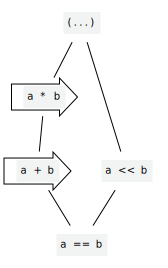

# Operator precedence

<!--
Part of the Carbon Language project, under the Apache License v2.0 with LLVM
Exceptions. See /LICENSE for license information.
SPDX-License-Identifier: Apache-2.0 WITH LLVM-exception
-->

[Pull request](https://github.com/carbon-language/carbon-lang/pull/555)

<!-- toc -->

## Table of contents

-   [Problem](#problem)
-   [Background](#background)
-   [Proposal](#proposal)
-   [Details](#details)
    -   [Notational convention](#notational-convention)
    -   [When to add precedence edges](#when-to-add-precedence-edges)
    -   [Parsing with a partial precedence order](#parsing-with-a-partial-precedence-order)
-   [Rationale based on Carbon's goals](#rationale-based-on-carbons-goals)
-   [Alternatives considered](#alternatives-considered)
    -   [Total order](#total-order)
    -   [Different precedence for different operands](#different-precedence-for-different-operands)
    -   [Require less than a partial order](#require-less-than-a-partial-order)

<!-- tocstop -->

## Problem

Most expression-oriented languages use a strict hierarchy of precedence levels.
That approach is error-prone, as it assigns meaning to programs that developers
may either not understand or may misunderstand.

## Background

Given an expression, we need to be able to infer its structure: what are the
operands of each of the operators? This may be ambiguous in the absence of rules
that determine which operator is preferred, such as in the expression
`a $ b ^ c`: is this `(a $ b) ^ c` or `a $ (b ^ c)`?

Starting with a sequence of operators and non-operator terms, we can completely
determine the structure of an expression by determining which operator in our
sequence will be the root of the parse tree, splitting the expression at that
point, and recursively determining the structure of each subexpression. The
operator that forms the root of the parse tree is said to have the lowest
precedence in the expression.

Traditionally, this is accomplished by assigning a precedence level to each
operator and devising a total ordering over precedence levels. For example, we
could assign a higher precedence level to an infix `*` operator than an infix
`+` operator. With that choice of precedence levels, an infix `*` operator would
bind tighter than an infix `+` operator, regardless of the order in which they
appear.

This approach is well-understood, but is problematic. For example, in C++,
expressions such as `a & b << c * 3` are valid, but the meaning of such an
expression is unlikely to be readily apparent to many developers. Worse, for
cases such as `a & 3 == 3`, there is a clear intended meaning, namely
`(a & 3) == 3`, but the actual meaning is something else -- in this case,
`a & (3 == 3)`.

Because the precedence rules are not widely known and are sometimes quite
surprising, parentheses are used as a matter of course for certain kinds of C++
expressions. However, the absence of such parentheses is not diagnosed in all
cases, even by many linting tools, and forgetting those parentheses can lead to
subtle bugs.

## Proposal

Do not have a total ordering of precedence levels. Instead, define a partial
ordering of precedence levels. Expressions using operators that lack relative
orderings must be disambiguated by the developer, for example by adding
parentheses; when a program's meaning depends on an undefined relative ordering
of two operators, it will be rejected due to ambiguity.

The default behavior for any new operator is for it to be unordered with respect
to all other operators, thereby requiring parentheses when combining that
operator with any other operator. Precedence rules should be added only if it is
reasonable to expect most or all developers who regularly use Carbon to reliably
remember the precedence rule.

## Details

### Notational convention

For pedagogical purposes, our documentation will use
[Hasse diagrams](https://en.wikipedia.org/wiki/Hasse_diagram) to represent
operator precedence partial orders, where operators with lower precedence are
considered less than (and therefore depicted lower than and connected to)
operators with higher precedence. In our diagrams, an enclosing arrow will be
used to show associativity within precedence groups, if there is any, with a
left-to-right arrow meaning a left-associative operator.

For example:

<div align="center">

</div>

... would depict a higher-precedence `*` operator and a lower-precedence `+`
operator, both of which are left-associative, and a non-associative `<<`
operator. The `==` operator is lower precedence than all of those operators, and
parentheses are higher precedence than all of those operators.

With those precedence rules:

-   `a + b * c` would be parsed as `a + (b * c)`, because `+` has lower
    precedence than `*`.
-   `a + b << c` would be an error, requiring parentheses, because the
    precedence levels of `+` and `<<` are unordered.

A [python script](p0555/figures.py) to generate these diagrams is included with
this proposal.

### When to add precedence edges

Given a program whose meaning is ambiguous to a reader, it is preferable to
reject the program rather than to arbitrarily pick a meaning. For Carbon's
operators, we should only add an ordering between two operators if there is a
logical reason for that ordering, not merely to provide _some_ answer. **Goal:
for every combination of operators, either it should be reasonable to expect
most or all developers who regularly use Carbon to reliably remember the
precedence, or there should not be a precedence rule.**

As an example, consider the expression `a * b ^ c`, where `*` is assumed to be a
multiplication operator and `^` is assumed to be a bitwise XOR operation. We
should reject this expression because there is no logical reason to perform
either operator first and it would be unreasonable to expect Carbon developers
to remember an arbitrary tie-breaker between the two options.

This still leaves open the question of how high a bar of knowledge we put on our
developers (what is reasonable for us to expect?). We can use experience from
C++ to direct this decision: just as many developers who regularly use C++ do
not remember the relative precedence of `&&` vs `||`, and `&` vs `|`, and `&` vs
`<<`, and so on, we shouldn't expect them to remember similar precedence rules
in Carbon. If we are in doubt, omitting a precedence rule and waiting for
real-world experience should be preferred.

### Parsing with a partial precedence order

A traditional, totally-ordered precedence scheme can be implemented by an
[operator precedence parser](https://en.wikipedia.org/wiki/Operator-precedence_parser):

-   Keep track of the current left-hand-side operand and an ambient precedence
    level. The ambient precedence level is the precedence of the operator whose
    operand is being parsed, or a placeholder "lowest" precedence level when
    parsing an expression that is not the operand of an operator.
-   When a new operator is encountered, its precedence is compared to the
    ambient precedence level:
    -   If its precedence is higher than the ambient precedence level, then
        recurse ("shift") with that as the new ambient precedence level to form
        the right-hand side of the new operator. After forming the right-hand
        side, build an operator expression from the current left-hand side
        operand and the right-hand side operand; that is the new current
        left-hand side.
    -   If its precedence is equal to the ambient precedence level, then use the
        associativity of that precedence level to determine what to do:
        -   If the operator is left-associative, build an operator expression.
        -   If the operator is right-associative, recurse.
        -   If the operator is non-associative, produce an error.
    -   If its precedence is lower than the ambient precedence level, return the
        expression formed so far; it's the complete operand to an earlier
        operator.

This is, for example, the strategy
[currently used in Clang](https://github.com/llvm/llvm-project/blob/5f0903e9bec97e67bf34d887bcbe9d05790de934/clang/lib/Parse/ParseExpr.cpp#L396).

The above algorithm is only suited to parsing in the case where precedence
levels are totally ordered, because it does not say what to do if the new
precedence is not comparable with the ambient precedence. However, the algorithm
can easily be adapted to also parse with a partial precedence order by adding
one more case:

-   If the precedence level of the new operator is not comparable with the
    ambient precedence level, produce an ambiguity error.

The key observation here is that, if we ever see `... a * b ^ c ...`, where `*`
and `^` have incomparable precedence, no later tokens can ever resolve the
ambiguity, so we can diagnose it immediately. Sketch proof: If there were a
valid parse tree for this expression, one of `*` and `^` must end up as an
ancestor of the other. But in a valid parse tree, along the path from one
operator to the other, precedences monotonically increase, so by transitivity of
the precedence partial ordering, the ancestor operator has lower precedence than
the descendent operator.

An operator precedence parser with a partial ordering of predecence levels
[has been implemented](https://github.com/carbon-language/carbon-lang/commit/b8afadb3c6af5e68192d585232fee759180ea1e3)
as a proof-of-concept in the Carbon toolchain.

Operator precedence partial ordering can also be implemented in yacc / bison
parser generators by using a variant of the
[precedence climbing method](https://en.wikipedia.org/wiki/Operator-precedence_parser#Precedence_climbing_method).
For example, here is a yacc grammar for the Hasse diagram shown above:

```
expression: compare_expression | compare_operand;

compare_expression: compare_lhs EQEQ compare_operand { $$ = ($1 == $3); };
compare_lhs: compare_expression | compare_operand;
compare_operand: add_expression | multiply_expression | shift_expression | primary_expression;

add_expression: add_lhs '+' add_operand { $$ = ($1 + $3); };
add_lhs: add_expression | add_operand;
add_operand: multiply_expression | multiply_operand;

multiply_expression: multiply_lhs '*' multiply_operand { $$ = ($1 * $3); };
multiply_lhs: multiply_expression | multiply_operand;
multiply_operand: primary_expression;

shift_expression: shift_lhs LSH shift_operand { $$ = ($1 << $3); };
shift_lhs: shift_expression | shift_operand;
shift_operand: primary_expression;

primary_expression: INT | '(' expression ')' { $$ = $2; };
```

Note that some care must be taken to avoid grammar ambiguities. Under the
precedence climbing method, a `primary_expression` would be a
`shift_expression`, a `multiply_expression`, and an `add_expression`, and
therefore interpreting a `primary_expression` as an `expression` would be
ambiguous: we could take either the `shift_expression` path or the
`multiply_expression` path through the grammar. The above formulation avoids
this ambiguity by excluding `primary_expression` from `add_expression` and
`shift_expression`, and instead listing it as a distinct production for
`compare_operand`. A yacc grammar such as the above can be produced
systematically for any precedence partial ordering.

A complete example of a yacc parser with operator precedence partial ordering is
available [alongside this proposal](p0555/yacc-parser).

## Rationale based on Carbon's goals

-   Software and language evolution

    -   The advice to not supply an operator precedence relationship if in doubt
        is based on the idea that it's easier to add a precedence rule as an
        evolutionary step than to remove one.

-   Code that is easy to read, understand, and write

    -   This proposal aims to support this goal by ensuring that the operator
        expressions that are used in programs are readily understood by
        practitioners, by making unreadable constructs invalid.

## Alternatives considered

### Total order

We could provide a total order over operator precedence. This proposal is not
strictly in conflict with doing so, if every ordering relationship is justified,
but in practice we expect there to be pairs of operators for which there is no
obvious precedence relationship.

For:

-   This is established practice across most languages.

Against:

-   This practice is a common source of bugs in the case where an arbitrary or
    bad choice is made.

### Different precedence for different operands

We could provide different precedence relationships for the left and right sides
of infix operators. For example, we could allow multiplication on the left of a
`<<` operator but not on the right. This is precedented in C++: the `?` in a
`?:` allows a comma operator on its right but not on its left.

For:

-   This may allow some additional cases that would be clear and unsurprising.

Against:

-   The resulting rules would be more challenging to learn, and it seems likely
    that they would fail the test that most developers who regularly use Carbon
    know the rules.

This proposal is not incompatible with adopting such a direction in future if we
find motivation to do so.

### Require less than a partial order

We could require something weaker than a partial ordering of precedence levels.
This proposal assumes the following two points are useful for human
comprehension of operator precedence:

-   The lowest-precedence operator does not depend on the relative order of
    operators in the expression (except as a tie-breaker when there are multiple
    operators with the same precedence, where the associativity of the operator
    is considered).
-   If an `^` expression can appear indirectly (but unparenthesized) within an
    `$` expression, then an `^` expression can appear directly within an `$`
    expression.
-   If the lowest-precedence operator in `a $ b ^ c` is `$`, and the
    lowest-precedence operator in `b ^ c # d` is `^`, then the lowest-precedence
    operator in `a $ b ^ c # d` is `$`.

These assumptions lead to the conclusion that operator precedence should form a
partial order over equivalence classes of operators. However, these assumptions
could be wrong.

If we find motivation to select rules that violate the above assumptions, we
should reconsider the approach of using a partial precedence ordering, but no
motivating case is currently known.
