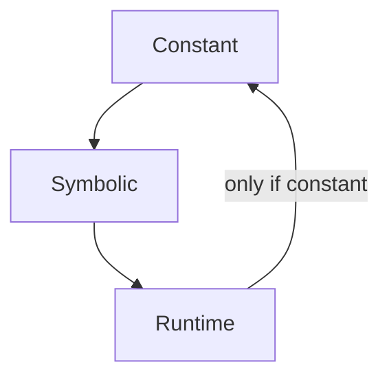

# Evaluation phases

<!--
Part of the Carbon Language project, under the Apache License v2.0 with LLVM
Exceptions. See /LICENSE for license information.
SPDX-License-Identifier: Apache-2.0 WITH LLVM-exception
-->

[Pull request](https://github.com/carbon-language/carbon-lang/pull/1935)

<!-- toc -->

## Table of contents

-   [Problem](#problem)
-   [Background](#background)
-   [Proposal](#proposal)
-   [Details](#details)
    -   [Phases](#phases)
    -   [Conversions](#conversions)
    -   [What are symbolic values?](#what-are-symbolic-values)
    -   [Examples](#examples)
-   [Rationale](#rationale)
-   [Alternatives considered](#alternatives-considered)
    -   [Replace the single-step equality rule with a transitive rule](#replace-the-single-step-equality-rule-with-a-transitive-rule)

<!-- tocstop -->

## Problem

Carbon's generics system treats different ways of naming the same type as being
distinct, with a single-step equality rule:

```carbon
interface Sized {
  let Size:! i32;
}
interface HasList {
  let List:! Type;
}
fn Make(T:! Type) -> T;

class MyArray(T:! Type, N:! i32) {}

fn F(T:! Sized where .Size == 4,
     U:! HasList where .List == MyArray(i32, 4)) {
  // ✅ MyArray(i32, T.Size) is one "step" away from MyArray(i32, 4),
  // using "T.Size == 4" from the `where` clause.
  let ok1: MyArray(i32, T.Size) = Make(MyArray(i32, 4));

  // ✅ MyArray(i32, 4) is one "step" away from U.List,
  // using "U.List == MyArray(i32, 4)" from the `where` clause.
  let ok2: MyArray(i32, 4) = Make(U.List);

  // ❌ Error, this would require using two `==` steps in sequence.
  let two_steps: MyArray(i32, T.Size) = Make(U.List);
}
```

However, it's always clear which operations preserve the symbolic identity of
values and which operations lose them:

```carbon
  // Are these types one step apart? What symbolic types are being compared?
  let unclear1: MyArray(i32, T.Size + 1) = Make(MyArray(i32, 5));
```

```carbon
  // Is this value retained symbolically as "T.Size" or is it resolved to 4?
  let n:! i32 = T.Size;
  // If `n` is symbolically "T.Size", then this is the same as `two_steps`
  // above, and should be rejected.
  // If `n` is resolved to the value `4`, then this is the same as `ok2`
  // above, and should be accepted.
  let unclear2: MyArray(i32, n) = Make(U.List);
```

We need rules to determine what happens in these cases. When are associated
constants resolved to concrete values, and when are values retained
symbolically?

## Background

Carbon's approach to associated constants was introduced in
[#731, generics details 2](https://github.com/carbon-language/carbon-lang/pull/731).

The
[manual type equality](https://github.com/carbon-language/carbon-lang/blob/trunk/docs/design/generics/details.md#manual-type-equality)
rule, described above as single-step equality, was introduced in
[#818, generics details 3](https://github.com/carbon-language/carbon-lang/pull/818).

## Proposal

Each expression and each context in which an expression can appear has an
associated phase -- constant, symbolic, or runtime -- that describes how the
expression is evaluated and what kind of value is produced. Expressions can be
converted from an earlier phase to a later phase, but conversion in the opposite
direction is permitted only if constant evaluation is possible.

## Details

### Phases

This proposal introduces the notion of expressions having an _evaluation phase_.
There are three different evaluation phases:

-   _Constant_: A constant-phase expression is an expression whose value is
    known during type-checking. These include literals and template parameters.

-   _Symbolic_: A symbolic expression is an expression whose value is known
    symbolically but not literally. For example, if `T:! Foo` is a generic
    parameter, then the expression `T` is symbolic, as is the expression
    `MyArray(T, 5)`, and if `Foo` is an interface with an associated constant
    `Bar`, then `T.Bar` is symbolic.

-   _Runtime_: A runtime expression is an expression whose value is not known
    ahead of time, or whose evaluation has runtime side-effects.

The phase of an expression is determined by its syntactic form and its static
properties, such as the types of its operands and the result of name lookup.

Each context in which an expression can appear also has an associated phase:

-   For a `template Param:! SomeType` binding, the corresponding initializer is
    a constant context.

-   For a `Param:! SomeType` binding, the corresponding initializer is a
    symbolic context. Type contexts, such as the right-hand side of
    `local_var: MyType`, are also symbolic contexts.

-   Other places where an expression can appear are runtime contexts. For
    example, initializers for `name: Type` bindings, function return values, and
    the condition of an `if`.

### Conversions

An expression context requires an expression with a matching phase. If an
expression of a different phase is provided, a minimal sequence of necessary
_phase conversions_ is performed:



-   _Constant to symbolic_: A constant-phase expression can be converted to a
    symbolic-phase expression. The result is a symbolic expression whose value
    is the constant value of the expression. For example:

    ```carbon
    class HasBound(N:! i32) {}
    // Constant-phase expression `3` converted to symbolic expression with
    // symbolic identity `3`.
    var n: HasBound(3);
    ```

-   _Symbolic to runtime_: A symbolic expression can be converted to a runtime
    expression. For example:

    ```carbon
    interface Vector {
      let Dim:! i32;
    }
    fn Add3dVectors[T:! Vector where .Dim == 3](a: T, b: T) -> T {
      // `T.Dim` is converted from symbolic to runtime when passed as an
      // argument to `Print`.
      Print("size is {0}", T.Dim);
    }
    ```

    For an interface member such as an associated constant, this conversion
    resolves the value to the corresponding value in the `impl`. For a symbolic
    type such as `MyArray(T, 5)`, this conversion resolves the type by
    substituting in the value of `T`.

    Note that this conversion is lossy: the symbolic representation of the value
    of the expression is lost.

-   _Runtime to constant_: Runtime and symbolic phase expressions cannot in
    general be converted to constant phase expressions. However, if the
    expression can be evaluated to a constant, this conversion is permitted.

    ```carbon
    fn F(template N:! i32);
    fn G(n: i32) {
      // `2 * 3` is a runtime expression, but it is permitted in a constant
      // context because it can be evaluated to the constant `6`.
      F(2 * 3);
      // `2 * n` is a runtime expression and is rejected in this constant
      // context because it cannot be converted to a constant expression,
      // because the value of `n` is not known.
      F(2 * n);
    }
    ```

    This proposal does not specify rules for what is permitted in a constant
    expression in Carbon. One notable question we leave open is whether a local
    `:` binding is usable:

    ```carbon
    fn H() {
      let n: i32 = 5;
      // OK?
      F(n);
    }
    ```

Following a complete cycle in this diagram from a phase to itself is not a no-op
in general. In particular, symbolic values will be resolved to concrete,
non-symbolic representations.

```
class MyArray(T:! Type, N:! Size) {}
fn Cycle(T:! Sized where .Size == 4,
         U:! HasList where .List == MyArray(i32, T.Size)) {
  // ✅ `MyArray(i32, T.Size)` is one "step" away from `U.List`.
  let a: MyArray(i32, T.Size) = Make(U.List);

  // ❌ `T.Size + 0` converts `T.Size` from symbolic to the runtime
  // value 4. Use of the result as the argument for the symbolic `N`
  // binding produces the type `MyArray(i32, 4)`, which is two "steps"
  // away from `U.List`.
  let b: MyArray(i32, T.Size + 0) = Make(U.List);
}
```

### What are symbolic values?

A symbolic value is one of the following:

-   A constant, such as `5` or `i32`.
-   A name of a generic parameter, such as `T`.
-   A parameterized entity such as a class, interface, or adapter, such as
    `Array(T, 5)`.
-   An interface member, such as an associated constant, for example `T.Size`.

### Examples

The examples from the [problem](#problem) section are resolved as follows:

```carbon
// ✅ OK
let unclear1: MyArray(i32, T.Size + 1) = Make(MyArray(i32, 5));
```

This example is interpreted as follows:

-   The operand of `+` is a runtime context, so `T.Size` is resolved to 4,
    resulting in the runtime expression `4 + 1`.
-   The runtime expression `4 + 1` is used in a symbolic context, so constant
    evaluation is attempted, which succeeds, resulting in the value 5. The
    constant 5 is then converted to a symbolic representation, which is a no-op.
-   The symbolic type of `unclear1` is then `MyArray(i32, 5)`, which matches the
    type of the initializer.

```carbon
// ✅ OK
let n:! i32 = T.Size;
let unclear2: MyArray(i32, n) = Make(U.List);
```

This example is interpreted as follows:

-   The initializer of `n` is a symbolic context, so the symbolic expression
    `T.Size` produces a symbolic value.
-   The symbolic type of `unclear2` is then `MyArray(i32, 5)`, which matches the
    type of the initializer.

A similar example with a `:` binding is, however, not valid:

```carbon
// ❌ Error
let m: i32 = T.Size;
let unclear3: MyArray(i32, m) = Make(U.List);
```

This example is interpreted as follows:

-   The initializer of `m` is a runtime context, so the symbolic expression
    `T.Size` is converted to a runtime expression that extracts the value of the
    associated constant.
-   The use of the runtime expression `m` in a symbolic context in
    `MyArray(i32, m)` causes a conversion from runtime to constant phase. There
    are then two possibilities:
    -   If we allow the use of local `:` bindings in constant evaluation, that
        conversion succeeds and produces the value `4` because the value of the
        associated constant is known to be `4` in this context. A no-op
        constant-to-symbolic conversion is then applied. But the initialization
        fails because the type of `unclear3` is `MyArray(i32, 4)`, not
        `MyArray(i32, T.Size)`.
    -   If we disallow the use of local `:` bindings in constant evaluation,
        that conversion fails because constant evaluation fails.

## Rationale

This proposal aims to fill a specification gap in the single-step generics type
equality rule. As such, it is motivated by the same goals as
[#818](https://github.com/carbon-language/carbon-lang/pull/818), which
introduced the rule.

## Alternatives considered

### Replace the single-step equality rule with a transitive rule

If type equality were transitive, we would not need to be careful about which
operations preserve symbolic representations of types and which operations
resolve symbolic types to concrete types. For example, if it's known that
`T.Size` is `4`, then under a transitive type equality rule, it doesn't matter
whether we represent an array bound as `T.Size` or as `4`, because comparing the
resulting type against an equal type will succeed regardless of the
representation.

This choice was previously considered in #818. We may wish to reconsider it now
that we have a better understanding of what is required to make the single-step
equality rule work.
