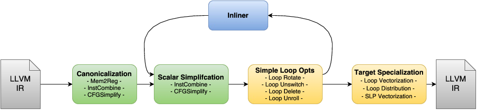
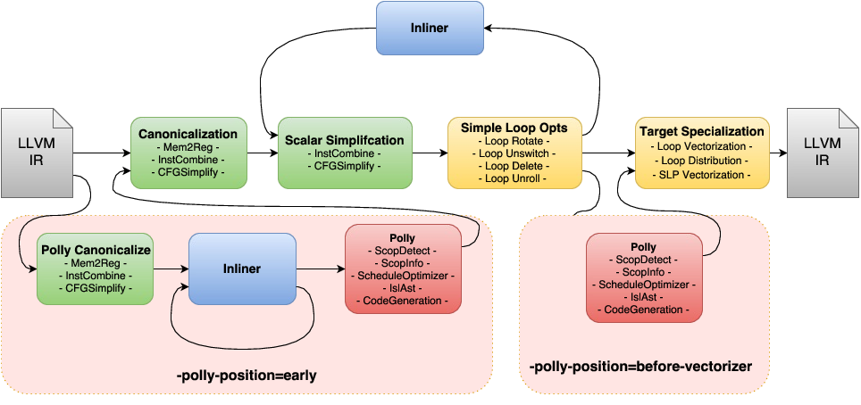
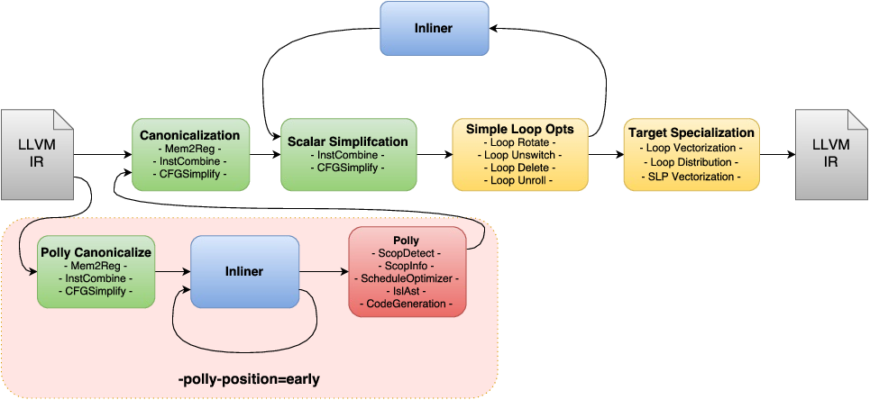
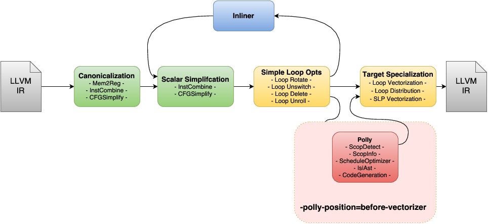

================
The Architecture
================

Polly is a loop optimizer for LLVM. Starting from LLVM-IR it detects and
extracts interesting loop kernels. For each kernel a mathematical model is
derived which precisely describes the individual computations and memory
accesses in the kernels. Within Polly a variety of analysis and code
transformations are performed on this mathematical model. After all
optimizations have been derived and applied, optimized LLVM-IR is regenerated
and inserted into the LLVM-IR module.

.. image:: images/architecture.png
    :align: center

Polly in the LLVM pass pipeline
-------------------------------

The standard LLVM pass pipeline as it is used in -O1/-O2/-O3 mode of clang/opt
consists of a sequence of passes that can be grouped in different conceptual
phases. The first phase, we call it here **Canonicalization**, is a scalar
canonicalization phase that contains passes like -mem2reg, -instcombine,
-cfgsimplify, or early loop unrolling. It has the goal of removing and
simplifying the given IR as much as possible focusing mostly on scalar
optimizations. The second phase consists of three conceptual groups that  are
executed in the so-called **Inliner cycle**, This is again a set of **Scalar
Simplification** passes, a set of **Simple Loop Optimizations**, and the
**Inliner** itself. Even though these passes make up the majority of the LLVM
pass pipeline, the primary goal of these passes is still canonicalization
without loosing semantic information that complicates later analysis. As part of
the inliner cycle, the LLVM inliner step-by-step tries to inline functions, runs
canonicalization passes to exploit newly exposed simplification opportunities,
and then tries to inline the further simplified functions. Some simple loop
optimizations are executed as part of the inliner cycle. Even though they
perform some optimizations, their primary goal is still the simplification of
the program code. Loop invariant code motion is one such optimization that
besides being beneficial for program performance also allows us to move
computation out of loops and in the best case enables us to eliminate certain
loops completely.  Only after the inliner cycle has been finished, a last
**Target Specialization** phase is run, where IR complexity is deliberately
increased to take advantage of target specific features that maximize the
execution performance on the device we target. One of the principal
optimizations in this phase is vectorization, but also target specific loop
unrolling, or some loop transformations (e.g., distribution) that expose more
vectorization opportunities.

Polly can conceptually be run at three different positions in the pass pipeline.
As an early optimizer before the standard LLVM pass pipeline, as a later
optimizer as part of the target specialization sequence, and theoretically also
with the loop optimizations in the inliner cycle. We only discuss the first two
options, as running Polly in the inline loop, is likely to disturb the inliner
and is consequently not a good idea.

Running Polly early before the standard pass pipeline has the benefit that the
LLVM-IR processed by Polly is still very close to the original input code.
Hence, it is less likely that transformations applied by LLVM change the IR in
ways not easily understandable for the programmer. As a result, user feedback is
likely better and it is less likely that kernels that in C seem a perfect fit
for Polly have been transformed such that Polly can not handle them any
more. On the other hand, codes that require inlining to be optimized won't
benefit if Polly is scheduled at this position. The additional set of
canonicalization passes required will result in a small, but general compile
time increase and some random run-time performance changes due to slightly
different IR being passed through the optimizers. To force Polly to run early in
the pass pipeline use the option *-polly-position=early* (default today).

Running Polly right before the vectorizer has the benefit that the full inlining
cycle has been run and as a result even heavily templated C++ code could
theoretically benefit from Polly (more work is necessary to make Polly here
really effective). As the IR that is passed to Polly has already been
canonicalized, there is also no need to run additional canonicalization passes.
General compile time is almost not affected by Polly, as detection of loop
kernels is generally very fast and the actual optimization and cleanup passes
are only run on functions which contain loop kernels that are worth optimizing.
However, due to the many optimizations that LLVM runs before Polly the IR that
reaches Polly often has additional scalar dependences that make Polly a lot less
efficient. To force Polly to run before the vectorizer in the pass pipleline use
the option *-polly-position=before-vectorizer*. This position is not yet the
default for Polly, but work is on its way to be effective even in presence of
scalar dependences. After this work has been completed, Polly will likely use
this position by default.

