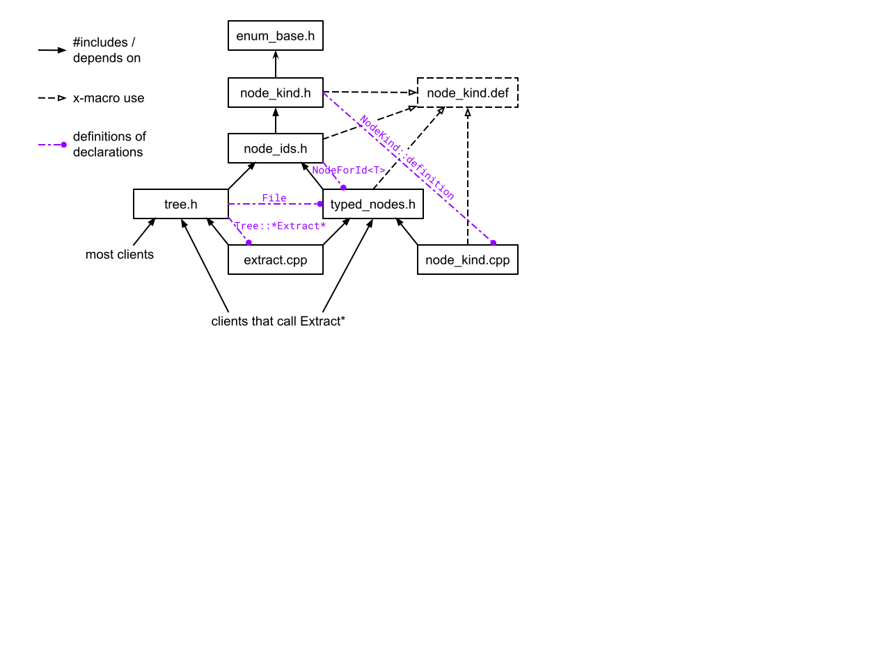

# Adding features

<!--
Part of the Carbon Language project, under the Apache License v2.0 with LLVM
Exceptions. See /LICENSE for license information.
SPDX-License-Identifier: Apache-2.0 WITH LLVM-exception
-->

<!-- toc -->

## Table of contents

-   [Lex](#lex)
-   [Parse](#parse)
    -   [Typed parse node metadata implementation](#typed-parse-node-metadata-implementation)
-   [Check](#check)
    -   [SemIR typed instruction metadata implementation](#semir-typed-instruction-metadata-implementation)
-   [Lower](#lower)
-   [Tests and debugging](#tests-and-debugging)
    -   [Running tests](#running-tests)
    -   [Updating tests](#updating-tests)
        -   [Reviewing test deltas](#reviewing-test-deltas)
    -   [Verbose output](#verbose-output)
    -   [Stack traces](#stack-traces)

<!-- tocstop -->

## Lex

New lexed tokens must be added to
[token_kind.def](/toolchain/lex/token_kind.def). `CARBON_SYMBOL_TOKEN` and
`CARBON_KEYWORD_TOKEN` both provide some built-in lexing logic, while
`CARBON_TOKEN` requires custom lexing support.

[TokenizedBuffer::Lex](/toolchain/lex/tokenized_buffer.h) is the main dispatch
for lexing, and calls that need to do custom lexing will be dispatched there.

## Parse

A parser feature will have state transitions that produce new parse nodes.

The resulting parse nodes are in
[parse/node_kind.def](/toolchain/parse/node_kind.def) and
[typed_nodes.h](/toolchain/parse/typed_nodes.h). When choosing node structure,
consider how semantics will process it in post-order; this will rule out some
designs. Adding a parse node kind will also require a handler in the `Check`
step.

The state transitions are in [parse/state.def](/toolchain/parse/state.def). Each
`CARBON_PARSER_STATE` defines a distinct state and has comments for state
transitions. If several states should share handling, name them
`FeatureAsVariant`.

Adding a state requires adding a `Handle<name>` function in an appropriate
`parse/handle_*.cpp` file, possibly a new file. The macros are used to generate
declarations in the header, so only extra helper functions should be added
there. Every state handler pops the state from the stack before any other
processing.

### Typed parse node metadata implementation

As of [#3534](https://github.com/carbon-language/carbon-lang/pull/3534):



> TODO: Convert this chart to Mermaid.

-   [common/enum_base.h](/common/enum_base.h) defines the `EnumBase`
    [CRTP](idioms.md#crtp-or-curiously-recurring-template-pattern) class
    extending `Printable` from [common/ostream.h](/common/ostream.h), along with
    `CARBON_ENUM` macros for making enumerations

-   [parse/node_kind.h](/toolchain/parse/node_kind.h) includes
    [common/enum_base.h](/common/enum_base.h) and defines an enumeration
    `NodeKind`, along with bitmask enum `NodeCategory`.

    -   The `NodeKind` enumeration is populated with the list of all parse node
        kinds using [parse/node_kind.def](/toolchain/parse/node_kind.def) (using
        [the .def file idiom](idioms.md#def-files)) _declared_ in this file
        using a macro from [common/enum_base.h](/common/enum_base.h)

    -   `NodeKind` has a member type `NodeKind::Definition` that extends
        `NodeKind` and adds a `NodeCategory` field (and others in the future).

    -   `NodeKind` has a method `Define` for creating a `NodeKind::Definition`
        with the same enumerant value, plus values for the other fields.

    -   `HasKindMember<T>` at the bottom of
        [parse/node_kind.h](/toolchain/parse/node_kind.h) uses
        [field detection](idioms.md#field-detection) to determine if the type
        `T` has a `NodeKind::Definition Kind` static constant member.

        -   Note: both the type and name of these fields must match exactly.

    -   Note that additional information is needed to define the `category()`
        method (and other methods in the future) of `NodeKind`. This information
        comes from the typed parse node definitions in
        [parse/typed_nodes.h](/toolchain/parse/typed_nodes.h) (described below).

-   [parse/node_ids.h](/toolchain/parse/node_ids.h) defines a number of types
    that store a _node id_ that identifies a node in the parse tree

    -   `NodeId` stores a node id with no restrictions

    -   `NodeIdForKind<Kind>` inherits from `NodeId` and stores the id of a node
        that must have the specified `NodeKind` "`Kind`". Note that this is not
        used directly, instead aliases `FooId` for
        `NodeIdForKind<NodeKind::Foo>` are defined for every node kind using
        [parse/node_kind.def](/toolchain/parse/node_kind.def) (using
        [the .def file idiom](idioms.md#def-files)).

    -   `NodeIdInCategory<Category>` inherits from `NodeId` and stores the id of
        a node that must overlap the specified `NodeCategory` "`Category`". Note
        that this is not typically used directly, instead this file defines
        aliases `AnyDeclId`, `AnyExprId`, ..., `AnyStatementId`.

    -   Similarly `NodeIdOneOf<T, U>` and `NodeIdNot<V>` inherit from `NodeId`
        and stores the id of a node restricted to either matching `T::Kind` or
        `U::Kind` or not matching `V::Kind`.
    -   In addition to the node id type definitions above, the struct
        `NodeForId<T>` is declared but not defined.

-   [parse/typed_nodes.h](/toolchain/parse/typed_nodes.h) defines a typed parse
    node struct type for each kind of parse node.

    -   Each one defines a static constant named `Kind` that is set using a call
        to `Define()` on the corresponding enumerant member of `NodeKind` from
        [parse/node_kind.h](/toolchain/parse/node_kind.h) (which is included by
        this file).
    -   The fields of these types specify the children of the parse node using
        the types from [parse/node_ids.h](/toolchain/parse/node_ids.h).

    -   The struct `NodeForId<T>` that is declared in
        [parse/node_ids.h](/toolchain/parse/node_ids.h) is defined in this file
        such that `NodeForId<FooId>::TypedNode` is the `Foo` typed parse node
        struct type.

    -   This file will fail to compile unless every kind of parse node kind
        defined in [parse/node_kind.def](/toolchain/parse/node_kind.def) has a
        corresponding struct type in this file.

-   [parse/node_kind.cpp](/toolchain/parse/node_kind.cpp) includes both
    [parse/node_kind.h](/toolchain/parse/node_kind.h) and
    [parse/typed_nodes.h](/toolchain/parse/typed_nodes.h)

    -   Uses the macro from [common/enum_base.h](/common/enum_base.h), the
        enumerants of `NodeKind` are _defined_ using the list of parse node
        kinds from [parse/node_kind.def](/toolchain/parse/node_kind.def) (using
        [the .def file idiom](idioms.md#def-files)).

    -   `NodeKind::definition()` is defined. It has a static table of
        `const NodeKind::Definition*` indexed by the enum value, populated by
        taking the address of the `Kind` member of each typed parse node struct
        type, using the list from
        [parse/node_kind.def](/toolchain/parse/node_kind.def).

    -   `NodeKind::category()` is defined using `NodeKind::definition()`.

    -   Tested assumption: the tables built in this file are indexed by the enum
        values. We rely on the fact that we get the parse node kinds in the same
        order by consistently using
        [parse/node_kind.def](/toolchain/parse/node_kind.def).

-   [parse/tree.h](/toolchain/parse/tree.h) includes
    [parse/node_ids.h](/toolchain/parse/node_ids.h). It does not depend on
    [parse/typed_nodes.h](/toolchain/parse/typed_nodes.h) to reduce compilation
    time in those files that don't use the typed parse node struct types.

    -   Defines `Tree::Extract`... functions that take a node id and return a
        typed parse node struct type from
        [parse/typed_nodes.h](/toolchain/parse/typed_nodes.h).

    -   Uses `HasKindMember<T>` to restrict calling `ExtractAs` except on typed
        nodes defined in [parse/typed_nodes.h](/toolchain/parse/typed_nodes.h).

    -   `Tree::Extract` uses `NodeForId<T>` to get the corresponding typed parse
        node struct type for a `FooId` type defined in
        [parse/node_ids.h](/toolchain/parse/node_ids.h).

        -   Note that this is done without a dependency on the typed parse node
            struct types by using the forward declaration of `NodeForId<T>` from
            [parse/node_ids.h](/toolchain/parse/node_ids.h).

    -   The `Tree::Extract`... functions ultimately call
        `Tree::TryExtractNodeFromChildren<T>`, which is a templated function
        only declared in this file. Its definition is in
        [parse/extract.cpp](/toolchain/parse/extract.cpp).

-   [parse/extract.cpp](/toolchain/parse/extract.cpp) includes
    [parse/tree.h](/toolchain/parse/tree.h) and
    [parse/typed_nodes.h](/toolchain/parse/typed_nodes.h)

    -   Defines struct `Extractable<T>` that defines how to extract a field of
        type `T` from a `Tree::SiblingIterator` pointing at the corresponding
        child node.

    -   `Extractable<T>` is defined for the node id types defined in
        [parse/node_ids.h](/toolchain/parse/node_ids.h).

    -   In addition, `Extractable<T>` is defined for standard types
        `std::optional<U>` and `llvm::SmallVector<V>`, to support optional and
        repeated children.

    -   Uses [struct reflection](idioms.md#struct-reflection) to support
        aggregate struct types containing extractable fields. This is used to
        support typed parse node struct types as well as struct fields that they
        contain.

    -   Uses `HasKindMember<Foo>` to detect accidental uses of a parse node type
        directly as fields of typed parse node struct types -- in those places
        `FooId` should be used instead.

    -   Defines `Tree::TryExtractNodeFromChildren<T>` and explicitly
        instantiates it for every typed parse node struct type defined in
        [parse/typed_nodes.h](/toolchain/parse/typed_nodes.h) using
        [parse/node_kind.def](/toolchain/parse/node_kind.def) (using
        [the .def file idiom](idioms.md#def-files)). By explicitly instantiating
        this function only in this file, we avoid redundant compilation work,
        which reduces build times, and allow us to keep all the extraction
        machinery as a private implementation detail of this file.

-   [parse/typed_nodes_test.cpp](/toolchain/parse/typed_nodes_test.cpp)
    validates that each typed parse node struct type has a static `Kind` member
    that defines the correct corresponding `NodeKind`, and that the `category()`
    function agrees between the `NodeKind` and `NodeKind::Definition`.

Note: this is broadly similar to
[SemIR typed instruction metadata implementation](#semir-typed-instruction-metadata-implementation).

## Check

Each parse node kind requires adding a `Handle<kind>` function in a
`check/handle_*.cpp` file.

If the resulting SemIR needs a new instruction:

-   add a new kind to [sem_ir/inst_kind.def](/toolchain/sem_ir/inst_kind.def)
    -   Add a `CARBON_SEM_IR_INST_KIND(NewInstKindName)` line in alphabetical
        order
-   a new struct definition to
    [sem_ir/typed_insts.h](/toolchain/sem_ir/typed_insts.h), such as:

    ```cpp
    struct NewInstKindName {
        static constexpr auto Kind = InstKind::NewInstKindName.Define(
            // the name used in textual IR
            "new_inst_kind_name"
            // Optional: , TerminatorKind::KindOfTerminator
            );

        // Optional: omit if not associated with a parse node.
        Parse::Node parse_node;

        // Optional: omit if this sem_ir instruction does not produce a value.
        TypeId type_id;

        // 0-2 id fields, with types from sem_ir/ids.h or sem_ir/builtin_kind.h
        // For example, fields would look like:
        StringId name_id;
        InstId value_id;
    };
    ```

Adding an instruction will also require a handler in the Lower step.

Most new instructions will automatically be formatted reasonably by the SemIR
formatter.

If the resulting SemIR needs a new built-in, add it to
[builtin_inst_kind.def](/toolchain/sem_ir/builtin_inst_kind.def).

### SemIR typed instruction metadata implementation

How does this work? As of
[#3310](https://github.com/carbon-language/carbon-lang/pull/3310):


> TODO: Convert this chart to Mermaid.

-   [common/enum_base.h](/common/enum_base.h) defines the `EnumBase`
    [CRTP](idioms.md#crtp-or-curiously-recurring-template-pattern) class
    extending `Printable` from [common/ostream.h](/common/ostream.h), along with
    `CARBON_ENUM` macros for making enumerations

-   [sem_ir/inst_kind.h](/toolchain/sem_ir/inst_kind.h) includes
    [common/enum_base.h](/common/enum_base.h) and defines an enumeration
    `InstKind`, along with `InstValueKind` and `TerminatorKind`.

    -   The `InstKind` enumeration is populated with the list of all instruction
        kinds using [sem_ir/inst_kind.def](/toolchain/sem_ir/inst_kind.def)
        (using [the .def file idiom](idioms.md#def-files)) _declared_ in this
        file using a macro from [common/enum_base.h](/common/enum_base.h)

    -   `InstKind` has a member type `InstKind::Definition` that extends
        `InstKind` and adds the `ir_name` string field, and a `TerminatorKind`
        field.

    -   `InstKind` has a method `Define` for creating a `InstKind::Definition`
        with the same enumerant value, plus values for the other fields.

-   Note that additional information is needed to define the `ir_name()`,
    `value_kind()`, and `terminator_kind()` methods of `InstKind`. This
    information comes from the typed instruction definitions in
    [sem_ir/typed_insts.h](/toolchain/sem_ir/typed_insts.h).

-   [sem_ir/typed_insts.h](/toolchain/sem_ir/typed_insts.h) defines a typed
    instruction struct type for each kind of SemIR instruction, as described
    above.

    -   Each one defines a static constant named `Kind` that is set using a call
        to `Define()` on the corresponding enumerant member of `InstKind` from
        [sem_ir/inst_kind.h](/toolchain/sem_ir/inst_kind.h) (which is included
        by this file).

-   `HasParseNodeMember<TypedInst>` and `HasTypeIdMember<TypedInst>` at the
    bottom of [sem_ir/typed_insts.h](/toolchain/sem_ir/typed_insts.h) use
    [field detection](idioms.md#field-detection) to determine if `TypedInst` has
    a `Parse::Node parse_node` or a `TypeId type_id` field respectively.

    -   Note: both the type and name of these fields must match exactly.

-   [sem_ir/inst_kind.cpp](/toolchain/sem_ir/inst_kind.cpp) includes both
    [sem_ir/inst_kind.h](/toolchain/sem_ir/inst_kind.h) and
    [sem_ir/typed_insts.h](/toolchain/sem_ir/typed_insts.h)

    -   Uses the macro from [common/enum_base.h](/common/enum_base.h), the
        enumerants of `InstKind` are _defined_ using the list of instruction
        kinds from [sem_ir/inst_kind.def](/toolchain/sem_ir/inst_kind.def)
        (using [the .def file idiom](idioms.md#def-files))

    -   `InstKind::value_kind()` is defined. It has a static table of
        `InstValueKind` values indexed by the enum value, populated by applying
        `HasTypeIdMember` from
        [sem_ir/typed_insts.h](/toolchain/sem_ir/typed_insts.h) to every
        instruction kind by using the list from
        [sem_ir/inst_kind.def](/toolchain/sem_ir/inst_kind.def).
    -   `InstKind::definition()` is defined. It has a static table of
        `const InstKind::Definition*` indexed by the enum value, populated by
        taking the address of the `Kind` member of each `TypedInst`, using the
        list from [sem_ir/inst_kind.def](/toolchain/sem_ir/inst_kind.def).

    -   `InstKind::ir_name()` and `InstKind::terminator_kind()` are defined
        using `InstKind::definition()`.
    -   Tested assumption: the tables built in this file are indexed by the enum
        values. We rely on the fact that we get the instruction kinds in the
        same order by consistently using
        [sem_ir/inst_kind.def](/toolchain/sem_ir/inst_kind.def).

    -   This file will fail to compile unless every kind of SemIR instruction
        defined in [sem_ir/inst_kind.def](/toolchain/sem_ir/inst_kind.def) has a
        corresponding struct type in
        [sem_ir/typed_insts.h](/toolchain/sem_ir/typed_insts.h).

-   `TypedInstArgsInfo<TypedInst>` defined in
    [sem_ir/inst.h](/toolchain/sem_ir/inst.h) uses
    [struct reflection](idioms.md#struct-reflection) to determine the other
    fields from `TypedInst`. It skips the `parse_node` and `type_id` fields
    using `HasParseNodeMember<TypedInst>` and `HasTypeIdMember<TypedInst>`.

    -   Tested assumption: the `parse_node` and `type_id` are the first fields
        in `TypedInst`, and there are at most two more fields.

-   [sem_ir/inst.h](/toolchain/sem_ir/inst.h) defines templated conversions
    between `Inst` and each of the typed instruction structs:

    -   Uses `TypedInstArgsInfo<TypedInst>`, `HasParseNodeMember<TypedInst>`,
        and `HasTypeIdMember<TypedInst>`, and
        [local lambda](idioms.md#local-lambdas-to-reduce-duplicate-code).

    -   Defines a templated `ToRaw` function that converts the various id field
        types to an `int32_t`.
    -   Defines a templated `FromRaw<T>` function that converts an `int32_t` to
        `T` to perform the opposite conversion.
    -   Tested assumption: The `parse_node` field is first, when present, and
        the `type_id` is next, when present, in each `TypedInst` struct type.

-   The "tested assumptions" above are all tested by
    [sem_ir/typed_insts_test.cpp](/toolchain/sem_ir/typed_insts_test.cpp)

## Lower

Each SemIR instruction requires adding a `Handle<kind>` function in a
`lower/handle_*.cpp` file.

## Tests and debugging

### Running tests

Tests are run in bulk as `bazel test //toolchain/...`. Many tests are using the
file_test infrastructure; see
[testing/file_test/README.md](/testing/file_test/README.md) for information.

There are several supported ways to run Carbon on a given test file. For
example, with `toolchain/parse/testdata/basics/empty.carbon`:

-   `bazel test //toolchain/testing:file_test --test_arg=--file_tests=toolchain/parse/testdata/basics/empty.carbon`
    -   Executes an individual test.
-   `bazel run //toolchain/parse:testdata/basics/empty.carbon.run`
    -   Runs `carbon` on the file with standard arguments, printing output to
        console.
    -   This form will often be most useful when iterating over a specific test.
-   `bazel run //toolchain/parse:testdata/basics/empty.carbon.verbose`
    -   Similar to the previous command, but with the `-v` flag implied.
-   `bazel run //toolchain/driver:carbon -- compile --phase=parse --dump-parse-tree toolchain/parse/testdata/basics/empty.carbon`
    -   Explicitly runs `carbon` with the provided arguments.
-   `bazel-bin/toolchain/driver/carbon compile --phase=parse --dump-parse-tree toolchain/parse/testdata/basics/empty.carbon`
    -   Similar to the previous command, but without using `bazel`.

### Updating tests

The `toolchain/autoupdate_testdata.py` script can be used to update output. It
invokes the `file_test` autoupdate support. See
[testing/file_test/README.md](/testing/file_test/README.md) for file syntax.

#### Reviewing test deltas

Using `autoupdate_testdata.py` can be useful to produce deltas during the
development process because it allows `git status` and `git diff` to be used to
examine what changed.

### Verbose output

The `-v` flag can be passed to trace state, and should be specified before the
subcommand name: `carbon -v compile ...`. `CARBON_VLOG` is used to print output
in this mode. There is currently no control over the degree of verbosity.

### Stack traces

While the iterative processing pattern means function stack traces will have
minimal context for how the current function is reached, we use LLVM's
`PrettyStackTrace` to include details about the state stack. The state stack
will be above the function stack in crash output.
