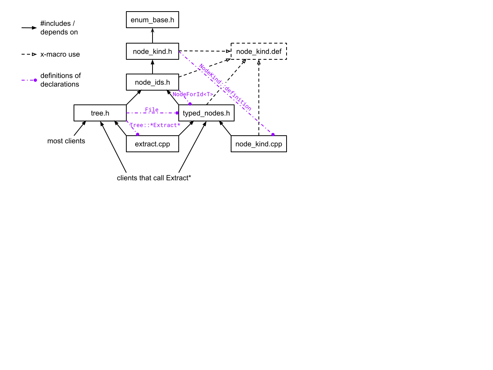

# Adding features

<!--
Part of the Carbon Language project, under the Apache License v2.0 with LLVM
Exceptions. See /LICENSE for license information.
SPDX-License-Identifier: Apache-2.0 WITH LLVM-exception
-->

<!-- toc -->

## Table of contents

-   [Lex](#lex)
-   [Parse](#parse)
    -   [Typed parse node metadata implementation](#typed-parse-node-metadata-implementation)
-   [Check](#check)
    -   [Adding a new SemIR instruction](#adding-a-new-semir-instruction)
    -   [SemIR typed instruction metadata implementation](#semir-typed-instruction-metadata-implementation)
-   [Lower](#lower)
-   [Tests and debugging](#tests-and-debugging)
    -   [Running tests](#running-tests)
    -   [Updating tests](#updating-tests)
        -   [Reviewing test deltas](#reviewing-test-deltas)
    -   [Minimal Core prelude](#minimal-core-prelude)
    -   [Debugging ASAN Poisoning](#debugging-asan-poisoning)
        -   [Non-determinism in the poison log](#non-determinism-in-the-poison-log)
    -   [Verbose output](#verbose-output)
    -   [Stack traces](#stack-traces)
        -   [ASAN stack trace quality](#asan-stack-trace-quality)
    -   [Dumping objects in interactive debuggers](#dumping-objects-in-interactive-debuggers)
    -   [ASAN error: `malloc: nano zone abandoned`](#asan-error-malloc-nano-zone-abandoned)

<!-- tocstop -->

## Lex

New lexed tokens must be added to
[token_kind.def](/toolchain/lex/token_kind.def). `CARBON_SYMBOL_TOKEN` and
`CARBON_KEYWORD_TOKEN` both provide some built-in lexing logic, while
`CARBON_TOKEN` requires custom lexing support.

[TokenizedBuffer::Lex](/toolchain/lex/tokenized_buffer.h) is the main dispatch
for lexing, and calls that need to do custom lexing will be dispatched there.

## Parse

A parser feature will have state transitions that produce new parse nodes.

The resulting parse nodes are in
[parse/node_kind.def](/toolchain/parse/node_kind.def) and
[typed_nodes.h](/toolchain/parse/typed_nodes.h). When choosing node structure,
consider how semantics will process it in post-order; this will rule out some
designs. Adding a parse node kind will also require a handler in the `Check`
step.

The state transitions are in [parse/state.def](/toolchain/parse/state.def). Each
`CARBON_PARSER_STATE` defines a distinct state and has comments for state
transitions. If several states should share handling, name them
`FeatureAsVariant`.

Adding a state requires adding a `Handle<name>` function in an appropriate
`parse/handle_*.cpp` file, possibly a new file. The macros are used to generate
declarations in the header, so only extra helper functions should be added
there. Every state handler pops the state from the stack before any other
processing.

### Typed parse node metadata implementation

As of [#3534](https://github.com/carbon-language/carbon-lang/pull/3534):



> TODO: Convert this chart to Mermaid.

-   [common/enum_base.h](/common/enum_base.h) defines the `EnumBase`
    [CRTP](idioms.md#crtp-or-curiously-recurring-template-pattern) class
    extending `Printable` from [common/ostream.h](/common/ostream.h), along with
    `CARBON_ENUM` macros for making enumerations

-   [parse/node_kind.h](/toolchain/parse/node_kind.h) includes
    [common/enum_base.h](/common/enum_base.h) and defines an enumeration
    `NodeKind`, along with bitmask enum `NodeCategory`.

    -   The `NodeKind` enumeration is populated with the list of all parse node
        kinds using [parse/node_kind.def](/toolchain/parse/node_kind.def) (using
        [the .def file idiom](idioms.md#def-files)) _declared_ in this file
        using a macro from [common/enum_base.h](/common/enum_base.h)

    -   `NodeKind` has a member type `NodeKind::Definition` that extends
        `NodeKind` and adds a `NodeCategory` field (and others in the future).

    -   `NodeKind` has a method `Define` for creating a `NodeKind::Definition`
        with the same enumerant value, plus values for the other fields.

    -   `HasKindMember<T>` at the bottom of
        [parse/node_kind.h](/toolchain/parse/node_kind.h) uses
        [field detection](idioms.md#field-detection) to determine if the type
        `T` has a `NodeKind::Definition Kind` static constant member.

        -   Note: both the type and name of these fields must match exactly.

    -   Note that additional information is needed to define the `category()`
        method (and other methods in the future) of `NodeKind`. This information
        comes from the typed parse node definitions in
        [parse/typed_nodes.h](/toolchain/parse/typed_nodes.h) (described below).

-   [parse/node_ids.h](/toolchain/parse/node_ids.h) defines a number of types
    that store a _node id_ that identifies a node in the parse tree

    -   `NodeId` stores a node id with no restrictions

    -   `NodeIdForKind<Kind>` inherits from `NodeId` and stores the id of a node
        that must have the specified `NodeKind` "`Kind`". Note that this is not
        used directly, instead aliases `FooId` for
        `NodeIdForKind<NodeKind::Foo>` are defined for every node kind using
        [parse/node_kind.def](/toolchain/parse/node_kind.def) (using
        [the .def file idiom](idioms.md#def-files)).

    -   `NodeIdInCategory<Category>` inherits from `NodeId` and stores the id of
        a node that must overlap the specified `NodeCategory` "`Category`". Note
        that this is not typically used directly, instead this file defines
        aliases `AnyDeclId`, `AnyExprId`, ..., `AnyStatementId`.

    -   Similarly `NodeIdOneOf<T, U>` and `NodeIdNot<V>` inherit from `NodeId`
        and stores the id of a node restricted to either matching `T::Kind` or
        `U::Kind` or not matching `V::Kind`.
    -   In addition to the node id type definitions above, the struct
        `NodeForId<T>` is declared but not defined.

-   [parse/typed_nodes.h](/toolchain/parse/typed_nodes.h) defines a typed parse
    node struct type for each kind of parse node.

    -   Each one defines a static constant named `Kind` that is set using a call
        to `Define()` on the corresponding enumerant member of `NodeKind` from
        [parse/node_kind.h](/toolchain/parse/node_kind.h) (which is included by
        this file).
    -   The fields of these types specify the children of the parse node using
        the types from [parse/node_ids.h](/toolchain/parse/node_ids.h).

    -   The struct `NodeForId<T>` that is declared in
        [parse/node_ids.h](/toolchain/parse/node_ids.h) is defined in this file
        such that `NodeForId<FooId>::TypedNode` is the `Foo` typed parse node
        struct type.

    -   This file will fail to compile unless every kind of parse node kind
        defined in [parse/node_kind.def](/toolchain/parse/node_kind.def) has a
        corresponding struct type in this file.

-   [parse/node_kind.cpp](/toolchain/parse/node_kind.cpp) includes both
    [parse/node_kind.h](/toolchain/parse/node_kind.h) and
    [parse/typed_nodes.h](/toolchain/parse/typed_nodes.h)

    -   Uses the macro from [common/enum_base.h](/common/enum_base.h), the
        enumerants of `NodeKind` are _defined_ using the list of parse node
        kinds from [parse/node_kind.def](/toolchain/parse/node_kind.def) (using
        [the .def file idiom](idioms.md#def-files)).

    -   `NodeKind::definition()` is defined. It has a static table of
        `const NodeKind::Definition*` indexed by the enum value, populated by
        taking the address of the `Kind` member of each typed parse node struct
        type, using the list from
        [parse/node_kind.def](/toolchain/parse/node_kind.def).

    -   `NodeKind::category()` is defined using `NodeKind::definition()`.

    -   Tested assumption: the tables built in this file are indexed by the enum
        values. We rely on the fact that we get the parse node kinds in the same
        order by consistently using
        [parse/node_kind.def](/toolchain/parse/node_kind.def).

-   [parse/tree.h](/toolchain/parse/tree.h) includes
    [parse/node_ids.h](/toolchain/parse/node_ids.h). It does not depend on
    [parse/typed_nodes.h](/toolchain/parse/typed_nodes.h) to reduce compilation
    time in those files that don't use the typed parse node struct types.

    -   Defines `Tree::Extract`... functions that take a node id and return a
        typed parse node struct type from
        [parse/typed_nodes.h](/toolchain/parse/typed_nodes.h).

    -   Uses `HasKindMember<T>` to restrict calling `ExtractAs` except on typed
        nodes defined in [parse/typed_nodes.h](/toolchain/parse/typed_nodes.h).

    -   `Tree::Extract` uses `NodeForId<T>` to get the corresponding typed parse
        node struct type for a `FooId` type defined in
        [parse/node_ids.h](/toolchain/parse/node_ids.h).

        -   Note that this is done without a dependency on the typed parse node
            struct types by using the forward declaration of `NodeForId<T>` from
            [parse/node_ids.h](/toolchain/parse/node_ids.h).

    -   The `Tree::Extract`... functions ultimately call
        `Tree::TryExtractNodeFromChildren<T>`, which is a templated function
        only declared in this file. Its definition is in
        [parse/extract.cpp](/toolchain/parse/extract.cpp).

-   [parse/extract.cpp](/toolchain/parse/extract.cpp) includes
    [parse/tree.h](/toolchain/parse/tree.h) and
    [parse/typed_nodes.h](/toolchain/parse/typed_nodes.h)

    -   Defines struct `Extractable<T>` that defines how to extract a field of
        type `T` from a `Tree::SiblingIterator` pointing at the corresponding
        child node.

    -   `Extractable<T>` is defined for the node id types defined in
        [parse/node_ids.h](/toolchain/parse/node_ids.h).

    -   In addition, `Extractable<T>` is defined for standard types
        `std::optional<U>` and `llvm::SmallVector<V>`, to support optional and
        repeated children.

    -   Uses [struct reflection](idioms.md#struct-reflection) to support
        aggregate struct types containing extractable fields. This is used to
        support typed parse node struct types as well as struct fields that they
        contain.

    -   Uses `HasKindMember<Foo>` to detect accidental uses of a parse node type
        directly as fields of typed parse node struct types -- in those places
        `FooId` should be used instead.

    -   Defines `Tree::TryExtractNodeFromChildren<T>` and explicitly
        instantiates it for every typed parse node struct type defined in
        [parse/typed_nodes.h](/toolchain/parse/typed_nodes.h) using
        [parse/node_kind.def](/toolchain/parse/node_kind.def) (using
        [the .def file idiom](idioms.md#def-files)). By explicitly instantiating
        this function only in this file, we avoid redundant compilation work,
        which reduces build times, and allow us to keep all the extraction
        machinery as a private implementation detail of this file.

-   [parse/typed_nodes_test.cpp](/toolchain/parse/typed_nodes_test.cpp)
    validates that each typed parse node struct type has a static `Kind` member
    that defines the correct corresponding `NodeKind`, and that the `category()`
    function agrees between the `NodeKind` and `NodeKind::Definition`.

Note: this is broadly similar to
[SemIR typed instruction metadata implementation](#semir-typed-instruction-metadata-implementation).

## Check

Each parse node kind requires adding a `Handle<kind>` function in a
`check/handle_*.cpp` file.

### Adding a new SemIR instruction

If the resulting SemIR needs a new instruction:

-   Add a new kind to [sem_ir/inst_kind.def](/toolchain/sem_ir/inst_kind.def).

    -   Add a `CARBON_SEM_IR_INST_KIND(NewInstKindName)` line in alphabetical
        order

-   Add a new struct definition to
    [sem_ir/typed_insts.h](/toolchain/sem_ir/typed_insts.h), such as:

    ```cpp
    struct NewInstKindName {
        static constexpr auto Kind =
            // `Parse::SomeId` should be one of:
            // - A node ID from `parse/node_ids.h`,
            //   specifying the kind of parse nodes for this instruction.
            //   This could be a node kind from `parse/node_kind.def`
            //   suffixed by `Id`, or one of the `Any`...`Id` alias
            //   declarations that match multiple kinds of parse nodes.
            // - `Parse::NodeId` if it can be any kind of parse node.
            // - `Parse::InvalidNodeId` if no associated parse node.
            InstKind::NewInstKindName.Define<Parse::SomeId>(
                // The name used in textual IR:
                {.ir_name = "new_inst_kind_name"}
                // Other parameters have defaults.
            );

        // Optional: Include if this instruction produces a value used in
        // an expression.
        TypeId type_id;

        // 0-2 id fields, with types from sem_ir/ids.h or
        // sem_ir/builtin_kind.h. For example, fields would look like:
        StringId name_id;
        InstId value_id;
    };
    ```

    -   [`sem_ir/inst_kind.h`](/toolchain/sem_ir/inst_kind.h) documents the
        different options when defining a new instruction, as well as their
        defaults, see `InstKind::DefinitionInfo`.
    -   If an instruction always produces a type:

        -   Set `.is_type = InstIsType::Always` in its `Kind` definition.
        -   When constructing instructions of this kind, pass
            `SemIR::TypeType::TypeId` in as the value of the `type_id` field, as
            in:

            ```
            SemIR::InstId inst_id = AddInst<SemIR::NewInstKindName>(context,
                node_id, {.type_id = SemIR::TypeType::TypeId, ...});
            ```

    -   Although most instructions have distinct types represented by
        instructions like `ClassType`, we also have builtin types for cases
        where types don't need to be distinct per-entity. This is rare, but
        used, for example, when an expression implicitly uses a value as part of
        SemIR evaluation or as part of desugaring. We have builtin types for
        bound methods, namespaces, witnesses, among others. These are
        constructed as a special-case in
        [`File` construction](/toolchain/sem_ir/file.cpp). To get a type id for
        one of these builtin types, use something like
        `GetSingletonType(context,SemIR::WitnessType::InstId)`, as in:

        ```
        SemIR::TypeId witness_type_id =
            GetSingletonType(context, SemIR::WitnessType::InstId);
        SemIR::InstId inst_id = AddInst<SemIR::NewInstKindName>(
            context, node_id, {.type_id = witness_type_id, ...});
        ```

    -   Instructions without types may still be used as arguments to
        instructions.

Once those are added, a rebuild will give errors showing what needs to be
updated. The updates needed, can depend on whether the instruction produces a
type. Look to the comments on those functions for instructions on what is
needed.

Instructions won't be given a name unless
[`InstNamer::CollectNamesInBlock`](/toolchain/sem_ir/inst_namer.cpp) is called
on the `InstBlockId` they are a member of. As of this writing,
`InstNamer::CollectNamesInBlock` should only be called once per `InstBlockId`.
To accomplish this, there should be one instruction kind that "owns" the
instruction block, and will have a case in `InstNamer::CollectNamesInBlock` that
visits the `InstBlockId`. That instruction kind will typically use
`FormatTrailingBlock` in the `sem_ir/formatter.cpp` to list the instructions in
curly braces (`{`...`}`). Other instructions that reference that `InstBlockId`
will use the default rendering that has just the instruction names in parens
(`(`...`)`).

Adding an instruction will generally also require a handler in the Lower step.

Most new instructions will automatically be formatted reasonably by the SemIR
formatter. If not, then add a `FormatInst` overload to
[`sem_ir/formatter.cpp`](/toolchain/sem_ir/formatter.cpp). If only the arguments
need custom formatting, then a `FormatInstRhs` overload can be implemented
instead.

If the resulting SemIR needs a new built-in, add it to
[`File` construction](/toolchain/sem_ir/file.cpp).

### SemIR typed instruction metadata implementation

How does this work? As of
[#3310](https://github.com/carbon-language/carbon-lang/pull/3310):


> TODO: Convert this chart to Mermaid.

-   [common/enum_base.h](/common/enum_base.h) defines the `EnumBase`
    [CRTP](idioms.md#crtp-or-curiously-recurring-template-pattern) class
    extending `Printable` from [common/ostream.h](/common/ostream.h), along with
    `CARBON_ENUM` macros for making enumerations

-   [sem_ir/inst_kind.h](/toolchain/sem_ir/inst_kind.h) includes
    [common/enum_base.h](/common/enum_base.h) and defines an enumeration
    `InstKind`, along with `TerminatorKind`.

    -   The `InstKind` enumeration is populated with the list of all instruction
        kinds using [sem_ir/inst_kind.def](/toolchain/sem_ir/inst_kind.def)
        (using [the .def file idiom](idioms.md#def-files)) _declared_ in this
        file using a macro from [common/enum_base.h](/common/enum_base.h)

    -   `InstKind` has a member type `InstKind::Definition` that extends
        `InstKind` and adds the `ir_name` string field, and a `TerminatorKind`
        field.

    -   `InstKind` has a method `Define` for creating a `InstKind::Definition`
        with the same enumerant value, plus values for the other fields.

-   Note that additional information is needed to define the `ir_name()`,
    `has_type()`, and `terminator_kind()` methods of `InstKind`. This
    information comes from the typed instruction definitions in
    [sem_ir/typed_insts.h](/toolchain/sem_ir/typed_insts.h).

-   [sem_ir/typed_insts.h](/toolchain/sem_ir/typed_insts.h) defines a typed
    instruction struct type for each kind of SemIR instruction, as described
    above.

    -   Each one defines a static constant named `Kind` that is set using a call
        to `Define()` on the corresponding enumerant member of `InstKind` from
        [sem_ir/inst_kind.h](/toolchain/sem_ir/inst_kind.h) (which is included
        by this file).

-   `HasParseNodeMember<TypedInst>` and `HasTypeIdMember<TypedInst>` at the
    bottom of [sem_ir/typed_insts.h](/toolchain/sem_ir/typed_insts.h) use
    [field detection](idioms.md#field-detection) to determine if `TypedInst` has
    a `Parse::Node parse_node` or a `TypeId type_id` field respectively.

    -   Note: both the type and name of these fields must match exactly.

-   [sem_ir/inst_kind.cpp](/toolchain/sem_ir/inst_kind.cpp) includes both
    [sem_ir/inst_kind.h](/toolchain/sem_ir/inst_kind.h) and
    [sem_ir/typed_insts.h](/toolchain/sem_ir/typed_insts.h)

    -   Uses the macro from [common/enum_base.h](/common/enum_base.h), the
        enumerants of `InstKind` are _defined_ using the list of instruction
        kinds from [sem_ir/inst_kind.def](/toolchain/sem_ir/inst_kind.def)
        (using [the .def file idiom](idioms.md#def-files))

    -   `InstKind::has_type()` is defined. It has a static table of indexed by
        the enum value, populated by applying `HasTypeIdMember` from
        [sem_ir/typed_insts.h](/toolchain/sem_ir/typed_insts.h) to every
        instruction kind by using the list from
        [sem_ir/inst_kind.def](/toolchain/sem_ir/inst_kind.def).
    -   `InstKind::definition()` is defined. It has a static table of
        `const InstKind::Definition*` indexed by the enum value, populated by
        taking the address of the `Kind` member of each `TypedInst`, using the
        list from [sem_ir/inst_kind.def](/toolchain/sem_ir/inst_kind.def).

    -   `InstKind::ir_name()` and `InstKind::terminator_kind()` are defined
        using `InstKind::definition()`.
    -   Tested assumption: the tables built in this file are indexed by the enum
        values. We rely on the fact that we get the instruction kinds in the
        same order by consistently using
        [sem_ir/inst_kind.def](/toolchain/sem_ir/inst_kind.def).

    -   This file will fail to compile unless every kind of SemIR instruction
        defined in [sem_ir/inst_kind.def](/toolchain/sem_ir/inst_kind.def) has a
        corresponding struct type in
        [sem_ir/typed_insts.h](/toolchain/sem_ir/typed_insts.h).

-   `TypedInstArgsInfo<TypedInst>` defined in
    [sem_ir/inst.h](/toolchain/sem_ir/inst.h) uses
    [struct reflection](idioms.md#struct-reflection) to determine the other
    fields from `TypedInst`. It skips the `parse_node` and `type_id` fields
    using `HasParseNodeMember<TypedInst>` and `HasTypeIdMember<TypedInst>`.

    -   Tested assumption: the `parse_node` and `type_id` are the first fields
        in `TypedInst`, and there are at most two more fields.

-   [sem_ir/inst.h](/toolchain/sem_ir/inst.h) defines templated conversions
    between `Inst` and each of the typed instruction structs:

    -   Uses `TypedInstArgsInfo<TypedInst>`, `HasParseNodeMember<TypedInst>`,
        and `HasTypeIdMember<TypedInst>`, and
        [local lambda](idioms.md#local-lambdas-to-reduce-duplicate-code).

    -   Defines a templated `ToRaw` function that converts the various id field
        types to an `int32_t`.
    -   Defines a templated `FromRaw<T>` function that converts an `int32_t` to
        `T` to perform the opposite conversion.
    -   Tested assumption: The `parse_node` field is first, when present, and
        the `type_id` is next, when present, in each `TypedInst` struct type.

-   The "tested assumptions" above are all tested by
    [sem_ir/typed_insts_test.cpp](/toolchain/sem_ir/typed_insts_test.cpp)

## Lower

Each SemIR instruction requires adding a `Handle<kind>` function in a
`lower/handle_*.cpp` file.

## Tests and debugging

### Running tests

Tests are run in bulk as `bazel test //toolchain/...`. Many tests are using the
file_test infrastructure; see
[testing/file_test/README.md](/testing/file_test/README.md) for information.

There are several supported ways to run Carbon on a given test file. For
example, with `toolchain/parse/testdata/basics/empty.carbon`:

-   `bazel test //toolchain/testing:file_test --test_arg=--file_tests=toolchain/parse/testdata/basics/empty.carbon`
    -   Executes an individual test.
-   `bazel run //toolchain -- compile --phase=parse --dump-parse-tree toolchain/parse/testdata/basics/empty.carbon`
    -   Explicitly runs `carbon` with the provided arguments.
-   `bazel-bin/toolchain/carbon compile --phase=parse --dump-parse-tree toolchain/parse/testdata/basics/empty.carbon`
    -   Similar to the previous command, but without using `bazel run`. This can
        be useful with a debugger or other tool that needs to directly run the
        binary.
-   `bazel run //toolchain -- -v compile --phase=check toolchain/check/testdata/basics/run.carbon`
    -   Runs using `-v` for verbose log output, and running through the `check`
        phase.

### Updating tests

The `toolchain/autoupdate_testdata.py` script can be used to update output. It
invokes the `file_test` autoupdate support. See
[testing/file_test/README.md](/testing/file_test/README.md) for file syntax.

#### Reviewing test deltas

Using `autoupdate_testdata.py` can be useful to produce deltas during the
development process because it allows `git status` and `git diff` to be used to
examine what changed.

### Minimal Core prelude

For most file tests in `check/`, very little of the `Core` package is used, and
the test is not intentionally testing the `Core` package itself. Compiling the
entire `Core` package adds a lot of noise during interactive debugging, which
can be avoided by using a minimal prelude.

To replace the production `Core` package with a minimal one, add the path to a
minimal `Core` package and `prelude` library to the file test with the
`INCLUDE-FILE` directive, and tell the toolchain to avoid loading the production
`Core` package by putting it in a `min_prelude` subdirectory. For example,
`check/testdata/facet_types/min_prelude/my_test.carbon` might contain:

```
// INCLUDE-FILE: toolchain/testing/min_prelude/facet_types.carbon
```

We have a set of minimal `Core` preludes for testing different compiler feature
areas in `//toolchain/testing/min_prelude/`. Each file begins with the line
`package Core library "prelude";` to make it provide a prelude.

### Debugging ASAN Poisoning

If a pointer is held across a ValueStore being modified and then used afterward
it may have been invalidated and this is a bug.

Our default build enables ASAN, and with ASAN enabled we look for these bugs by
poisoning ValueStores on modification. If a test fails due to ValueStore
poisoning, it will give an ASAN stack trace that says `use-after-poison` and
looks like this:

```
==12==ERROR: AddressSanitizer: use-after-poison on address 0x50800020feec at pc 0x55f9c9777abe bp 0x7fff51624df0 sp 0x7fff51624de8
WRITE of size 4 at 0x50800020feec thread T0
    #0 0x55f9c9777abd in Carbon::Check::HandleParseNode(Carbon::Check::Context&, Carbon::Parse::NodeIdForKind<Carbon::Parse::NodeKind::ImplDefinitionStart>) /proc/self/cwd/toolchain/check/handle_impl.cpp:584:27
    #1 0x55f9c9717b1e in Carbon::Check::CheckUnit::ProcessNodeIds() /proc/self/cwd/./toolchain/parse/node_kind.def:357:1
    #2 0x55f9c9712c0a in Carbon::Check::CheckUnit::Run() /proc/self/cwd/toolchain/check/check_unit.cpp:91:8
```

Debugging use-after-poison is a little tricky, as it takes some work to
determine how the poisoning occurred. Here we will look at how to do this
debugging.

Some suggested aliases for the common commands in this section:

```sh
alias pbuild='bazel build //toolchain/testing:file_test'
alias ptestall='bazel test //toolchain/testing:file_test --test_arg=--threads=1'
alias ptestfile='bazel-bin/toolchain/testing/file_test -- --dump_output --poison_verbose --file_tests'
```

If the test failed in the usual testing configuration, you will get a stack
trace but an ASAN stack does not display which test failed. To determine this,
run the tests again with `--threads=1`, which will print the name of each test
before running it:

```sh
bazel test //toolchain/testing:file_test --test_arg=--threads=1
```

In the failure log, it should now be clear which test failed, as it will be the
last test name printed before the ASAN stack trace, like this:

```
TEST toolchain/check/testdata/poisoned.carbon =================================================================
==12==ERROR: AddressSanitizer: use-after-poison on address 0x50800020feec at pc 0x55f9c9777abe bp 0x7fff51624df0 sp 0x7fff51624de8
WRITE of size 4 at 0x50800020feec thread T0
    #0 0x55f9c9777abd in Carbon::Check::HandleParseNode(Carbon::Check::Context&, Carbon::Parse::NodeIdForKind<Carbon::Parse::NodeKind::ImplDefinitionStart>) /proc/self/cwd/toolchain/check/handle_impl.cpp:584:27
    #1 0x55f9c9717b1e in Carbon::Check::CheckUnit::ProcessNodeIds() /proc/self/cwd/./toolchain/parse/node_kind.def:357:1
    #2 0x55f9c9712c0a in Carbon::Check::CheckUnit::Run() /proc/self/cwd/toolchain/check/check_unit.cpp:91:8
```

The ASAN stack trace printed on a use-after-poison includes two sections. To
debug, we need to get information from each stack trace section:

1. The use-after-poison stack, which shows the invalid use of a pointer.
2. The allocation stack, which shows which `ValueStore<T>` the pointer is into.
   For example, if the invalid pointer read was to an `Impl`, the allocation
   stack will name `ValueStore<SemIR::Impl>` in the first few frames below the
   `llvm::SmallVector` frames.

Now we know which pointer is invalid and where from (1) above. But we don't know
what invalidated it yet. To do that we need to get a stack trace for the
poisoning event.

We do know which value store type was poisoned from (2) above. Run the
individual test that failed with `--poison_verbose` to list all poison events.
We only do this for a single test at a time because it prints a _lot_ and will
be too slow to run all the tests.

```sh
bazel-bin/toolchain/testing/file_test -- --dump_output --poison_verbose --file_tests path/to/test.carbon
```

This will print a lot of `Poison` and `Unpoison` log messages and eventually
crash again on the use-after-poison event. We use the information from (2) to
look up through the logs and find the last `Poison` event for the type of value
store from (2). For example, if the allocation stack showed
`ValueStore<SemIR::Impl>` then we'd look for the last `Poison` event on `impl`.

For example, if the log ended at the use-after-poison crash as follows, then we
would be interested in the `++ impl PoisonAll (impl:911)` line:

```
-- inst UnpoisonElement 18
-- interface UnpoisonElement 0
-- inst_block UnpoisonElement 10
++ facet_type PoisonAll (facet_type:910)
++ impl PoisonAll (impl:911)
++ interface PoisonAll (interface:912)
-- inst UnpoisonElement 31
-- inst_block UnpoisonElement 5
-- inst_block UnpoisonElement 5
-- inst_block UnpoisonElement 5
-- interface UnpoisonElement 0
-- inst_block UnpoisonElement 10
-- inst UnpoisonElement 34
++ inst_block PoisonAll (inst_block:913)
=================================================================
==554912==ERROR: AddressSanitizer: use-after-poison on address 0x50800006c06c at pc 0x55ee267f0abe bp 0x7fff197bdbf0 sp 0x7fff197bdbe8
WRITE of size 4 at 0x50800006c06c thread T0
    #0 0x55ee267f0abd in Carbon::Check::HandleParseNode(Carbon::Check::Context&, Carbon::Parse::NodeIdForKind<Carbon::Parse::NodeKind::ImplDefinitionStart>) /proc/self/cwd/toolchain/check/handle_impl.cpp:584:27
```

From the poison log, we get the label and counter value of interest. In the
example above that is `impl:911`, and we can use that with `--poison_abort` to
get the stack trace of the poisoning event, in order to find out where the
pointer was invalidated.

```sh
bazel-bin/toolchain/testing/file_test -- --dump_output --poison_verbose --file_tests path/to/test.carbon --poison_abort=impl:911
```

If everything goes well, it will run up to this poison event and dump a stack
trace showing the source of the pointer invalidation:

```
-- interface UnpoisonElement 0
-- inst UnpoisonElement 18
-- interface UnpoisonElement 0
-- inst_block UnpoisonElement 10
++ facet_type PoisonAll (facet_type:910)
++ impl PoisonAll (impl:911)
*** Stopping on poison event. Stack trace below.
...
 #0 0x000055d7bb2b623a ___interceptor_backtrace (bazel-bin/toolchain/testing/file_test+0xbe9023a)
 #1 0x000055d7c7c74d1d llvm::sys::PrintStackTrace(llvm::raw_ostream&, int) /proc/self/cwd/external/+llvm_project+llvm-project/llvm/lib/Support/Unix/Signals.inc:804:13
...
 13 0x000055d7bd409b0a Invalidate /proc/self/cwd/./toolchain/sem_ir/impl.h:186:39
#14 0x000055d7bd409b0a Carbon::Check::LoadImportRef(Carbon::Check::Context&, Carbon::SemIR::InstId) /proc/self/cwd/toolchain/check/import_ref.cpp:3217:19
#15 0x000055d7bd38cf54 Carbon::Check::AllocateFacetTypeImplWitness(Carbon::Check::Context&, Carbon::SemIR::InterfaceId, Carbon::SemIR::InstBlockId) /proc/self/cwd/toolchain/check/facet_type.cpp:257:21
```

In this example, `AllocateFacetTypeImplWitness()` caused an import to occur, and
imports can load arbitrary things and invalidate value stores. This shows use
where we need to stop using the pointer. We document the function call that
causes the invalidation and ensure code afterward avoids reusing the invalidated
pointer.

Then rebuild and run the test again to see if the issue was correctly resolved,
and there are no further issues, iterating as needed:

```sh
bazel build //toolchain/testing:file_test
bazel-bin/toolchain/testing/file_test -- --dump_output --poison_verbose --file_tests path/to/test.carbon
```

#### Non-determinism in the poison log

The counter in the poison log can be non-deterministic across runs,
unfortunately, due to non-determinism in our data structures such as maps, and
sorting. For example, if you used `--poison_abort=impl:911`, you might see on
the next run that the last `impl` poison event is now `impl:908`. To help deal
with this, `--poison_abort` will abort when the label matches and the counter
value is any value equal to or greater than the one you specify. So using
`--poison_abort=impl:908` would then catch the poison event whether it was
recorded as `908` or `911` in the next run.

If a ValueStore is invalidated frequently (such as the `inst` store), this
non-determinism may make the poison stack less reliable. It may require
collecting a few poison logs to find the correct one (sorry).

### Verbose output

The `-v` flag can be passed to trace state, and should be specified before the
subcommand name: `carbon -v compile ...`. `CARBON_VLOG` is used to print output
in this mode. There is currently no control over the degree of verbosity.

### Stack traces

While the iterative processing pattern means function stack traces will have
minimal context for how the current function is reached, we use LLVM's
`PrettyStackTrace` to include details about the state stack. The state stack
will be above the function stack in crash output.

#### ASAN stack trace quality

In order to get a symbolized stack trace from ASAN (which is enabled in the
default build), ensure that `llvm-symbolizer` is in your path or set the
`LLVM_SYMBOLIZER_PATH` environment variable to point to the `llvm-symbolizer`
binary.

If the quality of the stack trace is low, it is possible to enable ASAN and
debug symbols together by building under bazel with `--config=asan -c dbg`.

### Dumping objects in interactive debuggers

We provide namespace-scoped `Dump` functions in several components, such as
[check/dump.cpp](/toolchain/check/dump.cpp). These `Dump` functions will print
contextual information about an object to stderr. The files contain details
regarding support.

Objects which inherit from `Printable` also have `Dump` member functions, but
these will lack contextual information.

### ASAN error: `malloc: nano zone abandoned`

On MacOS when running ASAN binaries directly, you will get this error message in
stderr:

```
file_test(61907,0x20b351f00) malloc: nano zone abandoned due to inability to reserve vm space.
```

To avoid this, set `MallocNanoZone=0` in your environment. This issue is tracked
in https://github.com/google/sanitizers/issues/1666. Note that when running
binaries through bazel we set this environment variable for you.
